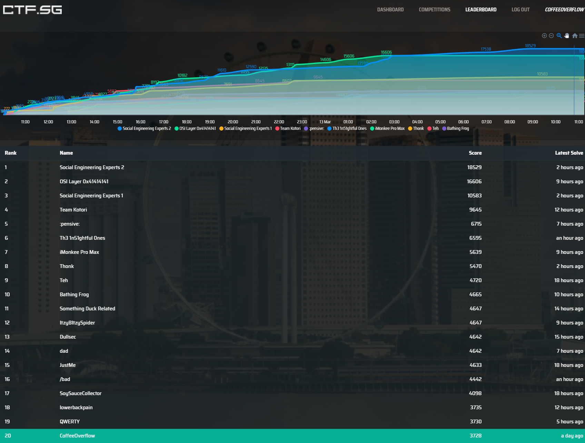
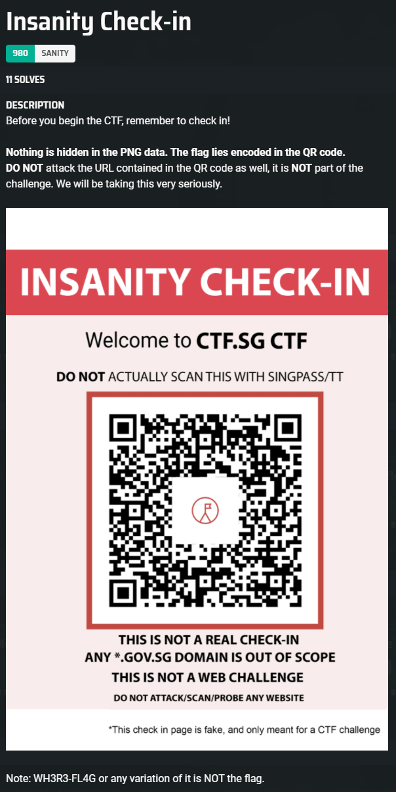
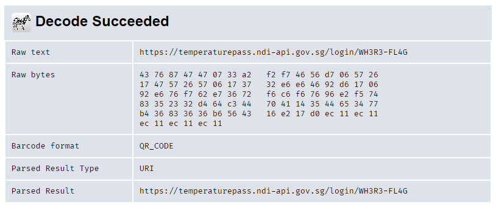
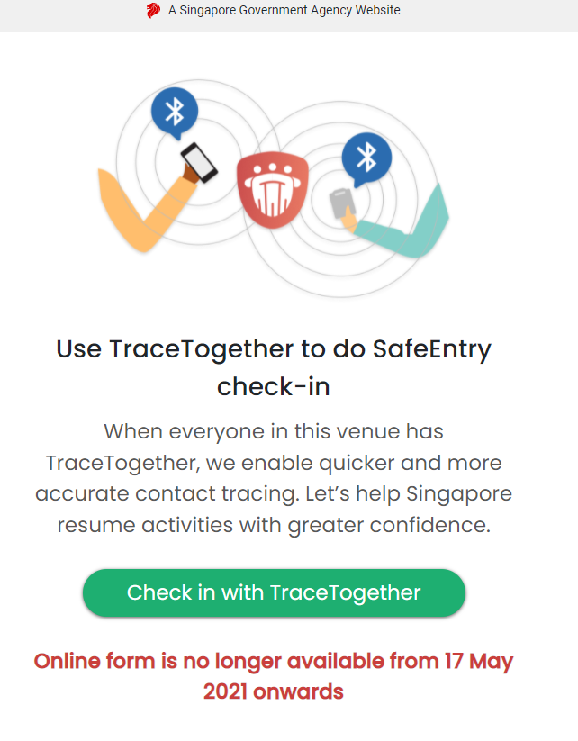
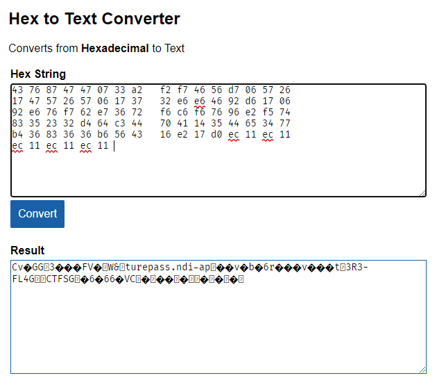
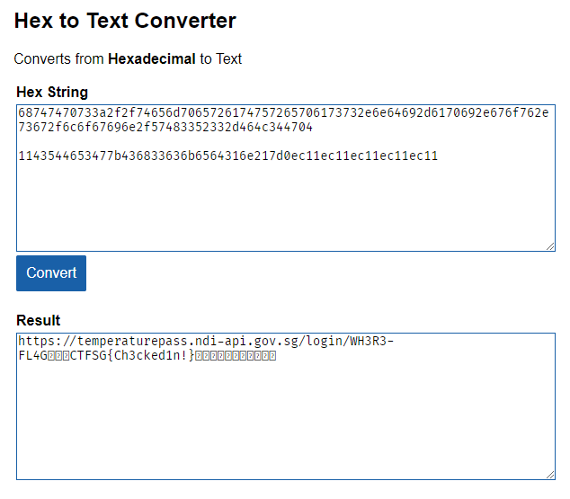

# CTFSG2022 Writeups

This was a tough CTF but a good learning process.



## Insanity Check-in



I used [zxing](https://zxing.org/w/decode.jspx) decoder to decode the QR code.



Clicking on the link goes to a website that directs you to the tracetogethersg website upon clicking on “Check in with TraceTogether”



Since this was clearly stated as not a web challenge, we can assume that this webpage is just a rabbit hole.

The next thing I looked at was the raw bytes.

```
43 76 87 47 47 07 33 a2   f2 f7 46 56 d7 06 57 26
17 47 57 26 57 06 17 37   32 e6 e6 46 92 d6 17 06
92 e6 76 f7 62 e7 36 72   f6 c6 f6 76 96 e2 f5 74
83 35 23 32 d4 64 c3 44   70 41 14 35 44 65 34 77
b4 36 83 36 36 b6 56 43   16 e2 17 d0 ec 11 ec 11
ec 11 ec 11 ec 11 
```

I used a Hex to Text [converter](https://www.online-toolz.com/tools/hex-to-ascii-converter.php) to find out what the bytes translate to.



Notice that there is some legible text in the result. The next thing that came to my mind was that there was probably some extra bytes in the original hex string. So I played around with it and found the flag!



`flag: CTFSG{Ch3cked1n!}` 


# Wildest Dreams Part 2

This was a web challenge that had a hidden `php` functionality in it.

```php
<?php
if (!empty($_GET['i1']) && !empty($_GET['i2']))
{
    $i1 = $_GET['i1'];
    $i2 = $_GET['i2'];
    if ($i1 === $i2)
    {
        die("i1 and i2 can't be the same!");
    }
    $len1 = strlen($i1);
    $len2 = strlen($i2);
    if ($len1 < 15)
    {
        die("i1 is too shorttttttt pee pee pee pee pee");
    }
    if ($len2 < 15)
    {
        die("i2 is too shorttttttt pee pee pee pee pee");
    }
    if (md5($i1) == md5($i2))
    {
        echo $flag;
    }
    echo "<br>The more that you say, the less i know.";
}
else
{
    echo "<br> You need to provide two strings, i1 and i2. /1989.php?i1=a&i2=b";
}

?>
```

From the source code, it seems like it is comparing 2 different md5(string) and check if it is the same. 

After doing some Google searches, I found out that php has this vulnerability called md5 collision where sometimes comparing between 2 md5 hashes using `==` can return true. 

Thankfully, I found this list of md5 hashes that are vulnerable to collision [here]([hashes/md5.md at master · spaze/hashes · GitHub](https://github.com/spaze/hashes/blob/master/md5.md)).

Thereafter, I just provided the variables with 2 vulnerable strings in the url and got the flag.

`http://chals.ctf.sg:40401/1989.php?i1=RSnake9YML3vVKDyVM&i2=RSnakeUecYwT6N2O9g`

`flag: CTFSG{you_see_me_in_h1nds1ght_tangled_up_with_you_all_night}`


