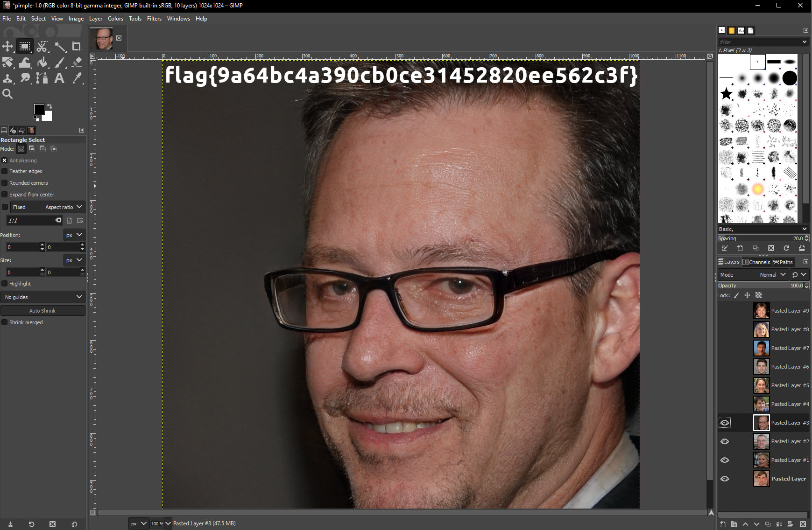
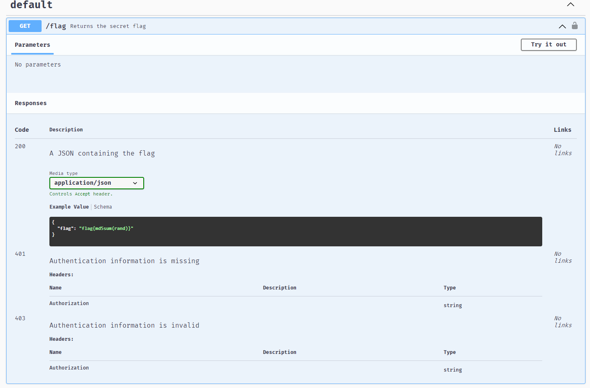

# Hacktivity 2021


It was an opportunity to work with many international members from CYBERx and I am happy to say that we managed to place 45th out of 2527 teams!

# CTF Name – Oddball

-   **Category:** Warmups
-   **Points:** 441

## Challenge

> Well this file sure is... odd...

## Solution

```
shiro in Users/User/Downloads
-> cat oddball
0000000 067531 020165 067165 067543 062566 062562 020144 064164
0000020 020145 062563 071143 072145 066440 071545 060563 062547
0000040 035440 005051 072516 061155 071145 020163 067151 071040
0000060 067141 062547 030040 033455 020077 066510 066555 020041
0000100 067510 020167 062157 005041 063012 060554 075547 060462
0000120 031065 061462 033062 034143 060467 031546 034461 061062
0000140 031064 031543 063064 031544 033062 034063 061065 005175
0000160
```

The first thing that stood out was the first column. It looked similar to a hexdump but it's not so I Googled for `0000000 0000020 0000040 0000060` to find out what it could be.

It turns out that it was an octal dump.

Now that we know what it is from, it's just a matter of reversing it. After Googling for awhile, I found this Python script written by [Zh3r0](https://rainbowpigeon.me/posts/zh3r0ctf-2021/#strpos-and-substr)

```
dump = ""
octs = [("0o" + n) for n in  dump.split(" ") if n]
hexs = [int(n, 8) for n in octs]
result = ""
for n in hexs:
    if (len(hex(n)) > 4):
        swapped = hex(((n << 8) | (n >> 8)) & 0xFFFF)
        result += swapped[2:].zfill(4)
print(bytes.fromhex(result).decode())
```

Running the script get's us the flag

```
You uncovered the secret message ;)
Numbers in range 0-7? Hmmm! How od!

flag{2a522c26c87af3192b42c34fd326385b}
```

# CTF Name – 2EZ

-   **Category:** Warmups
-   **Points:** 50

## Challenge

> These warmups are just too easy! This one definitely starts that way, at least!

## Solution

```
shiro in Users/User/Downloads
-> file 2ez
2ez: data
```

Running `file` shows us that it is a data file.

First thing that came to my mind was to check it's hex value on an online [Hex Editor](https://hexed.it/).


We notice that the file has a `JFIF` value which is an image file!

However, the signature header is wrong! So let's change it!


```
shiro in Users/User/Downloads
-> file 2ez_changed
2ez_changed: JPEG image data, JFIF standard 1.01, aspect ratio, density 1x1, segment length 16, baseline, precision 8, 800x200, components 1
shiro in Users/User/Downloads
-> cp 2ez_changed 2ez_changed.jfif
```


# CTF Name – Six Four Over Two

-   **Category:** Warmups
-   **Points:** 50

## Challenge

> I wanted to cover all the bases so I asked my friends what they thought, but they said this challenge was too basic...

## Solution

```
shiro in Users/User/Downloads
-> cat six_four_over_two
EBTGYYLHPNQTINLEGRSTOMDCMZRTIMBXGY2DKMJYGVSGIOJRGE2GMOLDGBSWM7IK%
```

It seems to be encoded in something. Let's use [CyberChef](https://gchq.github.io/CyberChef/) to crack the code!


# CTF Name – Bass64

-   **Category:** Warmups
-   **Points:** 50

## Challenge

> It, uh... looks like someone bass-boosted this? Can you make any sense of it?

## Solution

```
shiro in Users/User/Downloads
-> cat bass64
 ___ ____ _____  __   ____        __  _ _____ __  __    __     ___     _   _ __        _____        __  __ ____  ____  _     _   _           _____      __   ____        ________     __  __  ____ __  __ ____  __  __               _         __   ______     _ _     ____ _______   __   __  __ ____  _____ _      __  __  ____ _____ ___
|_ _/ ___|__  /__\ \ / /\ \      / /_| |___  |  \/  |___\ \   / / |__ | \ | |\ \      / / _ \ __  _|  \/  |___ \|  _ \| |__ | \ | |_ __ ___ | ____|   _ \ \ / /\ \      / /__  / |__ |  \/  |/ ___|  \/  |___ \|  \/  |_ __ ___     | | _ __ __\ \ / /___ \   | | | __|__  /|  _ \ \ / /__|  \/  |  _ \|  ___| |__  |  \/  |/ ___|  ___/ _ \
 | | |  _  / // __\ V /  \ \ /\ / / _` |  / /| |\/| |_  /\ \ / /| '_ \|  \| | \ \ /\ / / | | |\ \/ / |\/| | __) | |_) | '_ \|  \| | '_ ` _ \|  _|| | | | \ V /  \ \ /\ / /  / /| '_ \| |\/| | |  _| |\/| | __) | |\/| | '_ ` _ \ _  | || '_ ` _ \ V /  __) |  | | |/ /  / / | | | \ V /_  / |\/| | | | | |_  | '_ \ | |\/| | |  _| |_ | (_) |
 | | |_| |/ /_\__ \| |    \ V  V / (_| | / / | |  | |/ /  \ V / | | | | |\  |  \ V  V /| |_| | >  <| |  | |/ __/|  _ <| | | | |\  | | | | | | |__| |_| |  | |    \ V  V /  / /_| | | | |  | | |_| | |  | |/ __/| |  | | | | | | | |_| || | | | | | |  / __/ |_| |   <  / /_ | |_| || | / /| |  | | |_| |  _| | | | || |  | | |_| |  _| \__, |
|___\____/____|___/|_|     \_/\_/ \__,_|/_/  |_|  |_/___|  \_/  |_| |_|_| \_|   \_/\_/  \__\_\/_/\_\_|  |_|_____|_| \_\_| |_|_| \_|_| |_| |_|_____\__, |  |_|     \_/\_/  /____|_| |_|_|  |_|\____|_|  |_|_____|_|  |_|_| |_| |_|\___/ |_| |_| |_|_| |_____\___/|_|\_\/____ |____/ |_|/___|_|  |_|____/|_|   |_| |_||_|  |_|\____|_|     /_/
                                                                                                                                                  |___/

```

It seems to be an ASCII art. To view the art clearly, we will need to stretch the window.

The code is `IGZsYWd7MzVhNWQxM2RhNmEyYWZhMGM2MmJmY2JkZDYzMDFhMGF9=`

```
shiro in Users/User/Downloads
-> echo "IGZsYWd7MzVhNWQxM2RhNmEyYWZhMGM2MmJmY2JkZDYzMDFhMGF9" | base64 -d
 flag{35a5d13da6a2afa0c62bfcbdd6301a0a}
```

# CTF Name – Pimple

-   **Category:** Warmups
-   **Points:** 50

## Challenge

> This challenge is simple, it's just a pimple!

## Solution

```
shiro in Users/User/Downloads
-> file pimple
pimple: GIMP XCF image data, version 011, 1024 x 1024, RGB Color
```

It seems to be a GIMP file. So let's open it in GIMP!


It seems to layers of images.

I found a flag hidden in one of the images.



# CTF Name – Jed Sheeran

-   **Category:** OSINT
-   **Points:** 50

## Challenge

> Oh we have another fan with a budding music career! Jed Sheeran is seemingly trying to produce new songs based off of his number one favorite artist... but it doesn't all sound so good. Can you find him?

## Solution

For this challenge, I searched for Jed Sheeran on Google and found an interesting Soundcloud page


Afterwhich, I clicked on the comments and found the flag!


# CTF Name – Read The Rules

-   **Category:** Warmups
-   **Points:** 50

## Challenge

> Please follow the rules for this CTF!

## Solution

For this challenge, the flag was hidden in the source code of the rules page!


# CTF Name – Swaggy

-   **Category:** Web
-   **Points:** 50

## Challenge

> This API documentation has all the swag

## Solution

Navigating to the website shows this webpage.


!


Playing around with the commonly used username and password, `admin:admin` was a success.


I tried searching for `./flag` on the Swagger webpage but nothing was returned


I decided to try using cURL instead

```
shiro in Users/User/Downloads
-> curl http://staging-api.congon4tor.com:7777/
No flag sorry%
shiro in Users/User/Downloads
-> curl http://staging-api.congon4tor.com:7777/flag
{"error":"Missing authorization header"}
shiro in Users/User/Downloads
-> curl -u admin:admin http://staging-api.congon4tor.com:7777/flag
{"flag":"flag{e04f962d0529a4289a685112bf1dcdd3}"}
```

# CTF Name – Tsunami

-   **Category:** Warmups
-   **Points:** 50

## Challenge

> Woah! It's a natural disaster! But something doesn't seem so natural about this big wave...

## Solution

```
shiro in Users/User/Downloads
-> file tsunami
tsunami: RIFF (little-endian) data, WAVE audio, Microsoft PCM, 16 bit, stereo 44100 Hz
shiro in Users/User/Downloads
-> cp tsunami tsunami.wav
```

The file seems to be a wav file so I converted it to a `.wav` file.

Thereafter, I used Sonic Visualizer to view the wav file.


Opening the wav file doesn't seem to show anything much so I played around with the layers.

After awhile, I found out that there was a flag hidden in the Spectrogram layer (All Channels Mixed)


# CTF Name – Confidentiality

-   **Category:** Web
-   **Points:** 50

## Challenge

> My school was trying to teach people about the CIA triad so they made all these dumb example applications... as if they know anything about information security. Can you prove these aren't so secure?

## Solution


This challenge seems to be a webpage that takes in some input and runs `ls` on it.

So I tried injecting another command right after the input and turns out it worked.


Seems like the `flag.txt` is right there. So can we `cat` it?


