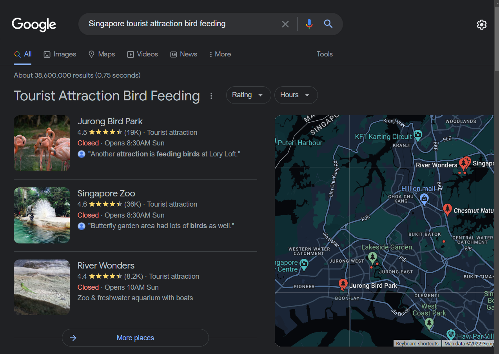

# CTF Name – 🧑‍🎓 Everyone Needs a Break

-   **Category:** OSINT

## Challenge

> Despite the pandemic, Bruce Wayne decided to take a break and visit Singapore. He went to feed some birds at one of Singapore's tourist attractions. He eventually became tired and walked over to the location in the attached image to try out another activity.
>
> Where is this location?
> Flag format is `SEE{Postal Code}`. Note that Singaporean postal codes consist of 6 digits.

## Solution

Based on the challenge description, it seems like we need to find out the location of some tourist attraction.

First, lets take a look at the image!

Hmm.. it looks like there some fishing spot? Well lets find out!

As the challenge mentioned something about feeding birds and Singapore’s tourist attraction, we should Google exactly that!

Jurong Bird Park seems to be something we might be looking for, so lets check it out on Google Maps!

However, recall that the challenge states that Bruce Wayne walked to a nearby place to take a break.

So, we should look around the map for any clues.

Oh, there’s a fishing village which looks similar to the image given in the challenge!

Submit the postal flag `SEETF{629143}` and solve the challenge! OwO

