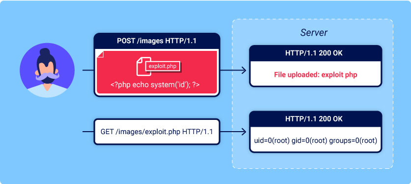

# File Upload Vulnerabilities

>   Source: [PortSwigger](https://portswigger.net/web-security/file-upload)



File upload vulnerabilities occur when a web server allows users to upload files to the filesystem without sufficiently validating the file.


## Exploiting unrestricted file uploads to deploy a web shell

>   ```
>   A web shell is a malicious script that enables an attacker to execute arbitrary commands on a remote web server simply by sending HTTP requests to the right endpoint.
>   ```
>
>   If you're able to upload a web shell, you basically have full control over the server - read and write arbitrary files, exfiltrate sensitive data, even use the server to pivot attacks against both internal infrastructure and other servers outside the network. 
>
>   For example, the following PHP one-liner could be used to read arbitrary files from the server's filesystem:
>
>   ```php
>   <?php echo file_get_contents('/path/to/target/file'); ?>
>   ```
>
>   Once uploaded, sending a request for this malicious file will return the target file's contents in the response.
>
>   A more versatile web shell may look something like this:
>
>   ```php
>   <?php echo system($_GET['command']); ?>
>   ```
>
>   This script enables you to pass an arbitrary system command via a query parameter as follows:
>
>   ```php
>   GET /example/exploit.php?command=id HTTP/1.1
>   ```


## Exploiting flawed validation of file uploads

>   When submitting HTML forms, your browser typically sends the provided data in a `POST` request with the content type `application/x-www-form-url-encoded`. This is fine for sending simple text like your name, address, and so on, but is not suitable for sending large amounts of binary data, such as an entire image file or a PDF document. In this case, the content type `multipart/form-data` is the preferred approach.
>
>   Consider a form containing fields for uploading an image, providing a description of it, and entering your username. Submitting such a form might result in a request that looks something like this:
>
>   ```
>   POST /images 
>   HTTP/1.1
>   Host: normal-website.com
>   Content-Length: 12345
>   Content-Type: multipart/form-data; boundary=---------------------------012345678901234567890123456
>   ---------------------------012345678901234567890123456
>   
>   Content-Disposition: form-data; name="image"; filename="example.jpg"
>   Content-Type: image/jpeg
>   [...binary content of example.jpg...]
>   ---------------------------012345678901234567890123456
>   
>   Content-Disposition: form-data; name="description"
>   This is an interesting description of my image.
>   ---------------------------012345678901234567890123456
>   
>   Content-Disposition: form-data; name="username"
>   wiener
>   ---------------------------012345678901234567890123456--
>   ```
>
>   The message body is split into separate parts for each of the form's inputs. Each part contains a `Content-Disposition` header, which provides some basic information about the input field it relates to. These individual parts may also contain their own `Content-Type` header, which tells the server the MIME type of the data that was submitted using this input.
>
>   One way that websites may attempt to validate file uploads is to check that this input-specific `Content-Type` header matches an expected MIME type. If the server is only expecting image files, for example, it may only allow types like `image/jpeg` and `image/png`. Problems can arise when the value of this header is implicitly trusted by the server.


## Preventing file execution in user-accessible directories

>   As a precaution, servers generally only run scripts whose MIME type they have been explicitly configured to execute. Otherwise, they may just return some kind of error message or, in some cases, serve the contents of the file as plain text instead:
>
>   ```
>   GET /static/exploit.php?command=id 
>   HTTP/1.1
>   Host: normal-website.com
>   HTTP/1.1 200 OK
>   Content-Type: text/plain
>   Content-Length: 39
>   <?php echo system($_GET['command']); ?>
>   ```
>
>   This behavior is potentially interesting in its own right, as it may provide a way to leak source code, but it nullifies any attempt to create a web shell.
>
>   If you can find a way to upload a script to a different directory that's not supposed to contain user-supplied files, the server may execute your script after all.
>
>   Tip: Web servers often use the filename field in multipart/form-data requests to determine the name and location where the file should be saved.

## Insufficient blacklisting of dangerous file types

>   One of the more obvious ways of preventing users from uploading malicious scripts is to blacklist potentially dangerous file extensions like `.php`. Such blacklists can sometimes be bypassed by using lesser known, alternative file extensions that may still be executable, such as `.php5`, `.shtml`, and so on.

### Overriding the server configuration

>   Servers typically won't execute files unless they have been configured to do so. For example, before an Apache server will execute PHP files requested by a client, developers might have to add the following directives to their `/etc/apache2/apache2.conf` file:
>
>   ```php
>   LoadModule php_module /usr/lib/apache2/modules/libphp.soAddType application/x-httpd-php .php
>   ```
>
>   Many servers also allow developers to create special configuration files within individual directories in order to override or add to one or more of the global settings. Apache servers, for example, will load a directory-specific configuration from a file called `.htaccess` if one is present.
>
>   Similarly, developers can make directory-specific configuration on IIS servers using a `web.config` file. This might include directives such as the following, which in this case allows JSON files to be served to users:
>
>   ```json
>   <staticContent> <mimeMap fileExtension=".json" mimeType="application/json" /></staticContent>
>   ```
>
>   Web servers use these kinds of configuration files when present, but you're not normally allowed to access them using HTTP requests. However, you may occasionally find servers that fail to stop you from uploading your own malicious configuration file. In this case, even if the file extension you need is blacklisted, you may be able to trick the server into mapping an arbitrary, custom file extension to an executable MIME type.

### Obfuscating file extensions

>   Even the most exhaustive blacklists can potentially be bypassed using classic obfuscation techniques. Let's say the validation code is case sensitive and fails to recognize that `exploit.pHp` is in fact a `.php` file. If the code that subsequently maps the file extension to a MIME type is **not** case sensitive, this discrepancy allows you to sneak malicious PHP files past validation that may eventually be executed by the server.
>
>   You can also achieve similar results using the following techniques:
>
>   -   Provide multiple extensions. Depending on the algorithm used to parse the filename, the following file may be interpreted as either a PHP file or JPG image: `exploit.php.jpg`
>   -   Add trailing characters. Some components will strip or ignore trailing whitespaces, dots, and suchlike: `exploit.php.`
>   -   Try using the URL encoding (or double URL encoding) for dots, forward slashes, and backward slashes. If the value isn't decoded when validating the file extension, but is later decoded server-side, this can also allow you to upload malicious files that would otherwise be blocked: `exploit%2Ephp`
>   -   Add semicolons or URL-encoded null byte characters before the file extension. If validation is written in a high-level language like PHP or Java, but the server processes the file using lower-level functions in C/C++, for example, this can cause discrepancies in what is treated as the end of the filename: `exploit.asp;.jpg` or `exploit.asp%00.jpg`
>   -   Try using multibyte unicode characters, which may be converted to null bytes and dots after unicode conversion or normalization. Sequences like `xC0 x2E`, `xC4 xAE` or `xC0 xAE` may be translated to `x2E` if the filename parsed as a UTF-8 string, but then converted to ASCII characters before being used in a path.
>
>   Other defenses involve stripping or replacing dangerous extensions to prevent the file from being executed. If this transformation isn't applied recursively, you can position the prohibited string in such a way that removing it still leaves behind a valid file extension. For example, consider what happens if you strip `.php` from the following filename:
>
>   ```
>   exploit.p.phphp
>   ```


