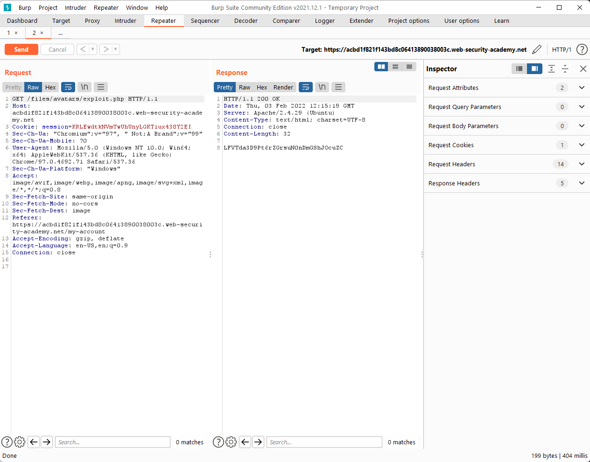

### Lab: Web shell upload via Content-Type restriction bypass

When we try to upload a `php` file, the response indicates `Only image/jpeg and image/png are allowed`.

However, what if we changed the `Content-Type` from `Content-Type: application/octet-stream` to `Content-Type: image/jpeg`?

Now, we can send a `GET` request to `/files/avatars/rce_via_web_shell_upload.php` to view the secret.

