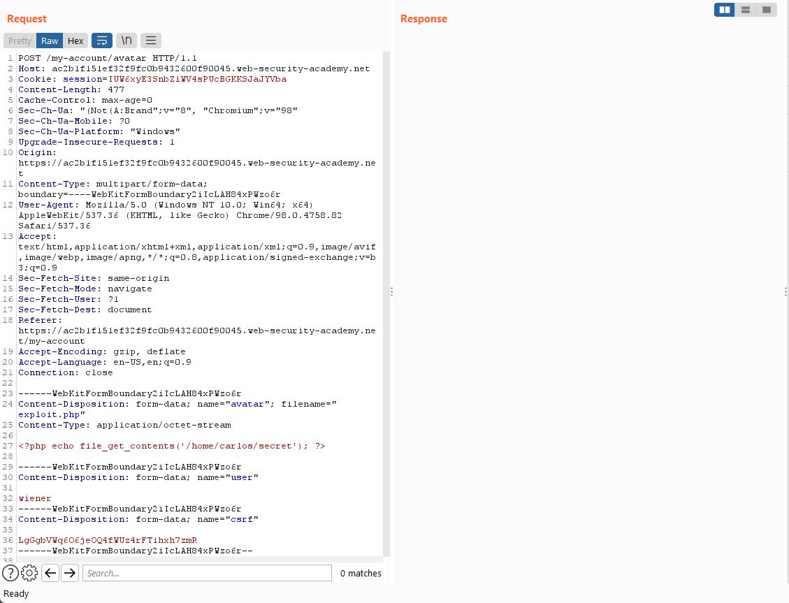
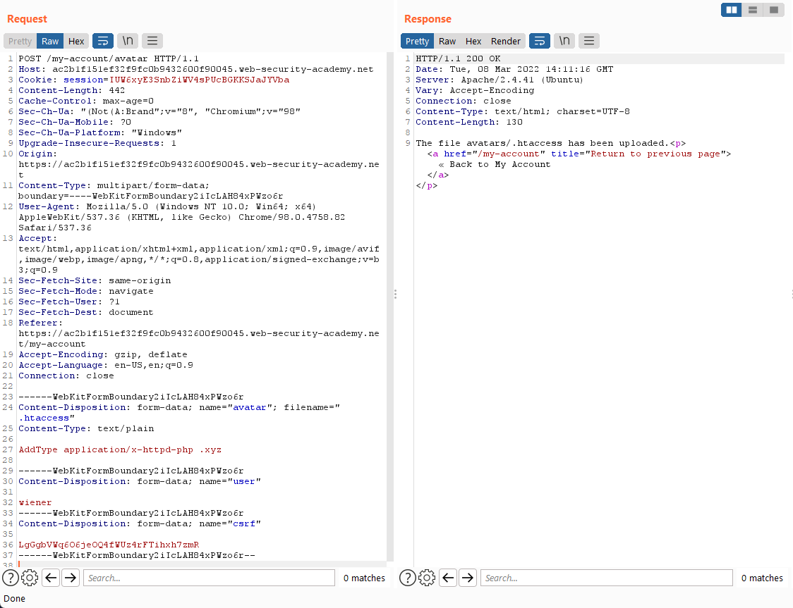
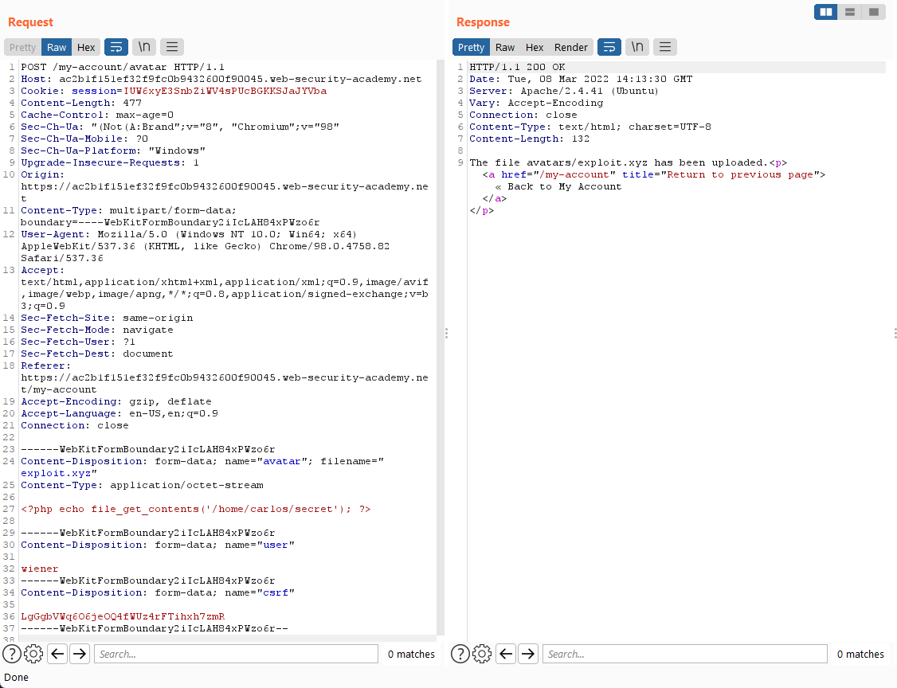

### Lab: Web shell upload via extension blacklist bypass

In this lab, when we try to upload a `php` file, it tells us that `php` files are not allowed.

Let’s check out the request on Burp then!

It seems like we might need to make some changes to the `.htaccess` to treat a chosen file extension as `php`!

>   ".htaccess" files allow users to specify what MIME type should be reported for specific files in their html directory. 
>
>   Before an Apache server will execute PHP files requested by a client, developers might have to add the following directive `AddType application/x-httpd-php .php`
>
>   -   `AddType mime-type file-extension`
>
>   We will use `Content-Type: text/html` and use `AddType application/x-httpd-php xyz`

Nice! Now we should be able to upload the exploit as `exploit.xyz` and it will be read as `exploit.php` :D

Finally, we can find out where the file is uploaded (`/files/avatars/exploit.xyz`) and execute it! 

#### Easier Solution

When uploading the `exploit.php` file, change the `.php` to `.phtml` on Burp before sending the request.