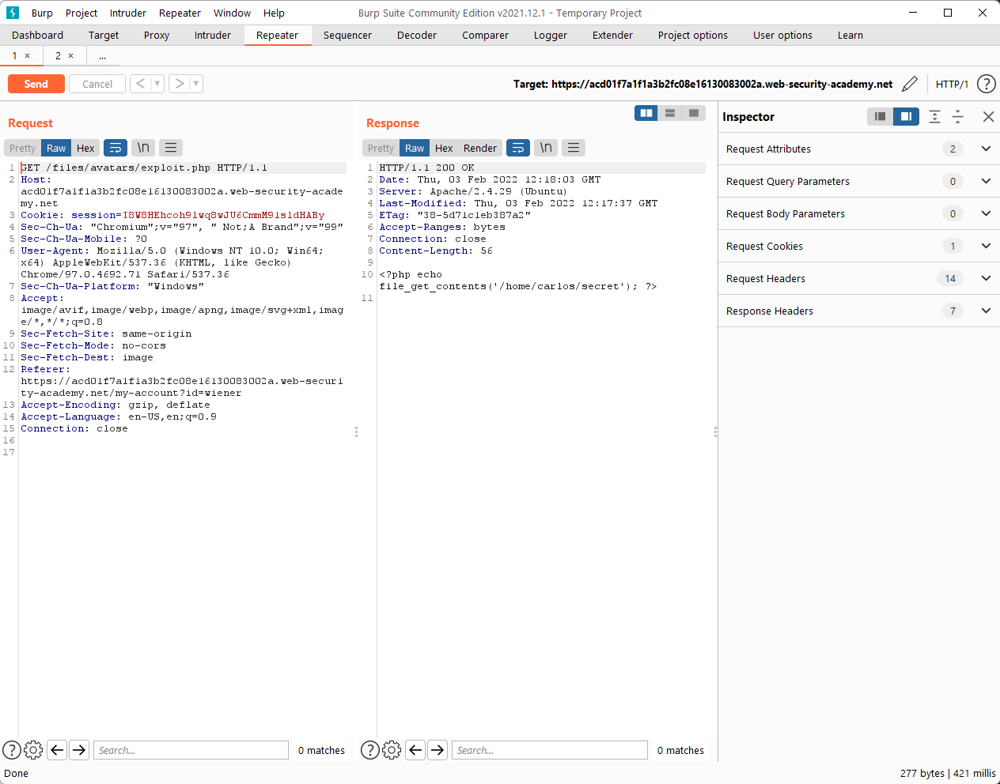
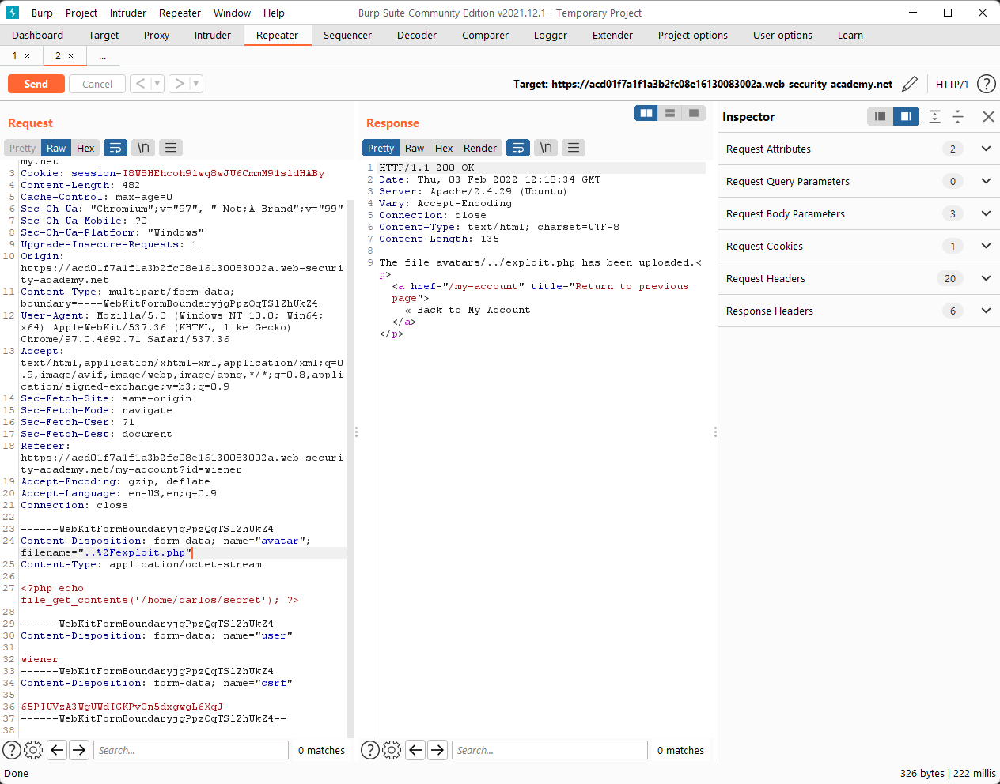
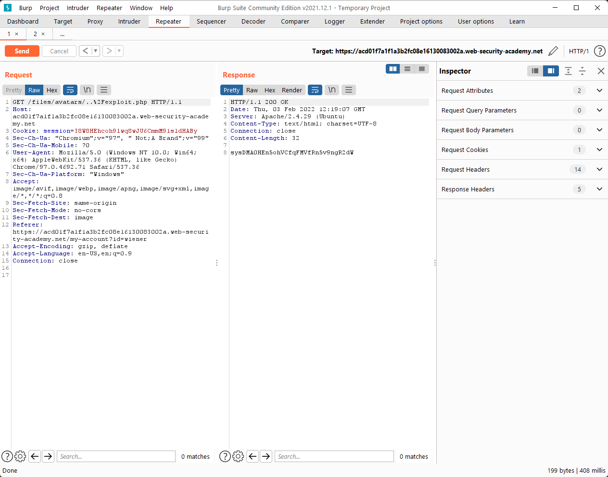

### Lab: Web shell upload via path traversal

The website did not prevent us from uploading `php` files to the server.

However, when we try to send the request `GET /files/avatars/rce_via_web_shell_upload.php`, it returns us the contents of the `php` file as plain text…

What if we uploaded the file in another directory instead?

We can do this by adjusting the `POST /my-account/avatar` request by changing the `Content-Disposition: filename="rce_via_web_shell_upload.php"` to `Content-Disposition: filename="..%2Frce_via_web_shell_upload.php"`

>   Remember that `/` URL-encoded is `%2F`

Send the request and the file should be uploaded.

Now we can execute the `php` file from the new directory.

